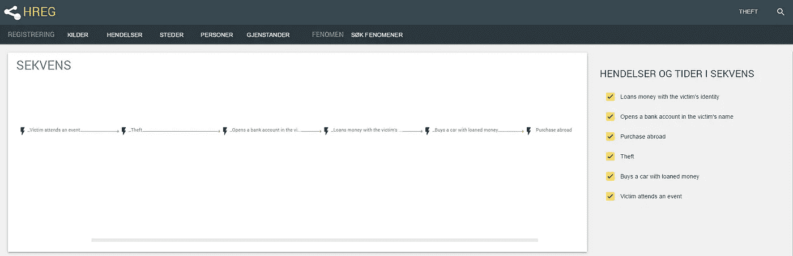
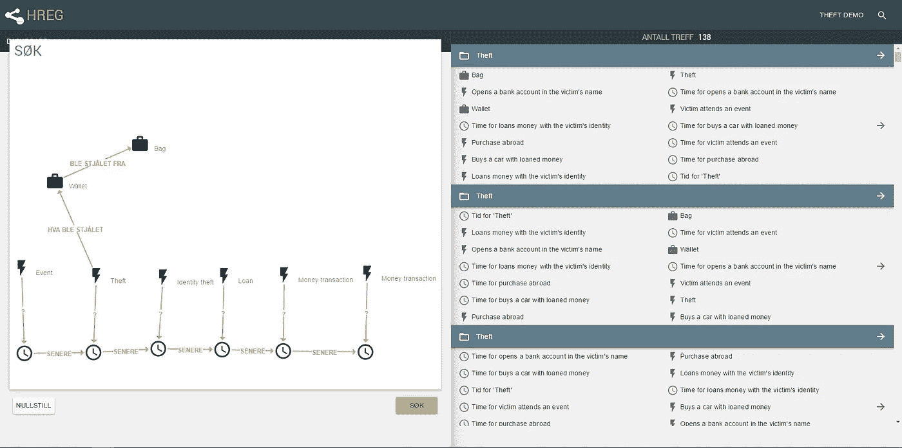
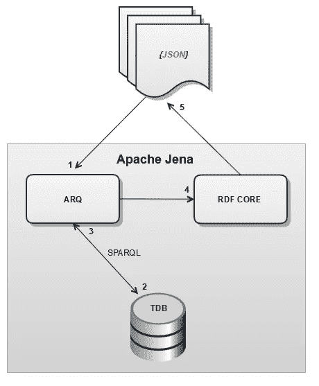

# 用语义技术揭示犯罪模式和现象

> 原文：<https://medium.com/compendium/disclosing-patterns-and-phenomena-in-crime-with-semantic-technologies-239b21b1bc26?source=collection_archive---------4----------------------->

**事件登记是为挪威警方开发的一个原型，目的是支持调查、防止犯罪，并为更好的企业管理提供统计数据。该系统的整个后端堆栈基于与 Java 集成的语义技术，采用 Apache Jena 框架进行语义编程。**

# RDF —灵活的陈述

语义 Web 技术(不要让“Web”这个术语欺骗了你，因为它可以完全独立于 Web 应用)包括 W3C 标准: [RDF](https://www.w3.org/RDF/) 用于序列化数据， [SPARQL](https://www.w3.org/TR/rdf-sparql-query/) 用于查询 RDF 数据，以及 [OWL](https://www.w3.org/TR/owl2-overview/) 和 [RDFs](https://www.w3.org/TR/rdf-schema/) 用于将数据模型应用于数据。RDF 数据可以完全不受模式限制，只作为事实陈述存在，这使得它非常适合那些预先就数据模式达成一致没有好处的系统。这允许数据模式在系统的整个生命周期中不断发展、适应和扩展。在事件注册中，重要的是警察可以表达任何事情，这意味着对灵活的数据结构的需求是巨大的，这是项目中采用语义技术的主要原因。

# 事件序列和现象搜索

想象一下这样一个案例，一名妇女来到警察局，向警方报告一起盗窃案。她刚参加完一个人群庞大而狭窄的大型活动，突然发现包里的钱包被偷了。她参加的事件和实际的盗窃事件被记录为图 1 中描述的事件序列画布中的前两个事件。

在这种情况下，警方没有什么线索可循，但两周后，受害者回到警察局，提交了一份新的警方报告，称收到了一封银行来信，称她在那里开了一个银行账户。受害者向警方声称，她本人从未开立过这个银行账户，这可能意味着她可能遭遇了身份盗窃。

警方现在通过与该银行的一名银行职员谈话进一步调查此事，该职员透露，该账户确实是以受害人的名字开立的，而且一笔 500 000 挪威克朗(约 60 000 美元)的消费贷款也是以同一名字办理的。此外，银行员工注意到消费者贷款被支付到同一个银行账户，并且一天后从汽车零售商处购买了一辆汽车。最后，他们看到剩余的钱被用于国外的某种交易，这意味着罪犯已经离开了这个国家。

***图 1:一场大规模身份盗窃的全案。***

警方对事件链进行了登记，现在他们有了事件如何发生的假设，他们可以使用“现象搜索”功能来识别类似的案件(见图 2)。

***图 2:从图 1 中搜索与给定案例匹配的案例模式。***

在图 2 中，警察在左侧的搜索画布上绘制了一个图案，与图 1 中的事件链相匹配。这一功能允许警察查看所有与搜索画布中的模式相匹配的其他案件中的模式聚类。右侧的搜索结果是与搜索画布中的模式相匹配的其他案件中的模式，这意味着警方可以揭示现象，并从类似案件中获得有价值的洞察力和知识。

这篇博文仅仅触及了现象搜索中各种可能性的表面，因为我们甚至没有触及属性值的过滤，或者将地理位置或人及其角色添加到等式中。然而，所提供的例子仍然表明，当发现跨案件的犯罪现象时，警察能够看到有助于他们预防犯罪和解决案件的模式。

例如，他们可以通过鼓励人们在大型活动中妥善保管自己的贵重物品，更有效地在此类活动中分配警力资源，以及研究如何使开立银行账户和贷款更加安全，来防止类似的盗窃事件发生。

最后，一连串的事件表明，几个有组织的犯罪集团正在合作进行这种类型的犯罪，因为这清楚地表明，一个集团负责窃取身份证件，并将其出售给其他想要伪造证件的人。这使警察更容易了解他们面对的是什么，从类似案件中获得的知识和经验对调查极为宝贵。

# 技术方面

现象搜索的技术部分从请求客户端构建实体的 JSON 搜索标准结构以及搜索画布中实体之间的关系开始。

下一步是通过使用 Apache Jena 框架中的 ARQ API 将 JSON 搜索标准转换成 SPARQL 查询。ARQ 是 Jena 中的一个组件，用于动态构建 SPARQL 查询，并针对 RDF 数据库执行这些查询，在本例中是一个名为 TDB 的 Jena RDF 数据库实现。

最后，执行 SPARQL 查询的结果被转换成一个 JSON 结构，该结构被发送回发出初始请求的客户机。图 3 显示了现象搜索的整个数据流的概述。

***图片 3:现象搜索的数据流概述。***