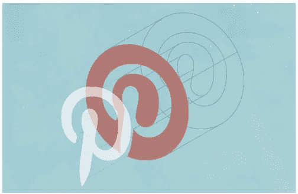

# 探索 Pinterest:移动工程和设计

> 原文：<https://medium.com/pinterest-engineering/discover-pinterest-mobile-engineering-and-design-3bd908a20b47?source=collection_archive---------2----------------------->

作为一家以移动为先的公司，一大重点是为 80%通过移动设备访问 Pinterest 的 Pinners 设计和工程。跨平台移动工程师的小团队最近在 Discover Pinterest 活动上发言。温迪·卢和[卡尔·赖斯](https://www.pinterest.com/carlrice/)展示了他们在改善苹果手机在 iOS 上的初始体验和在安卓上的整体体验方面所做的工作。我们还邀请了谷歌产品总监[卢克·乌鲁布莱夫斯基](http://www.lukew.com/about/)来谈谈如何在一个移动的世界中工作，专注于为各种屏幕尺寸设计应用程序。下面是演示文稿的摘要，我们已经在我们的 [YouTube 频道](https://www.youtube.com/channel/UC_Yfscj9v1htNsHf-BiGu3g)上发布了该活动的[视频](https://www.youtube.com/watch?v=wzRyTmBxs7Y)。

## 屏幕时间(卢克乌鲁布莱夫斯基)

卢克目前是谷歌的产品总监，他是一位连续创业者，带领他的两家初创公司 [Polar](http://www.lukew.com/ff/entry.asp?1918) 和 [Bagcheck](http://www.lukew.com/ff/entry.asp?1371) 被谷歌和 Twitter 收购。在他的演讲中，他讨论了屏幕时间，这个概念从最初定义我们可以坐在电视机前多长时间到现在已经有了很大的发展。今天，人们整天都在使用不同尺寸、比例和质量的屏幕。Luke 专注于工程师和设计师补偿每个设备复杂性的方法，使用 RESS 技术、垂直媒体查询等修改 UI 设计。

## 重建移动新用户教育(Wendy Lu)

温迪于 2013 年初加入 Pinterest，当时她在斯坦福大学完成了计算机科学本科学位，是一名兼职工程师。自从毕业后全职加入以来，她一直专注于 iOS 工程，并参与了 [iOS7 重新设计](https://engineering.pinterest.com/post/67769846580/behind-the-pins-building-pinterest-3-0-for-ios)、我们在日本的[发布](https://techcrunch.com/2013/11/11/pinterest-launches-japanese-version-18-months-after-rakuten-investment/)、[“新闻”专题](https://blog.pinterest.com/en/get-little-news-your-notifications)、[可购买 pin 码](https://blog.pinterest.com/en/buyable-pins)等工作。在她的[演示](https://www.youtube.com/watch?v=wzRyTmBxs7Y#t=63m24s)中，她讨论了构建动态[新用户体验](https://engineering.pinterest.com/post/81721068266/rebuilding-nux-with-the-experience-framework)的问题，这种体验在所有参与度指标以及支持它的跨平台系统方面都明显优于以前的体验。

## 优化 Pinner 的 Android 体验(卡尔·赖斯)

Carl 在移动工程方面的经验横跨移动应用和平板电脑上的 Android 和 iOS。在 Pinterest，他专注于 Android 开发，并在 2012 年的最初应用发布和所有应用更新中发挥了重要作用。在这次活动中，Carl [向](https://www.youtube.com/watch?v=wzRyTmBxs7Y#t=76m32s)介绍了我们 Android 应用的开发和[重新设计，为 Pinners 创造更好的体验，包括优化内容布局、简化常见流程和迎合不同设备。](https://blog.pinterest.com/en/new-look-android-app)

**埃弗雷特·米拉姆是 Pinterest 的一名工程经理。**

**获取 Pinterest 工程新闻和更新，关注我们的工程*[*Pinterest*](https://www.pinterest.com/malorie/pinterest-engineering-news/)*，* [*脸书*](https://www.facebook.com/pinterestengineering) *和*[*Twitter*](https://twitter.com/PinterestEng)*。有兴趣加入团队吗？查看我们的* [*招聘网站*](https://about.pinterest.com/en/careers/engineering-product) *。**