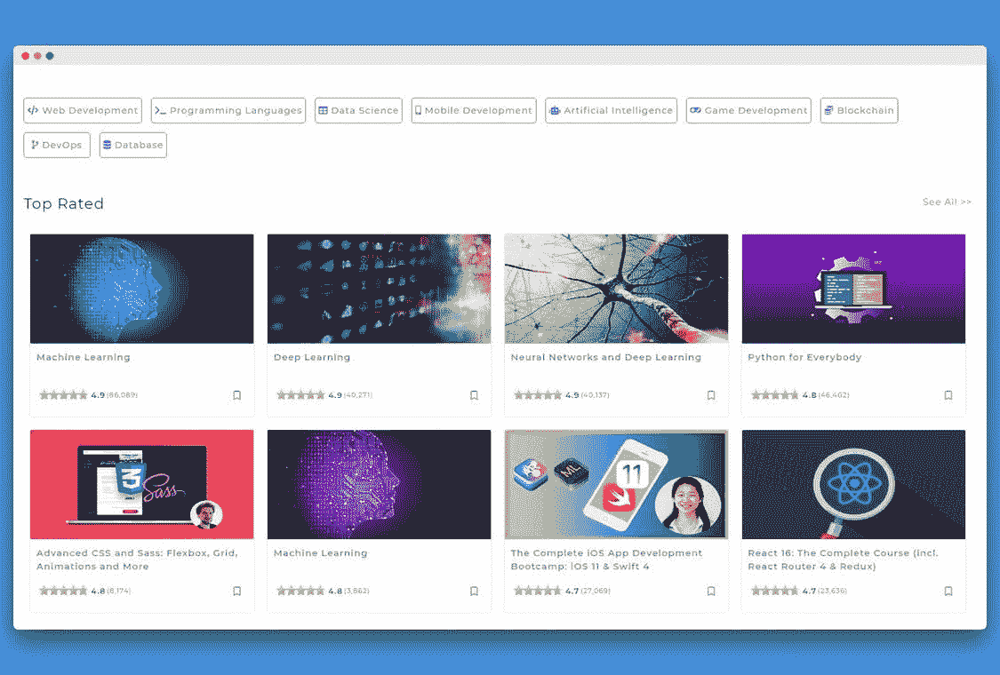

# 发现顶级在线编程课程

> 原文：<https://medium.com/quick-code/discover-top-rated-online-programming-courses-c3b3a3ad4a61?source=collection_archive---------0----------------------->

## 介绍 Quick Code Plus- **你必须参加的所有最佳编程课程！**

推出 [**快码加**](https://www.quickcode.co/best-programming-courses) ，我们超级兴奋。Quick Code Plus 是一个发现最佳和最高评级的在线编程课程的地方。它根据在线编程课程的评级和评论来管理这些课程，并向你推荐学习编程应该学习的课程。

Quick Code plus 将帮助您从数以百万计的在线课程中挑选最好的编程课程，而不必浪费时间在课程选择上。这些课程是根据它们的评级和评论挑选出来的。这有助于保持质量。

你可以找到在线课程来学习 web 开发、应用程序开发、数据科学、游戏开发、机器学习等等。

# 探索您必须参加的最佳在线课程:

## Web 开发

*   [HTML & CSS](https://www.quickcode.co/best-tutorials-learn/HTML/6)
*   [PHP](https://www.quickcode.co/best-tutorials-learn/PHP/7)
*   [角度 Js](https://www.quickcode.co/best-tutorials-learn/Angular/4)
*   [节点 Js](https://www.quickcode.co/best-tutorials-learn/Node-Js/5)
*   [Vue Js](https://www.quickcode.co/best-tutorials-learn/Vue-JS/13)
*   [反应 Js](https://www.quickcode.co/best-tutorials-learn/React/2)
*   [Django 框架](https://www.quickcode.co/best-tutorials-learn/Django/55)
*   [弹簧框架](https://www.quickcode.co/best-tutorials-learn/Spring-Framework/51)

## 编程语言

*   [Python](https://www.quickcode.co/best-tutorials-learn/Python/37)
*   [Java](https://www.quickcode.co/best-tutorials-learn/Java/36)
*   [戈朗](https://www.quickcode.co/best-tutorials-learn/Go/56)

## 移动应用开发

*   [安卓](https://www.quickcode.co/best-tutorials-learn/Android/14)
*   [反应原生](https://www.quickcode.co/best-tutorials-learn/React-Native/18)
*   [科特林](https://www.quickcode.co/best-tutorials-learn/Kotlin/20)
*   [沙玛琳](https://www.quickcode.co/best-tutorials-learn/Xamarin/17)
*   [飘起](https://www.quickcode.co/best-tutorials-learn/Flutter/78)

## 先进技术

*   [区块链](https://www.quickcode.co/best-tutorials-learn/Solidity/77)
*   [数据科学](https://www.quickcode.co/best-courses-learn/Data-Science/15)
*   [机器学习](https://www.quickcode.co/best-tutorials-learn/Machine-Learning/59)
*   [深度学习](https://www.quickcode.co/best-tutorials-learn/Deep-Learning/49)

我们今天也在寻找产品。请分享您对产品搜索的想法和反馈。