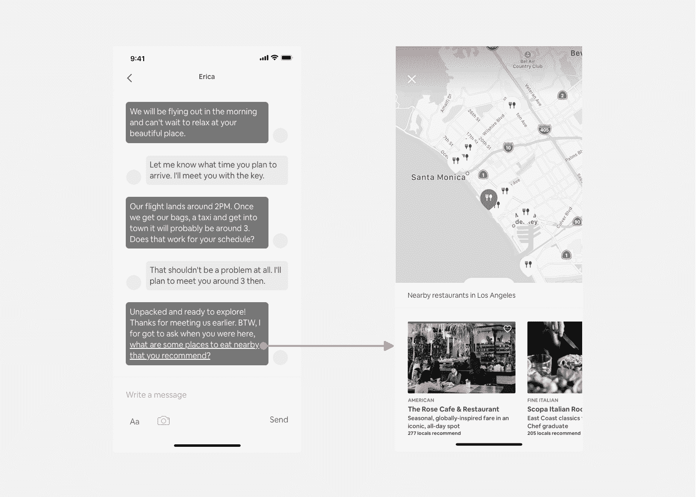
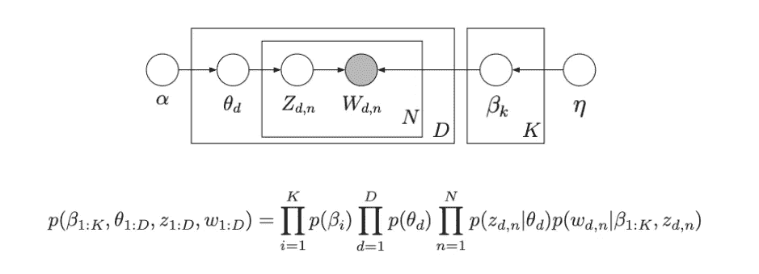
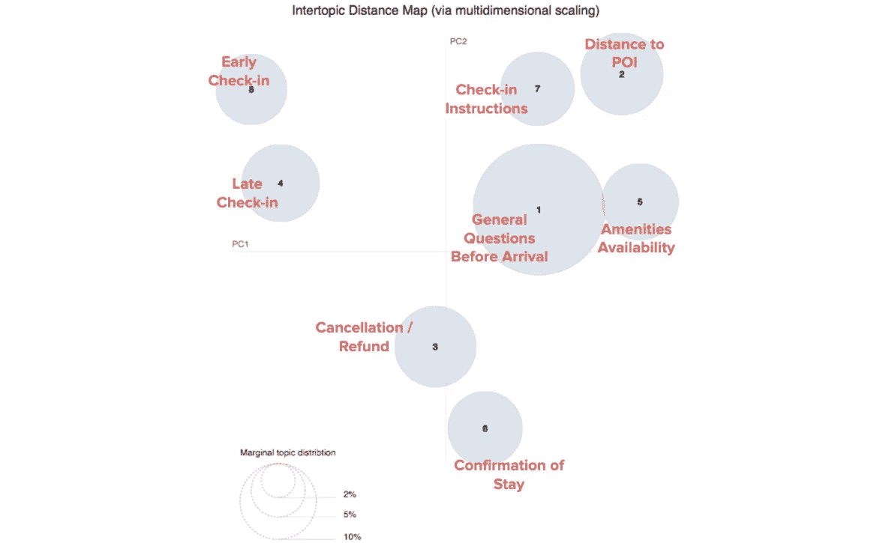
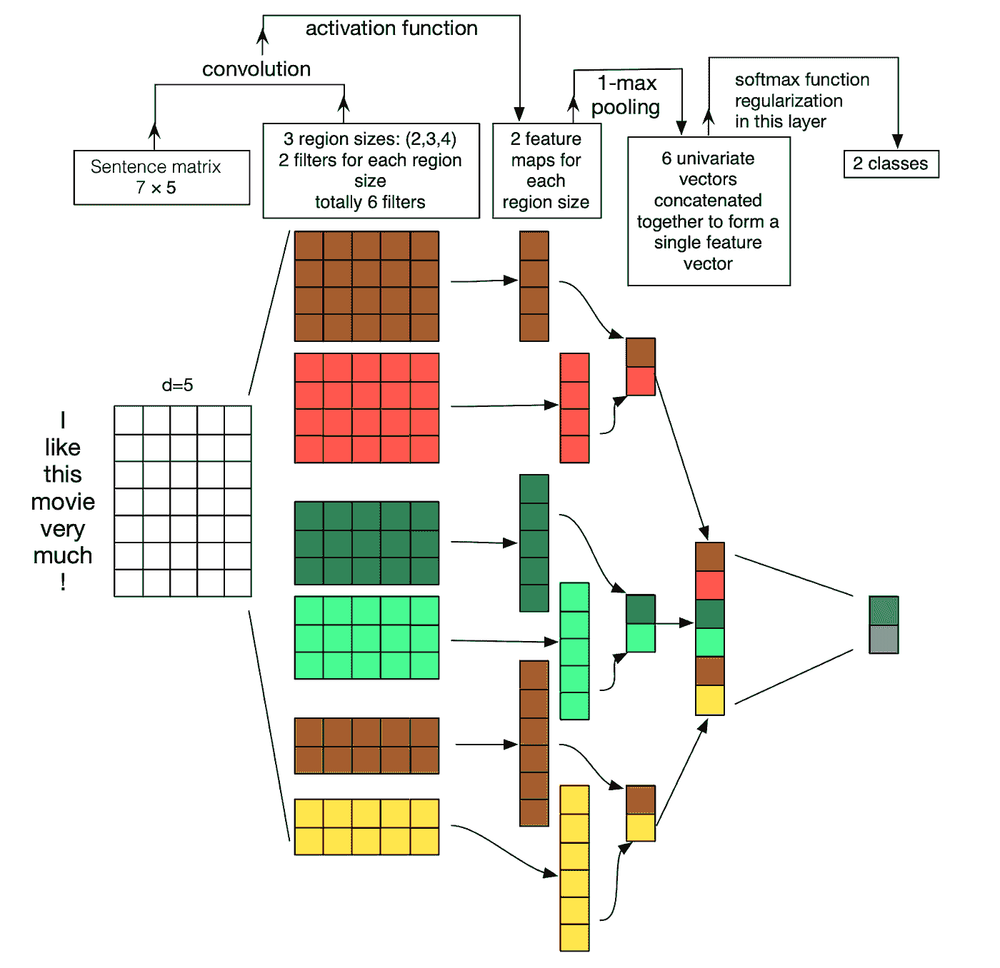
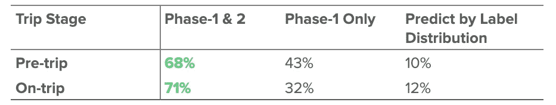
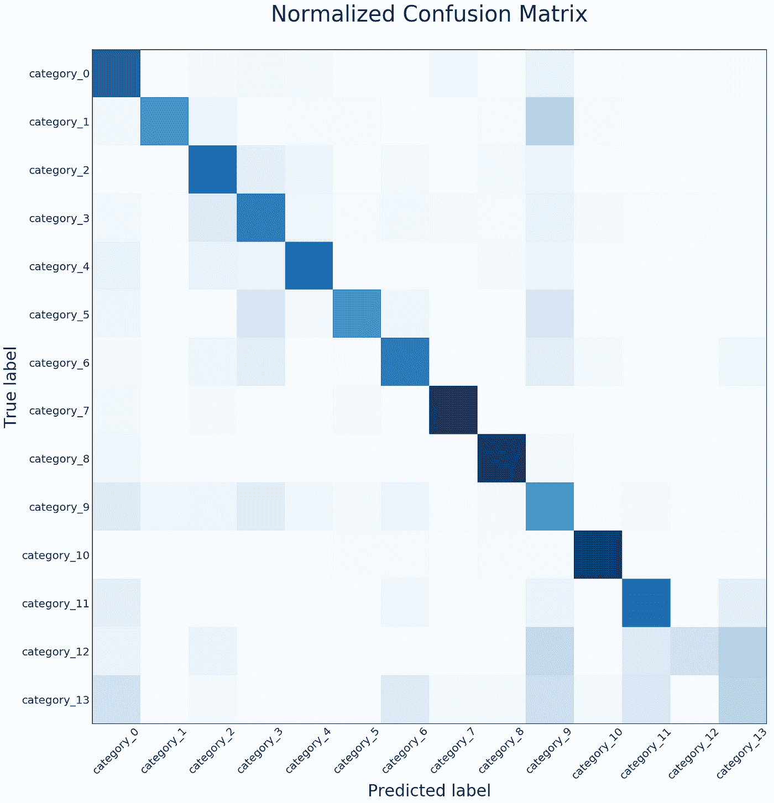
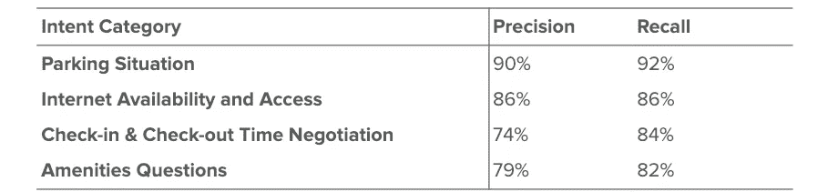
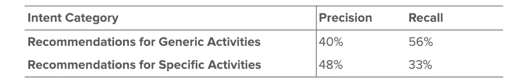
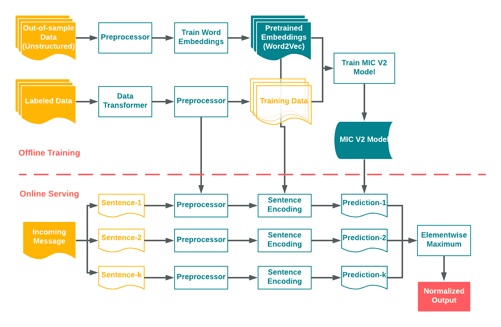

# 在 Airbnb 发现和分类应用内信息意图

> 原文：<https://medium.com/airbnb-engineering/discovering-and-classifying-in-app-message-intent-at-airbnb-6a55f5400a0c?source=collection_archive---------1----------------------->

## 对话式人工智能正在激励我们重新思考我们平台上的客户体验。

**作者:** [*杜*](/@michelle.du)*[*【石井瑶】*](/@yaoshijing)*

**

*Get embraced by plenty of natural light, brick, and plant in our new office in downtown Seattle.*

*Airbnb 的使命是创造一个每个人都可以属于任何地方的世界。确保客人和主人之间的良好沟通是培养归属感的关键之一，也是为客人提供顺畅无忧的旅行体验的关键之一。数百万客人和主人在 Airbnb 消息平台上交流各种话题，包括预订安排、支付请求、旅行计划、服务反馈，甚至与新朋友分享经验。因此，为平台上的客人改善体验的一个巨大机会是预测和理解他们给主人的信息的意图。*

*考虑以下情况。还有两周就是圣诞节了。你正计划最后一次去夏威夷的家庭旅行，你在 Airbnb 上找到了檀香山的一栋可爱的海滨别墅。列表说明没有显示有多少床位。在 Airbnb 移动应用程序中，你问“你的房子有足够的床位容纳六个人吗？”，并焦急地等待主持人回复。但是，主持人太忙，无法立即回复。你开始担心，因为在等待回复的过程中，你可能会错过其他的列表。*

*在另一种情况下，你和你最好的朋友提前预定了去巴黎的夏季旅行。然而出乎意料的是，就在旅行的前几天，你的朋友告诉你，你可能需要改变行程，因为她受伤了。您正在考虑取消预订，但您不确定是否会全额退款。你通过一个应用内消息问主持人关于取消政策的问题，希望他们能快点回复。然而，你必须等好几个小时，因为现在是巴黎时间的午夜。*

*我们认识到这些情况会导致焦虑和困惑，并相信有更好的方法来解决它们。在上述两种情况下，以实时方式回答问题是特别理想的。当出现这种不方便的情况时，Airbnb 的应用内消息平台是促进沟通的重要渠道。另一方面，要求所有主人立即回应客人会给他们带来很多负担，更不用说这是不现实的。*

*利用最近的对话式人工智能技术，Airbnb 的三个团队——共享产品、应用机器学习和机器学习基础设施——共同开发了一个机器学习框架，可以缓解这个问题。该框架能够自动分类某些客人信息，以帮助我们更好地理解客人的意图。因此，它可以帮助大大缩短来宾的响应时间，并减少主机所需的总体工作量。它还允许 Airbnb 提供必要的指导，从而为客人和主人提供无缝的交流体验。*

**

**Figure 1: A concept that illustrates a guest asking a host for dining recommendations nearby.**

# *识别消息意图*

*发送的每条信息背后都有一个意图，无论是制定后勤计划、澄清细节，还是与主人联系。为了改善现有的交流体验，作为第一步，人工智能正确识别这种“意图”是至关重要的。然而，这是一项具有挑战性的任务，因为很难识别可能存在于数百万条消息中的详尽意图集。*

*为了应对这一挑战，我们分两个阶段建立我们的解决方案:在**阶段 1** 中，我们使用了一种经典的无监督方法——[潜在狄利克雷分配(LDA)](https://en.wikipedia.org/wiki/Latent_Dirichlet_allocation)——来发现大型消息语料库中的潜在主题(意图)。在**第二阶段**，我们转向监督学习技术，但是使用从第一阶段得出的主题作为每条信息的意图标签。具体来说，我们使用规范的卷积神经网络(CNN)架构构建了一个多类分类模型。这两个阶段为我们准确理解消息平台上的文本数据创建了一个强大的框架。*

## *意图发现*

*这个问题的第一个挑战是在没有先验知识的情况下，从庞大的消息语料库中发现现有的主题(意图)。人们可能会想到使用嵌入技术来生成消息级集群，从而生成主题。然而，这里的一个关键假设是，一条消息中只存在一个主要主题，这不适用于 Airbnb 数据。在 Airbnb 上，人们倾向于在开始输入核心信息之前设置上下文，一条信息包含几条彼此不太相关的信息是很常见的。*

*这里有一个例子。一位客人实际上想问他们如何存放行李以便提前入住。但他们可能会先告诉主人自己的到达时间，再问真正的入住问题。对于人类来说，分解话题，搞清楚关键话题是“提前入住的可能性”相对容易。然而，对于嵌入方法，无论是单个嵌入向量还是几个不同嵌入向量的代数集合都不能代表关键主题。我们真正需要的是一种算法，它可以检测出不同的潜在主题，并根据概率得分来决定哪一个是主要主题。*

*因此，LDA 成为我们的自然选择。首先，LDA 是一个概率模型，它给出了消息中主题的概率组成。第二，LDA 假设每个单词都是从某个单词分布中抽取的，该分布描述了一个独特的主题，并且每条消息可以包含许多不同的主题(参见下面的图 2，其中显示了变量的联合分布)。单词 distribution 允许人们在决定每个主题的含义时进行判断。*

**

*Figure 2: A graphical model representation of LDA by [David Blei et al.](http://www.cs.columbia.edu/~blei/papers/BleiLafferty2009.pdf) along with the joint probabilities of the observed (shaded nodes) and hidden (unshaded nodes) units*

*图 3 显示了使用 [pyLDAvis](https://github.com/bmabey/pyLDAvis) 生成的主题的 2D 可视化。我们确定 LDA 中的主题数量(超参数 *K* )是在验证集上产生最高[一致性分数](http://svn.aksw.org/papers/2015/WSDM_Topic_Evaluation/public.pdf)的主题。*

**

**Figure 3: A 2D visualization of inter-topic distances* [*calculated based on topic-term distribution and projected via principal component analysis (PCA)*](https://nlp.stanford.edu/events/illvi2014/papers/sievert-illvi2014.pdf)*. The size of the circle is determined by the prevalence of the topic.**

*由于时间限制，我们没有在像 [doc2vec](https://arxiv.org/abs/1405.4053) 和 [BERT](https://arxiv.org/pdf/1810.04805.pdf) 这样的方法上投入太多时间。尽管这些方法有如上所述的限制，但是它们确实考虑了词序，并且对于意图发现目的来说可能是有吸引力的备选方案。我们对这些方法持开放态度，并计划在以后重新审视它们。*

## ***贴标签:从无监督到有监督***

*标记是阶段 2 的关键组成部分，因为它建立了从无监督解决方案到有监督解决方案的关键过渡。尽管阶段 1 中的意图空间的草图已经被检测到，但是由于其无监督的性质，我们不能完全控制粒度。如果某些 Airbnb 产品需要处理在阶段 1 中可能没有检测到的特定消息意图，这就特别成问题。在没有明确预定义的消息意图标签作为基础事实的情况下，也很难评估每个消息的 LDA 结果的功效。*

*正如意图发现一样，标记的第一个挑战是确定定义什么标签。更重要的是，我们需要确保标签的高质量。我们的解决方案是执行一个迭代过程，从 LDA 发现的主题开始，但利用产品反馈来生成最终的标签集。首先，我们*对*一个小样本进行试点标记，让多个人对每条消息进行标记，以评估标记质量。然后，我们基于 [*评分者间协议*](https://en.wikipedia.org/wiki/Inter-rater_reliability) 为每个意图标签细化标签定义，并以更大的数据量开始正式标注。在正式的一轮中，每条消息都被审查一次，以获得大部分数据。我们保留了一小部分由多个审查者标记的消息，以便我们能够*确定由于人为错误*而导致的我们的模型能够达到的预测准确性的限制。每封邮件都完全匿名，个人身份信息(PII)在整个过程中被删除。*

*在标签资源方面，我们确保我们的内部产品专家能够为消息数据提供高质量的标签服务。与第三方供应商相比，标签服务更加可定制和可靠，也体现了公司不同组织之间的良好合作。*

*在标记过程中，我们发现大约 13%的目标信息具有多重意图。**多重意图**是指人们在一条信息中提出两个或更多不同意图的问题。当多重意图出现时，我们要求我们的专家将每个特定的意图分配给相应的句子。在建立意图分类模型时，具有单一意图的句子被用作独立的训练样本。我们在*生产化*部分演示了如何在实时服务中处理它们(图 6)。*

## ***CNN 的意向分类***

*卷积神经网络(CNN)和递归神经网络(RNN)已经成为 NLP 任务中非常流行的方法。在这项工作中，我们将重点放在 CNN，因为它的实现简单，报道的高精度，特别是快速(在训练和推理时间)。 [Piero Molino 等人，2018](https://arxiv.org/pdf/1807.01337.pdf) 表明，在相同的数据集和硬件上，Word CNN 的性能比 Char C-RNN 差不到 1%，而在训练和推理过程中的速度都快了约 9 倍。在我们的例子中，验证误差收敛平均需要 10 分钟，而 RNN 收敛到相同水平平均需要 60 分钟。当考虑超参数调整时，这会导致模型迭代和开发慢得多。*

*在模型精度方面，[尹等，2017](https://arxiv.org/pdf/1702.01923.pdf) 在不同的文本分类任务上对 CNN 和做了深入的比较。他们发现，当通过一些关键短语而不是理解整个远程语义来确定分类时，CNN 实际上比 RNN 表现得更好。在我们的案例中，我们通常不需要了解客人信息的全部内容来确定他们问题的意图。相反，意图主要取决于关键短语，如“你有多少张床？”或者“有街边停车场吗？”*

*经过广泛的文献回顾，我们决定采用 [Yoon Kim，2014](https://arxiv.org/pdf/1408.5882.pdf) 和[张烨等人，2016](https://arxiv.org/pdf/1510.03820.pdf) ，其中提出了一个简单的单层 CNN，然后是一个 1-max 池层。与最初的工作不同，我们设计了 4 种不同的过滤器尺寸，每种尺寸有 100 个过滤器。*

**

**Figure 4: Illustration of a CNN architecture for sentence classification from Ye Zhang et al.**

*为了准备嵌入层，我们基于大样本外 Airbnb 消息传递语料库预训练单词嵌入。我们进行了仔细的文本预处理，发现某些预处理步骤(如标记某些信息)特别有助于减少噪音，因为它们将 URL、电子邮件、日期、时间、电话号码等信息规范化。下面是由 word2vec 模型生成的与单词`house`最相似的单词的示例，该模型在没有和有这样的预处理步骤的情况下被训练:*

*Most similar words for “house” generated by word2vec models trained without / with extra preprocessing steps*

*为了保持一致，我们在训练单词嵌入、消息意图分类器的离线训练以及实时消息的在线推断中使用了相同的预处理步骤。我们即将开源的 Bighead 库使所有这些成为可能。*

*第 1 和第 2 阶段解决方案的总体准确度约为 70%,比第 1 阶段解决方案高出 50-100%。它还超过了基于标签分布的预测的准确度约 400%。*

**

**Table 1: Comparison on overall accuracy between Phase-1&2, Phase-1 Only, and Predict by Label Distribution. Pre-trip: before a trip starts. On-trip: during a trip.**

*我们逐类评估分类精度，尤其是当数据集在不同类之间不平衡时。图 5 是上面提到的出行模型的混淆矩阵。我们用`category_1`、`category_2`等来掩盖实际的类别名称。出于保密原因。正如你可以看到的，可以发现一个清晰的对角线模式，这意味着大部分的类预测与地面真相相匹配。*

**

**Figure 5: The normalized confusion matrix for the on-trip model results**

*表 2 显示了一些预测良好的示例类别。在这些类别中，关键短语是信息意图的强有力指标，CNN 模型捕捉得非常好。*

**

*Table 2: Example categories that are well predicted*

*下面的表 3 显示了一些没有被很好预测的示例类别。*

**

*Table 3: Example categories that are not so well predicted*

*错误分类有两个主要的根本原因:*

*1.标签中的人为错误。例如，一些贴标签者错误地认为“你有徒步旅行或乘船旅游的推荐吗？”是一个一般的问题，但是这种类型的问题在我们的分类中被认为是特定的问题。*

*2.标签歧义。例如，“你能推荐一些在这个地区可以做的事情吗？我们想去一个公共海滩或湖泊”，可以作为一个通用问题，因为第一句话，“你能推荐一些在该地区做的事情吗？”，是将军问的。然而，同一条信息中的下一句话，“我们想去公共海滩或湖泊”，显然有非常具体的意图。该信息不能作为一个整体整齐地放入任何一个标签(特定的或一般的)。*

# ***生产化——在线服务***

*我们使用由 Airbnb 的 ML 基础设施团队开发的综合 ML 基础设施工具 [Bighead](https://conferences.oreilly.com/strata/strata-ny-2018/public/schedule/detail/69383) 来生产我们的框架。这些模型是通过 Deep think 提供的，Deep think 是 Bighead 的在线推理组件。将会有一篇单独的博客文章详细介绍 Bighead 敬请期待！*

**

**Figure 6: The offline training & online serving workflow of Phase II.**

# ***应用***

*下面是一些正在进行或计划在不久的将来进行的应用的一瞥。*

*   *利用信息意图历史预测客户支持问题*
*   *通过尽早识别此类意图，指导取消/支付/退款流程*
*   *通过识别顾客关注的问题改善预订体验*
*   *通过识别客人/主人的需求，提供即时的智能响应*

# ***结论***

*我们已经开发了一个用于消息意图理解的框架，该框架使用无监督和有监督的学习技术从意图发现发展到意图分类。这项工作使各种产品应用程序能够通过 Airbnb 的消息平台促进无缝通信体验。以下是一些要点:*

*   *无监督学习可以是为监督学习解决方案提供标签的强大工具。*
*   *当使用定制的文本语料库训练单词嵌入时，文本预处理可以起到关键作用。*
*   *标签质量是模型性能的关键。如果问题的瓶颈首先在于标注的准确性，那么找出正确的方法来减少标注过程中的人为错误可能会对模型的准确性产生巨大的影响。*

*接下来，我们计划从几个方面进一步改进我们的解决方案:*

*   *通过试验更多的语言表示模型(如 doc2vec、BERT)来改进无监督学习结果，以实现意图发现*
*   *通过带有半监督学习的增强型标注工具提高标注效率*
*   *通过更严格的定义和专业培训提高标签质量*
*   *探索主人的意图，超越客人的意图*

*随着我们对 Airbnb 文本数据理解的加深，我们不断发现新的领域，我们可以利用这项技术来改进 Airbnb 产品。我们还计划支持其他语言来帮助我们在世界各地的社区。*

# *确认*

*这部作品是与*约翰·派克*和[萨姆·沙德威尔 合作的。我们还要感谢](/@samshadwell) [*欢乐张*](/@joycmu/) *彼得·甘农*[*帕特里克·斯瑞尔*](/@patricksrail)*[*廖俊硕*](/@junshuoliao) *、安德鲁·霍* [*达里克·布朗*](/@darrick.brown) *、阿图尔·卡莱* [*杰夫·冯*我们还要感谢](/@jtfeng) [*曾晓涵*](/@XiaohanZeng) *、戴莉、*和*丽贝卡·罗森菲尔特*对校对工作的鼎力相助！**

**Airbnb 一直在寻求优秀的人加入我们的团队！如果你有兴趣解决本文中的问题，请查看我们在数据科学和分析领域的[空缺职位](https://www.airbnb.com/careers/departments/data-science-analytics)，并发送你的申请！**