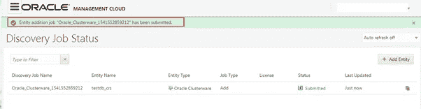

# OMC:发现 Oracle 基础架构监控的实体—第一部分

> 原文：<https://medium.com/oracledevs/discovering-target-entities-for-oracle-infrastructure-monitoring-omc-6163b5dc201c?source=collection_archive---------0----------------------->

## 作者:[mono war Mukul](https://medium.com/u/3757393c69bd?source=post_page-----6163b5dc201c--------------------------------)(OCM)&[NASS yam Basha](https://medium.com/u/ba3f0a72ff81?source=post_page-----6163b5dc201c--------------------------------)(甲骨文王牌总监，OCM)

## **简介**

在本文中，我们将重点关注发现 Oracle 基础架构的实体，监视 Oracle 数据库服务器堆栈组件中已安装代理的目标。将组件添加到 OMC 后，我们将为所有添加的实体启用许可证以进行基础架构监控，最后我们将查看配置，同时从华而不实的 OMC 控制台监控目标。具体来说，我们将看到为以下 Oracle 组件发现实体

*   Oracle 集群件
*   ASM/ASM 监听器
*   查看配置
*   监控目标

## **从 OMC 发现 Oracle 集群件实体**

回到基础:在 Enterprise Manager 中，最初我们将在目标服务器上安装代理，然后我们将手动发现对目标配置的必要更改。同样，我们已经在上一篇文章中安装了代理，在本文中，我们将发现目标的实体和目标的组件，在本例中，我们将发现 Oracle 堆栈的实体。现在，我们将添加 Oracle 集群件的实体。

通过“管理→发现”导航访问 Oracle 管理控制台

Navigation to Discovery

Click on Add Entity

在“添加实体”表单中，需要为以下字段填写为 Oracle Clusterware 组件添加实体所需的所有条目。

*   实体类型
*   实体名称
*   CRS 主路径
*   扫描名称
*   集群名称
*   港口
*   云代理→从下拉列表中选择
*   作业名
*   许可证版本

Adding entity for the Oracle Clusterware

填写所有必填字段后，单击“添加实体”提交。

Entity Confirmation

提交请求后，我们可以查看作业的状态。

Job Submitted

Job Completed

作业完成后，我们可以看到状态为“已完成”。现在，目标应该能够发送特定于此组件(Oracle Clusterware)的分析数据，并且可以按如下方式进行监视。

The entity was added to OMC

好的一面是，添加 Oracle Clusterware 后，我们可以看到集群的所有成员，以及 OMC 在配置或性能方面的各种选项。

The Clusterware entity with all the nodes

Review configuration of Entity

## **添加自动存储管理的实体**

在本节中，我们将把 ASM 实体添加到 Oracle 管理云中，以监视 ASM 实例、磁盘组和相关信息。所有组件的添加实体表单都是相同的，唯一的区别是选择合适的实体类型。

我们需要填写以下详细信息来完成实体。

*   实体类型
*   实体名称
*   实体显示名称
*   机器名称
*   主机名
*   港口
*   （同 suddenionosphericdisturbance）电离层的突然骚扰
*   草案
*   Oracle 主目录路径
*   云代理
*   作业名
*   用户名/密码/角色
*   许可证版本

完成所有字段后，现在我们可以提交要添加的实体。

ASM entity form

提交后，将分配作业名称来监控或跟踪状态。

Job submitted for the ASM entity

Job Completed for the ASM entity

自动存储管理(ASM)实体已成功添加到 Oracle infrastructure monitoring。

## **添加 Oracle 数据库集群监听器的实体**

到目前为止，我们已经添加了集群件和 ASM 的实体，现在我们将集群监听器实体添加到 OMC。该程序同样是我们上述实践中熟知的。

*   实体类型
*   实体名称
*   CRS 主页
*   主机名
*   别名
*   云代理
*   作业名
*   许可证版本

按照下图填写所有字段，然后点击“添加条目”。

Add Entity for Oracle ASM Listener

提交作业后，我们可以监控作业的状态。

Job Submitted for Oracle ASM Listener Entity

完成后，我们可以从 Oracle 管理云控制台查看状态、配置和各种其他指标和结果。

Oracle ASM Listener entity status

## **实体授权许可**

到目前为止，我们已经添加了集群件、监听器等实体。到目前为止，只是添加了目标，但没有启用它们，因为在添加每个实体后，我们需要启用许可证。在许可选项中，我们可以看到三种选择

*   无-禁用的实体
*   企业版—许可版
*   标准版—许可版

现在，我们将启用 RAC 主机来持续监控基础架构。

导航路径与“添加条目”不同，我们必须遵循 Oracle 管理云的导航路径“管理→实体配置→许可”

Navigate to Entity Configuration

在下图中，选择我们在实践中发现的所有实体，然后我们将启用监控。

Click on Entities (1 Out of 7)

它将列出在 OMC 注册的实体数量，选择需要启用的实体。

Entities to be enabled

在选择了监控所需的目标后，现在我们可以从 entities 部分看到所有目标的状态，该部分有一个漂亮的图形视图，其中包含友好的基础架构监控的各种选项。

> 我们将在下一篇文章“将 Oracle RAC 数据库实体添加到 OMC 并启用许可证”中看到更多详细信息，不久我们将链接文章 URL。

All the Entities Status from the OMC

## **总结**

我们已经了解了如何将 Oracle 堆栈的实体(集群件、监听程序)添加到 OMC 以实现更好的基础架构监控，通过界面上的逐步说明(包括如何为持续监控启用许可证)轻松进行故障排除。

## 作者简历

***纳西姆·巴沙*** 是数据库管理员。他有大约十年的 Oracle 数据库管理员工作经验，目前是 eprosed KSA 公司的数据库专家。他拥有马德拉斯大学的计算机应用硕士学位。他是 Oracle 11g 认证大师和 Oracle ACE 总监。他以超级英雄的身份积极参与甲骨文相关论坛，如 OTN，甲骨文支持被授予“大师”称号，并担任 OTN 版主，与 OTN 一起撰写了大量关于 Toad World 的文章。他维护着一个与甲骨文技术相关的博客，www.oracle-ckpt.com，可以通过 https://www.linkedin.com/in/nassyambasha/找到他

***Monowar Mukul*** 目前担任首席 Oracle 数据库专家。我是 Oracle 认证大师(Oracle 12c 认证大师管理、Oracle 12c 认证大师 MAA 和 Oracle 11g 认证大师管理)。他在 Oracle MAA 空间担任了 17 年的 Oracle 数据库管理员顾问，负责数据库云服务器和非数据库云服务器系统、Oracle 云空间和 SOA 中间件。他曾在澳大利亚的多个商业领域工作，包括高等教育、能源、政府、采矿和运输。作为一名首席 Oracle 数据库专家，他展示了高度发展的批判性思维和分析技能。你可以在[https://www.linkedin.com/in/monowarmukul/](https://www.linkedin.com/in/monowarmukul/)找到关于他和他的工作成就的更多细节