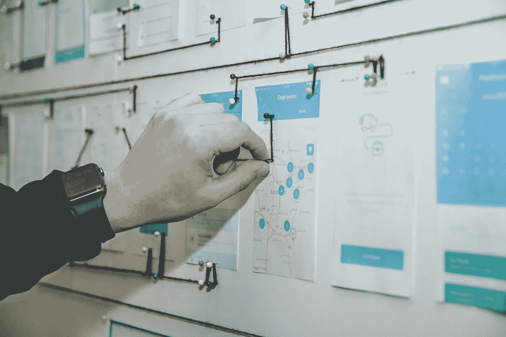

# 剖析产品所有权

> 原文：<https://medium.com/globant/dissecting-product-ownership-5b6312936e32?source=collection_archive---------0----------------------->

IT 中的许多角色定义松散，随之而来的职责也有些模糊。产品所有者(或 PO，我将继续简称它)的角色就是其中之一，我相信名称中的单词 ***所有者*** *是误导许多听到它的人的部分原因。在这篇文章中，我想解释所有权的概念，以及它与成功的项目官员和团队的态度和技能的关系。*

# **所有权**

在最常见的意义上，所有权是一个法律概念，它定义了谁拥有某物。就产品而言，这是谁拥有知识产权。这种所有权很容易理解和识别，它通常意味着所有者有权对他们的产品做出任何决定。我想补充一下这个定义，任何东西的拥有者都是对它负责的人。如果你有一个孩子，在讨论得到他们的第一只宠物时，你很可能会提出这一点。这是他们的宠物，这意味着他们可以享受欢乐时光，但他们也需要清理混乱。

那么 POs 拥有什么，或者他们负责什么？通常，他们被认为拥有产品 backlog，或者类似的东西。虽然不同组织的确切界限各不相同，但 PO 通常被描述为:

*   将产品愿景转化为明确的用户故事
*   团队中客户的声音
*   各方之间透明讨论和谈判的促进者
*   负责确保交付的产品符合预期

人们通常期望 POs 不仅负责这些项目。他们可能被期望处理部分发现或 BA 过程，帮助产品经理定义远景，帮助 scrum 团队完成他们的仪式，优化开发过程，以及其他相关的任务。这完全取决于团队和项目的规模以及组织的文化。有时根本没有 PO 角色，pm、PDM 和 TLs 负责以上所有工作。最后，术语并不是最重要的方面，尽管如此，让我解释一下为什么我认为在这个角色的名称中使用 owner 这个词是好的。

让我们退一步，看看所有权的另一层含义是什么。许多文章和谈话鼓励在工作中采取所有权，当然，他们并不意味着你应该试图收购公司。*夺取所有权在这个意义上意味着两件事:*

*   *通过积极主动地专注于改进产品来展示你对产品的关心*
*   *承担任何结果的责任，不管是好是坏*

*我认为这是一种相反的态度，不注意，只做你被告知的事情而不考虑后果。这种行为可能足以表明你在乎保住你的工作，但也表明你并没有真正致力于充分利用产品。*

*相反，作家、前海军海豹突击队的 Jocko Willink 在他同名的书中创造了术语*极端所有权，其信息可以总结为永远不要责怪他人。相反，他建议承认任何你本可以合理避免的失败，积极寻求纠正它，并确保它不会重复。他认为这是一种每个人都应该展示的所有权，无论是在工作中还是在个人生活中(点击这里查看他的 TED 演讲)。让我们看看这对产品负责人来说意味着什么。**

# ****将所有权作为 PO****

**第一个方面，积极主动，现在是一个时髦的词，但是你不应该把它解释为工作狂或者为了工作放弃休息和个人时间。它只是意味着你要睁大眼睛寻找机会让事情变得更好，当你看到它们的时候就采取行动。销售代表负责让每个人都朝着同一个愿景前进，并确保流程高效，因此他们的这种态度会对产品产生巨大影响。**

**至于责任，这个角色意味着不断的决策，这在每个转折点都有成功和失败的可能。这意味着，如果你是一个积极主动的 PO，做了很多决定，你一定会不时地把事情搞砸。你应该做好准备，而不是找借口，你应该承担责任，寻找经验教训。这是赢得依赖你和你的工作的人的信任和尊重的好方法，值得努力。**

**参与组织处于不同团队和利益相关者之间的最佳位置，以确定机会并倡导行动，但他们只有在拥有所有权的情况下才会这样做。在他们的角色中使用“所有者”这个词是一个很好的提醒，即使他们不是公司或产品的合法所有者，他们也需要每天准备好掌握所有权。**

# ****团队拥有产品****

**作为结束语，请记住，从这个意义上来说，一个产品或功能永远不会只有一个所有者，一家公司也是如此。这种隐喻性的所有权不是排他性的，这就是为什么角色有时重叠对我来说也是有意义的。如果你能激励团队中的每一个人避免玩指责游戏，并在他们看到机会的地方推动改进，团队士气和产品质量都会显著提高。在那一点上， ***团队拥有产品*** ，这是应该的方式，这是应该鼓励每个团队成员去做的，不管他们的角色中有没有所有者这个词。**

****