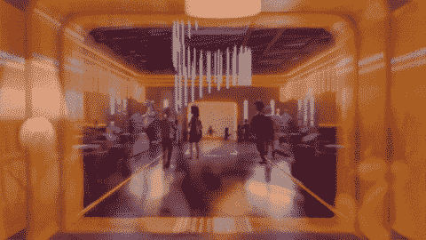
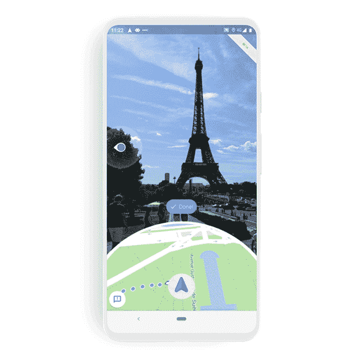

# 剖析元宇宙社交和搜索的未来

> 原文：<https://medium.com/globant/dissecting-the-future-of-social-and-search-in-metaverse-6f230259e784?source=collection_archive---------1----------------------->

元宇宙是一个真正的游戏规则改变者，自成立以来，它发展迅速，改变了营销的定义，并挑战现有的社交媒体营销和搜索引擎优化策略。就背景而言，各品牌正在有意识地努力，通过修改后的元宇宙营销战略赢得元宇宙的这一新空间，这些战略承诺提高品牌知名度，以创造和提供最强大的沉浸式体验为中心——这些体验定义了元宇宙的本质。

这篇文章揭示了元宇宙的“视界”,它不仅仅是具有沉浸式社交存在的社交空间，而且实际上是营销人员需要识别和利用的“巨大”营销可能性。它揭示了品牌如何在元宇宙开花结果，以及哪些社交媒体和搜索引擎优化策略和技术在行动过程中非常有帮助。

重要的事情先来！

**元宇宙的起源**

“欢迎进入社交联系的下一个篇章”——这是社交媒体巨头脸书宣布更名为 Meta 的方式。由此，它暗示了元宇宙新时代的出现，这是一个拥有更伟大、更宏伟、更像 T4 的 3D 世界。虽然 2D 世界是移动主导的，通过**图像和视频将人们联系起来，但元宇宙远远超过了**，通过增强现实和虚拟现实被最大限度地利用，以促进真正沉浸式的体验。

欢迎来到元宇宙——勇敢的 3D 新世界！ ***虚拟世界的社交关系！***

The Metaverse Experience (Source: Giphy)

***在去“地平线”的路上。。。！***

Meta 的地平线世界:关键的社交虚拟现实平台

到 2022 年 2 月，多达 10，000 个地平线世界已经被创造出来，而且这个数字每天都在成倍增加(来源:地平线世界)。品牌正准备建设地平线的原因是显而易见的——在 3D“世界”中有无限的可能性来丰富客户体验事实上，这些视野并不局限于虚拟共享空间中的“社交在场”或虚拟角色之间的情感社交互动，它不仅仅是提供一种***完整的多感官客户体验*** *。* 因此，营销人员可以识别这些高潜力的营销接触点，使他们的客户体验真正引人入胜、身临其境。

例如，一个饮料品牌可以充分利用俱乐部的视野，一个运动品牌可以通过他们的健身房元宇宙展示真实世界的健身体验，等等。

创作能够给观众带来逼真体验的虚拟现实内容 对于这样的行业来说是非常出色的。根据营销目标和观众角色，品牌可以开发任何类型的虚拟现实内容，从**虚拟现实产品演示、360°视频到虚拟现实活动和互动模拟。**

***市场的可能性是无限的！***

**化身代表作为一个巨大的营销机会:**

替身是元宇宙生存的必需品。毕竟，元宇宙需要有人“在场”在那里玩耍、会面、表演和呼吸。在上下文中，metaverses 充满了真实生活中真实人物的 3D 化身，他们在那里体验整个元宇宙。

*   **用户可以设计自己的头像:**元宇宙的用户可以按照自己想要表达的方式创建和定制自己的头像。他们可以生成照片般逼真的人形面孔或丰满的化身，还可以按照他们想要的方式来设计。
*   **营销人员的职责:**设计头像是用户的选择。为用户提供无限的可能性是营销人员的职责！这是真的，这就是为什么像耐克这样的时尚品牌向虚拟形象展示过多产品的原因，这样他们就可以成为最好的自己。Nikeland 的元宇宙营销说服用户“跳入”Nikeland，用“Nike Gear”和“解锁运动超能力”来设计他们的头像，以体验 Nikeland 上最令人兴奋的游戏(来源:Nikeland，Roblox)。
*   **元宇宙的虚拟形象和双重人格:**虚拟化听起来令人兴奋。然而，营销人员应该认识到这样一个事实:在 3D 人形机器人的背后，是一个有身份的真实跳动的人——那就是你真正的顾客！尝试 ***了解你的客户角色*** 在你进军元宇宙市场之前。以这样一种方式管理您的品牌努力和创建您的品牌故事，以便您解决两种身份的需求和偏好——一个在元宇宙，另一个在现实世界。
*   **化身影响者在元宇宙:**随着名人的化身化，元宇宙标志着影响者营销的转变。请注意环球音乐集团(UMG)和 Genies 之间的全球合作伙伴关系，为标志性的艺术家开发头像和数字可穿戴设备，贾斯汀比伯、蕾哈娜和肖恩·蒙德兹就是其中的几个例子。(来源:环球音乐)

此外，不要忘记会见 Maya，Puma 的虚拟影响者和东南亚的第一个虚拟影响者(Instagram handle: mayaaa.gram)。Maya 是一个虚拟角色，使用 3D 版本技术和人工智能技术创建。她的个性和故事都随着她与南亚观众的互动而实时发展。Maya 是一位杰出的社交媒体影响者，不知何故，她正在改变营销领域的定义。

Meet Maya, Puma’s Virtual Influencer on Social Media

**元宇宙:新社会**

虽然我们看到了社交媒体与人和资产的 3D 表现之间的强大协作，但随着元宇宙的到来，社交媒体很可能会变得栩栩如生。 **3D 广告**正在进入社交媒体，电子商务和零售行业正在努力创建和上传他们产品的 3D 展示。是时候拿起虚拟现实耳机开始体验强大的沉浸式旅程了。

随着元宇宙的扩张，**社交虚拟现实**无疑是新的未来，这可能意味着翻新现有的社交媒体平台，以拥抱扩展的现实。社交虚拟现实平台已经出现，这些平台可以成为新的空间，成为见面、玩耍和社交的新元宇宙——这可能是一个新的更好、更广阔、互动和沉浸式的虚拟世界，品牌和客户可以在这里见面，进行更好的合作。

虽然 3D 渲染和虚拟现实开发是元宇宙的关键，但品牌需要对客户的体验之旅格外谨慎。元宇宙，就其本质而言，意味着一个互联虚拟世界的宇宙，因此，**也有必要为您的受众增强“搜索”体验**，以便他们感受、感知并认同在每个营销平台和生态系统中听起来都一样的品牌声音。

**元宇宙和搜索引擎优化**

面对元宇宙的发展势头，以及从 Web 2.0 到 Web 3.0 的预期过渡。最相关的问题仍然是相似的——如何被找到？

在 Web 2.0 时代，营销人员优化了他们的网站，重新思考了他们的品牌叙事，以便在 2D 占主导地位的搜索引擎上找到它们。一些最关键和最成功的策略包括语音搜索优化、使用 alt 文本的图像优化、创建移动优先响应网站，以及通过结构化数据标记、本地列表等确保搜索引擎的正确索引和受众的轻松可见性。

好消息是，优化仍在继续，事实上，我们已经完成了一半，已经针对 web 2.0 优化了我们的 Web 资产。随着这种转变和数字世界拥抱元宇宙，我们更加需要用 Web 3.0(代表视觉现实、增强现实和 3D)来规划我们的数字营销战略和优化工作。

元宇宙 SEO 战略应该是什么样的？

**视觉搜索优化:**网络资产的视觉搜索优化将是成功品牌的关键区别。即使在今天，这也适用于许多电子商务品牌，尤其是时尚和家居装饰零售商，他们是视觉优化搜索的先驱。一个这样的例子是 *Pinterest Lens* 及其相关功能，如 *Lens Your Look* 和 *Shop Your Look* ，它们严重依赖于增强现实(AR)。试一试你最喜欢的化妆品和家居装饰品——每一次虚拟的体验都是真实的，令人着迷的，令人满足的。

*元宇宙将视觉搜索提升到了一个全新的水平！*

**在虚拟空间中建立虚拟商店:**如果零售商建立虚拟商店供你穿行呢？沃尔玛通过 3D 虚拟购物之旅在他们的网站上推出了“新的家庭数字购物体验”。虚拟之旅在很大程度上提升了品牌知名度，也促成了一个简单且高度便捷的(也是转化！)顾客可以“购买房间”的购物体验——这是通过 3D 购物之旅虚拟设计和展示的方式(来源:沃尔玛公司)。

针对元宇宙的优化将不限于 3D 虚拟旅游，而是扩展到将 3D 空间感知嵌入到您的网站中。

**3D 图像、感官标识和全息图:**当 3D 图像流行时，品牌应该尽快适应在网站上加入感官标识。不要错过，全息图是营销的未来。然而，给网站添加全息图的想法仍然没有得到充分考虑，因为如何让它们被搜索引擎索引是一个挑战，而搜索引擎目前主要是 2.0。然而，这开启了围绕搜索引擎变得擅长索引 3D 资产的新一轮讨论。

也许是时候期待另一个主要的算法或搜索引擎模型与元宇宙同步了——一些超越谷歌妈妈的东西。谷歌妈妈在其现状中，将搜索能力扩展到包括视频在内的模态，也许当前的需要是创造一些有助于重新思考和重新发明搜索的东西，同时拥抱元宇宙新的虚拟现实。

然而，总有一种方法可以让搜索引擎知道和理解内容，以获得更好的索引和搜索结果，这是通过部署良好编码的结构化数据标记来实现的。

**元宇宙和 3D 模型模式标记:**

这很大程度上取决于我们的搜索引擎如何进化以适应元宇宙。然而，3D 模型模式标记可以促进品牌在搜索引擎上的可见性。标记可以帮助标记存在于虚拟世界和元宇宙空间中的各种对象，以这种方式，搜索引擎发现结构化标签容易访问并且机器可读。一旦呈现给搜索引擎的结构化信息被编入索引，你的企业/品牌就会出现在元宇宙中，就像 Web 2.0 上的搜索结果一样。3D 模型模式标记将被 JSON-LD fed，它将让搜索引擎知道您网站上的内容类型是 3D 模型。在元宇宙，虚拟内容类型将占据优先地位，结构化数据标记可能是最有效的可见性解决方案之一。

就背景而言，3D 地图和 3D 街景等 3D 对象是另一套将在元宇宙保持强劲势头的虚拟现实体验。

**VR 驱动的本地 SEO:**

优化企业名录以获得逼真的沉浸式体验是一笔不错的交易。用增强现实创造 3D 体验是可能的，谷歌的 AR/VR techstack 可以帮助你的品牌立即实现这一点。想象一下，顾客在 3D 街景中穿行，查看你的餐厅美丽宁静的环境，这种努力是值得的，对吗？

An image showing the Live View experience in Google Maps near the Eiffel Tower in Paris, France (Source: Google Maps)

构建这种身临其境的内容所需要的只是与搜索引擎分享关于您业务的准确信息，包括视觉信息，以便 AR 和 VR 平台通过增强现实增强这些信息的表现，创造有史以来最诱人的客户体验。

最后但同样重要的是。。。

**基于领域的战略和品牌重塑**

脸书更名为 Meta，Oculus VR 套装现在更名为 MetaQuest。这不是无中生有。重塑品牌有帮助！脸书更名为 Meta，以展示他们所信仰的元宇宙，在元宇宙获得更高的知名度，并在搜索引擎上被发现。关键词要紧！话虽如此，如果你要推出一款新产品，围绕元宇宙进行设计，让它融入新的勇敢的 3D 世界。如果它是一个现有的，但已经冒险进入元宇宙，尝试更名！

**结论**

请记住，元宇宙仍然不是主流，但它带来了成为主流的巨大潜力。它已经超越了预设的定义，打破了许多传统的营销模式。这是品牌行动的时候，也是营销人员利用元宇宙承诺的巨大营销范围的时候。他们可以重新思考他们的品牌叙事，重新调整他们的优化工作，使其更加强大，并重申他们的品牌价值，但以“元宇宙”的方式-这是真正身临其境，有影响力，令人印象深刻的记忆和享受！