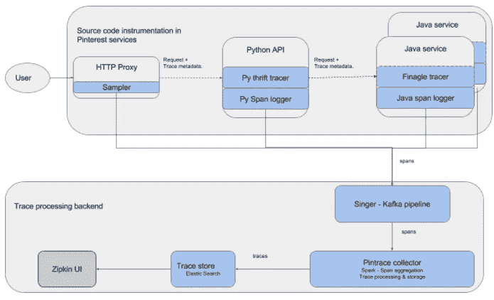
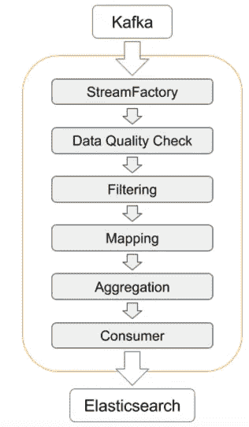

# 使用新的开源工具在 Pinterest 进行分布式追踪

> 原文：<https://medium.com/pinterest-engineering/distributed-tracing-at-pinterest-with-new-open-source-tools-a4f8a5562f6b?source=collection_archive---------0----------------------->

Pinterest 工程师苏曼·卡鲁穆里

Pinterest 后端由部署在数万台机器上的数百个微服务组成。对 Pinterest home feed 的一个简单请求可以对几十个后端服务进行数百次网络调用。虽然我们知道执行一个请求需要多长时间，但是以前我们不知道为什么一个请求会很慢。为了收集这些数据，我们构建了 Pintrace，这是一个分布式跟踪管道，可以在我们的 Python 和 Java 后端服务处理请求时跟踪请求。我们还构建了 Pintrace collector 来帮助我们调试性能问题。Pintrace collector 是一个 Spark 作业，它从 Kafka 读取跨度，将它们聚合成轨迹，并存储在 Elasticsearch 后端。今天，我们在 Github 上开源 [Pintrace collector，并将代码贡献给 OpenZipkin 社区。通过向社区发布它，我们希望其他人也能像我们一样从这个项目中受益。](https://github.com/openzipkin/zipkin-sparkstreaming)

## 背景

追踪延迟的来源可能非常具有挑战性，因为缓慢可能是由我们的任何一个后端服务引起的。我们的度量标准( [OpenTSDB](http://opentsdb.net/) )和日志记录( [ELK](https://www.elastic.co/products/kibana) )基础设施提供了后端如何处理请求的粗粒度视图，但是在 Pintrace 之前，很难查明请求缓慢的原因。

为了解决这一挑战，我们求助于分布式跟踪，这种跟踪跟踪延迟问题并显示请求在哪里花费时间。除了请求延迟信息之外，它还通过捕获请求因果关系信息(即，哪些下游请求作为请求的一部分被执行)来提供对请求执行的细粒度可见性。Pintrace 是我们内部的分布式跟踪管道，在我们的 Python 和 Java 后端服务处理请求时跟踪请求。

在我们研究细节之前，让我们定义一些术语。注释是在请求过程中发生的事件。例如，向服务器发送请求就是一个注释。一个 span 表示一个逻辑操作，并包含一组属于该操作的注释。例如，由“客户端发送”和“客户端接收”注释组成的 RPC 调用被表示为一个 span。轨迹是跨度的图形。请求执行通常被捕获为跟踪。跟踪中的所有跨度都具有相同的跟踪 ID。关于如何构造跟踪的更多细节，请查看 [OpenTracing 的介绍](http://opentracing.io/documentation/)。

## Pintrace:追踪管道

构建分布式跟踪基础结构包括设置跟踪管道。跟踪管道由两个主要组件组成——源代码工具和跟踪处理后端。

源代码工具负责跨服务跟踪请求，并在请求沿着各种服务被处理时生成事件(跨度)。跟踪处理后端负责聚集生成的范围，将它们处理成跟踪并存储它们。可以在 UI 中搜索和可视化存储的轨迹。

Pintrace 跟踪管道由下图所示的几个组件组成。蓝色部分是内部制造的。

## 源代码检测

设置跟踪管道时，源代码检测是主要工作。该工具负责生成属于具有相同跟踪 ID 的同一请求的范围。为了实现这一点，该工具执行三项任务:(a)将跟踪 ID 与每个请求一起传播(b)为该组件执行的每个逻辑操作生成跨度，并将生成的跨度发送到后端。前两项职责由追踪器执行。记录器实现第三种责任。在 Pinterest，我们使用名为 [Singer](https://engineering.pinterest.com/blog/real-time-analytics-pinterest) 的分析工具记录 Kafka 的跨度。

Pintrace backend 由用 Python、Java、Go、Node 和 C++编写的 Thrift 服务组成，每种服务使用不同的框架。为了跨这些服务跟踪请求，我们为每个语言框架组合实现了一个跟踪器。Pinterest 对每种语言都有一个通用的框架，我们感兴趣的大多数服务都是用 Python 和 Java 编写的，所以我们只需要使用 Python 和 Java 框架。当我们第一次开始构建 Pintrace 时，最初的目标是跟踪网络请求延迟，所以我们只关注于捕获 Python 和 Java 应用程序中请求的网络活动。

## Python 工具

我们的 Java 服务由一个名为 ngapi 的整体 Python 应用程序提供前端支持，ngapi 是一个 HTTP 服务，它处理所有传入我们后端的请求。为了满足请求，ngapi 通过 Thrift 与几个 Java 服务进行对话，并实现了一个基于 Python gevent 库的定制 web 框架。由于它是一个定制的框架，我们实现了自己的跟踪器来跟踪通过它的请求。

我们使用[开放跟踪 API](http://opentracing.io/) 为我们的网络框架编写了一个跟踪程序。跟踪程序使用 Finagle 提供的自定义节俭包装器将跟踪 ID 从 HTTP 接口传播到 Java 节俭服务。此外，跟踪程序生成的范围涵盖了所有的 credit、Memcache 和 HTTP 请求。为了报告这些跨度，我们编写了一个记录器，将生成的跨度转换为 [Zipkin 格式](https://github.com/openzipkin/zipkin-api/blob/master/thrift/zipkinCore.thrift)，并使用 Singer 将它们记录到卡夫卡。

由于 ngapi 在 monorepo 中进行管理，并作为一个整体应用程序进行部署，因此启用跟踪的更改将在所有前端服务中一步到位。
爪哇示踪剂及记录器

我们的 Java 服务使用一个名为“服务框架”的内部框架，这是一个围绕着推特的 Finagle 库的包装。由于 Finagle 附带了一个 Zipkin 跟踪程序，我们没有为我们的 Java 服务构建新的跟踪程序。默认情况下，Finagle tracer 会将收集到的跨度写入到 scribe 或日志文件中，但是因为我们想使用 Singer 将跨度写入到 Kafka，所以我们编写了一个跨度记录器，将跨度记录到 Singer 中。

一旦跟踪器和记录器就位，我们就在服务框架中启用它们。然而，我们的服务框架缺乏一种在所有应用程序中同时启用跟踪的方法。为了避免在 100 多个应用程序中重复这个逻辑，我们更新了服务框架，使其具有全局配置并启用了跟踪。然后，我们更新了我们的 Java 应用程序，以使用更新后的服务框架中的全局配置。在 Java 中启用跟踪最困难的部分是在数百个应用程序中进行更改，并努力在整个组织中部署更改。

## 取样器

尽管我们的客户端工具具有非常小的延迟开销，但是通过捕获跨度并记录它们，会增加两位数的计算开销。为了减少这种开销以及存储生成的跟踪的成本，我们只跟踪一小部分整体请求。

采样器组件决定应该跟踪哪些请求，并随机选择我们所有后端请求的 0%到 1%(通常是 0.3%)。该费率可使用[决策器框架](https://engineering.pinterest.com/blog/serving-configuration-data-scale-high-availability)动态调整。我们还在开发机器上对所有请求进行采样，以便开发人员可以将跟踪作为日常活动的一部分。

## 跟踪处理后端

如上图所示，跟踪处理后端负责聚合集群中数千台机器的跨度，将它们处理成跟踪，并存储和可视化它们。

## 辛格-卡夫卡管道

Singer-Kafka 管道负责聚合跨越数千台机器的多个进程生成的跨度，并将它们写入 Kafka 主题。我们使用 [Singer](https://engineering.pinterest.com/blog/real-time-analytics-pinterest) 作为我们的 span 聚合渠道。Python 和 Java 记录器将跨度记录到本地文件中。安装在每台主机上的 Singer 守护进程跟踪这些文件，并将跨度写入 Kafka 主题。

## Pintrace 收集器

我们使用 OpenZipkin 后端来获取跨度，但是捕获的轨迹揭示了一些问题。例如，我们的一些仪器可能有故障。在这种情况下，我们希望修复故障量程或丢弃量程，直到修复仪器。即使仔细取样，以我们的规模，我们也能看到很多类似的痕迹。与其存储这些跟踪，不如在接收时进一步对跟踪进行采样，并且只存储高价值的跟踪，这样会更划算。

这些功能很难添加到我们的后端，所以我们建立了 Pintrace collector，这是一个 Spark 作业，它从 Kafka 读取跨度，将它们聚集成轨迹并存储在 Elasticsearch 后端。我们选择 Spark 来实现管道，因为它足够灵活和可伸缩，可以实现所需的过滤、按跟踪 ID 分组跨度以及为分析目的聚合时间窗口的跨度。作为一个额外的好处，Spark 作业允许我们对跨度运行实时分析，而无需存储它们。

下图显示了 Pintrace collector 的内部架构。StreamFactory 是一个可扩展的接口，它从 Kafka 或任何其他传输中获取数据。然后，使用数据质量检查器对摄取的跨度进行处理，以确保它们的格式正确。可选地，过滤步骤基于诸如服务名称或跨度上的注释之类的标准来过滤跨度。聚合阶段按时间或跟踪 ID 对跨度进行分组。最终的消费者阶段将数据保存到存储系统，如 ElasticSearch 服务。

## Zipkin UI

如架构图所示，我们使用 [Zipkin UI](https://github.com/openzipkin/zipkin/tree/master/zipkin-ui) 来搜索和查看存储在 ElasticSearch 集群中的踪迹。我们也为 Zipkin UI 贡献了一些[的](https://github.com/openzipkin/zipkin/commits?author=mansu) [错误修复](https://github.com/openzipkin/zipkin/commits?author=naoman)。

## 开源 Pintrace 收集器

在过去的一年中，我们注意到 [OpenZipkin](https://github.com/openzipkin) 社区中的其他人正在寻找我们在 Pintrace 中实现的相同解决方案，例如更高级的采样和流处理，以支持 viz general 可视化。我们希望与社区分享我们的工作，同时利用其集体专业知识。为了尽可能的开放，我们在 [zipkin-sparkstreaming](https://github.com/openzipkin/zipkin-sparkstreaming) 代码库下直接将我们的代码贡献给 OpenZipkin。我们鼓励您观看或与我们合作构建 Zipkin-spark。我们希望你能像我们一样发现 Pintrace 收集器的用处。我们迫不及待地想看到来自社区的新想法。

如需继续阅读，请阅读第 2 部分:[(引脚)跟踪数据的应用](https://hackernoon.com/applications-of-pin-trace-data-3b9e6dc2744b)

*鸣谢:本项目的贡献者有*[*Naoman Abbas*](https://github.com/naoman)*[*Phoebe Tse*](https://github.com/phoebetse)*[*Ashley Huynh*](https://github.com/ashleyswinning)*[*Alejandro Garcia Salas*](https://github.com/alejandrogarciasalas)*[*Emmanuel Udo tong 我们还要感谢*](https://github.com/eudotong) [*阿德里安·科尔*](https://github.com/adriancole) *在项目期间给予的反馈和建议。*****