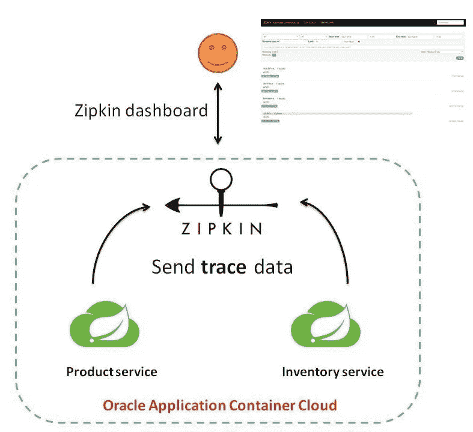
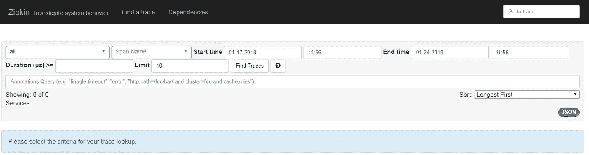
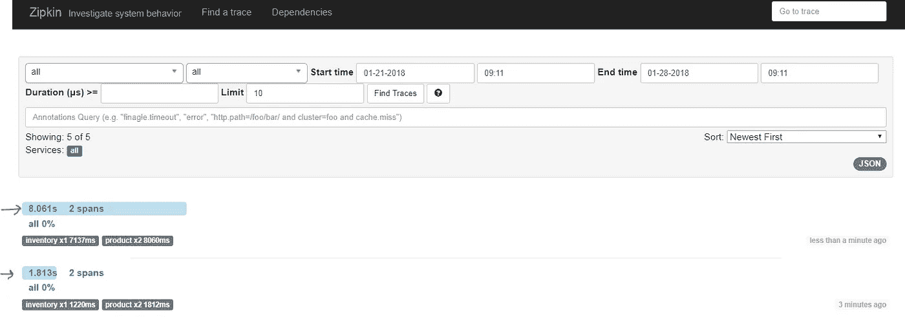
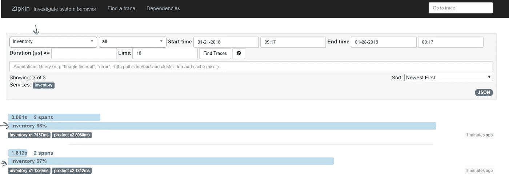
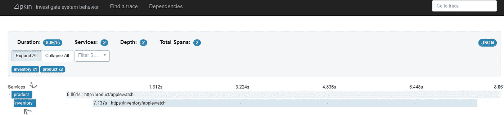
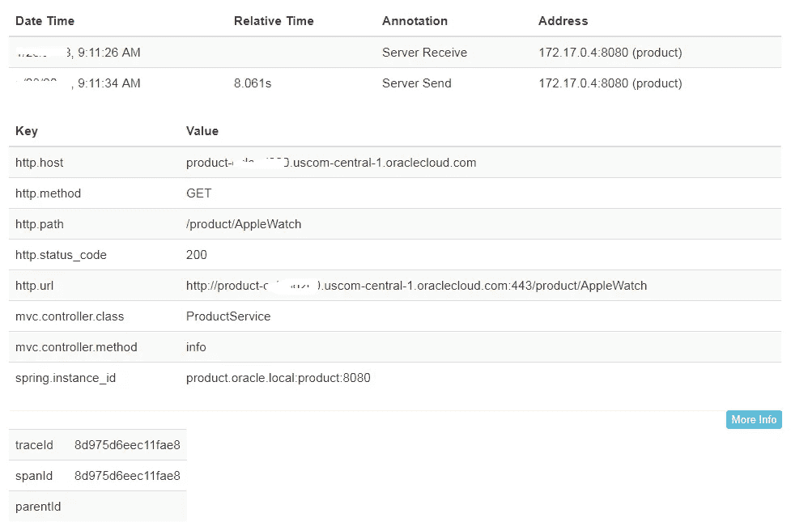
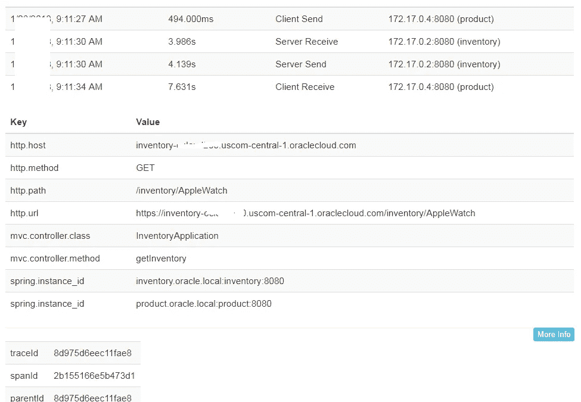
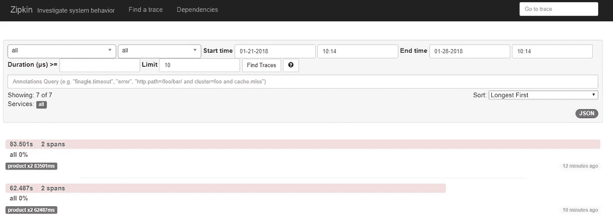
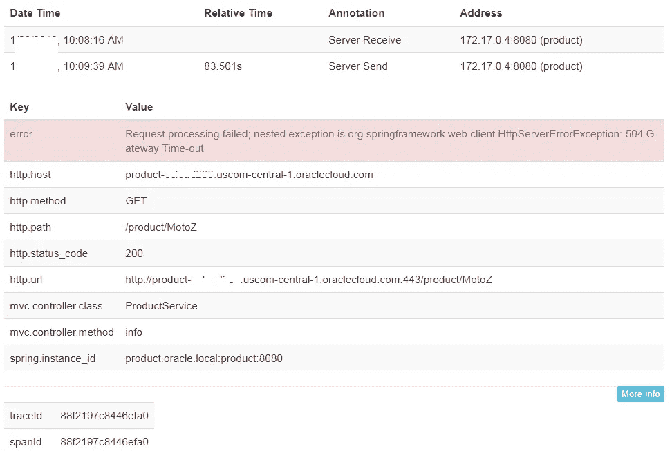

# 使用 Spring Cloud Sleuth 和 Zipkin 对 Oracle 云上的微服务进行分布式跟踪

> 原文：<https://medium.com/oracledevs/distributed-tracing-for-microservices-on-oracle-cloud-with-spring-cloud-sleuth-and-zipkin-b67158ebb34a?source=collection_archive---------0----------------------->

> 有关微服务主题的博客帖子的主目录，请参考—[https://medium . com/Oracle devs/bunch-of-microservice-related-blogs-57 b5 f1 f 062 e 5](/oracledevs/bunch-of-microservices-related-blogs-57b5f1f062e5)

好了，现在你有了一个云原生/微服务风格的架构，其中有多个服务相互协作来实现某个目标……太棒了！

调试和故障排除可能会很困难

*   多个(微)服务——每个服务做自己的事情
*   每个服务有多个实例——毕竟，我们的服务是无状态的，可水平扩展的！
*   有时，您甚至可能无法访问底层机器/虚拟机/节点，而只能通过特定于供应商/产品的方式来访问应用程序日志
*   等等。

上述限制没有任何问题——事实上，它们对于一般的分布式应用(无论是否是微服务)来说都是不可避免的，尤其是当它们在托管的 PaaS(平台即服务)环境中运行时

那么，当涉及到深入的应用程序级可见性时，我们可以做些什么来使事情变得更容易和可管理呢？没有灵丹妙药，但是**分布式跟踪**是一个工具，如果使用得当，可以帮助我们

这篇博客展示了 [Spring Boot](https://projects.spring.io/spring-boot/) 应用程序利用 [Spring Cloud Sleuth](https://cloud.spring.io/spring-cloud-sleuth/) 跟踪应用程序级别的事务，并将跟踪信息传输到远程 [Zipkin](https://zipkin.io/) 服务器

> 虽然重点是基于 Java 的应用程序，但是这个概念适用于任何能够以 OpenZipkin 格式生成跟踪数据的系统/服务

**Oracle 应用程序容器云**作为运行时

*   `**Zipkin**` 服务器和…
*   …以及 Spring Boot 应用程序— `inventory` 和`product`(我们将继续使用我们在[之前的一篇博客](/oracledevs/microservices-service-discovery-on-oracle-cloud-with-spring-cloud-and-zookeeper-627e6bb59ea2)中使用的同一组应用程序，只做了一些小的修改来演示这个概念)

[](https://cloud.oracle.com/application-container-cloud) [## 应用容器云| ACC | Oracle 云

### 云中的 Java 标准版和 Node.js。

cloud.oracle.com](https://cloud.oracle.com/application-container-cloud) 

# 体系结构

> *Github 上有示例应用*

[](https://github.com/abhirockzz/accs-spring-boot-zipkin-distributed-tracing) [## abhirockzz/accs-spring-boot-zipkin-分布式跟踪

### 在 GitHub 上创建一个账号，为 accs-spring-boot-zipkin-distributed-tracing 开发做贡献。

github.com](https://github.com/abhirockzz/accs-spring-boot-zipkin-distributed-tracing) 

下图提供了一个高层次的概述



High level architecture

非常简单——多亏了 Spring Cloud Sleuth (Zipkin 模块),单个 Spring Boot 应用程序将交易数据(跟踪)发送到 Zipkin，然后可以使用 Zipkin 自己提供的仪表板查看这些数据

以下是组件/服务的摘要

## 齐普金

Zipkin server 是另一个 Spring Boot 应用程序，它运行在嵌入式 Tomcat 容器中(在本例中)。这里几乎没有什么要求，除了

*   使用`zipkin-server`和`zipkin-autoconfigure-ui`(用于可视化仪表板)依赖关系，然后…
*   …在 Spring Boot 引导类上使用`[@EnableZipkinServer](http://twitter.com/EnableZipkinServer)`就可以了！

## 库存和产品服务

关于库存和产品服务的详细信息，请参考*关于 Oracle Cloud with Spring Cloud 和 Zookeeper 的微服务服务发现*博文

[](/oracledevs/microservices-service-discovery-on-oracle-cloud-with-spring-cloud-and-zookeeper-627e6bb59ea2) [## 基于 Spring Cloud 和 Zookeeper 的 Oracle Cloud 微服务服务发现

medium.com](/oracledevs/microservices-service-discovery-on-oracle-cloud-with-spring-cloud-and-zookeeper-627e6bb59ea2) 

需要知道的重要事情是

*   应用程序使用`spring-cloud-starter-sleuth`和`spring-cloud-sleuth-zipkin`模块(在`**pom.xml**`中)
*   `application.properties`使用`spring.zipkin.baseUrl`属性指向 Zipkin 服务器
*   为了简单起见，基于 Zookeeper 的服务发现*已被排除*并专注于单个主题，即*分布式跟踪*
*   而且它用了`RestTemplate` 而不是`FeignClient`

# 构建和部署

首先从 Github 获取项目— `git clone [https://github.com/abhirockzz/accs-spring-boot-zipkin-distributed-](https://github.com/abhirockzz/accs-microservices-service-discovery)tracing.git`

## 建设

**Zipkin 服务器**

*   `cd zipkinserver`
*   `mvn clean install`

构建过程将在`target` 目录中创建`zipkin-dist.zip`

**库存服务**

*   `cd inventory`
*   `mvn clean install`

构建过程将在`target` 目录中创建`inventory-dist.zip`

**产品服务**

*   `cd product`
*   `mvn clean install`

构建过程将在`target` 目录中创建`product-dist.zip`

## 部署也称为向云推进

借助 Oracle Application Container Cloud，您在部署应用程序方面有多种选择。本博客将利用 **PSM CLI** ，这是一个用于管理 Oracle 云服务的强大命令行界面

> 其他部署选项包括 [REST API](https://docs.oracle.com/en/cloud/paas/app-container-cloud/apcsr/index.html) 、 [Oracle 开发人员云](https://docs.oracle.com/en/cloud/paas/developer-cloud/csdcs/deploying-application-oracle-developer-cloud-service.html#GUID-6FE6D850-65DC-471D-A249-F7CCA9CAB56F)，当然还有[控制台/UI](https://docs.oracle.com/en/cloud/paas/app-container-cloud/csjse/creating-application.html)

您可以在您的机器上下载并设置 PSM CLI(使用`psm setup`)——[详情请点击](https://docs.oracle.com/en/cloud/paas/java-cloud/pscli/using-command-line-interface-1.html)

首先从部署 Zipkin 服务器应用程序开始，因为我们的两个微服务都依赖于它

*   **齐普金**——`psm accs push -n zipkin -r java -s hourly -m manifest.json -d deployment.json -p target/zipkin-dist.zip`

一旦 Zipkin 启动并运行，记下它在 Oracle Application Container Cloud 的**应用**页面中的 URL(下面突出显示)


**Zipkin** server deployed

现在，更新`inventory`应用的`deployment.json`,输入 Zipkin 服务器信息

```
{
 "memory": "2G",
 "instances": 1,
 "environment":{
 **"ZIPKIN":"<ZIPKIN_URL>"**
 }
}
```

*   **库存服务** — `psm accs push -n inventory -r java -s hourly -m manifest.json -d deployment.json -p target/inventory-dist.zip`

记下 URL，因为它将在产品服务中使用


**inventory** service deployed

更新产品应用程序的`deployment.json`,以包括`inventory` 和`zipkin` 坐标

```
{
 "memory": "2G",
 "instances": 1,
 environment":{
 **"INVENTORY_SERVICE":"<INVENTORY_APP_URL>",
 "ZIPKIN":"<ZIPKIN_URL>"**
 }
}
```

*   **产品服务** — `psm accs push -n product -r java -s hourly -m manifest.json -d deployment.json -p target/product-dist.zip`


Spring Boot (**product**) service deployed

一切都准备好了，我们可以看到事情的进展…

# 试车

访问 Zipkin 服务器—记下应用程序的 URL，例如`[https://zipkin-<mydomain>.apaas.us2.oraclecloud.com](https://zipkin-ocloud200.uscom-central-1.oraclecloud.com)`



Zipkin on Oracle Application Container Cloud

## 快乐之路

首先，调用几次产品服务端点

例如`curl -X [https://product-ocloud100.apaas.us2.oraclecloud.com/product/iPhone](https://ProductService-ocloud100.apaas.us2.oraclecloud.com/product/iphone2)X`和`curl -X [https://product-ocloud100.apaas.us2.oraclecloud.com/product/](https://ProductService-ocloud100.apaas.us2.oraclecloud.com/product/iphone2)AppleWatch`

产品服务在内部调用库存服务来返回 JSON 响应

```
{"name":"iPhoneX","description":"Description for iPhoneX","stock":{"inventory":8,"node":"7e8127f0-c1a6-41db-b893-b786b773590b_67000ba4-ee1f-405c-9249-37ecd56b705d"}}
```

让我们跳到 Zipkin 仪表板，查询最新的跟踪(通过点击 **Find Traces** )



**Query** transactions in Zipkin

**对应于我们的调用，生成了两个独立的事务**(突出显示)

值得注意的要点

*   每个交易被分成 **2 个区间**
*   每个跨度由**服务跳**产生，即产品服务调用库存服务
*   您还可以准确地看到*库存服务在总时间方面贡献了多少时间*，即在第一个事务中，库存服务花费了 7137 ms ( **7.137 秒**)，而调用花费了 **8.06 秒**
*   通过服务过滤将会给你花费的时间的百分比

**过滤**只是通过**库存**服务然后查询 Zipkin，这就是你将会看到的——大约 **88%** 的时间都花在库存服务上了(在第一个事务中)



**Filter** by application in Zipkin

让我们通过单击第一个事务来更深入地了解一个特定的事务——这将为您提供一个详细的划分，调用的顺序也很明显



Spawned spans

单击产品范围将会显示更多细节，如调用时间表和 HTTP 请求信息



Parent transaction (**product** service)

请注意下面屏幕截图中的父事务 ID



child transaction (**inventory** service)

到目前为止一切顺利——让我们**停止**库存服务，看看会发生什么，并向 Zipkin 寻求帮助！

## 失败案例

停止(使用命令行界面)——`psm accs **stop** -n inventory`

再次调用产品服务(几次)——`curl -X [https://product-ocloud100.apaas.us2.oraclecloud.com/product/iPhone](https://ProductService-ocloud100.apaas.us2.oraclecloud.com/product/iphone2)X`

您应该会看到一个`**HTTP 500**`响应

```
{
 “timestamp”: 1517114482192,
 **“status”: 500**,
 “error”: “Internal Server Error”,
 “exception”: “org.springframework.web.client.HttpServerErrorException”,
 “message”: “504 Gateway Time-out”,
 “path”: “/product/MotoZ”
}
```



**Failed** transactions

我喜欢红色，但不是在这种情况下，因为它意味着危险——深入研究特定的交易会发现更多



explicit error message

# 其他注意事项

这些都是在这篇文章中没有提到的，但是值得一提的

*   编写自定义跨度
*   跟踪其他系统(如数据库)

好了，这篇博文到此为止！

# 不要忘记…

*   查看 Oracle Application Container Cloud 教程—每个运行时都有适合的内容！

 [## Oracle 应用容器云服务—创建您的第一批应用

### Oracle 应用容器云服务教程。学习创建你的第一个应用程序。

docs.oracle.com](https://docs.oracle.com/en/cloud/paas/app-container-cloud/create-first-applications.html) 

*   关于应用程序容器云的其他博客

[](/tag/app-container-cloud/latest) [## 关于应用容器云的最新故事和新闻—中型

### 阅读关于应用容器云的最新文章。每天，成千上万的声音阅读、书写和分享重要的…

medium.com](/tag/app-container-cloud/latest) 

干杯！

> 本文表达的观点是我个人的观点，不一定代表甲骨文的观点。