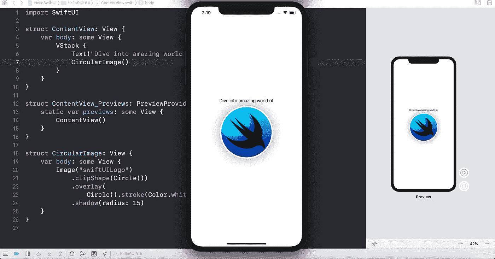

# 潜入 SwiftUI 的神奇世界

> 原文：<https://medium.com/globant/dive-into-amazing-world-of-swiftui-f35a25c5e9ce?source=collection_archive---------5----------------------->

# 简介:

SwiftUI 是自 2014 年苹果宣布 Swift 以来最激动人心的消息。苹果的目标是让每个人都编码，简化基础，这样我们就可以花更多的时间在让用户满意的定制功能上，这是一个巨大的进步。

SwiftUI 框架和设计工具协同工作，实现了构建用户界面的新方式。在 Xcode 之前…