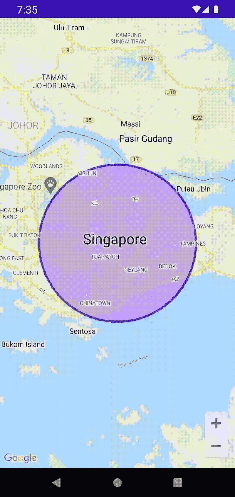

# 潜入合成-构建地图时学到的经验合成

> 原文：<https://medium.com/androiddevelopers/diving-into-compose-lessons-learned-while-building-maps-compose-d20ef5dfe1bb?source=collection_archive---------6----------------------->

## 构建地图时学到的互操作性和合成 API 经验

今年，我们发布了 [Maps Compose](https://github.com/googlemaps/android-maps-compose) 库，这是一个 Jetpack Compose 库，用于将谷歌地图添加到您的应用程序中。其核心是，Maps Compose 是一个用于 Android 的 Maps SDK 的互操作库，它公开了友好的合成 API。因此，要创建 Maps Compose 的可组合元素，我们需要在 Maps SDK 的现有 API 和可用的 Compose interop 函数的约束下工作。

在最终发布初始版本之前，Maps Compose 经历了几次设计和实现迭代。在这篇博文中，我想介绍一下 Maps Compose 的背景，它是如何出现的，以及在使用它时学到的一些经验。这篇文章与想要提供组合支持的 SDK 开发者特别相关；然而，它也应该与对写作感兴趣的读者相关。如果你落入了其中的一个桶里——继续读下去！

# 背景

在 Maps Compose 可用之前，由于 Compose 的[互用性 API](https://developer.android.com/jetpack/compose/interop/interop-apis)，即 [AndroidView](https://developer.android.com/jetpack/compose/interop/interop-apis#views-in-compose) 可组合，在 Compose 中使用 Maps SDK 已经成为可能。简单的用例——比如显示一张只有一个标记的地图——很简单；然而，与大量定制和绘图的适度复杂的集成需要编写大量的互操作代码，使得使用不那么简单。

为了衡量一个 Compose 库对 Android 开发人员有多有用，我发了以下推文:

Preview API of Maps Compose.

令我惊讶的是，许多开发人员的回答是“是的，请吧！”，“爽！”，并且“这将取代几百行代码。”🤯作为当时在 Maps SDK 工作的开发人员关系工程师之一，优先为 Maps SDK 发布可组合元素是有意义的。从那里，我内部提出了一个地图合成的设计和实现，并与 [Adam Powell](https://twitter.com/adamwp) 、 [Leland Richardson](https://twitter.com/intelligibabble) 和 [Ben Trengrove](https://twitter.com/bentrengrove) 合作完成。

*提供反馈会产生影响，并转化为真正的产品变化。我们喜欢收到您的来信！*

# 经验教训

## 第 1 课:重用核心地图 SDK 中的类

地图 SDK 已经存在了 10 多年，被许多应用程序使用。虽然 Compose 引入了一种完全不同的构建 UI 的方式，但一个可组合的地图版本应该仍然让人感到熟悉。如果你知道一点 Compose，并且以前使用过 Maps SDK，那么 composable maps 对你来说应该很直观。

为了让 API 更直观，我们尽可能重用了底层的 Maps SDK 类。例如，要在地图合成中执行相机更新，您仍然可以使用从 [CameraUpdateFactory](https://developers.google.com/android/reference/com/google/android/gms/maps/CameraUpdateFactory) 对象创建的现有 [CameraUpdate](https://developers.google.com/android/reference/com/google/android/gms/maps/CameraUpdate) 类。

然而，在某些情况下，Maps SDK 中的现有类不能按原样使用。例如， [UiSettings](https://developers.google.com/maps/documentation/android-sdk/reference/com/google/android/libraries/maps/UiSettings) 类被重用是没有意义的，因为它只能在地图创建后被检索。理想情况下，您应该能够创建该类的一个实例，并能够将其传递给 GoogleMap composable。为了解决这个问题，该类被镜像为一个地图合成类型， [MapUiSettings](https://googlemaps.github.io/android-maps-compose/maps-compose/com.google.maps.android.compose/-map-ui-settings/index.html) 。这个命名与现有的 UiSettings 类非常匹配，增加了“Map”前缀，有助于 API 的可发现性。MapUiSettings 与 UiSettings 具有完全相同的属性和默认值，不同之处在于它可以被创建并传递到 GoogleMap composable 中，而不是从另一个控制表面获取并改变它:

在运行时还可以更改映射的其他属性(例如，[setBuildingsEnabled(boolean)](https://developers.google.com/maps/documentation/android-sdk/reference/com/google/android/libraries/maps/GoogleMap#setBuildingsEnabled(boolean)))。我们的一个考虑是将这些属性作为单独的参数公开在 GoogleMap composable 上；但是，这将显著增加参数的数量，因为有许多属性可以切换。相反，我们选择创建一个单独的类， [MapProperties](https://googlemaps.github.io/android-maps-compose/maps-compose/com.google.maps.android.compose/-map-properties/index.html) ，它包含这些运行时配置的属性:

对于可以在地图上绘制的对象(标记、多段线等)。)，基于视图的强制方法是在 GoogleMap 对象上调用 add*方法，如 Google map . add marker(marker options)。为了在 Compose 中进行转换，GoogleMap composable 可以为每个绘图接受一个列表参数，但是，这个 API 可能很难用于包含大量具有复杂逻辑的绘制对象的集成。相反，我们决定公开一个组合友好的 API——一个通用的内容 lambda，其中的绘图可以作为单独的组合被调用。

需要在地图上绘制标记、折线或其他支持的绘制对象？调用[标记](https://googlemaps.github.io/android-maps-compose/maps-compose/com.google.maps.android.compose/-marker.html)、[折线](https://googlemaps.github.io/android-maps-compose/maps-compose/com.google.maps.android.compose/-polyline.html)，或者 GoogleMap 的内容 lambda 中的另一个装饰器可组合函数，如下所示:

## 第二课:利用 Kotlin 的特性

地图 SDK 是在 Kotlin 成为编写 Android 应用程序的一流语言之前开发的。也就是说，Maps SDK 主要是用 Java 构建的。另一方面，Jetpack Compose 完全是用 Kotlin 编写的，并且大量依赖 Kotlin 的习惯用法。对于 Maps Compose，我们还决定利用 Kotlin 语言特性，如协同程序，来公开一个 Kotlin 惯用 API。

例如，Compose 为[动画 API](https://developer.android.com/jetpack/compose/animation)使用了 Kotlin 的协同程序挂起函数。因此，在 Maps SDK 中为底层的基于回调的 API 提供类似的 API 是有意义的。例如，可以在协程范围内制作摄像机动画并等待其完成:

有关在 Compose 中广泛使用的其他 Kotlin 习惯用法的列表，请参见 Jetpack Compose 的[kot Lin](https://developer.android.com/jetpack/compose/kotlin)。

## 第 3 课:保持与其他 Compose toolkit APIs 的一致性

维护与其他 Compose toolkit APIs 的一致性可以实现良好的开发人员工效学。这样做可以让函数更容易使用，从而更快地开发，因为它遵循了其他 API 的熟悉约定。无论您是库还是应用程序开发人员，这种一致性对于提高易用性至关重要。 [Compose API guidelines](https://android.googlesource.com/platform/frameworks/support/+/androidx-main/compose/docs/compose-api-guidelines.md) 是学习 Compose API 所遵循的惯例的极好资源。

以下是 Maps Compose 采用的指南中概述的一些模式:

*   可组合的 [GoogleMap](https://github.com/googlemaps/android-maps-compose/blob/main/maps-compose/src/main/java/com/google/maps/android/compose/GoogleMap.kt#L73) 符合[元素，接受并尊重一个修改参数](https://github.com/androidx/androidx/blob/androidx-main/compose/docs/compose-api-guidelines.md#elements-accept-and-respect-a-modifier-parameter)。
*   [MarkerInfoWindow](https://github.com/googlemaps/android-maps-compose/blob/main/maps-compose/src/main/java/com/google/maps/android/compose/Marker.kt#L229)Composable 符合在 [Compose UI Layouts](https://github.com/androidx/androidx/blob/androidx-main/compose/docs/compose-api-guidelines.md#elements-accept-and-respect-a-modifier-parameter) 下列出的这一点:“布局函数应该将它们的主要或最常见的@Composable function 参数[这应该被命名为 content]放在最后一个位置，以允许使用 Kotlin 的尾随 lambda 语法”。

有几个实例表明我最初的设计与这些指导方针不同，我发现参考它们来调整 API 决策以更好地符合 Compose 最佳实践是非常有帮助的。

## **第 4 课:普通类最适合二进制兼容性**

Kotlin 数据类是保存数据的有效方式。它们提供了一些生成的方法，您不必自己编写，为每个类节省了几行代码。然而，如果你正在写一个库，数据类有一个隐藏的成本，因为未来对数据类的改变会破坏二进制兼容性。添加新属性将改变为 copy()生成的方法签名，并且根据新属性添加的位置，它还可能破坏析构函数，从而破坏消费者。为了减轻这种情况，Maps Compose 为 MapUiSetting 和 MapProperties 使用普通类。杰克·沃顿(Jake Wharton)在 Kotlin 的博客文章中指出了这一点。

## 第 5 课:使用组合公共类型

要在 Maps SDK 中自定义绘制对象的颜色，需要为其提供一个颜色整数。例如，要定制一个圆的填充颜色，您可以在构造 [CircleOptions](https://developers.google.com/maps/documentation/android-sdk/reference/com/google/android/libraries/maps/model/CircleOptions#fillColor(int)) 对象时为其提供一个颜色整数。另一方面，贴图合成[圆](https://googlemaps.github.io/android-maps-compose/maps-compose/com.google.maps.android.compose/-circle.html)，使用合成提供的[颜色](https://developer.android.com/reference/kotlin/androidx/compose/ui/graphics/Color)类代替。

Compose 的一个很棒的特性是它内置了对应用素材主题化的支持。因此，通过使用 Compose 提供的颜色类，当在 MaterialTheme 中使用 GoogleMap 及其子组件时，当系统外观变为亮或暗模式时，颜色会自动适应您的主题的颜色。

## 第六课:子组合很强大

在开发过程的早期，我们发现随着时间的推移，使用副作用 API 来添加和删除地图装饰以匹配应用程序的数据模型是乏味且容易出错的。管理元素树的需求实际上与管理可组合 UI 树的需求是同一个问题，因此更好的解决方案是使用相同的底层工具，在状态随时间变化时直接更新元素。这种方法比使用副作用要简单直观得多。

为了实现这一点，我们使用了 [Applier](https://developer.android.com/reference/kotlin/androidx/compose/runtime/Applier) 类和 [ComposeNode](https://developer.android.com/reference/kotlin/androidx/compose/runtime/package-summary#ComposeNode(kotlin.Function0,kotlin.Function1)) composable 来支持添加绘制对象(标记、折线、多边形等)的基于子的 API (content lambda)。)在地图上。最终的实现创建了一个新的子组合来管理地图的状态，而不是组合 UI 节点。

以一个标记为例，通过子组合，我们能够确保地图的状态随着重组的发生而更新。因此，例如，如果一个可组合的标记以前在组合中，后来被删除，我们可以利用适当的节点删除方法来确保底层标记映射 SDK 对象也被从映射中删除。

如果你想深入研究代码，可以查看一下 [MapApplier](https://github.com/googlemaps/android-maps-compose/blob/main/maps-compose/src/main/java/com/google/maps/android/compose/MapApplier.kt) 和 [Marker](https://github.com/googlemaps/android-maps-compose/blob/main/maps-compose/src/main/java/com/google/maps/android/compose/Marker.kt) 的实现，了解更多关于如何使用这些 API 的信息。

# 结论

总的来说，我对可用的 Compose interop APIs 如何在 Compose 中支持 Maps SDK 印象深刻。虽然地图 SDK 的本地实现是可取的，但地图合成为许多使用合成的地图开发人员架起了一座桥梁。

希望你觉得这篇文章很有见地，并且学到了一两件关于设计 Compose APIs 和使用现有视图代码进行 Compose 工作的事情。

如果您不熟悉合成或地图合成，请查看示例应用程序以了解更多信息:

*   [撰写样本](https://github.com/android/compose-samples)
*   [地图构成样本](https://github.com/googlemaps/android-maps-compose)

如果接下来你想看什么，请告诉我，并在下面留言！