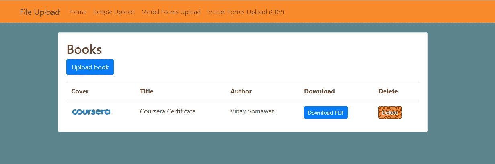
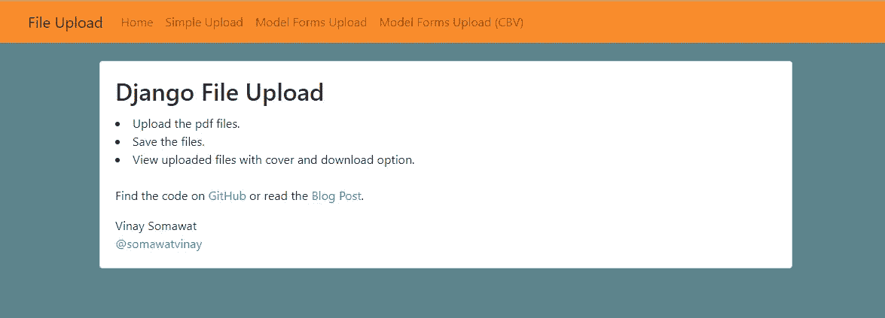

# Django:在用户中分发文件

> 原文：<https://medium.com/quick-code/django-distributing-files-among-users-efa729598ba4?source=collection_archive---------2----------------------->


> 每当一个想法突然出现在我的脑海中，将它转换成语言模式并赋予它现实的形状，只需要几分钟，我发现自己在那里做这件事，在**姜戈**的帮助下。它使 web 开发过程变得非常容易，开发人员可以完全专注于开发过程并优化性能。
> 我们也将这样做，您将一些文件上传到一个域，组织内的每个人都可以访问。

但是怎么做呢？
我们将使用**脆皮形式**、**枕头**、 **pytz** 和 **Django** 来实现这一点。

您会发现很多文章告诉您如何处理 Django 的文件，但是这篇文章并不仅限于此。这将主要关注**如何让组织从中受益？**

## 在我们开始之前…

*你提到了脆皮蛋糕、枕头和 paytz，那是什么？* Django-crisp-forms 是一个帮助管理 Django 表单的库， **Pillow** 是 **python 图像库**(被称为 PIL)增加了对打开、操作和保存许多不同图像文件格式的支持， **pytz** 将 Olson tz **数据库**引入 python

## 让我们开始吧:

*创建新目录:*

```
>mkdir Django-file-handling>cd Django-file-handling
```

我们将制作一个名为 myvenv 的虚拟人。通用命令的格式如下:

```
Django-file-handle> python -m venv myvenv
```

*运行以下命令启动您的虚拟环境:*

```
Django-file-handle> myvenv\Scripts\activate
```

现在您已经启动了 virtualenv，可以安装 Django 了。

*在我们这样做之前，我们应该确保我们有最新版本的 pip，我们用来安装 Django 的软件:*

```
(myvenv) ~Django-file-handle> python -m pip install — upgrade pip
```

创建 requirements.txt 文件:

```
pip freeze > requirements.txt
```

将此添加到 requirements.txt:

```
Django==2.1.3
django-crispy-forms==1.7.2
Pillow==5.3.0
pytz==2018.4
```

*安装要求:*

```
install -r requirements.txt
```

*现在，创建你的 Django 项目:*

```
(myvenv) C:\Users\Name\Django-file-handle> django-admin.exe startproject mysite .
```

*类似地创建 Django 应用:*

```
(myvenv) C:\Users\Name\Django-file-handle> python manage.py startapp core
```

我们还需要为静态文件添加一个路径:

`mysite/settings.py`

```
STATIC_URL = ‘/static/’
STATIC_ROOT = os.path.join(BASE_DIR, ‘static’)
```

当 DEBUG 为 True 且 ALLOWED_HOSTS 为空时，将根据['localhost '，' 127.0.0.1 '，'[::1]']验证主机。一旦我们部署了应用程序，这将与我们在 PythonAnywhere 上的主机名不匹配，因此我们将更改以下设置:

`mysite/settings.py`

```
ALLOWED_HOSTS = [‘127.0.0.1’, ‘.pythonanywhere.com’]
```

*应用迁移:*

```
python manage.py migrate
```

## 文件上传:

下面是一个使用 FileSystemStorage 的最小文件上传示例。使用它只是为了了解流程的流程。

`upload_book.html`

```


 <h2>Upload book</h2>
 <form method=”post” enctype=”multipart/form-data”>
 
 {{ form|crispy }}
 <button type=”submit” class=”btn btn-primary”>Upload book</button>
 </form>

```



你注意到“base.html”了吗？

是的，[**base.html**](https://github.com/vinaysomawat/django-file-handle/blob/master/mysite/templates/base.html)文件被扩展成 upload_book 文件。

这是 base.html 的样子:



为了帮助将信息以正确的显示格式保存到 upload.html 文件中，您需要一个 CSS 文件

`app.css`

```
body {
 background-color: #5c848e;
}
```

`views.py`

```
from django.shortcuts import render, redirect
from django.views.generic import TemplateView, ListView, CreateView
from django.core.files.storage import FileSystemStorage
from django.urls import reverse_lazyfrom .forms import BookForm
from .models import Bookdef upload_book(request):
 if request.method == ‘POST’:
 form = BookForm(request.POST, request.FILES)
 if form.is_valid():
 form.save()
 return redirect(‘book_list’)
 else:
 form = BookForm()
 return render(request, ‘upload_book.html’, {
 ‘form’: form
 })
```

## 使用模型表单上传文件

这是一种更便捷的方式。模型表单执行验证，自动建立上传的绝对路径，处理文件名冲突和其他常见任务。

`models.py`

```
from django.db import modelsclass Book(models.Model):
title = models.CharField(max_length=100)
author = models.CharField(max_length=100)
pdf = models.FileField(upload_to=’books/pdfs/’)
cover = models.ImageField(upload_to=’books/covers/’, null=True, blank=True)def __str__(self):
return self.titledef delete(self, *args, **kwargs):
self.pdf.delete()
self.cover.delete()
super().delete(*args, **kwargs)
```

`forms.py`

```
from django import forms
from .models import Bookclass BookForm(forms.ModelForm):
 class Meta:
 model = Book
 fields = (‘title’, ‘author’, ‘pdf’, ‘cover’)
```

## 直到最后…

文章快结束了。嗯，差不多了。
在本节中，我们将介绍 URL 部分。

互联网上的每个页面都需要自己的 URL。这样，您的应用程序就知道应该向打开该 URL 的用户显示什么。在 Django 中，我们使用一种叫做 URLconf (URL 配置)的东西。URLconf 是一组模式，Django 将尝试匹配所请求的 URL 以找到正确的视图。

Django 中的 URL 是如何工作的？
让我们在您选择的代码编辑器中打开 mysite/urls.py 文件，看看它是什么样子:

`mysite/urls.py`

```
from django.contrib import admin
from django.urls import path
from django.conf import settings
from django.conf.urls.static import staticfrom mysite.core import viewsurlpatterns = [
path(‘’, views.Home.as_view(), name=’home’),
path(‘upload/’, views.upload, name=’upload’),
path(‘books/’, views.book_list, name=’book_list’),
path(‘books/upload/’, views.upload_book, name=’upload_book’),
path(‘books/<int:pk>/’, views.delete_book, name=’delete_book’),
path(‘admin/’, admin.site.urls),
]if settings.DEBUG:
 urlpatterns += static(settings.MEDIA_URL, document_root=settings.MEDIA_ROOT)
```

如你所见，姜戈已经为我们准备了一些东西。

三重引号(“”或“”)之间的行称为文档字符串，您可以将它们写在文件、类或方法的顶部，以描述它的作用。它们不会被 Python 运行。

您在上一章访问的管理 URL 已经在这里了:

```
path(‘admin/’, admin.site.urls),
```

这一行意味着对于每一个以 admin/开头的 URL，Django 都会找到一个对应的视图。在这种情况下，我们包含了大量的管理 URL，所以它并没有被全部打包到这个小文件中——它更易读、更干净。

## 你的第一个 Django 网址！

是时候创建我们的第一个 URL 了！我们希望**' http://127 . 0 . 0 . 1:8000/'**成为我们项目的主页。

***下载示例:***

本帖使用的代码可以在 [**Github**](https://github.com/vinaysomawat/django-file-handle) **上获得。**

*首先，将存储库克隆到您的本地机器:*

```
git clone [https://github.com/vinaysomawat/django-file-handle.git](https://github.com/vinaysomawat/django-file-handle.git)
```

*安装要求:*

```
install -r requirements.txt
```

*应用迁移:*

```
python manage.py migrate
```

*最后，运行开发服务器:*

```
python manage.py runserver
```

> 我做错了什么吗？请在评论中提及。我很想进步。如果你学到了哪怕是一两件事，就鼓掌吧👏尽可能多的次数来表示你的支持！你好，世界，我是 Vinay Somawat。一个有创造力的开发者和一个有逻辑的设计师。你可以在 Linkedin 上找到我，或者在 GitHub 上跟踪我，或者在 Twitter 上关注我？如果这对你来说太社交化了，如果你想和我讨论技术，就给 vinaysomawat40@gmail.com 发封邮件。
> 
> 祝姜戈日愉快！