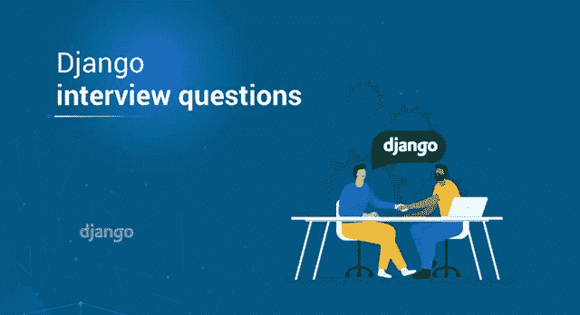
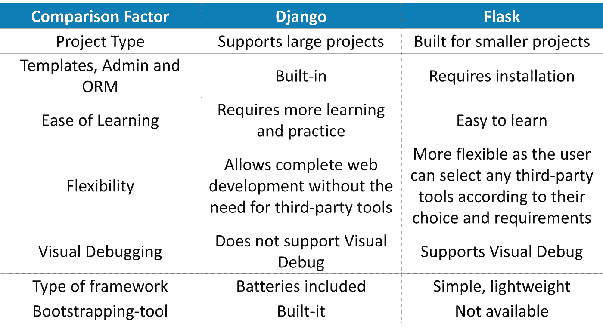
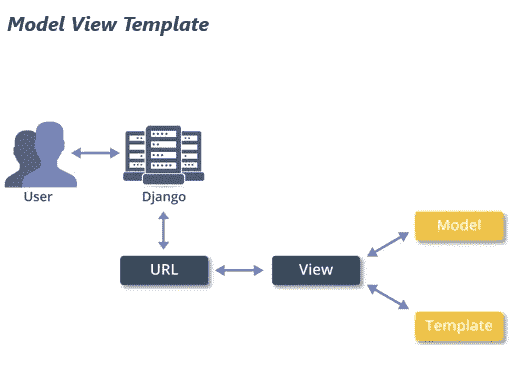
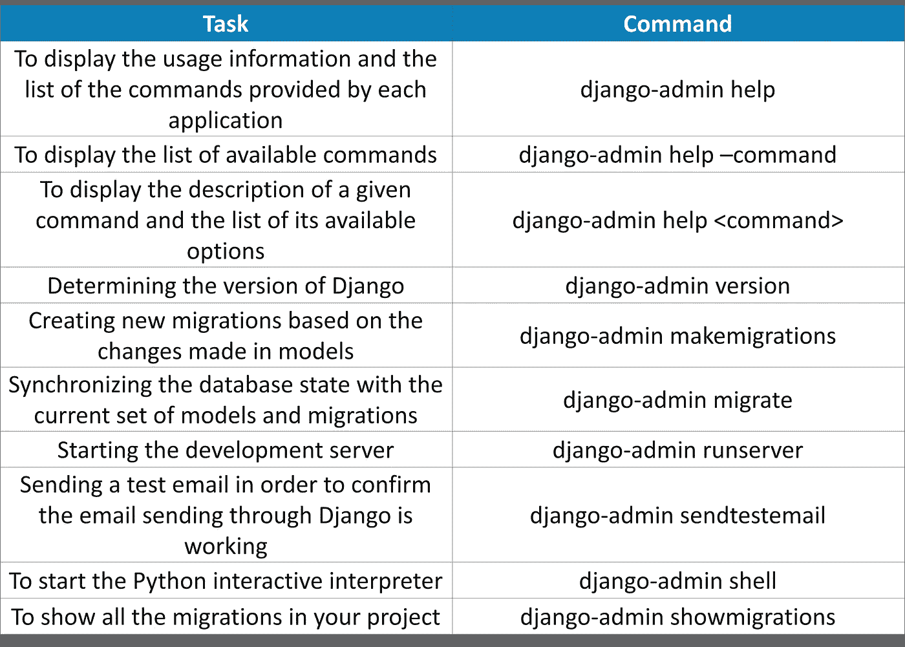
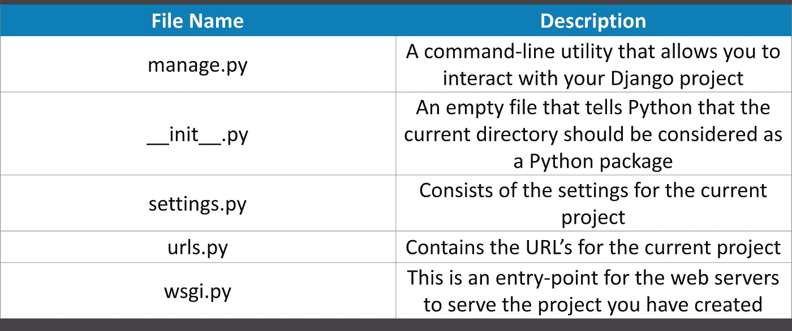
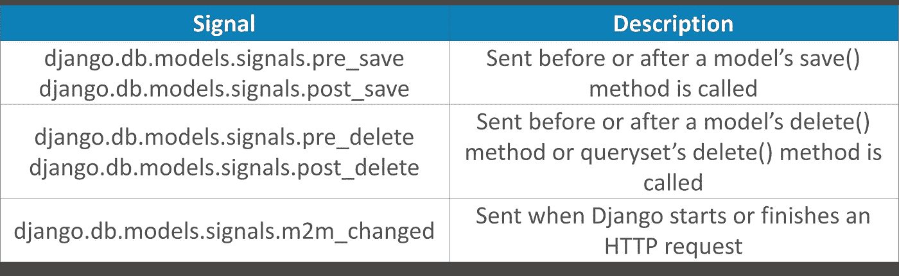
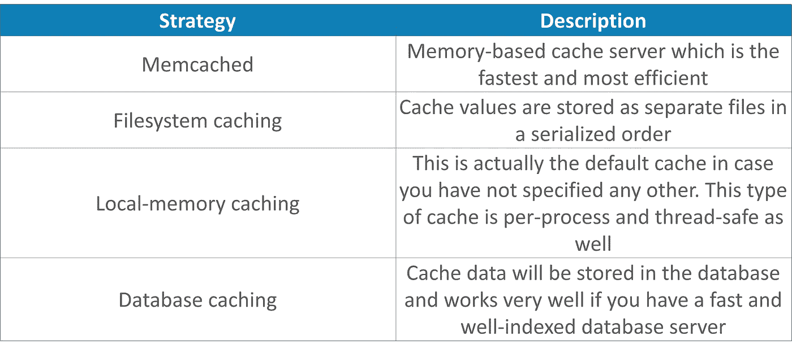
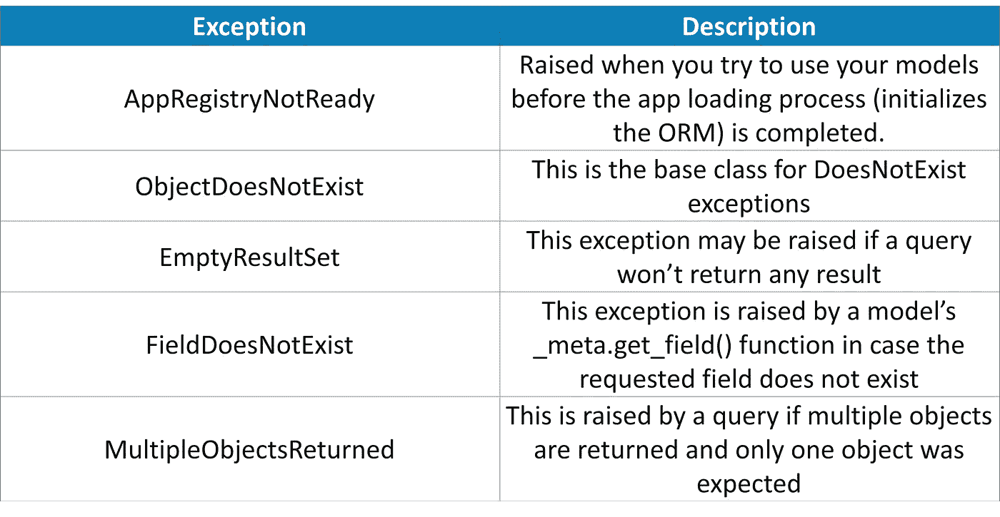
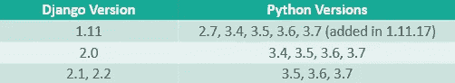

# 你需要知道的 50 个 Django 面试问题和答案

> 原文：<https://medium.com/edureka/django-interview-questions-a4df7bfeb7e8?source=collection_archive---------0----------------------->



Django 和 Python 是最受欢迎的技能之一，当然也是最棘手的技能之一。因此，如果你想在即将到来的 Django 面试中表现得最好，这里有 50 个 Django 面试常见问题和答案。

# Q1。Flask 和 Django 有什么区别？



# Q2。姜戈是什么？

Django 是一个在快节奏的新闻编辑室中开发的 web 开发框架。这是一个免费的开源框架，以 20 世纪 30 年代的爵士乐吉他手坦哥·雷恩哈特命名。Django 由一个名为 Django 软件基金会的非营利组织维护。Django 的主要目标是让 Web 开发变得快速而简单。

# Q3。列举一些使用 Django 的公司？

使用 Django 的公司有 Instagram、DISCUS、Mozilla Firefox、YouTube、Pinterest、Reddit 等。

# Q4。Django 有什么特点？

*   SEO 优化
*   极快
*   伴随认证、内容管理、RSS 提要等而来的完全加载的框架
*   非常安全，从而帮助开发人员避免常见的安全错误，如跨站点请求伪造(csrf)、点击劫持、跨站点脚本等
*   它具有出色的可扩展性，从而有助于满足最大的流量需求
*   非常多才多艺，允许你开发任何类型的网站

# Q5。如何检查系统上安装的 Django 版本？

要检查系统上安装的 Django 版本，可以打开命令提示符并输入以下命令:

*   python-m django–版本

您还可以尝试导入 Django 并使用 get_version()方法，如下所示:

```
import django 
print(django.get_version())
```

# Q6。使用 Django 有什么好处？

*   Django 的堆栈是松散耦合的，具有紧密的内聚力
*   Django 应用程序使用的代码很少
*   允许快速开发网站
*   遵循枯燥或不重复的原则，这意味着一个概念或一段数据应该只存在于一个地方
*   在低水平和高水平上保持一致
*   行为不是隐式假设的，而是显式指定的
*   SQL 语句不会执行太多次，并且会在内部进行优化
*   需要时可以很容易地放入原始 SQL
*   使用 URL 的灵活性

# Q7。解释 Django 架构。

Django 遵循基于 MVC 或模型视图控制器架构的 MVT 或模型视图模板架构。这两者的主要区别在于 Django 本身负责控制器部分。



Django 认为,“视图”基本上描述了呈现给用户的数据。它*不处理* *数据看起来如何*而是*数据* *实际上是什么*。视图基本上是指定 URL 的回调函数，这些回调函数描述了呈现的数据。

另一方面，“模板”处理数据的表示，从而将内容与其表示分离。在 Django 中，视图委托模板来呈现数据。

这里的“控制器”是 Django 本身，它根据指定的 URL 将请求发送到适当的视图。这就是 Django 被称为 MTV 而不是 MVC 架构的原因。

# Q8。简要介绍“django-admin”。

django-admin 是 django 用于管理任务的命令行实用程序。使用 django-admin，您可以执行许多任务，下表列出了其中一些任务:



# Q9。如何将 Django 项目连接到数据库？

Django 附带了一个默认数据库 SQLite。若要将您的项目连接到此数据库，请使用以下命令:

1.  python manage.py migrate (migrate 命令查看 INSTALLED_APPS 设置并相应地创建数据库表)
2.  python manage.py 进行迁移(告诉 Django 您已经创建/更改了您的模型)
3.  python manage . py SQL migrate<name of="" the="" app="" followed="" by="" generated="" id="">(SQL migrate 获取迁移名称并返回它们的 SQL)</name>

# Q10。当你创建一个 Django 项目时，会创建哪些文件？简单解释一下。

当您使用 startproject 命令创建项目时，将会创建以下文件:



# Q11。什么是“模型”？

模型是关于数据信息的唯一和确定的来源。它由您存储的数据的所有基本字段和行为组成。通常，每个模型都会映射到一个特定的数据库表。

在 Django 中，模型充当抽象层，用于结构化和操作数据。Django 模型是 django.db.models.Model 类的子类，模型中的属性表示数据库字段。

# Q12。什么是“视图”？

Django 视图服务于封装的目的。它们封装了负责处理用户请求并将响应返回给用户的逻辑。Django 中的视图要么返回一个 HttpResponse，要么引发一个异常，比如 Http404。HttpResponse 包含由要呈现给用户的内容组成的对象。视图也可以用于执行任务，例如从数据库中读取记录、委托给模板、生成 PDF 文件等。

# Q13。什么是“模板”？

Django 的模板层以一种设计者友好的格式将信息呈现给用户。使用模板，您可以动态生成 HTML。HTML 由内容的静态和动态部分组成。根据项目的需求，您可以拥有任意数量的模板。一个都没有也很好。

Django 有自己的模板系统，叫做 Django 模板语言(DTL)。不管后端如何，您也可以使用 Django 的标准管理来加载和呈现模板。

# Q14。项目和 App 有什么区别？

一个应用程序基本上是一个 Web 应用程序，创建它是为了做一些事情，例如，一个雇员记录的数据库。另一方面，项目是某个特定网站的应用程序的集合。因此，一个项目可以包含“n”个应用程序，一个应用程序可以在多个项目中。

# Q15。Django 有哪些不同的继承风格？

Django 有三种可能的继承方式:

***抽象基类*** *—* 当你想用父类来保存你不想为每个子模型键入的信息时使用。在这里，父类永远不会被单独使用

***多表继承*** *—* 当您必须对现有模型进行子类化并希望每个模型都有自己的数据库表时使用

***代理模型*** *—* 如果您只想修改模型的 Python 级行为，而不想以任何方式更改“模型”字段，则使用此选项

# Q16。什么是静态文件？

Django 中的静态文件是那些用于附加文件的文件，比如 CSS、图像或 JavaScript 文件。这些文件由 django.contrib.staticfiles 管理，通过创建一个名为 static 的子目录在项目 app 目录中创建。

# Q17。什么是“信号”？

Django 包含一个信号调度器，当框架中的其他地方发生动作时，它可以帮助解耦的应用程序得到通知。Django 提供了一组内置信号，基本上允许发送者在某个动作被执行时通知一组接收者。一些信号如下:



# Q18。简单解释一下 Django 字段类。

“Field”基本上是一个抽象类，它实际上表示数据库表中的一列。Field 类又是 RegisterLookupMixin 的子类。在 Django 中，这些字段用于创建数据库表(db_type())，这些表用于使用 *get_prep_value()* 将 Python 类型映射到数据库，反之亦然，使用 *from_db_value()* 方法*。*因此，字段是不同 Django APIs 中的基础部分，比如模型和查询集。

# Q19。如何创建 Django 项目？

要创建 Django 项目，请使用 cd 进入您想要创建项目的目录，并键入以下命令:

*   django-管理开始项目 xyz

**注:**这里，xyz 是项目的名称。你可以给任何你想要的名字。

# 问题 20。mixin 是什么？

Mixin 是一种多重继承类型，其中您可以组合多个父类的行为和属性。Mixins 提供了一种很好的方法来重用来自多个类的代码。例如，通用的基于类的视图由一个名为 TemplateResponseMixin 的 mixin 组成，其目的是定义 *render_to_response()* 方法。当它与视图中存在的类结合时，结果将是一个 TemplateView 类。

使用这些 mixins 的一个缺点是，很难分析一个子类正在做什么，以及在它的代码过于分散在多个类之间的情况下应该覆盖哪些方法。

# 问题 21。什么是“会话”？

Django 完全支持会议。使用会话框架，您可以根据每个站点的访问者轻松地存储和检索任意数据。这个框架基本上将数据存储在服务器端，并负责发送和接收 cookies。这些 cookie 由一个会话 ID 组成，而不是实际的数据本身，除非您明确使用基于 cookie 的后端。

# 问题 22。你说的上下文是什么意思？

Django 中的 Context 是赋予 Python 对象的字典映射模板变量名。这是约定俗成的名字，但是如果你愿意的话，你也可以选择其他的名字。

# 问题 23。什么时候可以在 Django ORM 中使用迭代器？

Python 中的迭代器基本上是由可数个元素组成的容器。任何迭代器对象都会实现两个方法，即 __init__()和 __next__()方法。当您在 Django 中使用迭代器时，最好的情况是处理需要大量内存空间的结果。为此，您可以使用 iterator()方法，该方法基本上计算一个 QuerySet 并返回结果的相应迭代器。

# 问题 24。解释 Django 的缓存策略？

高速缓存基本上意味着保存昂贵计算的输出，以避免再次执行相同的计算。Django 提供了一个健壮的缓存系统，它反过来帮助你保存动态网页，这样就不必为每个请求一遍又一遍地评估它们。Django 的一些缓存策略如下表所示:



# 问题 25。解释 Django 中中间件的使用。

中间件是一个轻量级的框架和底层插件系统，用于改变 Django 的全局输入和输出。它基本上是一个挂钩 Django 的请求/响应处理的框架。中间件中的每个组件都有特定的任务。

例如，*认证中间件*用于使用会话将用户与请求相关联。Django 提供了许多其他中间件，如支持站点范围缓存的缓存中间件、执行许多任务(如禁止访问用户代理、URL 重写等)的通用中间件、用于为浏览器压缩内容的 GZip 中间件等。

# 问题 26。Django 中 manage.py 文件的意义是什么？

每当您创建项目时，都会自动生成 manage.py 文件。这基本上是一个命令行实用程序，帮助您以各种方式与 Django 项目进行交互。它做的事情与 django-admin 相同，但除此之外，它还设置了 DJANGO_SETTINGS_MODULE 环境变量，以便指向您的项目设置。通常，如果您正在处理一个项目，最好使用 manage.py，而不是 django-admin。

# Q27。解释 Django 中“migrate”命令的用法？

在 Django 中，迁移用于传播对模型所做的更改。migrate 命令主要用于应用或取消应用对模型所做的迁移更改。这个命令基本上将当前的一组模型和迁移与数据库状态同步。您可以使用带参数或不带参数的命令。如果不指定任何参数，所有应用程序都将运行所有迁移。

# 问题 28。如何从数据库中查看和筛选项目？

为了查看数据库中的所有项目，您可以使用交互式 shell 中的“all()”函数，如下所示:

*   XYZ.objects.all()，其中 XYZ 是您在模型中创建的某个类

要从数据库中筛选出某些元素，可以使用 get()方法或 filter 方法，如下所示:

*   XYZ.objects.filter(pk=1)
*   XYZ.objects.get(id=1)

# 问题 29。解释 Django 是如何处理请求的？

如果某个用户从某个 Django 支持的网站请求页面，系统会遵循一种算法来确定需要执行哪个 Python 代码。以下是总结该算法的步骤:

1.  Django 首先决定使用哪个根 URLconf 或 URL 配置模块
2.  然后，加载特定的 Python 模块，然后 Django 寻找变量 urlpatterns
3.  然后 Django 运行这些 URL 模式，并在第一次匹配请求的 URL 时停止
4.  一旦完成，Django 就会导入并调用给定的视图
5.  如果没有一个 URL 匹配所请求的 URL，Django 会调用一个错误处理视图

# Q30。姜戈是怎么出现的？

Django 基本上是从一个非常实际的需求发展起来的。世界在线开发者 Adrian Holovaty 和 Simon Willison 开始使用 Python 开发其网站。随着他们继续构建密集的、丰富的交互式网站，他们开始推出一个通用的 Web 开发框架，使他们能够越来越快地构建 Web 应用程序。在 2005 年夏天，世界在线决定开源由此产生的软件，也就是 Django。

# Q31。如何使用基于文件的会话？

为了利用基于文件的会话，您需要将 SESSION_ENGINE 设置为“django . contrib . sessions . backends .
file”。

# Q32。简单解释一下 Django 的 URL？

Django 允许你随心所欲地设计自己的 URL。目的是维护一个没有任何框架限制的干净的 URL 方案。为了为您的应用程序创建 URL，您需要创建一个非正式的 Python 模块，称为 URLconf 或 URL 配置，它是纯 Python 代码，也是 URL 路径表达式到 Python 方法之间的映射。

该映射的长度可以根据需要而定，也可以引用其他映射。处理请求时，请求的 URL 与 urls.py 文件中的 URL 匹配，并检索相应的视图。关于这个的更多细节，可以参考 Q29 的回答。

# Q33。给出 Django 中的异常类。

Django 使用自己的异常以及 Python 中的异常。Django 核心异常出现在 *django.core.exceptions* 类中，下表中提到了其中一些异常:



# Q34。姜戈稳定吗？

是的，姜戈很稳定。Instagram、Discus、Pinterest 和 Mozilla 等许多公司已经使用 Django 很多年了。不仅如此，使用 Django 建立的网站经受住了每秒超过 5 万次点击的流量高峰。

# Q35。Django 框架有规模吗？

是的。与开发时间相比，硬件要便宜得多，这就是为什么 Django 被设计成充分利用你能提供的任何数量的硬件。Django 使用了“无共享”架构，这意味着您可以在任何级别添加硬件，如数据库服务器、缓存服务器或 Web/应用服务器。

# Q36。Django 是 CMS 吗？

Django 不是一个内容管理系统。它只是一个网络框架，一个让你建立网站的工具。

# Q37。Django 应该使用哪个 Python 版本？

下表给出了可用于 Django 的 Python 版本的详细信息:



Python 3 实际上是最值得推荐的，因为它速度快，功能更多，支持更好。在 Python 2.7 的情况下，Django 1.1 可以和它一起使用，但只能使用到 2020 年。

# Q38。姜戈支持 NoSQL 吗？

NoSQL 基本上代表“不仅仅是 SQL”。这被认为是传统 RDBMS 或关系数据库的一种替代方案。Django 官方不支持 NoSQL 数据库。但是，有些第三方项目，比如 Django non-rel，允许在 Django 中使用 NoSQL 功能。目前可以使用 MongoDB 和 Google App Engine。

# Q39。如何定制 Django 管理界面的功能？

有许多方法可以做到这一点。您可以搭载在 Django 自动生成的添加/更改表单之上，您可以使用 *js 参数*添加 JavaScript 模块。这个参数基本上是指向 JavaScript 模块的 URL 列表，这些模块将包含在您的项目中的一个<脚本>标签中。如果您想做更多的事情，而不仅仅是摆弄 from，您可以专门为管理员编写视图。

# Q40。Django 比 Flask 好吗？

Django 是一个允许你构建大型项目的框架。另一方面， [Flask](https://www.youtube.com/watch?v=lj4I_CvBnt0) 用于构建较小的网站，但是 Flask 比 Django 更容易学习和使用。Django 是一个成熟的框架，不需要第三方包。Flask 更像是一个轻量级的框架，它允许你按照自己喜欢的方式安装第三方工具。所以，这个问题的答案基本上取决于用户的需求，如果需求非常大，答案肯定是，Django。

# Q41。举一个 Django 视图的例子。

Django 中的视图要么返回一个 HttpResponse，要么引发一个异常，比如 Http404。HttpResponse 包含由要呈现给用户的内容组成的对象。

**举例:**

```
from django.http import HttpResponse
def hello_world(request):
    html = "
<h1>Hello World!</h1>

"
    return HttpResponse(html)
```

# **Q42。如果您在输入正确的详细信息登录管理部分后仍收到一条消息，提示“请输入正确的用户名和密码”,该怎么办？**

如果您输入了正确的详细信息，但仍然无法登录到管理站点，请交叉验证用户帐户是否将 *is_active* 和 *is_staff* 属性设置为 True。管理站点只允许这些值设置为 True 的用户。

# Q43。如果您输入正确的详细信息后仍无法登录，并且没有收到错误消息，该怎么办？

在这种情况下，登录 cookie 设置不正确。如果 Django 发出的 cookie 的域与您的浏览器中的域不匹配，就会发生这种情况。为此，您必须更改 *SESSION_COOKIE_DOMAIN* 设置以匹配您的浏览器。

# Q44。如何限制管理员访问权限，使对象只能由创建它们的用户编辑？

Django 的 *ModelAdmin* 类提供了定制挂钩，使用这些挂钩，您可以控制管理器中对象的可见性和可编辑性。为此，您可以使用 *get_queryset()* 和 *has_change_permission()。*

# Q45。当您在管理站点上看不到所有对象时该怎么办？

缺少外键值或外键字段设置为 null=False 会导致行数不一致。如果*外键*指向一个不存在的记录，并且如果该外键出现在 *list_display* 方法中，则该记录不会显示在管理变更列表中。

# Q46。csrf_token 是什么意思？

csrf_token 用于防止跨站点请求伪造。当恶意网站包含一个链接、一些 JavaScript 或一个表单，其目的是通过使用真正用户的登录凭据在您的网站上执行一些操作时，就会发生这种攻击。

# Q47。Django 支持多列主键吗？

不可以。Django 只支持单列主键。

# Q48。如何能看到 Django 正在运行的原始 SQL 查询？

首先，确保您的调试设置为 True。然后，键入以下命令:

```
**from** django.db **import** connection 
connection.queries
```

# Q49。是否必须使用模型/数据库层？

不。模型/数据库层实际上与框架的其余部分是分离的。

# Q50。如何使一个变量对所有模板都可用？

如果你的所有模板都需要相同的对象，比如菜单，你可以使用 *RequestContext* 。这个方法将一个 HttpRequest 作为它的第一个参数，并根据引擎的
context_processors 配置选项，用一些变量自动填充上下文。

至此，关于 Django 面试问题的这篇文章到此结束。我希望你清楚这篇文章中与你分享的所有内容。 ***确保你尽可能多地练习，恢复你的经验。***

如果你想查看更多关于人工智能、DevOps、道德黑客等市场最热门技术的文章，你可以参考 [Edureka 的官方网站。](https://www.edureka.co/blog/?utm_source=medium&utm_medium=content-link&utm_campaign=django-interview-questions)

请留意本系列中的其他文章，它们将解释 Python 和数据科学的各个方面。

> 1.[Python 中的机器学习分类器](/edureka/machine-learning-classifier-c02fbd8400c9)
> 
> 2. [Python Scikit-Learn 备忘单](/edureka/python-scikit-learn-cheat-sheet-9786382be9f5)
> 
> 3.[机器学习工具](/edureka/python-libraries-for-data-science-and-machine-learning-1c502744f277)
> 
> 4.[用于数据科学和机器学习的 Python 库](/edureka/python-libraries-for-data-science-and-machine-learning-1c502744f277)
> 
> 5.[Python 中的聊天机器人](/edureka/how-to-make-a-chatbot-in-python-b68fd390b219)
> 
> 6. [Python 集合](/edureka/collections-in-python-d0bc0ed8d938)
> 
> 7. [Python 模块](/edureka/python-modules-abb0145a5963)
> 
> 8. [Python 开发者技能](/edureka/python-developer-skills-371583a69be1)
> 
> 9.[哎呀面试问答](/edureka/oops-interview-questions-621fc922cdf4)
> 
> 10.[Python 开发者简历](/edureka/python-developer-resume-ded7799b4389)
> 
> 11.[Python 中的探索性数据分析](/edureka/exploratory-data-analysis-in-python-3ee69362a46e)
> 
> 12.[使用 Python 的乌龟模块的蛇游戏](/edureka/python-turtle-module-361816449390)
> 
> 13. [Python 开发者工资](/edureka/python-developer-salary-ba2eff6a502e)
> 
> 14.[主成分分析](/edureka/principal-component-analysis-69d7a4babc96)
> 
> 15. [Python vs C++](/edureka/python-vs-cpp-c3ffbea01eec)
> 
> 16.[刺儿头教程](/edureka/scrapy-tutorial-5584517658fb)
> 
> 17. [Python SciPy](/edureka/scipy-tutorial-38723361ba4b)
> 
> 18.[最小二乘回归法](/edureka/least-square-regression-40b59cca8ea7)
> 
> 19. [Jupyter 笔记本备忘单](/edureka/jupyter-notebook-cheat-sheet-88f60d1aca7)
> 
> 20. [Python 基础知识](/edureka/python-basics-f371d7fc0054)
> 
> 21. [Python 模式程序](/edureka/python-pattern-programs-75e1e764a42f)
> 
> 22.[Python 中的生成器](/edureka/generators-in-python-258f21e3d3ff)
> 
> 23. [Python 装饰器](/edureka/python-decorator-tutorial-bf7b21278564)
> 
> 24. [Python Spyder IDE](/edureka/spyder-ide-2a91caac4e46)
> 
> 25.[在 Python 中使用 Kivy 的移动应用](/edureka/kivy-tutorial-9a0f02fe53f5)
> 
> 26.[十大最佳学习书籍&练习 Python](/edureka/best-books-for-python-11137561beb7)
> 
> 27.[用 Python 实现的机器人框架](/edureka/robot-framework-tutorial-f8a75ab23cfd)
> 
> 28.[使用 PyGame 的 Python 中的贪吃蛇游戏](/edureka/snake-game-with-pygame-497f1683eeaa)
> 
> 29.[Python 中什么是套接字编程](/edureka/socket-programming-python-bbac2d423bf9)
> 
> 30.[十大 Python 应用](/edureka/python-applications-18b780d64f3b)
> 
> 31.[Python 中的哈希表和哈希表](/edureka/hash-tables-and-hashmaps-in-python-3bd7fc1b00b4)
> 
> 32. [Python 3.8](/edureka/whats-new-python-3-8-7d52cda747b)
> 
> 33.[支持向量机](/edureka/support-vector-machine-in-python-539dca55c26a)
> 
> 34. [Python 教程](/edureka/python-tutorial-be1b3d015745)

*原载于 2019 年 10 月 17 日*[*https://www.edureka.co*](https://www.edureka.co/blog/robot-framework-tutorial/)*。*