# 使用 Django 构建一个 Web 应用程序

> 原文：<https://medium.com/edureka/django-tutorial-62588046279f?source=collection_archive---------4----------------------->

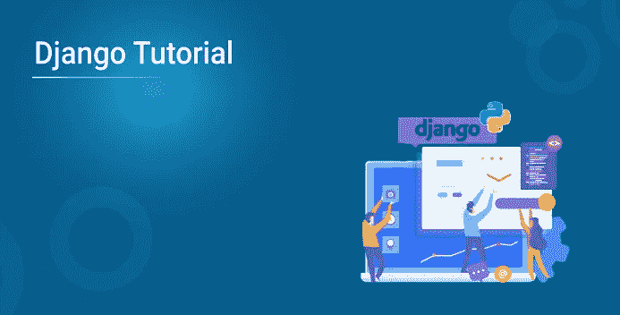

Web 开发是一个充满机会的常青领域。现在你已经登陆了这个博客，你要么是一个网络开发人员，要么渴望成为一个。不管怎样，你应该知道 **Python Django 认证**是快速 web 项目开发的高需求技能，被戏称为“有期限的完美主义者的 web 框架”。我将谈论最流行的 web 开发框架之一 Django，并帮助您开始使用它。在本 Django 教程中，我将向您介绍 Django 的基本概念，并帮助您理解在构建 Django 应用程序时所有的东西是如何组合在一起的。因此，让我们从这个 Django 教程开始，按照以下顺序理解所有主题:

*   为什么是 Web 框架，为什么是 Django？
*   姜戈是什么？
*   Django 的特点
*   姜戈建筑
*   Django 装置
*   在 Django 中构建您的第一个 Web 应用程序

# 为什么是 Web 框架，为什么是 Django？

在了解 Django 之前，我们先来了解一下为什么我们需要一个 web 框架？web 框架是一个服务器端应用程序框架，旨在支持动态网站的开发。在框架的帮助下，你不必处理 web 开发及其各种组件的麻烦。因此，它使 web 应用程序开发人员的生活变得更加容易，因为他们不必从头开始编写代码。市场上有各种 web 开发框架。其中一些列举如下:

*   反应 JS
*   有角的
*   Ruby on Rails
*   表达

Django 的一大亮点是它是基于 python 构建的。几年来，python 一直是最流行的编程语言，并继续受到熟练程序员的喜爱。因此，Django 提供了透明和高质量的代码编写，这对开发人员和客户都很重要。它还有其他各种优势，因为它有自动管理界面、对象关系映射器(ORM)等等。所以让我们来了解一下到底是什么。

# 姜戈是什么？

Django 是一个以坦哥·雷恩哈特命名的开源 web 框架。


它遵循“不重复自己”的原则。顾名思义，这个原则就是保持代码简单和不重复。Django 也是一个高级的 MVT 建筑师，代表模型视图模板。

## Django 好学吗？

Django 非常容易学习和上手。你可以在几周内学会 Django，然而，要真正精通 Django，你需要时间，你需要建立项目。

# Django 的特点

Django 的一些主要特点是:

***快*** :

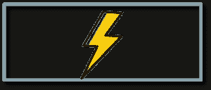

姜戈太快了。它鼓励使用干净实用的设计进行快速开发。它是免费和开源的，有助于开发者尽快完成他们的应用程序。Django 处理了 Web 开发的许多麻烦，而不需要重新发明轮子。

***吨包*** *:*

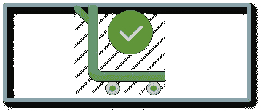

Django 包含一组组件，可以帮助你更快更容易地开发你的网站。您不需要单独下载它，因为 Django 会安装所有的附加组件、包和相关的依赖项来处理常见的 web 开发任务。它还负责用户认证、内容管理、站点地图等等。

***安全*** *:*

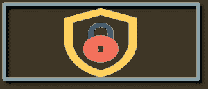

Django 非常安全，因为 Python web 社区已经在那里做了很多工作。它帮助开发人员避免许多常见的安全错误，如 SQL 注入、跨站脚本、csrf 和点击劫持。其用户认证系统提供了一种安全的方式来管理用户帐户和密码。

***可扩展*** *:*

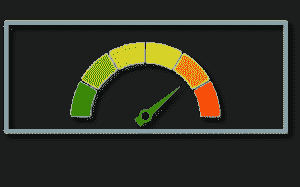

Django 有一组很好的默认值，Python 让它变得非常明确。此外，Instagram 和 Disqus 是两个服务于数百万用户的产品，并使用 Django 作为他们的主要后端。所以我宁愿说它是相当可扩展的。

**:**

*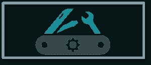*

*Django 被用来构建各种东西——从内容管理系统到社交网络到科学计算平台。所以 Django 在各个领域都是极其全能的。*

## *Django 比 PHP 好吗？*

*Django 相对于 PHP 的优势:*

*   *更好的设计*
*   *Python 和长期*
*   *更好的 Web 框架*
*   *更简单的语法*
*   *调试工具*

*接下来，让我们继续学习 Django 教程，理解 Django 的架构或内部工作方式。*

# *姜戈建筑*

*Django 遵循 MVC- MVT 架构。*

*MVC 代表*模型视图控制器*。它用于开发网络出版物，我们将代码分成不同的部分。这里我们有 3 个部分，模型视图和控制器。*

*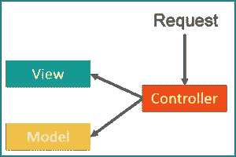*

***模型** —模型用于存储和维护您的数据。它是定义数据库的后端。*

***视图** —在 Django 模板中，视图是 HTML 格式的。视图完全是关于表示的，它根本不知道后端。无论用户看到什么，都被称为视图。*

***控制器** —控制器是一个业务逻辑，它将与模型和视图进行交互。*

*现在我们已经理解了 MVC，让我们来学习一下***Django MVT 模式*** 。*

*MVT 代表*模型视图模板*。在 MVT，用户界面有一个预定义的模板。我们举个例子，假设你想写几个静态的 HTML 表单，比如 hello user 1，hello user2 等等。有了模板，您将只有一个打印 hello 和变量名的文件。现在，这个变量将在特定的模板中使用一些 jinja 逻辑进行替换。这就是模板的神奇之处，你不需要把代码再重写 n 遍！*

*现在你可能想知道控制器在哪里？*

*在 MVT 的例子中，Django 本身负责控制器部分，它是内置的。*

*继续学习 Django 教程，让我们了解事物的内部工作方式。*

*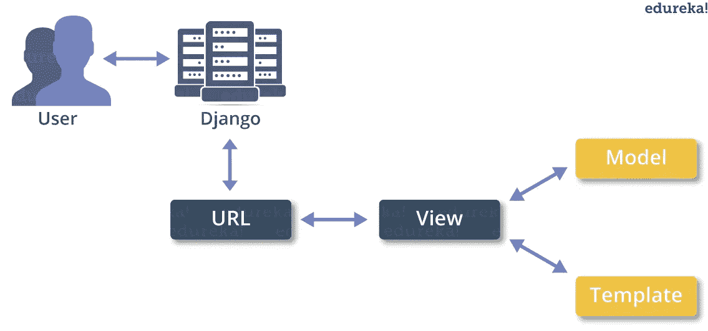*

*在上图中，模板是您的前端，它将与视图交互，而模型将被用作后端。然后视图将访问模型和模板，并将其映射到一个 URL。之后，Django 扮演控制器的角色，服务于用户。*

*现在你已经理解了 Django 的架构和内部工作方式，让我们继续学习 Django 教程，并在我们的系统中安装 Django。*

## *Django 是前端还是后端？*

*   *都不是，Django 是一个框架，Python 是编写 Django 的语言。*
*   *对于前端，Django 帮助您进行数据选择、格式化和显示。它的特点是 URL 管理，模板语言，认证机制。*
*   *对于后端，Django 附带了一个 ORM，让您可以轻松地操作数据源，处理用户输入和验证数据和信号的表单，以及 observer 模式的实现。*

# *Django 装置*

*让我来指导您在系统上安装 Django 的过程。只需遵循以下步骤:*

***第一步**:进入链接:https://www.djangoproject.com/download/*

***第二步**:在命令行输入 pip 命令，安装开始。*

*参考下面的截图，以获得更好的理解。*

*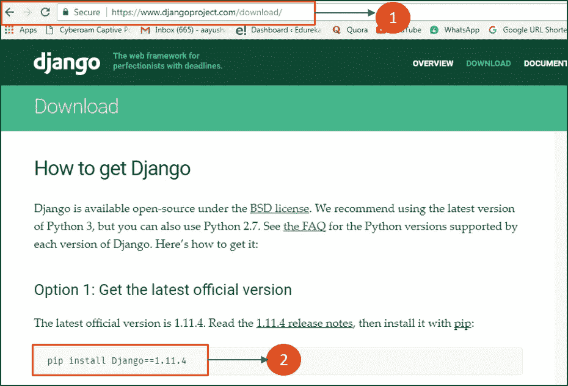*

*按照上面的步骤，您就完成了 Django 安装部分。接下来，是时候构建我们自己的 web 应用程序了。*

## *Python 对于 Web 开发来说够用吗？*

*Python 确实是应用程序程序员和 web 开发人员的最爱(感谢 Django ),因为它非常强调可读性和效率。*

*激动吗？我们开始吧！*

# *在 Django 中构建您的第一个 Web 应用程序*

*为了创建 web 应用程序，首先，让我们创建一个项目。要创建一个项目，只需进入您想要共享代码的目录，然后运行以下命令:*

```
*django-admin startproject myproject*
```

*一旦您的项目被创建，您将在项目目录中找到一个文件列表。让我们逐一讨论。*

*manage.py —这是一个命令行实用程序，允许您以各种方式与这个 Django 项目进行交互。*

***myproject/** —它是您的项目的实际 Python 包。它用于导入任何东西，比如说——my project . URLs。*

***init.py** — Init 只是告诉 python，这将被视为 python 包。*

*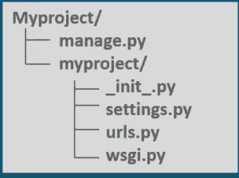*

***settings.py** —这个文件管理你项目的所有设置。*

***urls.py** —这是将它映射到您的网站的主控制器。*

*wsgi.py —它是兼容 wsgi 的 web 服务器的入口点。*

*请注意，要创建您的应用程序，请确保您与 manage.py 在同一个目录中，然后键入以下命令:*

```
*python manage.py startapp webapp*
```

*现在，如果我们看看“web app”目录，我们有一些来自原始 myproject 的额外内容。它包括模型，一个与你的后台数据库相关的测试。*

*接下来，在 Django 教程中，您需要在项目设置中手动导入应用程序。为此，请打开 myproject/settings.py 并手动添加您的应用程序:*

```
*INSTALLED_APPS **=** (
    'webapp',
    'django.contrib.admin',
    'django.contrib.auth',
    'django.contrib.contenttypes',
    'django.contrib.sessions',
    'django.contrib.messages',
    'django.contrib.staticfiles',
)*
```

*安装好应用程序后，现在让我们创建一个视图。打开 webapp/views.py，将以下代码放入其中:*

```
***from** django.shortcuts **import** render
**from** django.http **import** HttpResponse**def** index(request):
    **return**  HttpResponse("<H2>HEY! Welcome to Edureka! </H2>")*
```

*在上面的代码中，我创建了一个返回 HTTP 响应的视图。现在我们需要将这个视图映射到一个 URL。我们的应用程序中需要一个 URLconf。因此，让我们在 web 应用程序中创建一个新的 python 文件“urls.py”。在 webapp/urls.py 中包含以下代码:*

```
***from** django.conf.urls **import** url
**from** . **import** views
urlpatterns **=** [
   url(r'^$', views.index, name**=**'index'),
]*
```

*在上面的代码中，我引用了一个将返回 index 的视图(在 views.py 文件中定义)。URL 模式采用正则表达式格式，其中^代表字符串的开头，$代表结尾。*

*下一步是将根 URLconf 指向 webapp.urls 模块。打开 myproject/urls.py 文件并编写以下代码:*

```
***from** django.conf.urls **import** include, url
**from** django.contrib **import** admin
urlpatterns **=** [
url(r'^admin/', include(admin.site.urls)),
url(r'^webapp/', include('webapp.urls')),
]*
```

*在上面的代码中，我已经添加了我的 webapp 并包含了 webapp.urls，现在不要忘记导入 django.conf.urls.include 并在 URL 模式列表中插入一个 include()。它们包含()函数，允许引用其他 URLconfs。*

*请注意，正则表达式没有' $ '，而是有一个尾随斜杠，这意味着每当 Django 遇到 include()时，它会将 URL 中与该点匹配的部分去掉，并将剩余的字符串发送给 include URLconf 以供进一步处理。*

*我们现在完成了编码部分！现在让我们启动服务器，看看会发生什么。要启动服务器，请键入以下命令:*

```
*python manage.py runserver*
```

*运行服务器后，在浏览器中进入**http://localhost:8000/web app/**，应该会看到文字“*嘿！欢迎来到 Edureka！*，您在索引视图中定义的。*

*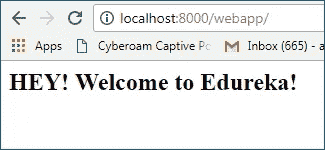*

**万岁*！我们已经成功地创建了一个基本的 Web 应用程序。*

## *2020 年的 Django 值得学习吗？*

*   *Django 绝对值得学习，尤其是如果你没有编程经验的话。这是最流行的 Python 框架之一。*
*   *至于 Django 的其他优势，该框架提供了许多构建常规应用程序的基本工具。*

## *Django 适合初学者吗？*

*Django 是一个网络框架，它可以处理你所有的数据，而且处理得比任何网络框架都好。Django 是 Python 的第一个 Web 框架，这是有原因的:它对初学者来说足够简单，但对专业人士来说又足够强大。*

*我希望你喜欢阅读这篇 Django 教程。我们已经介绍了 Django 的所有基础知识，所以您现在可以开始练习了。在这篇 Django 教程之后，我将会在 Django 上发表更多关于 web 应用程序开发、REST 框架、Django 模型等等的博客。请继续关注我这个系列的下一篇博客！*

*如果你想查看更多关于人工智能、DevOps、道德黑客等市场最热门技术的文章，你可以参考 Edureka 的官方网站。*

*请留意本系列中的其他文章，它们将解释 Python 和数据科学的各个方面。*

> **1。*[*Python 中的机器学习分类器*](/edureka/machine-learning-classifier-c02fbd8400c9)*
> 
> **2。*[*Python Scikit-Learn Cheat Sheet*](/edureka/python-scikit-learn-cheat-sheet-9786382be9f5)*
> 
> **3。* [*机器学习工具*](/edureka/python-libraries-for-data-science-and-machine-learning-1c502744f277)*
> 
> **4。* [*用于数据科学和机器学习的 Python 库*](/edureka/python-libraries-for-data-science-and-machine-learning-1c502744f277)*
> 
> **5。*[*Python 中的聊天机器人*](/edureka/how-to-make-a-chatbot-in-python-b68fd390b219)*
> 
> **6。* [*Python 集合*](/edureka/collections-in-python-d0bc0ed8d938)*
> 
> **7。* [*Python 模块*](/edureka/python-modules-abb0145a5963)*
> 
> **8。* [*Python 开发者技能*](/edureka/python-developer-skills-371583a69be1)*
> 
> **9。* [*哎呀面试问答*](/edureka/oops-interview-questions-621fc922cdf4)*
> 
> **10。*[*Python 开发者简历*](/edureka/python-developer-resume-ded7799b4389)*
> 
> **11。*[*Python 中的探索性数据分析*](/edureka/exploratory-data-analysis-in-python-3ee69362a46e)*
> 
> **12。* [*蛇与蟒的游戏*龟模块](/edureka/python-turtle-module-361816449390)*
> 
> *13。 [*Python 开发者工资*](/edureka/python-developer-salary-ba2eff6a502e)*
> 
> **14。* [*主成分分析*](/edureka/principal-component-analysis-69d7a4babc96)*
> 
> **15。*[*Python vs c++*](/edureka/python-vs-cpp-c3ffbea01eec)*
> 
> *16。 [*刺儿头教程*](/edureka/scrapy-tutorial-5584517658fb)*
> 
> *17。[*Python SciPy*](/edureka/scipy-tutorial-38723361ba4b)*
> 
> *18。 [*最小二乘回归法*](/edureka/least-square-regression-40b59cca8ea7)*
> 
> **19。* [*Jupyter 笔记本小抄*](/edureka/jupyter-notebook-cheat-sheet-88f60d1aca7)*
> 
> **20。* [*Python 基础知识*](/edureka/python-basics-f371d7fc0054)*
> 
> **21。* [*Python 模式程序*](/edureka/python-pattern-programs-75e1e764a42f)*
> 
> **22。* [*用 Python 进行网页抓取*](/edureka/web-scraping-with-python-d9e6506007bf)*
> 
> **23。* [*Python 装饰器*](/edureka/python-decorator-tutorial-bf7b21278564)*
> 
> **24。*[*Python Spyder IDE*](/edureka/spyder-ide-2a91caac4e46)*
> 
> **25。*[*Python 中使用 Kivy 的移动应用*](/edureka/kivy-tutorial-9a0f02fe53f5)*
> 
> **26。* [*十大最佳学习书籍&练习 Python*](/edureka/best-books-for-python-11137561beb7)*
> 
> **27。* [*机器人框架与 Python*](/edureka/robot-framework-tutorial-f8a75ab23cfd)*
> 
> **28。*[*Python 中的贪吃蛇游戏*](/edureka/snake-game-with-pygame-497f1683eeaa)*
> 
> **29。* [*Django 面试问答*](/edureka/django-interview-questions-a4df7bfeb7e8)*
> 
> **三十。* [*十大 Python 应用*](/edureka/python-applications-18b780d64f3b)*
> 
> *31。[*Python 中的哈希表和哈希表*](/edureka/hash-tables-and-hashmaps-in-python-3bd7fc1b00b4)*
> 
> *32。 [*Python 3.8*](/edureka/whats-new-python-3-8-7d52cda747b)*
> 
> **33。* [*支持向量机*](/edureka/support-vector-machine-in-python-539dca55c26a)*
> 
> **34。* [*Python 教程*](/edureka/python-tutorial-be1b3d015745)*

**原载于 2017 年 9 月 8 日*[*https://www.edureka.co*](https://www.edureka.co/blog/django-tutorial/)*。**