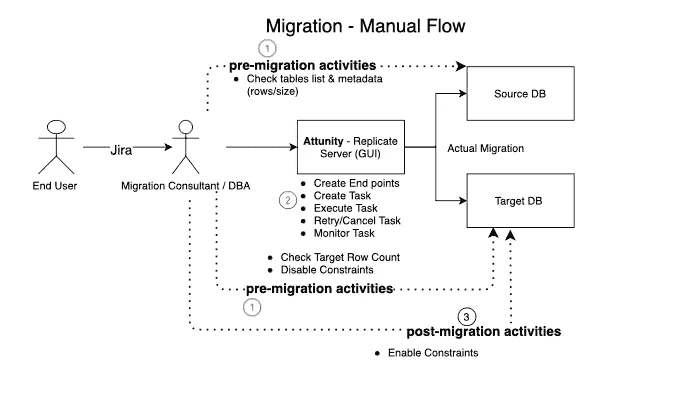
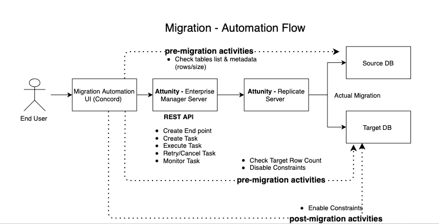
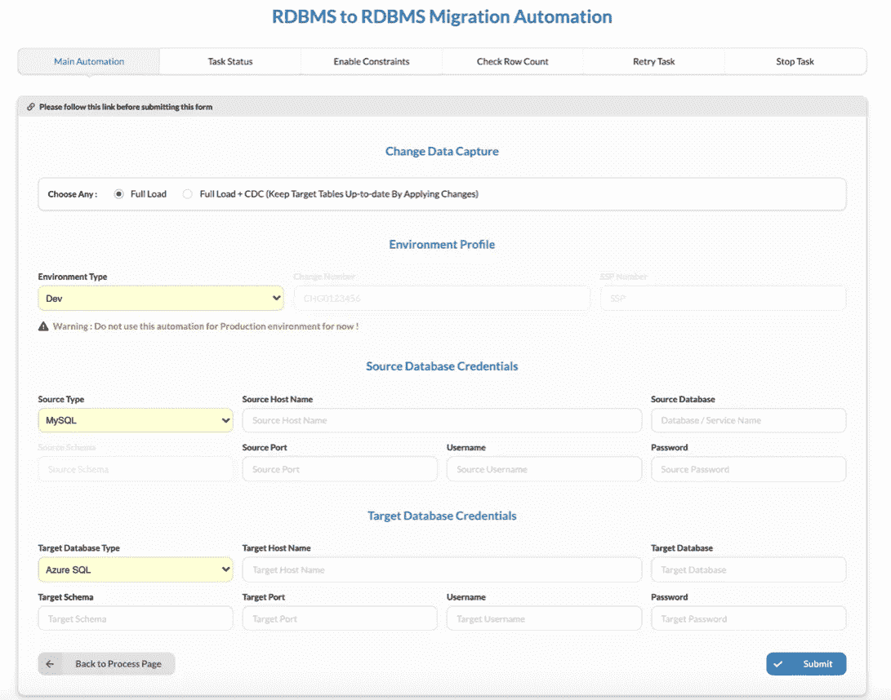
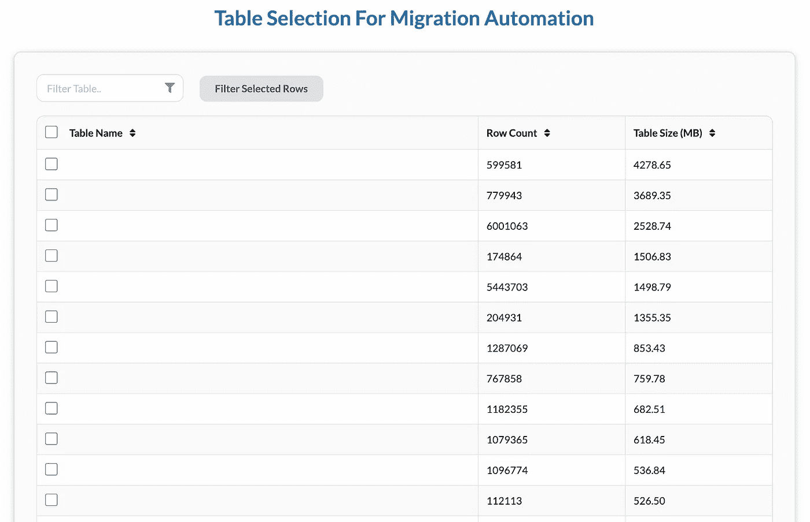

# DMaaS —数据库迁移即服务

> 原文：<https://medium.com/walmartglobaltech/dmaas-database-migrations-as-a-service-f2bbb0974f94?source=collection_archive---------1----------------------->

数据库迁移的整体方法，不仅仅是数据传输。

Photo by [Julia Craice](https://unsplash.com/@jcraice?utm_source=medium&utm_medium=referral) on [Unsplash](https://unsplash.com?utm_source=medium&utm_medium=referral)

最后，在消费网络内容十多年后，我很高兴成为一名贡献者:)！

# 前言

与像沃尔玛这样的企业合作的一个最好的方面是总是考虑大规模。就像数据库迁移一样！

在过去几年中，我们看到数据库迁移呈指数级增长，这主要是由于采用了云技术。随着不断发展的技术堆栈和多云的采用，这种上升趋势将会继续。

> 开发人员社区变得越来越聪明，在开发阶段就考虑数据库迁移，而不是事后才想到。这使得开发人员能够更加灵活地改变技术栈，或者非常方便地适应尖端的数据库解决方案。然而，**数据库迁移活动仍然是一个挑战**。

我们有几十种可用的数据传输工具([迁移工具](https://www.softwaretestinghelp.com/data-migration-tools))，可以执行同构(例如，MSSQL 到 MS SQL)或异构(例如，MS SQL 到 Oracle)数据库迁移。

这些迁移工具可以很好地处理使用变更数据捕获的一次性甚至连续迁移。这确保了数据不会丢失，并极大地减少了迁移期间的停机时间/业务影响。

问题是**目前大多数可用的数据库迁移工具只涵盖数据传输活动**。但是，实际的数据库迁移活动要复杂得多，需要在迁移后的&之前执行多个活动。这些前期&后期活动以及与现有迁移工具的交互需要一定水平的 DBA 专业知识。

这使得整个数据库迁移过程相当麻烦和耗时。

下面是使用**at unity replicate 服务器的手动迁移流程图。**

Database Migration — Manual Execution Flow

让我们进一步放大问题陈述。

# 问题陈述

按照上面的流程，当前的流程包括应用程序团队与数据库迁移顾问(异构迁移)或 DBA 团队(同构迁移)一起迁移他们的数据库。

然后，迁移顾问或数据库管理员使用 Attunity replicate 工具手动执行迁移。

**预迁移活动包括但不限于**

1.  连通性测试。
2.  查询源数据库表元数据(行数、表大小)以决定在一个迁移任务的范围内包括哪些表。(并行以减少迁移持续时间/排除不再需要的表)
3.  检查目标数据库表是否有记录(以避免意外覆盖)。
4.  禁用目标数据库中的约束(如果有),以避免在迁移过程中出现与约束相关的错误。

**启动实际的数据库迁移。**

**迁移后活动包括但不限于**

1.  检查迁移的状态
2.  生成迁移的状态报告，以查看是否所有表都已成功迁移。
3.  如果出现故障，请查看迁移工具的错误日志，找出故障的确切原因。
4.  如果失败，请重试迁移任务。
5.  在重试之前截断目标数据库表并禁用约束(如果有)。
6.  如果迁移成功，则启用约束。

上述任务列表使得整个迁移过程非常复杂，并导致大量手动工作。这给迁移项目造成了瓶颈，因为管道中的数据库迁移请求与迁移顾问/DBA 团队资源的比率永远不会匹配。

最终，这会通过剥夺最终用户的一些新的酷功能或通过更长时间地支持遗留系统来消耗收入，从而产生间接的业务影响。

进入“ **DMaaS —数据库迁移即服务”！**

# **“DMaaS”来救援了！**

我们查看了上面的问题陈述，以了解我们如何帮助简化这种与数据库相关的高接触性操作活动，并开发一个自动化框架来减少手动工作。

**“DMaaS—数据库迁移即服务”**工具帮助我们解决了这个问题。

一个全面查看数据库迁移的工具会自动执行迁移前&和迁移后活动以及实际的数据迁移。这使得整个数据库迁移过程只需点击几下鼠标即可完成，无需任何 DBA 的参与/知识。

我们与数据库迁移团队合作，了解典型数据库迁移请求的端到端[“操作手册”](https://en.wikipedia.org/wiki/Runbook)。这本操作手册帮助我们理解了迁移操作的整个生命周期，从而定义了自动化的范围。

最初的想法是看看哪些活动可以自动化，以减少琐碎迁移(开发/试运行、小批量生产等)期间对迁移顾问/数据库管理员的依赖。).然而，在决定 MVP 时，我们确定了一个简单的模式，如“前活动”、“主任务”和“后活动”

这使我们能够开发**“DMaaS—数据库迁移自动化”**工具，以完全消除对迁移顾问/数据库管理员的依赖，至少对于琐碎的迁移*(开发/试运行、低容量生产等)。)

这允许应用程序团队独立地执行他们琐碎的迁移！

DMaaS — Migration Automation Flow

(*剖析重要的迁移可以是一个独立的博客本身！)

# 工具和技术

*   [**Attunity 企业管理器**](https://help.qlik.com/en-US/enterprise-manager/November2020/Content/EnterpriseManager/Main/Introduction/Home.htm) ，，其公开[REST API](https://help.qlik.com/en-US/enterprise-manager/November2020/Content/EnterpriseManager/EnterpriseManager_APIGuide/CurlAPI/aem_rest_api_prereqs.htm)以编程方式与 Attunity Replicate 服务器进行交互。
*   [**Concord server**](https://concord.walmartlabs.com/docs/index.html)**用于托管 UI 和编排工作流(也可以是单独的应用服务器)。**
*   **用于用户界面的 HTML、Javascript。**
*   ****负责**模板功能&访问 Attunity 服务器。这有助于我们创建一个 JSON 对象，该对象捕获 Attunity Replicate 处理数据迁移所需的所有信息。**
*   ****PL/SQL** —用于获取表和存储过程列表的 SQL 查询(动态获取约束列表并启用/禁用它们)。**
*   ****Python** 脚本处理字符串操作(上帝保佑 Python！:) ).**
*   ****电子邮件，服务-现在&吉拉集成**用于管理活动，如通知、变更流程验证以及在出现故障时创建自动票证。**

# **“DMaaS”的显著特征**

*   **通过单一链接一站式处理所有与迁移相关的活动。**
*   **迁移前检查源和目标数据库连接。**
*   **至少在简单的迁移中，不需要 DBA 专业知识。**
*   **ServiceNow 更改验证(验证已批准的生产数据库迁移 CRQ)。**
*   **具有排序(基于行数和大小)和搜索功能(允许部分迁移)的表选择**
*   ****目标数据库的预迁移验证任务**，如禁用约束&行计数检查，被嵌入到流程中。**
*   ****启动实际迁移**并发送迁移状态的定期更新。**
*   ****迁移后任务，如**启用来自目标数据库的约束。**
*   **通过废弃 Attunity 日志来发布准确的错误，以便在出现错误时进行平稳的补救。(适用于 windows 或 Linux 平台)***

**(*这是一个关键特性，因为多个流程正在协调整个迁移过程，即。查询源数据库，与 Attunity replicate 交互，等等。如果错误没有得到很好的处理，那么可能会给迁移顾问/DBA 理解故障的确切点和原因造成混乱)**

**除了上述所有特性，这种自动化的**模块化设计允许该框架扩展到不同类型的数据库，数据库迁移工具&可以添加/删除各种前/后活动**。模块化设计还确保了各个流程可以独立执行。例如，在启动迁移之前检查目标数据库行数。(这也包含在端到端流程中)**

**这是对一些用户界面的窥探，**

****

**DMaaS — Main UI**

****

**DMaaS — Intuitive Table Selection UI**

# **结论**

****“DMaaS—数据库迁移即服务”**是一个协调所有迁移前&后活动的框架，包括数据传输本身。这个框架不受活动数量、数据库技术甚至底层使用的数据传输工具的限制。有了这个工具，应用程序团队可以在很大程度上独立运行他们的数据库迁移展示，只有在处理复杂的请求时，才需要熟练的迁移顾问/数据库管理员的参与。**

**非常感谢您通读**“DMaaS 之旅”我希望这有所帮助。****

**祝大家“数据库迁移愉快”:)！**

**请随时分享您的观点或任何其他建议。**

****演职员表:** [拉杰什·皮尔瓦里](/@rajeshpilwari)，[杰迪普·戈德哈尼](/@jaydeepgodhani)，毗湿奴拉姆·莫汉，& [森蒂尔·RV](/@rvsenthil)**