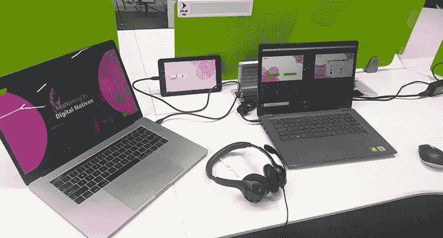

# DMNXT 2021 —活动概述

> 原文：<https://medium.com/globant/dmnxt-2021-event-recap-f2e72567fe64?source=collection_archive---------6----------------------->

DMNXT 2021 现在已成定局，这当然是值得纪念的一天。在 Globant 自主开发的 next 系列高级网络会议的主持下，这一年度会议 DMNXT 是数字营销领域思想领袖谈论尖端技术和方法的媒介。

*“数字原住民营销”*成为今年活动的主题。

有一个精彩的主题演讲，四场会议重点介绍了新兴战略和最新的创新技术，以提高营销工作的水平，超过 100 名与会者。

如果您无法参加活动，我们为您准备了一些精彩的活动。

Globant 的印度负责人 *Shivraj Sabale 做了开场发言。*

在当今不断变化的数字环境中，行业和客户真正寻求的是什么？

Shiv 解释说，今天的行业正在寻找能够转变其业务并为其客户找到新价值的合作伙伴。也就是说，为了在未来几年保持相关性，组织变得更强大并提供能够推动新时代技术的端到端解决方案至关重要。

Globant 数字营销工作室的技术总监 Kuljeet Kaveeshwar 通过分享一些关于工作室和活动的介绍，宣布会议开始。

接下来是第一节课**“无曲奇世界中的广告定位”** *新加坡报业控股有限公司广告技术数字开发主管 Darshan Radia*提到，在这个隐私至上的新世界，第一方数据是黄金。他讨论了第三方 cookies 的消亡，以及它对出版商、广告商和广告技术的影响、挑战、可能的解决方案和商机。

在接下来的**“利用客户旅程地图改善客户体验”***环节中，SG Analytics* 的 CMO kul winder Singh 谈到了如何让客户体验成为竞争优势。他深入探讨了潜在客户经历的不同时刻，以及营销人员如何能够实时挖掘这些复杂的“需求”。

接下来，我们围绕 Globant 自己的 *Fahad Shaikh* 和 *Raghvendra Kulkarni 和 Vicky Khobragade 的营销分析 **Geofencing 进行了一些有趣的技术会议。***

除了当天的对话之外，演讲者还详细回答了一些引人入胜的问题。

就这样结束了！

这是一个见识和信息丰富的一天，与会者带着他们需要知道的一切离开，并为接下来的事情做好准备。

感谢您的光临，非常感谢我们的演讲者和活动团队。

点击这里观看完整的网络会议点播。

查看 [Globant 的活动页面](https://www.globant.com/stay-relevant/events)，了解最新更新和即将举办的活动。

订阅媒体上的 Globant 出版物，了解更多最新技术。