# Mendix Web 应用程序的拖放小部件

> 原文：<https://medium.com/mendix/dnd-widget-for-mendix-web-apps-5950333f98a4?source=collection_archive---------3----------------------->

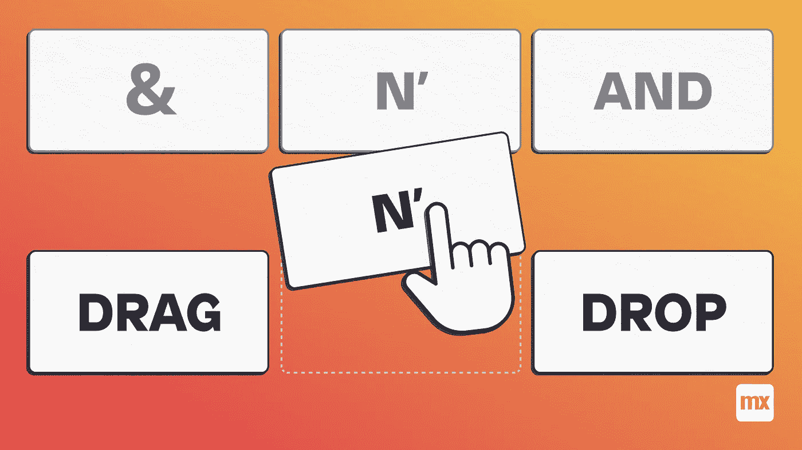

# 我写这篇博客是为了演示如何使用 React hooks 在 Mendix Studio Pro 版本 9.2.0 中开发一个拖放小部件。

让我们从一个新的可插拔小部件开始，运行 yo 命令(图 1。)

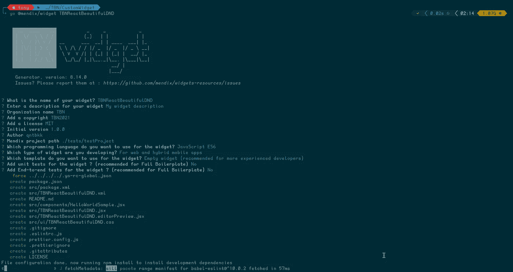

Fig. 1\. Create a new pluggable widget.

输入所有小部件细节并确认您的选择后，小部件生成器将创建您的小部件支架，如果成功完成，您将看到一条成功消息。然后我们可以用 **VS 代码**打开它(图 2。)

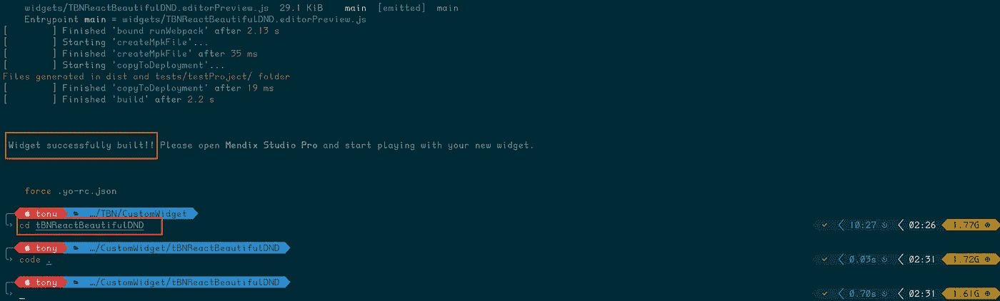

Fig. 2\. Open the pluggable built widget with vscode.


[https://www.mendix.com/pricing/](https://www.mendix.com/pricing/)

在小部件的组件文件夹中，将组件重命名为“ **ReactDnD.jsx** ”。可以修改前三行代码来反映下面的内容(图 3。)

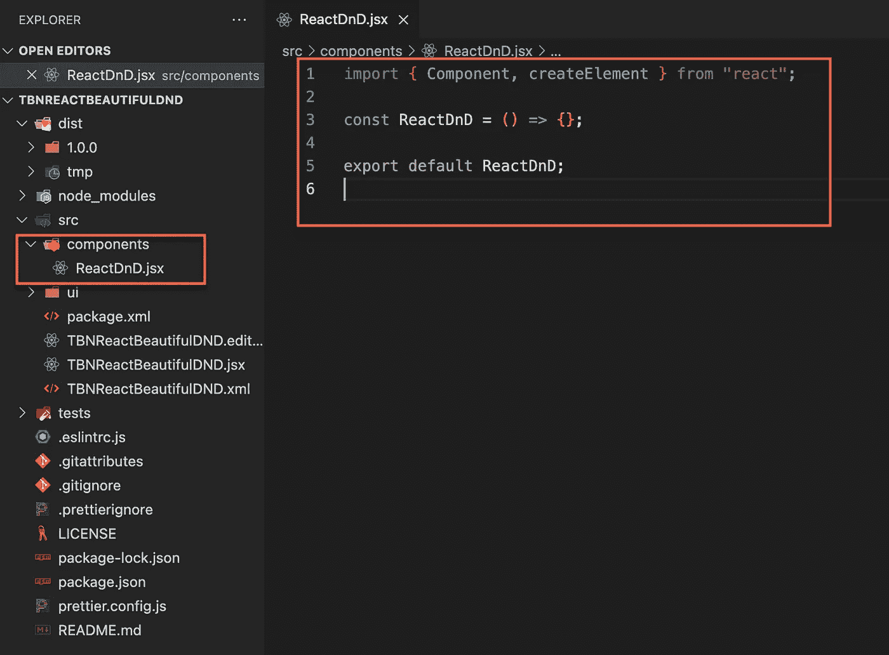

Fig. 3\. New ReacDnD component.

接下来我们需要安装 react 库“美丽 dnd”。使用命令**NPM install react-beautiful-dnd—save**(图 4。)

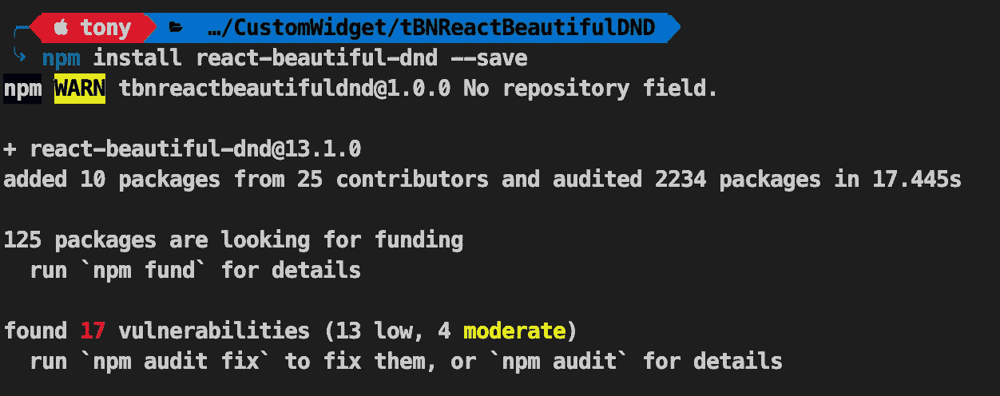

Fig. 4\. Install react beautiful dnd

现在是添加一些 css 的时候了，我们可以在 ui 文件夹中添加 css(图 5。)

```
.App {text-align: center;}.App-header {display: flex;flex-direction: column;align-items: center;justify-content: center;font-size: calc(10px + 1.5vmin);}.App-link {color: #61dafb;}@keyframes App-logo-spin {from {transform: rotate(0deg);}to {transform: rotate(360deg);}}.characters {list-style: none;padding-left: 0;}.characters li {display: flex;align-items: center;border: solid 2px #d0d0d0;border-radius: 0.2em;padding: 0.5em 0.8em 0.5em 0.5em;margin-bottom: 1em;}.characters p {max-width: none;font-weight: bold;margin: 0;}.characters-thumb {overflow: hidden;flex-shrink: 0;width: 2em;height: 2em;background-color: #e8e8e8;padding: 0.5em;margin-right: 0.5em;}.characters-thumb img {display: block;width: 100%;height: auto;}
```

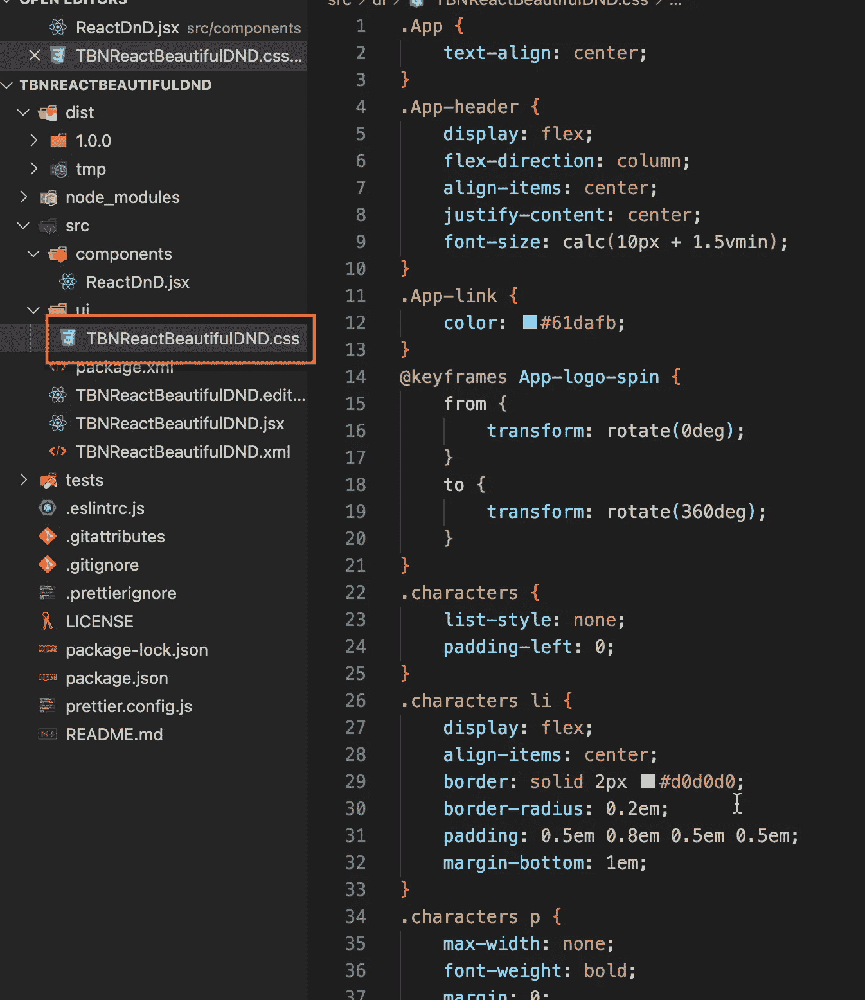

Fig. 5\. Styling for DnD widget

将父文件更改为(图 6。)，并用. editorPreview.jsx 做同样的事情

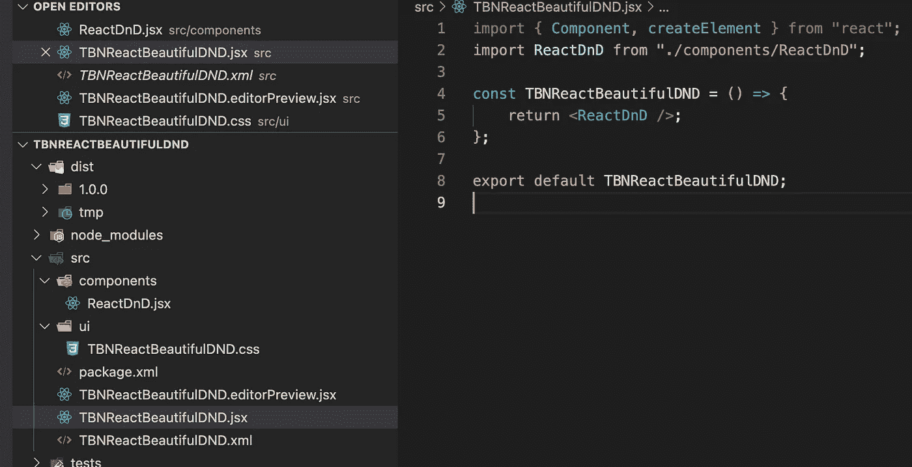

Fig. 6\. Modified parent pages.

目前，我们需要创建一个数据集，用一些数据填充子组件(图 7。).我将很快发表另一篇关于如何将它与 Mendix 数据源集成的博客。

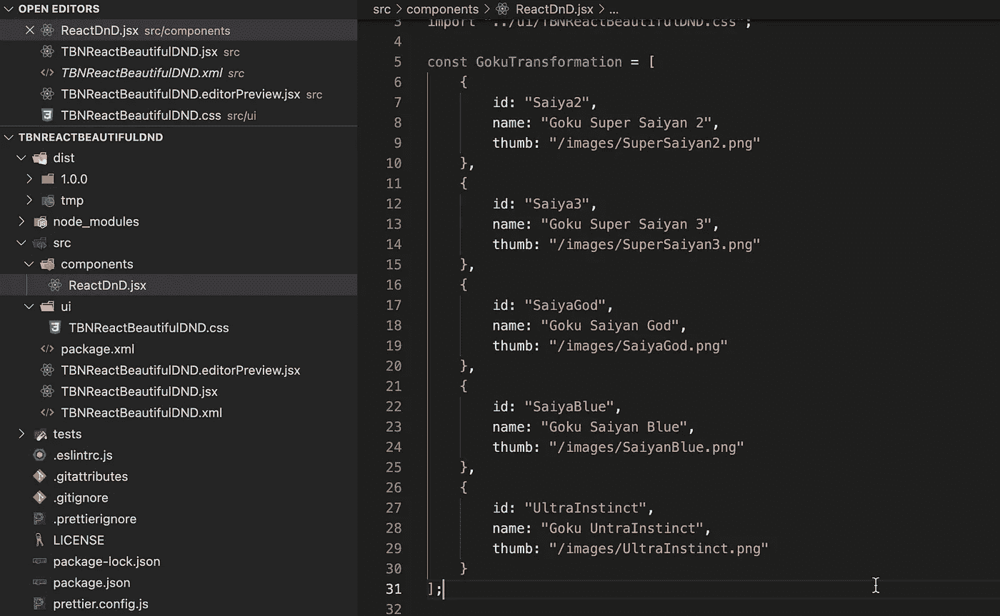

Fig. 7\. A set of data.

在子组件中，我们必须创建一个新的函数来处理拖放功能，称为 handleOnDragEnd(图 8。)

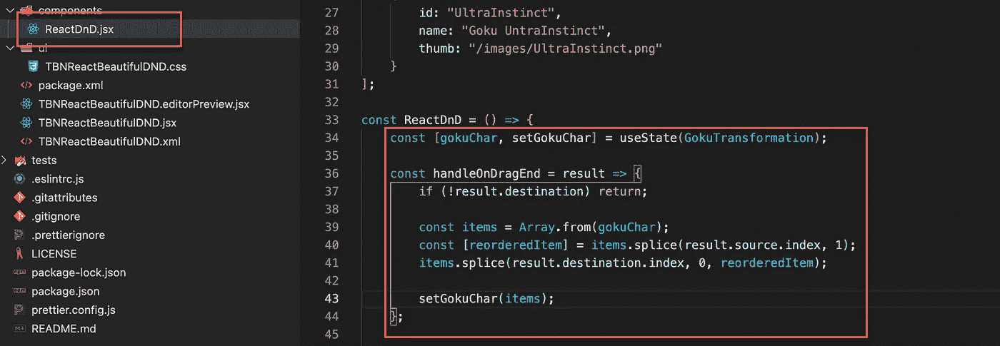

Fig. 8\. Function handle Drag and Drop.

现在我们可以用自定义 css 类返回小部件视图。(图 9。)

```
<div className=”App”><header className=”App-header”><h1>Final Space Characters</h1><DragDropContext onDragEnd={handleOnDragEnd}><Droppable droppableId=”characters”>{provided => (<ul className=”characters” {…provided.droppableProps} ref={provided.innerRef}>{gokuChar.map(({ id, name, thumb }, index) => {return (<Draggable key={id} draggableId={id} index={index}>{provided => (<liref={provided.innerRef}{…provided.draggableProps}{…provided.dragHandleProps}><div className=”characters-thumb”></div><p>{name}</p></li>)}</Draggable>);})}{provided.placeholder}</ul>)}</Droppable></DragDropContext></header></div>
```

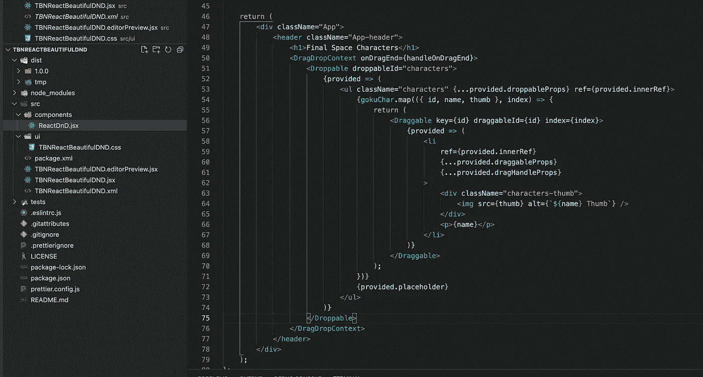

Fig. 9\. Return view with custom css class.

转到终端并运行命令> **npm run build** (图 10。)

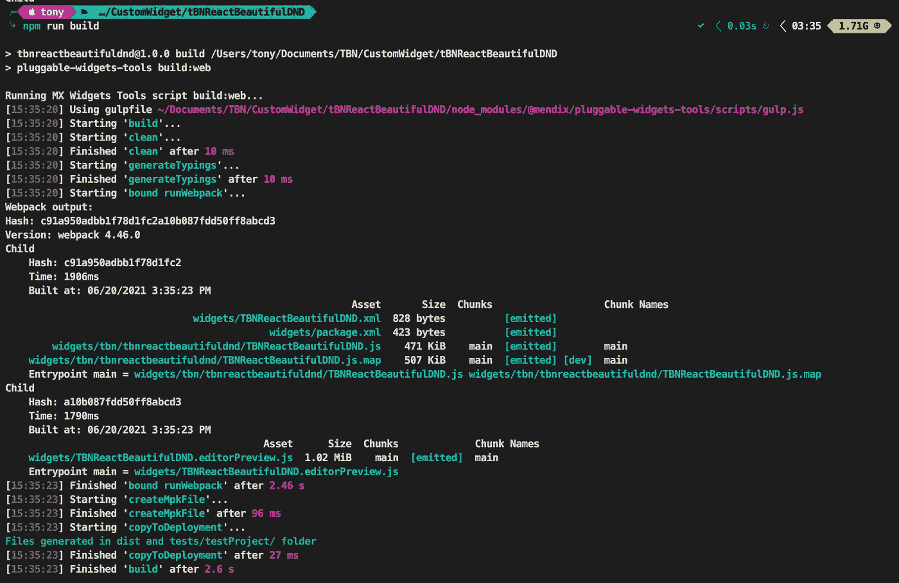

Fig. 10\. Build a widget.

由于我使用了硬编码的数据集来填充小部件，所以需要将图像放在特定的位置。请确保更新相对于您的项目文件的路径，或者如果您完全复制了我，我的文件路径是**E:\ Mendix \ TBN-ReactBeautyDnD-main \ theme \ web \ images**(图 11。)

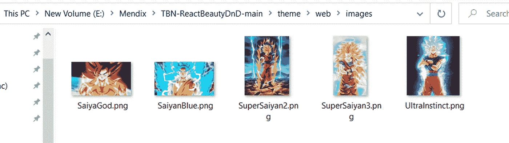

Fig. 11\. Image path in Mendix.

您的小部件将位于路径**…\ tbnreactbeautifulndd \ dist \ 1 . 0 . 0 \中。**然后你就可以把它移动到**……\门迪克斯\ TBN-反应堆缓冲区\主窗口\窗口小部件\** (图 12)

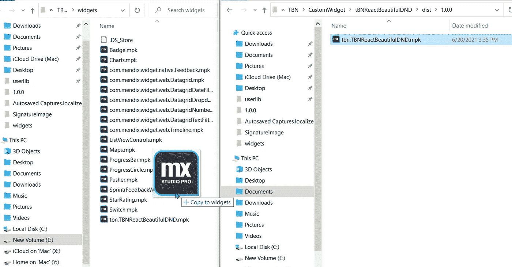

Fig. 12\. Moving widget to destination project widget folder.

转到 Mendix Studio Pro，按 F4 同步您的目录。然后在页面 **Home_Web** 上添加新的小部件(图 13)。

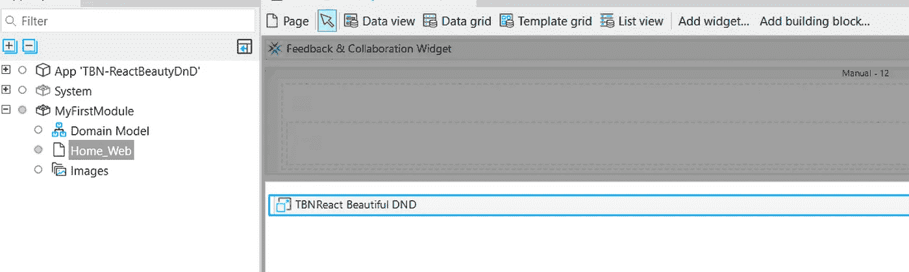

Fig. 13\. Place widget on the Home_Web page.

然后，你可以在本地或云中运行你的应用程序，你会看到一个类似这样的屏幕，享受拖放的乐趣！(图 14。)

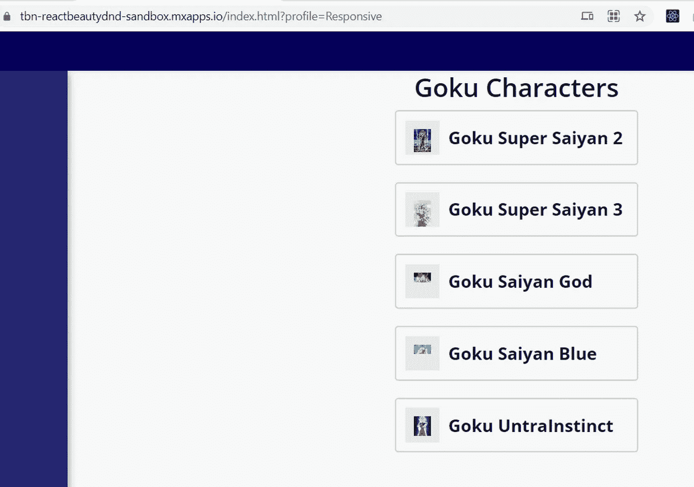

**现场演示。**

 [## 门迪克斯

### 编辑描述

tbn-reactbeautydnd-sandbox . MX apps . io](https://tbn-reactbeautydnd-sandbox.mxapps.io/index.html?profile=Responsive) 

编码快乐！

## 阅读更多

 [## 构建可插入的 Web 小部件:第 1 部分- Studio Pro 9 操作指南| Mendix 文档

### 可插拔 web 小部件是新一代的定制小部件。这些小部件基于 React 并使用了…

docs.mendix.com](https://docs.mendix.com/howto/extensibility/create-a-pluggable-widget-one#1-introduction)  [## 构建可插入的 Web 小部件:第 2 部分(高级)- Studio Pro 9 操作指南| Mendix 文档

### 新的可插拔小部件 API 使得构建功能完整的小部件变得更加容易。本指南将超越如何…

docs.mendix.com](https://docs.mendix.com/howto/extensibility/create-a-pluggable-widget-two)  [## 可插拔小部件 API-API & SDK | Mendix 文档

### 理解插件的指南。

docs.mendix.com](https://docs.mendix.com/apidocs-mxsdk/apidocs/pluggable-widgets) 

*来自发布者-*

*如果你喜欢这篇文章，你可以在我们的* [*媒体页面*](https://medium.com/mendix) *或我们自己的* [*社区博客网站*](https://developers.mendix.com/community-blog/) *找到更多类似的文章。*

*希望入门的创客，可以注册一个* [*免费账号*](https://signup.mendix.com/link/signup/?source=direct) *，通过我们的* [*学苑*](https://academy.mendix.com/link/home) *即时获取学习。*

有兴趣更多地参与我们的社区吗？你可以加入我们的 [*Slack 社区频道*](https://join.slack.com/t/mendixcommunity/shared_invite/zt-hwhwkcxu-~59ywyjqHlUHXmrw5heqpQ) *或者想更多参与的人，看看加入我们的* [*遇见 ups*](https://developers.mendix.com/meetups/#meetupsNearYou) *。*