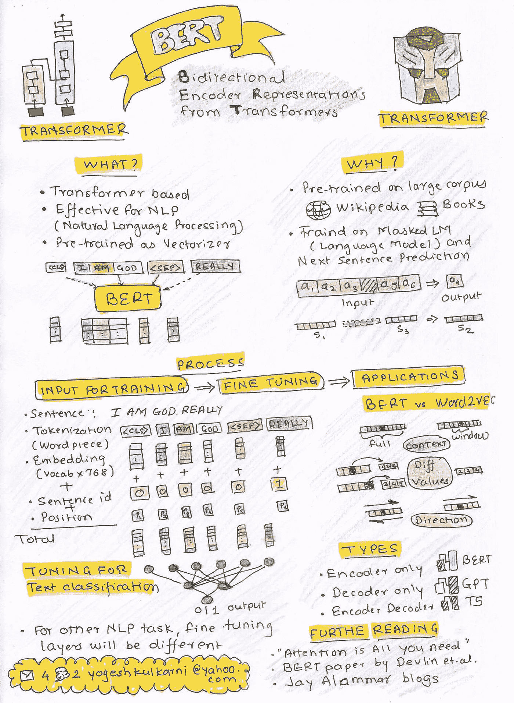

# 多伯特

> 原文：<https://medium.com/google-developer-experts/do-bert-a846d7e4853c?source=collection_archive---------1----------------------->

(Image source: [Pixabay](https://pixabay.com/illustrations/typewriter-words-write-meaning-6760585/))

BERT(来自变压器的双向编码器表示)已经席卷了 NLP(自然语言处理)的世界。

语言-文本本质上是一系列单词。因此，像 RNNs(递归神经网络)和 LSTMs(长短期记忆)这样的传统方法曾经在语言建模(预测下一个单词)中无处不在。还记得，打短信？).但是他们不会记得稍远的以前的单词。然后出现了“注意力是你所需要的”，它的架构被称为“变压器”。

BERT 是一种基于变压器的机器学习技术，用于 NLP 预训练，由 Jacob Devlin 和他来自谷歌的同事在 2018 年开发。

以下草图给出了 BERT 的概述:

# 参考

*   “变压器:一种用于语言理解的新型神经网络架构”——谷歌人工智能博客([链接](https://ai.googleblog.com/2017/08/transformer-novel-neural-network.html))
*   “第一次使用 BERT 的视觉指南”——杰伊·阿拉玛([链接](https://jalammar.github.io/a-visual-guide-to-using-bert-for-the-first-time/))
*   “插图中的伯特、埃尔莫等人(NLP 如何破解迁移学习)”—杰伊·阿拉玛([链接](https://jalammar.github.io/illustrated-bert/))
*   “图解变形金刚”——杰伊·阿拉玛([链接](https://jalammar.github.io/illustrated-transformer/))
*   “用草图简单地解释伯特”——Rahul Agarwal([link](https://mlwhiz.medium.com/explaining-bert-simply-using-sketches-ba30f6f0c8cb))
*   “注意力是你所需要的”——Ashish vas Wani 等人

*最初发布于*[*LinkedIn*](https://www.linkedin.com/pulse/do-bert-yogesh-kulkarni/)