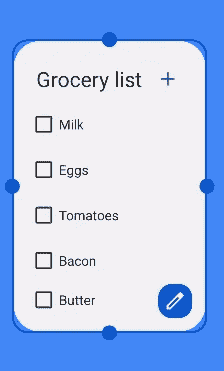

# 在 Android 12 中使用您的 widget 做更多事情！

> 原文：<https://medium.com/androiddevelopers/do-more-with-your-widget-in-android-12-e33f12710532?source=collection_archive---------0----------------------->


# 在 Android 12 中使用您的 Widget 做更多事情！

这篇文章是我写的关于为 Android 12 更新你的小部件的系列文章的第二篇。在[最后一部分](/androiddevelopers/updating-your-widget-for-android-12-92e7de87424c)中，我们探索了一些简单的方法来实现对应用程序用户高度可见的可视化更新。在这一部分，我们将看看一些更高级的功能，使您的小部件更具交互性，更易于配置，并在 Android 12 上提供更好的 UI 体验。

# **更简单的配置**

在 Android 12 之前，重新配置小部件意味着用户必须删除现有的小部件，然后用新的配置重新添加。Android 12 在几个方面改进了小部件的配置方式，并帮助用户更容易地个性化小部件。

## 允许用户重新配置放置的小部件

可重新配置的小部件允许用户将小部件定制为他们想要的设置。使用 Android 12，他们将不再需要删除和重新添加小工具来调整这些设置。



You can adjust the size and reconfigure the settings of the widget

要启用此功能，请将`appwidget-provider`中的`widgetFeatures`属性设置为`reconfigurable`。

```
[*xml/app_widget_info_checkbox_list.xml*](https://github.com/android/user-interface-samples/blob/main/AppWidget/app/src/main/res/xml/app_widget_info_checkbox_list.xml)<!-- Copyright 2019 Google LLC.
SPDX-License-Identifier: Apache-2.0 --><appwidget-provider
    android:configure="com.example.android.appwidget.ListWidgetConfigureActivity"
    android:widgetFeatures="**reconfigurable**"
    ... />
```

## 默认配置

如果您的小部件可以依赖默认设置，您可以跳过启动初始配置活动，在 Android 12 中使用默认配置设置小部件。

让我们看一下样例小部件，看看它是如何工作的。在这个用例中，我们希望用户能够在两种不同的小部件布局之间进行选择，杂货列表和待办事项列表。我们希望使用杂货列表作为默认，这样用户就不需要经历配置步骤，除非他们想切换到待办事项列表。

要实现这个用例，您可以存储用户的选择，并在没有预先选择的情况下返回默认的杂货店列表。

```
[*ListAppWidget.kt*](https://github.com/android/user-interface-samples/blob/main/AppWidget/app/src/main/java/com/example/android/appwidget/ListAppWidget.kt)<!-- Copyright 2019 Google LLC.
SPDX-License-Identifier: Apache-2.0 -->**val layoutId = ListSharedPrefsUtil.loadWidgetLayoutIdPref(
    context, appWidgetId
)**val remoteViews = if (layoutId == R.layout.widget_grocery_list) {
    // Specify the maximum width and height in dp and a layout, 
    // which you want to use for the specified size
    val viewMapping = mapOf(
        SizeF(150f, 150f) to constructRemoteViews(
            R.layout.widget_grocery_list
        ), SizeF(250f, 150f) to constructRemoteViews(
            R.layout.widget_grocery_grid
        )
    )
        RemoteViews(viewMapping)
    } else {
        constructRemoteViews(
            layoutId
        )
    }
**appWidgetManager.updateAppWidget(appWidgetId, remoteViews)**
```

现在小部件被配置为提供默认配置，您需要将`configuration_optional`标志设置为`widgetFeatures`属性。这跳过了额外的配置步骤，将您的小部件直接放在用户的主屏幕上。在这样做的同时，确保添加`reconfigurable`标志，以便用户可以在以后更改应用的默认设置。

```
[*xml/app_widget_info_checkbox_list.xml*](https://github.com/android/user-interface-samples/blob/main/AppWidget/app/src/main/res/xml/app_widget_info_checkbox_list.xml)<!-- Copyright 2019 Google LLC.
SPDX-License-Identifier: Apache-2.0 --><appwidget-provider 
    android:configure="com.example.android.appwidget.ListWidgetConfigureActivity"
    android:widgetFeatures="**reconfigurable|configuration_optional**"
    ... />
```

通过这一更改，当用户将小部件添加到主屏幕时，它会自动使用杂货列表布局。因为配置活动被添加到了`appwidget-provider`的`configure`属性中，所以当用户长按小部件并单击编辑/重新配置按钮时，它就会启动。


ListWidgetConfigureActivity will be launched when users click edit/reconfigure button

当用户配置小工具时，这个新的配置存储在`ListWidgetConfigureActivity`中。

```
[*ListWidgetConfigureActivity.kt*](https://github.com/android/user-interface-samples/blob/main/AppWidget/app/src/main/java/com/example/android/appwidget/ListWidgetConfigureActivity.kt)<!-- Copyright 2019 Google LLC.
SPDX-License-Identifier: Apache-2.0 -->private fun onWidgetContainerClicked(@LayoutRes widgetLayoutResId: Int) {
    **ListSharedPrefsUtil.saveWidgetLayoutIdPref(this, appWidgetId, widgetLayoutResId)** // It is the responsibility of the configuration activity to update the app widget
    **val appWidgetManager = AppWidgetManager.getInstance(this)
    ListAppWidget.updateAppWidget(this, appWidgetManager, appWidgetId)** // Make sure we pass back the original appWidgetId
    val resultValue = Intent()
    resultValue.putExtra(AppWidgetManager.EXTRA_APPWIDGET_ID, appWidgetId)
    setResult(RESULT_OK, resultValue)
    finish()
}
```

# 新的和改进的 API

说到运行 Android 的设备，有许多不同的外形可供选择，无论是手机、平板电脑、可折叠还是另一种产品。Android 12 引入了更精细的尺寸属性和更灵活的布局，使小部件更容易定制，在不同设备和屏幕尺寸上更可靠。

## 小部件大小限制

Android 12 除了现有的`minWidth`、`minHeight`、`minResizeWidth`、`minResizeHeight`之外，还增加了新的`appwidget-provider`属性。

您可以使用新的`maxResizeWidth`和`maxResizeHeight`属性来定义用户可以调整小部件大小的最大高度和宽度。新的`targetCellWidth`和`targetCellHeight`属性定义了设备主屏幕上的默认小部件大小。

当定义了`targetCellWidth`和`targetCellHeight`属性后，运行 Android 12 的设备将使用这些属性，而不是`minWidth`和`minHeight`。运行 Android 11 及更低版本的设备将继续使用`minWidth`和`minHeight`属性。

> 注意:`targetCellWidth`和`targetCellHeight`属性在单元格中定义，而`maxResizeWidth`和`maxResizeHeight`属性在 dps 中定义。

```
[*xml/app_widget_info_checkbox_list.xml*](https://github.com/android/user-interface-samples/blob/main/AppWidget/app/src/main/res/xml/app_widget_info_checkbox_list.xml)<!-- Copyright 2019 Google LLC.
SPDX-License-Identifier: Apache-2.0 --><appwidget-provider
    **android:maxResizeWidth="240dp"
    android:maxResizeHeight="180dp"** android:minWidth="180dp"
    android:minHeight="110dp"
    android:minResizeWidth="180dp"
    android:minResizeHeight="110dp"
    **android:targetCellWidth="3"
    android:targetCellHeight="2"** ... />
```


In Android 12, `targetCellWidth` and `targetCellHeight` attributes are used instead of `minWidth` and `minHeight`

## 响应式布局

虽然使用大小约束可以帮助用户根据需要调整小部件的大小，但是您可能希望根据小部件的大小提供不同的布局和内容类型。这也使系统能够在不唤醒应用程序的情况下以不同的大小显示小部件。

要实现这一点，首先为一系列尺寸创建一组布局，然后调用`updateAppWidget()` 函数并传递这组布局，如下例所示。当小部件尺寸改变时，系统自动改变布局。

```
<!-- Copyright 2019 Google LLC.
SPDX-License-Identifier: Apache-2.0 -->val viewMapping: MutableMap<SizeF, RemoteViews> = mutableMapOf()
// Specify the maximum width and height in dp and a layout, which 
// you want to use for the specified size
val viewMapping = mapOf(
    SizeF(150f, 110f) to RemoteViews(
        context.packageName,
        R.layout.widget_grocery_list
    ),
    SizeF(250f, 110f) to RemoteViews(
        context.packageName,
        R.layout.widget_grocery_grid
    ),
)
appWidgetManager.updateAppWidget(appWidgetId, RemoteViews(viewMapping))
//...
```


Responsive layouts offer better usability when users resize their widgets

## 复合按钮

用户可以在 Android 12 中使用 widgets 做更多事情，而无需启动应用程序！使用新的复合按钮，您可以使您的小工具更具交互性。这不会改变小部件的无状态特性，但是可以让您添加一个监听器来观察状态变化事件。当状态改变事件发生时，您可以调用`RemoteResponse.fromPendingIntent()`并在监听器中传递一个`PendingIntent`。

```
[*ItemsCollectionAppWidget.kt*](https://github.com/android/user-interface-samples/blob/main/AppWidget/app/src/main/java/com/example/android/appwidget/ItemsCollectionAppWidget.kt)<!-- Copyright 2019 Google LLC.
SPDX-License-Identifier: Apache-2.0 -->remoteViews.setOnCheckedChangeResponse(
    R.id.item_switch,
    **RemoteViews.RemoteResponse.fromPendingIntent(
        onCheckedChangePendingIntent
    )** )
```

另一方面，如果你的小部件有一个控件列表，你不应该在集合的单个项目上设置`PendingIntent` s，因为这会导致性能下降。在这种情况下，在集合上设置一个单个的`PendingIntent`模板，调用`RemoteResponse.fromFillInIntent()`，并在状态改变事件发生时在监听器中传递一个 fillInIntent。

```
[*ItemsCollectionAppWidget.kt*](https://github.com/android/user-interface-samples/blob/main/AppWidget/app/src/main/java/com/example/android/appwidget/ItemsCollectionAppWidget.kt)<!-- Copyright 2019 Google LLC.
SPDX-License-Identifier: Apache-2.0 -->remoteViews.setOnCheckedChangeResponse(
    R.id.item_switch,
    **RemoteViews.RemoteResponse.fromFillInIntent(
        onCheckedChangeFillInIntent
    )** )
```


Widgets are more interactive with compound buttons

## 集合的简化远程视图

Android 12 引入了一个新的 API 来简化传递集合以填充小部件中的列表。以前，如果您想用项目集合填充一个`ListView`、`GridView`、`StackView`或其他视图，您需要实现`RemoteViewsService`来返回`RemoteViewsFactory`。有了新的`setRemoteAdapter()` API，你可以简单地用你的主`RemoteView`传递一个集合。我们也在研究`androidx` backport，以支持在旧版本的 Android 上使用这个 API。

如果该集合不使用一组恒定的布局，您可以使用`setViewTypeCount()`函数来设置该集合中的`RemoteView`将使用的布局 id 的最大数量。

```
[*ItemsCollectionAppWidget.kt*](https://github.com/android/user-interface-samples/blob/main/AppWidget/app/src/main/java/com/example/android/appwidget/ItemsCollectionAppWidget.kt)<!-- Copyright 2019 Google LLC.
SPDX-License-Identifier: Apache-2.0 -->remoteViews.setRemoteAdapter(
    R.id.items_list_view,
    RemoteViews.RemoteCollectionItems.Builder()
        .addItem(/* id= */ ID_1, RemoteViews(...))
        .addItem(/* id= */ ID_2, RemoteViews(...))
        //...
        .setViewTypeCount(MAX_NUM_DIFFERENT_REMOTE_VIEWS_LAYOUTS)
        .build()
)
```

# 摘要

就是这样！将您现有的 widget 更新到 Android 12 将立即带来更清新的外观，并使您的 widget 更具交互性。

既然您已经阅读了本文中的可配置性和新的或改进的 API，请查看第一部分[以了解如何更新您的小部件的设计，并在小部件选择器中提供更好的用户体验。为了更进一步，请确保查看整篇文章中使用的](/androiddevelopers/updating-your-widget-for-android-12-92e7de87424c)[示例代码](https://github.com/android/user-interface-samples/tree/main/AppWidget)。

如果您正在构建新的小部件，请留意未来的公告。我们正在努力使建立新的部件更加容易！