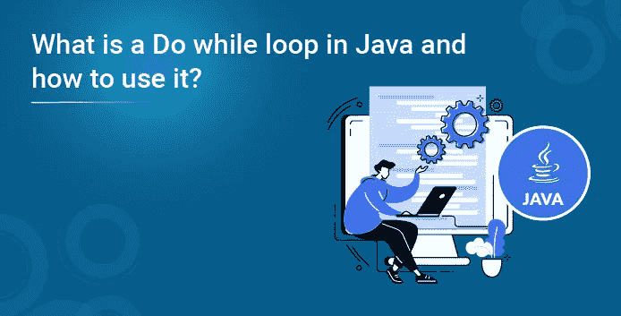
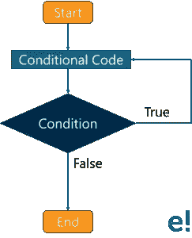

# 什么是 Java 中的 Do while 循环，如何使用？

> 原文：<https://medium.com/edureka/do-while-loop-in-java-3d67c40d7970?source=collection_archive---------2----------------------->



Java *do-while 循环*用于迭代一组语句，直到满足给定的条件。如果迭代次数不固定，并且必须至少执行一次循环，那么使用 do-while 循环。在本文中，您将学习 Java 中的 do-while 循环以及如何使用它。

让我们深入这篇文章，探讨以下主题:

*   Java 中的循环是什么
*   流程图
*   句法
*   通过示例实现
*   无限 do-while 循环
*   句法
*   不定式 do-while 循环示例

我们开始吧！

# Java 中的 Do while 循环是什么？

do-while 循环类似于 while 循环，但有一点不同:在 while 循环中，条件在循环体执行之前计算，而在 do-while 循环中，条件在循环体执行之后计算。

我会通过这个流程图让概念在视觉上变得清晰。

## 流程图:



让我解释一下上面的图表:

1.  首先，它将执行一组在您的“do”块中提到的语句。
2.  之后，它将进入“while”部分检查条件。
3.  如果条件为真，它返回并执行语句。
4.  如果条件为假，则直接退出循环。

现在，转到 Java 中 do-while 循环的语法

## 语法:

**做** {

//要执行的代码

} **而**(条件)；

如您所见，语法非常简单。接下来，让我通过一个示例向您展示 do-while 循环的实现。

## 通过示例实现:

```
public class Example {

   public static void main(String args[]) {
      int x = 1;

      do {
         System.out.print("value of x : " + x );
         x++;
         System.out.print("n");
      }while( x < 11 );
   }
}
```

**输出:**

x 值:1
x 值:2
x 值:3
x 值:4
x 值:5
x 值:6
x 值:7
x 值:8
x 值:9
x 值:10

在上面提到的代码中，您可以看到 do while 循环将执行条件一次，这是肯定的。

现在，让我们进入下一部分，Java 中的无限 do-while 循环。

# Java 中的无限 do-while 循环

Java 中的无限 do-while 循环类似于*无限 while 循环。*

如果在 do-while 循环中传递' true ',这将是一个不定式 do-while 循环。下面是语法:

## 语法:

**做** {

//要执行的代码

} **而** ( **真**)；

下面是一个简单的例子，描述了 java 不定式 do-while 循环的用法。

## 不定式 do-while 循环示例:

```
public class DoWhileInfinite {  
public static void main(String[] args) {  
    do{  
        System.out.println("infinitive do while loop");  
        }while(true);  
}  
}
```

**输出:**

不定式 do while 循环
不定式 do while 循环
不定式 do while 循环

为了退出循环，按下 ***ctrl+c*** 。

至此，我的博客到此结束。我希望这些数据对您的 Java 知识有所帮助。我们将继续挖掘 Java 世界的更多概念。敬请期待！如果你想查看更多关于人工智能、DevOps、道德黑客等市场最热门技术的文章，你可以参考 Edureka 的官方网站。

请留意本系列中解释 Java 其他各方面的其他文章。

> *1。* [*面向对象编程*](/edureka/object-oriented-programming-b29cfd50eca0)
> 
> *2。*[*Java 中的继承*](/edureka/inheritance-in-java-f638d3ed559e)
> 
> *3。*[*Java 中的多态性*](/edureka/polymorphism-in-java-9559e3641b9b)
> 
> *4。*[*Java 中的抽象*](/edureka/java-abstraction-d2d790c09037)
> 
> *5。* [*Java 字符串*](/edureka/java-string-68e5d0ca331f)
> 
> *6。* [*Java 数组*](/edureka/java-array-tutorial-50299ef85e5)
> 
> *7。* [*Java 收藏*](/edureka/java-collections-6d50b013aef8)
> 
> *8。* [*Java 线程*](/edureka/java-thread-bfb08e4eb691)
> 
> *9。*[*Java servlet 简介*](/edureka/java-servlets-62f583d69c7e)
> 
> *10。* [*Servlet 和 JSP 教程*](/edureka/servlet-and-jsp-tutorial-ef2e2ab9ee2a)
> 
> *11。*[*Java 中的异常处理*](/edureka/java-exception-handling-7bd07435508c)
> 
> *12。* [*高级 Java 教程*](/edureka/advanced-java-tutorial-f6ebac5175ec)
> 
> *13。* [*Java 面试题*](/edureka/java-interview-questions-1d59b9c53973)
> 
> *14。* [*Java 程序*](/edureka/java-programs-1e3220df2e76)
> 
> *15。*[*kot Lin vs Java*](/edureka/kotlin-vs-java-4f8653f38c04)
> 
> 16。 [*依赖注入使用*](/edureka/what-is-dependency-injection-5006b53af782)
> 
> 17。 [*堪比 Java 中的*](/edureka/comparable-in-java-e9cfa7be7ff7)
> 
> 18。 [*十大 Java 框架*](/edureka/java-frameworks-5d52f3211f39)
> 
> *19。* [*Java 反射 API*](/edureka/java-reflection-api-d38f3f5513fc)
> 
> 20。[*Java 中的 30 大模式*](/edureka/pattern-programs-in-java-f33186c711c8)
> 
> *21。* [*核心 Java 备忘单*](/edureka/java-cheat-sheet-3ad4d174012c)
> 
> *二十二。*[*Java 中的套接字编程*](/edureka/socket-programming-in-java-f09b82facd0)
> 
> *23。* [*Java OOP 备忘单*](/edureka/java-oop-cheat-sheet-9c6ebb5e1175)
> 
> *24。*[*Java 中的注释*](/edureka/annotations-in-java-9847d531d2bb)
> 
> *25。*[*Java 中的库管理系统项目*](/edureka/library-management-system-project-in-java-b003acba7f17)
> 
> *26。*[*Java 中的树*](/edureka/java-binary-tree-caede8dfada5)
> 
> *27。*[*Java 中的机器学习*](/edureka/machine-learning-in-java-db872998f368)
> 
> *28。*[*Java 中的顶级数据结构&算法*](/edureka/data-structures-algorithms-in-java-d27e915db1c5)
> 
> *29。* [*Java 开发者技能*](/edureka/java-developer-skills-83983e3d3b92)
> 
> 三十。 [*前 55 名 Servlet 面试问题*](/edureka/servlet-interview-questions-266b8fbb4b2d)
> 
> *31。*[](/edureka/java-exception-handling-7bd07435508c)*[*顶级 Java 项目*](/edureka/java-projects-db51097281e3)*
> 
> **32。* [*Java 字符串备忘单*](/edureka/java-string-cheat-sheet-9a91a6b46540)*
> 
> **33。*[*Java 中的嵌套类*](/edureka/nested-classes-java-f1987805e7e3)*
> 
> *34。 [*Java 合集面试问答*](/edureka/java-collections-interview-questions-162c5d7ef078)*
> 
> *35。[*Java 中如何处理死锁？*](/edureka/deadlock-in-java-5d1e4f0338d5)*
> 
> *36。 [*你需要知道的 50 大 Java 集合面试问题*](/edureka/java-collections-interview-questions-6d20f552773e)*
> 
> **37。*[*Java 中的字符串池是什么概念？*](/edureka/java-string-pool-5b5b3b327bdf)*
> 
> *38。[*C、C++和 Java 有什么区别？*](/edureka/difference-between-c-cpp-and-java-625c4e91fb95)*
> 
> *39。[*Java 中的回文——如何检查一个数字或字符串？*](/edureka/palindrome-in-java-5d116eb8755a)*
> 
> *40。 [*你需要知道的顶级 MVC 面试问答*](/edureka/mvc-interview-questions-cd568f6d7c2e)*
> 
> **41。*[*Java 编程语言的十大应用*](/edureka/applications-of-java-11e64f9588b0)*
> 
> **42。*[*Java 中的死锁*](/edureka/deadlock-in-java-5d1e4f0338d5)*
> 
> **43。*[*Java 中的平方和平方根*](/edureka/java-sqrt-method-59354a700571)*
> 
> **44。*[*Java 中的类型转换*](/edureka/type-casting-in-java-ac4cd7e0bbe1)*
> 
> **45。*[*Java 中的运算符及其类型*](/edureka/operators-in-java-fd05a7445c0a)*
> 
> **46。*[*Java 中的析构函数*](/edureka/destructor-in-java-21cc46ed48fc)*
> 
> **47。*[*Java 中的二分搜索法*](/edureka/binary-search-in-java-cf40e927a8d3)*
> 
> **48。*[*Java 中的 MVC 架构*](/edureka/mvc-architecture-in-java-a85952ae2684)*
> 
> **49。* [*冬眠面试问答*](/edureka/hibernate-interview-questions-78b45ec5cce8)*

**原载于 2019 年 7 月 31 日*[*https://www.edureka.co*](https://www.edureka.co/blog/java-do-while-loop/)*。**