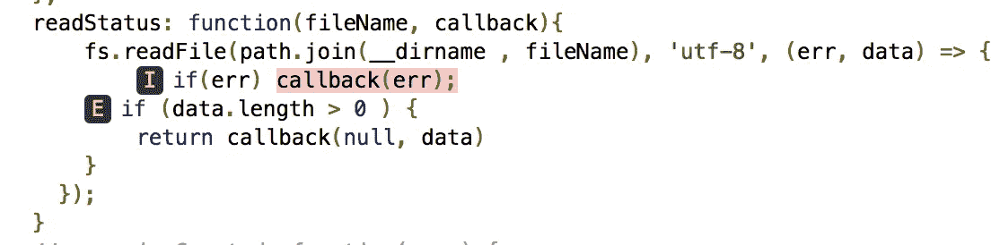
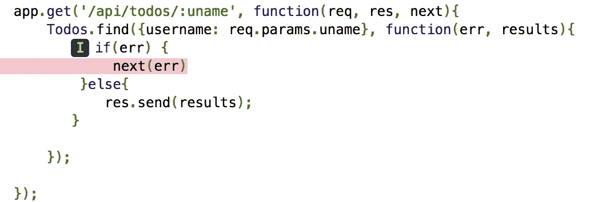

# 使用伊斯坦布尔增加您的代码覆盖率

> 原文：<https://medium.com/walmartglobaltech/do-you-have-100-code-coverage-10c09a44832b?source=collection_archive---------1----------------------->


[https://pixabay.com/en/code-code-editor-coding-computer-1839406/](https://pixabay.com/en/code-code-editor-coding-computer-1839406/)

很多时候，我们谈论我们的项目有 100%的代码覆盖率。事实是，拥有 100%的代码覆盖率是我们代码库的一颗闪亮的星星，但是对于一个过去覆盖率不是最高优先级的现有代码库来说，这是非常困难的。原因很简单:当你不以‘可测试’的方式编写代码时，你不能为你的代码编写单元测试，这意味着，你不能有 100%的覆盖率。

获得 100%覆盖率的最好方法是在开发代码时不断评估覆盖率。在测试驱动开发(TDD)中，覆盖率伴随着努力而来。然而，在非 TDD 中，您需要非常小心地计算覆盖率。

在我们继续之前，请注意我不是 100%覆盖率的执行者，但是朝着那个目标前进通常会启发我们代码中的许多隐藏流，否则我们可能会跳过测试。

## **工具**:

因为我最近一直在使用 NodeJS，所以我要谈谈最流行的代码覆盖工具之一，`[istanbul](https://www.npmjs.com/package/istanbul)`。假设您可以从伊斯坦布尔自己的[文档](https://github.com/gotwarlost/istanbul)中获得伊斯坦布尔的基础知识，我将介绍一些使用伊斯坦布尔来增加现有项目覆盖面的技术。

伊斯坦布尔提出了一些体面的 html 报告，可以用来找到没有涵盖的代码。

## **要记住的事情**:

1.  一段代码必须是可测试的。如果一个可导出的模块包含一个函数，它应该以一种可以从外部注入数据的方式被创建，这样一个测试就可以发送数据并在期望的输出上断言。举个例子，

```
//example module index.js
module.exports = {
  add: **function**(x, y){
      **return** x + y;
  }
}//example test
describe(**'Index'**, **function**(){
    *it*(**'should add 2 and 3 to give 5'**, **function**(){
        expect(**index**.add(2, 3)).**to**.be.equal(5);
    });
});//code coverage
Statements   : 100% ( 4/4 )
Branches     : 100% ( 0/0 )
Functions    : 100% ( 1/1 )
Lines        : 100% ( 4/4 )
```

2.**条件语句**:这些对于分支覆盖很重要。在下面的例子中，覆盖率被删除，因为测试用例没有覆盖条件语句。

```
add2: **function**(x, y){
    **if** (x && y){
        **return** x + y;
    } **else** {
        **return null**;
    }
}//test
***it***(**'should add 2 and 3 to give 5'**, **function**(){
    expect(**index**.add2(2, 3)).to.be.equal(5);
});//code coverage
Statements   : 85.71% ( 6/7 )
Branches     : 75% ( 3/4 )
Functions    : 100% ( 2/2 )
Lines        : 85.71% ( 6/7 )
```

通过为 else 条件添加一个测试用例来修复它:

```
***it***(**'should return a value based on conditions'**, **function**(){
    expect(**index**.add2(2, 3)).to.be.equal(5);
});
***it***(**'should return null when no value is passed'**, **function**(){
    expect(**index**.add2()).to.be.null;
});//code coverage
Statements   : 100% ( 10/10 )
Branches     : 100% ( 4/4 )
Functions    : 100% ( 3/3 )
Lines        : 100% ( 10/10 )
```

另一个例子是图片中的物体。通常我们使用“短路”评估来设置默认值，但是它也需要被测试来完成覆盖。

```
doSomething: **function** (y) {
    **var** x = y || {};  // assign x as y or an empty object
    **return** x.val;     

}
//example test*it*(**'should return expected value '**, **function**(){
    expect(**index**.doSomething({**val**: 2 })).to.be.equal(2);
});
***it***(**'should return expected value '**, **function**(){
    expect(**index**.doSomething()).to.be.undefined;
});
//code coverage
Statements   : 100% ( 12/12 )
Branches     : 100% ( 6/6 )
Functions    : 100% ( 4/4 )
Lines        : 100% ( 12/12 )
```

现在有点复杂的功能。

**3。异步操作和条件:**考虑一个简单的读取文件的例子:

```
readStatus: **function**(fileName, callback){
  fs.readFile(path.join(__dirname , fileName),**'utf-8'**,(**err**, **data**) =>   {
        **if**(err) callback(err);
        **if** (**data**.length > 0 ) {
         **return** callback(**null**, **data**)
        }
  });
}//test
it(**'should read the data from the test file  '**, **function**(done){
    **index**.readStatus(**'test.json'**, (err, data) => {
        expect(data).to.*equal*(**'this is a test file'**)
        done();
    });
});//coverage
Statements   : 94.44% ( 17/18 )
Branches     : 80% ( 8/10 )
Functions    : 100% ( 5/5 )
Lines        : 100% ( 17/17 )
```

请注意，尽管我们有一个测试，但是语句和分支的覆盖率已经显著下降。评估伊斯坦布尔创建的报告，您会看到这样的内容:



显然，错误场景没有被涵盖。“ **I** ”和“ **E** ”字母表示语句不包含 if-else 条件，因此分支覆盖范围缩小。为了解决这个问题，让我们创建一个包含错误条件的测试。

```
it(**'should throw an error if the file is not read  '**, **function**(done){
    **index**.readStatus(**'notexist'**, (err, data) => {
        expect(err).with.deep.property(**'code'**).to.*equal*(**'ENOENT'**)
        expect(data).to.be.**undefined**;
        done();
    });
});//coverage
Statements   : 100% ( 18/18 )
Branches     : 90% ( 9/10 )
Functions    : 100% ( 5/5 )
Lines        : 100% ( 17/17 )
```

因此，上述报表的覆盖率有所增加，但分行的覆盖率仍为 90%。这是因为，`if(data.length > 0)`的`else`部分还没有被测试。让我们为此创建一个测试。然而，在我们的测试函数中有一个缺陷。如果找到了文件，但是数据是空的，那么在回调中不返回任何东西。`data.length`是≤0。因此，我们需要首先修复函数:

```
readStatus: **function**(fileName, callback){
    fs.readFile(path.join(__dirname , fileName), **'utf-8'**, (**err**, **data**) => {
        **if**(err) callback(err);
    **if** (**data**.length > 0 ) {
        **return** callback(**null**, **data**)
    } **else** {
        **return** callback(**null**, **null**)
    }
  });
}
```

现在测试变成了:

```
it(**'should return undefined when file exists but no data is present '**, **function**(done){
    **index**.readStatus(**'test_empty.json'**, (err, data) => {
        expect(err).to.be.**null**;
        expect(data).to.be.**null**;
        done();
    });
});//coverage
Statements   : 100% ( 19/19 )
Branches     : 100% ( 10/10 )
Functions    : 100% ( 5/5 )
Lines        : 100% ( 18/18 )
```

API 测试覆盖范围的示例:

```
// a simple app
**var** express = require(**'express'**);
**var** app = express();

**var** people = [
    {
        **name**: **'John Doe'** },
    {
        **name**: **'Jane Doe'** },
    {
        **name**: **'Jim Doe'** }
]

app.use(**'/assets'**, express.static(__dirname + **'/public'**));
app.get(**'/people'**, **function**(req, res){
    res.send(people);
});

**var** server = app.listen(3000);
module.exports = server;
```

相应测试

```
**var** expect = require(**'chai'**).expect;
**var** request = require(**'supertest'**);

describe(**'app'**, **function**(){
    **var** server;
    **beforeEach**(**function**(){
        server = require(**'../app'**);
    });
    **afterEach**(**function** () {
        server.close();
    });
    it(**'should respond with status code 200'**, **function**(done){
        request(server)
            .get(**'/people'**)
            .expect(200)
            .end((**err**, res) => {
               expect(res.body).to.be.an(**'array'**);
               done();
            });

        })
})//
Statements   : 100% ( 9/9 )
Branches     : 100% ( 0/0 )
Functions    : 100% ( 1/1 )
Lines        : 100% ( 9/9 )
```

**4。带条件的异步操作:**考虑以下 api

```
app.get(**'/api/todos/:uname'**, **function**(req, res, next){
    Todos.find({**username**: req.**params**.uname}, **function**(err, results){
       **if**(err) {
            next(err)
        }**else**{
           res.send(results);
       }
    });
});
```

相应的测试:

```
it(**'should respond successfully to /api/todos for a username'**, **function**(done){
    request(server)
        .get(**'/api/todos/test'**)
        .expect(200)
        .end(**function**(req, res) {
            expect(res.**body**).to.be.an(**'array'**);
            done();
        });
});
//coverage
Statements   : 97.06% ( 33/34 )
Branches     : 75% ( 3/4 )
Functions    : 100% ( 5/5 )
Lines        : 97.06% ( 33/34 )
```

覆盖率下降是因为我们还没有检查错误情况。



# **引入存根**

存根或模拟在单元测试中起着非常重要的作用。当您不知道如何在正常场景中遇到错误情况时，您需要使用一个存根，基本上是原始函数的模拟，但它在您的控制之下。您可以强制这个函数以您想要的方式抛出一个错误。

回到上面的场景，我们需要覆盖用粉色突出显示的错误条件。`sinon`是 Node 中一个流行的库，可用于此目的。

我们创建了一个`Error`的对象，并将其传递给 stub，作为在`Todos`上从`find`方法回调的结果。注意，我们为此使用了`sinon.stub`上的`yields` API。`yields`获取调用回调时应该使用的参数列表。

```
 it(**'should throw an error when any kind of error is encountered'**, **function**(done){
    **var** stub = sinon.stub(Todos, **'find'**);
    **var** expectedError = **new** Error(**'oops'**);
    stub.yields(expectedError);

    request(server)
      .get(**'/api/todos/test'**)
      .expect(**function**(res){
        expect(res.error).to.have.deep.property(**'text'**).to.contain(**'oops'**)
        })
      .end(done);
});
```

因此，我们完整的测试套件如下所示:

```
**var** expect = require(**'chai'**).expect;
**var** request = require(**'supertest'**);
**var** sinon = require(**'sinon'**);
**var** Todos = require(**'../models/todomodel'**);
**var** AssertionError = require(**"assert"**).**AssertionError**;

describe(**'main app'**, **function**(){
    **var** server;
    **beforeEach**(**function**(){
        server = require(**'../app'**);
    });
    **afterEach**(**function** () {
        server.close();
    });
    it(**'should respond successfully to /api/todos for a username'**, **function**(done){
        request(server)
            .get(**'/api/todos/test'**)
            .expect(200)
            .end(**function**(req, res) {
                expect(res.**body**).to.be.an(**'array'**);
                done();
            });
    });

    it(**'should throw an error when any kind of error is encountered'**, **function**(done){
        **var** stub = sinon.stub(Todos, **'find'**);
        **var** expectedError = **new** Error(**'oops'**);
        stub.yields(expectedError);

        request(server)
            .get(**'/api/todos/test'**)
            .expect(500)
            .expect(**function**(res){
             expect(res.error).to.have.deep.property(**'text'**).to.contain(**'oops'**)
            })
            .end(done);
    });

});/coverage
Statements   : 100% ( 34/34 )
Branches     : 100% ( 4/4 )
Functions    : 100% ( 5/5 )
Lines        : 100% ( 34/34 )
```

# 总结:

一个 100%覆盖率的代码库给你的代码提供了一个保护盾，防止一些不可预见的错误。尽管有些错误没有意义，但是 100%覆盖代码的努力会让你经历某些场景，否则你可能不会经历。这就产生了一个可靠的软件产品，您可以对它充满信心。

**有用资源:**

 [## jstest

### 在创建模拟时，您可以使用上面显示的整个存根 API，唯一的区别是如果您使用 expect(…

jstest.jcoglan.com](http://jstest.jcoglan.com/mocking.html) [](https://martinfowler.com/bliki/TestCoverage.html) [## bliki:测试覆盖率

### 标签:我不时听到有人问他们应该以什么样的测试覆盖率(也称为代码覆盖率)为目标…

martinfowler.com](https://martinfowler.com/bliki/TestCoverage.html)