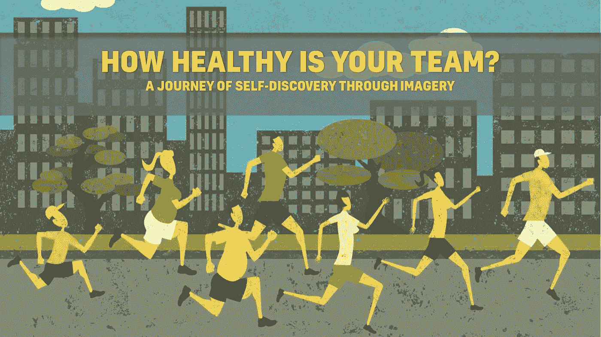
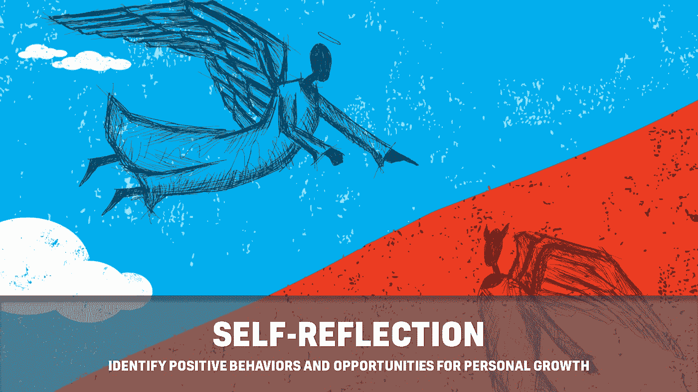
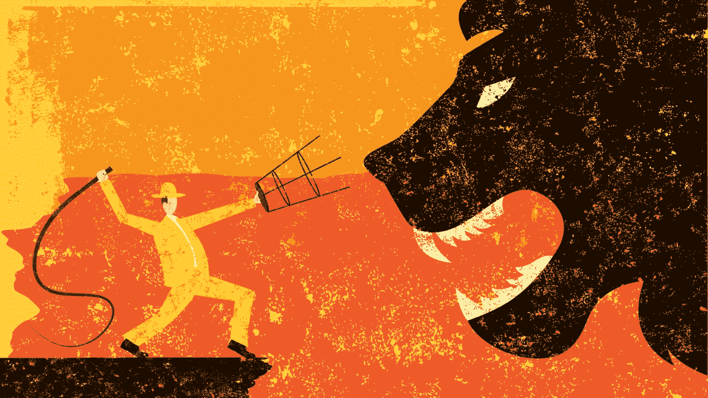
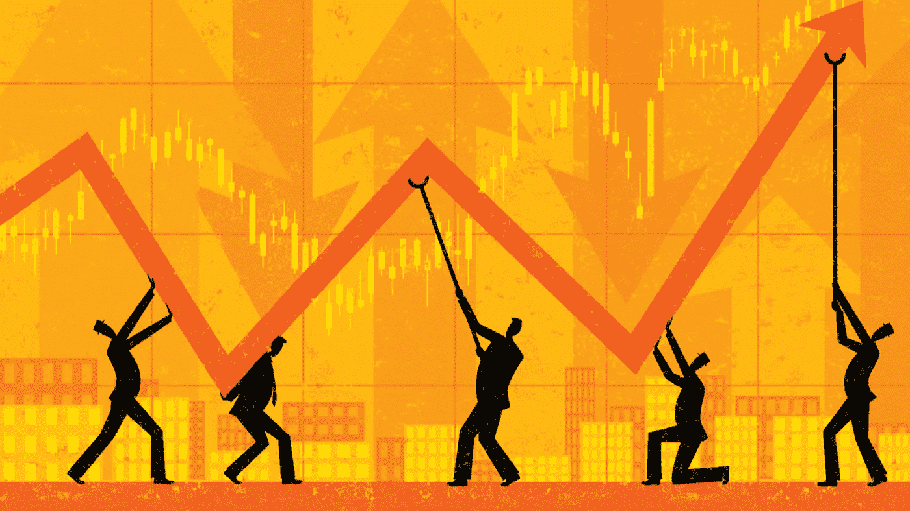

# 你有健康的团队文化吗？试试这个训练方案吧！

> 原文：<https://medium.com/walmartglobaltech/do-you-have-a-healthy-team-culture-give-this-training-regimen-a-try-to-find-out-7ef7e3c6f356?source=collection_archive---------2----------------------->

# 你的团队有多健康？

铁人三项赛是对耐力的终极考验。参与者的目标是完成 140.6 英里的三个连续项目，包括游泳(2.4 英里)、自行车(112 英里)和跑步(26.2 英里)。

想象一下，如果你的组织被邀请参加铁人三项赛。他们需要几个月的时间来准备害怕训练方案，还是为比赛做好心理和身体上的准备？

有时，工作场所本身似乎是对耐力的终极考验，如果铁人三项是工作场所挑战的隐喻，作为一名领导者，你必须问问自己…

*“我的团队有多健康？”。*

# 背景故事

2017 年是我领导生涯中充满挑战的一年。前两个季度我被 ***抽搐*** 打了。

什么是****抽搐*** ？简单地说就是的摆放，它的当你不得不理:*

*   *eam 损耗*
*   *一、&职责范围的扩大*
*   *对未成熟人才的指导*

*同时应对实现公司最高目标、保持高绩效团队和确保健康文化的压力。*

*(*这么说吧，去年的事情让我有点不知所措*)。*

****TIC*** 的余波传遍了我的组织，我开始注意到我的团队中正在形成不健康的行为。*

*这些行为最终成为我所在组织的铁人三项赛。*

***事件#1:不健康的沟通***

*   *自上而下和自下而上的信息歪曲*
*   *产品愿景、战略和范围的清晰性*
*   *明确业务/客户影响*

***事件#2 不健康的管理/员工关系***

*   *经理们不愿意给出建设性的反馈*
*   *管理人员没有在他们的团队中提供明确的角色和职责*
*   *微观管理*
*   *员工不清楚职业发展机会*
*   *员工感到未被充分利用*

***事件#3 不健康的团队间行为***

*   *对个人的交付能力缺乏信心*
*   *指责*
*   *“我自己能行”的心态*
*   *基于情感的决策*

*这些行为对整体文化有害，我需要一种方法让我的团队回到高绩效模式。*

*我的解决方案是:图像。*

# *通过意象的自我发现之旅*

**

*我提倡 4 种核心品质来帮助激励团队中的健康行为。我意识到，随着时间的推移，这些品质自然退化了，在我的组织中造成了沮丧和混乱。*

*我想采取一种独特的方法来解决这个问题，所以我找到了最能代表 4 种核心品质的图片，并要求每位员工运用他们的解释和批判性思维技能来鼓励自我反思和个人领导力。*

# *训练制度*

*以下是我与我的组织分享的 4 张图片。这个练习有三个部分:*

*   **高层分析:*你对图像的最初反应是什么。*
*   **深度分析:*你的解读和我的不同吗(*见图片说明*)？从这幅图像中还能得出什么结论？*
*   **离线分析:*针对自我反思和个人成长的发人深省的问题。*

*花点时间从公司、团队和个人的角度回顾和反思每张图片的意义。*

## *弓箭，两个人，和一个苹果*

**

***TRUST** — “IF YOU WANT SOMEONE TO TRUST YOU, YOU HAVE TO TRUST THEM FIRST.”*

***高层分析:***

*   *这张图片用一个词来代表你什么？*
*   *你为什么选择这个词？*
*   *照片中的什么引起了你的共鸣？*

***深度分析:***

*   *你和字幕语句有关系吗？*
*   *这幅图中谁信任谁？*
*   *信任在经理和员工之间扮演什么角色？*
*   *关于工作场所的信任，你能分享哪些正面或负面的经历？*

***离线分析:***

*   *当一项任务被分配时，你相信它会 100%按时保质完成吗？*
*   *当给出反馈时，你相信它会被很好地接受并会得到改进吗？*
*   *你相信自己会从同事和领导那里获得反馈，并以此作为职业发展的一部分吗？*
*   *你相信自己有能力完成任务吗？如果不是，你相信你能在需要的时候得到帮助吗？*

## *狮子和驯兽师*

**

***CONFIDENCE** — “BE BOLD IN YOUR OPINIONS. SPEAK UP ON WHAT YOU THINK IS RIGHT.”*

***高层分析:***

*   *这张图片用一个词来代表你什么？*
*   *你为什么选择这个词？*
*   *照片中的什么引起了你的共鸣？*

***深度分析:***

*   *你和字幕语句有关系吗？*
*   *狮子代表了什么样的恐惧？*
*   *鞭子和椅子是抵御狮子的工具。象征性地，有什么技巧可以用来克服个人恐惧？*
*   *有哪些方法可以让你建立对同事的信心？*

***离线分析:***

*   *你有没有质疑过为什么有些事情正在被做，却因为害怕被评判而从来不说出来？*
*   *你有没有让恐惧阻碍你实现个人目标或重大成就？*

## *四个人，一个差距，一个目标*

**

***PERSPECTIVE** — “A WHAT IF QUESTION COULD CHANGE THE COURSE OF ANY SITUATION.”*

***高层分析:***

*   *这张图片用一个词来代表你什么？*
*   *你为什么选择这个词？*
*   *照片中的什么引起了你的共鸣？*

***深度解析:***

*   *你和字幕语句有关系吗？*
*   *从协作的角度来看，你能从这幅图中得出什么结论(例如，团队努力实现目标，个人承担风险，领导者以身作则)？*
*   *当你看图片时，你认为这个人达到了目标还是失败了？*
*   *如果从团队协作、个人贡献者、领导者的角度来看，最终结果是失败，我们将如何区别对待这种情况？*

***离线分析:***

*   *你或你的团队是否总是发现自己陷入了解决问题的单一思路？*
*   *作为一名领导者，你是否建立了一种将失败视为学习经历的文化？如果没有，为什么？如果有，如何实现？*
*   *你们有重视他人反馈的文化吗？*
*   *对于任何项目，问这样一个问题:我们怎么会失败？通过回答这个问题，你将为成功做好准备。*

## *线图和团队*

**

***ACCOUNTABILITY** — “TAKE PERSONAL RESPONSIBLY FOR YOUR ACTIONS ENSURING THE OVERALL SUCCESS OF THE TEAM.”*

***高层分析:***

*   *这张图片用一个词来代表你什么？*
*   *你为什么选择这个词？*
*   *照片中的什么引起了你的共鸣？*

***深度解析:***

*   *你和字幕语句有关系吗？*
*   *这幅图中的线形图代表了什么？*
*   *你注意到图片中每个人的什么？*
*   *清晰的角色和职责对项目的成功有多重要？*
*   *你认为有效的沟通和支持在成功实现目标中起着怎样的作用？*

***离线分析:***

*   *在你的工作中，你觉得每个人都在努力确保项目或任务的成功吗？如果没有，你如何解决？*
*   *当出现问题或需要帮助时，是否有一种尊重、透明和诚实的感觉？*
*   *团队合作对你来说意味着什么？你在你的组织中看到这些品质了吗？*

# *结论*

**

*上述练习有助于在我的团队中重建**信任**、**信心**、**观点**和**责任**的价值观。*

*结果，我的组织完成了 90%的年度目标，比上半年的业绩更好。*

*现在，我们绝不是完美的。我们是一项正在进行的工作。但是和任何训练方法一样，坚持不懈可以为取得更高的成绩培养耐力。*

*作为领导者，我们应该努力相互学习。我很想听听你的想法。请分享你个人对这些图像的理解，以及创造你的健康团队文化的 4 个核心品质。*