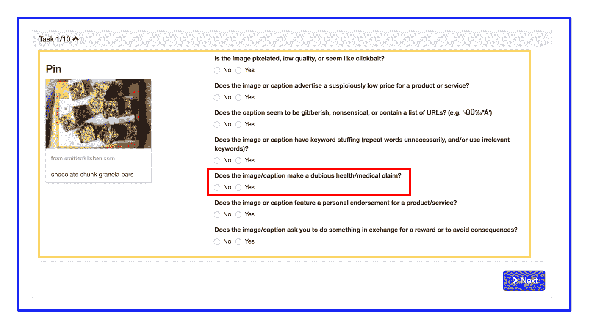
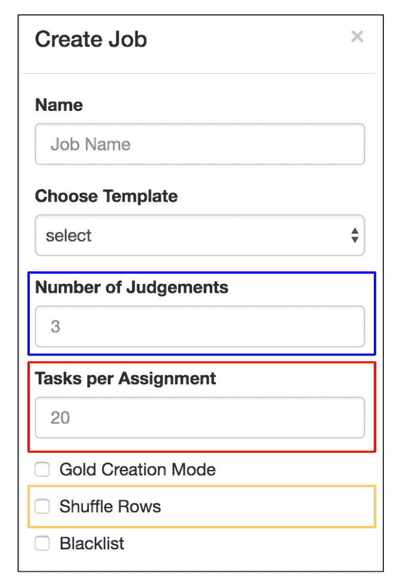
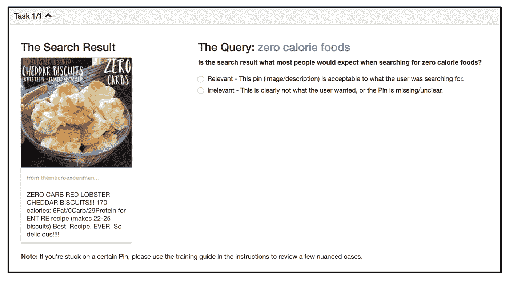
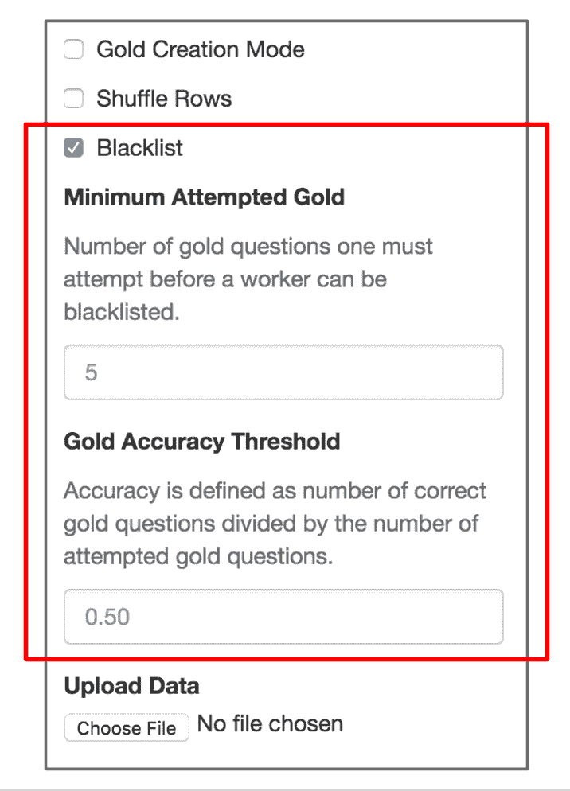
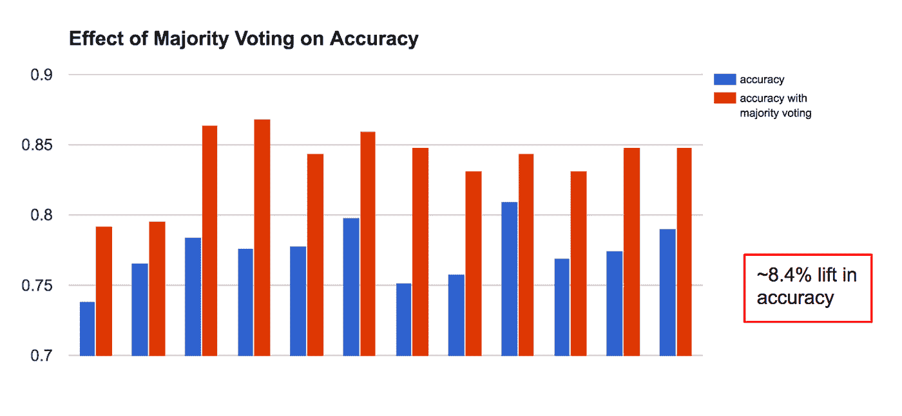

# 你相信群众吗？改善公司众包的 3 种方法

> 原文：<https://medium.com/pinterest-engineering/do-you-trust-the-crowd-3-ways-to-improve-crowdsourcing-at-your-company-6f19df729a89?source=collection_archive---------1----------------------->

王杰| Pinterest 工程师，人类计算

众包，或者我们称之为[人工计算](https://en.wikipedia.org/wiki/Human-based_computation)，在 Pinterest 发挥着重要作用。从测量搜索结果的相关性到检测垃圾邮件，我们有大量的用例。人类计算背后的前提很简单——有些任务比计算机更适合人类。此外，随着机器学习的出现，可靠的训练数据迅速成为必备条件。所有这些都推动了对大规模高质量人工计算的需求——每天超过 10 万个任务。

为了满足这一需求，我们使用了许多外部平台，包括 Mechanical Turk、Crowdflower、Upwork 和 Mighty AI。虽然我们在这些平台上取得了成功，但结果并不总是准确的，这导致了不精确的测量和嘈杂的训练数据。在本帖中，我们将描述我们用来对抗低质量评级并交付有意义结果的实用众包技术。

# 挑战

想想人群中的三种工人类型。首先是垃圾邮件发送者，低素质的工人试图最大化利润和最小化努力。接下来是审查员，他们忠实地回答问题，但并不总是提供最好的工作。最后是制片人，提供质量评级的工人。我们对人类计算团队的挑战是开发技术来消除和禁止垃圾邮件发送者，减轻攻击者的负面影响，并从生产者那里提取信号。

# 索非亚

去年，我们建立了 Sofia，这是我们内部的人类计算平台。通过与上述平台(MTurk、CrowdFlower、Upwork、Mighty AI)集成，Sofia 提供了一个直观的界面来请求工作，同时抽象出外部平台特有的复杂性。此外，Sofia 让我们能够完全控制员工体验，从我们如何分配工作到我们平台上允许的人员。这种控制使我们能够开发独特的解决方案来应对挑战。

*(注意:这篇文章不会讨论我们如何建造 Sofia，但是会强调我们在 Sofia 使用的质量控制技术。)*

## 技巧 1:任务设计

我们在 Sofia 中使用一个简单的数据模型。

*Figure 1: Sofia data model*

索菲亚的工作核心单元是一个问题(用红色捕捉)。任务(以黄色捕获)由多个问题组成。一项任务(以蓝色显示)是我们捆绑在一起并分配给员工的一组任务。

*Figure 2: Job creation in Sofia*

以上是 Sofia 的创造就业对话框截图。

我们要做的第一件事是管理每次分配的任务数量，因为员工疲劳是众包中的一个常见问题。我们没有硬性限制一个任务中应该有多少个任务，而是让这个参数可配置(用红色显示)。接下来，我们引入了任务随机化(显示为黄色)，因此当一个工人打开一个任务时，问题是从可用工作池中随机选择的。我们这样做是为了尽量减少数据排序中的任何潜在偏差。最后，我们在设计人类计算工作时学到的最有价值的东西是冗余的重要性——也就是说，要求对同一任务做出多种判断(以蓝色显示)。稍后，我们将解释一种叫做“多数表决”的技术如何与多重判断结合使用，以减少工作人员的失误。

## 技巧 2:将垃圾邮件发送者列入黑名单

我们需要的下一件事是确定单个工人素质的方法。为此，我们使用测试题。测试问题(也称为黄金问题)是你已经知道答案的问题，但你仍然要测试工人的素质。

一个好的试题有三个特征:

1.  这和普通的问题没什么区别
2.  这个问题很难回答
3.  一个不正确的答案强烈暗示一个低质量的工人

下面例子中的测试问题让我们能够识别出能够区分*低碳水化合物*和*低卡路里*的工人。

*Figure 3: gold question*

有了确定工人素质的能力，我们就可以将未通过一定数量测试问题的工人列入黑名单。此外，我们放弃黑名单上的工人的回答，并要求对放弃的工作做出更多回应。因为我们的客户的质量要求各不相同，而不是强加一个统一的黑名单政策，我们使黑名单的严格性可根据个人需要进行配置。

*Figure 4: blacklisting controls*

如你所见，我们的黑名单政策相当简单——它考虑到了一个工人已经完成的试题数量以及他或她在试题上的准确性。然而，这个简单的政策让我们相信垃圾邮件发送者不会污染我们的结果。

## 技巧 3:多数表决

我们采用的最后一种技术是多数表决。利用任务设计中的冗余，我们使用多数投票来汇总答案，方法是选择在给定问题的一半以上答案中重复出现的答案。我们发现多数投票，一种原始的异常检测形式，能够从信号中筛选出噪声。毕竟，虽然黑名单可以有效地禁止不良员工，但我们仍然需要一种技术来减轻通过黑名单的低质量工作的影响。只要我们对我们团队的整体素质有信心(这在很大程度上要感谢黑名单)，多数投票就能显著提高我们的工作质量。

这里有一个图表，比较了在有和没有多数表决的情况下，一个简单的人工计算工作的各种运行的准确性。

*Figure 5: effects of majority voting*

图 5 显示了运行 12 次的相同人工计算作业的群体准确性。在向人群发布之前，我们对所有数据进行了内部评级，以衡量人群的准确性。我们发现，使用多数投票来汇总员工的结果，可以将人群的准确性平均提高 8.4%。

# 结论

通过这些简单的技术，Pinterest 的人工计算已经取得了长足的进步。目前，Sofia 被我们的几十个团队用于广泛的人类计算任务。然而，我们只是触及了人类计算有多好的表面。这一领域的文献非常丰富，我们刚刚开始将学术知识应用于 Sofia。

展望未来，凭借我们丰富的工人质量数据，我们计划建立机器学习模型来计算单个工人的质量分数。这将开启更高级的任务分配策略，并影响我们汇总答案的方式。如果你对人类计算的空间感兴趣，请[加入我们](https://careers.pinterest.com/)！

*鸣谢:没有金正银、李北·雷兹万普尔、加纳·钟、詹姆士·鲁宾斯坦、维罗妮卡·梅普斯和穆罕默德·沙汉吉安，索菲亚就不可能建成。非常感谢和赞赏他们！*