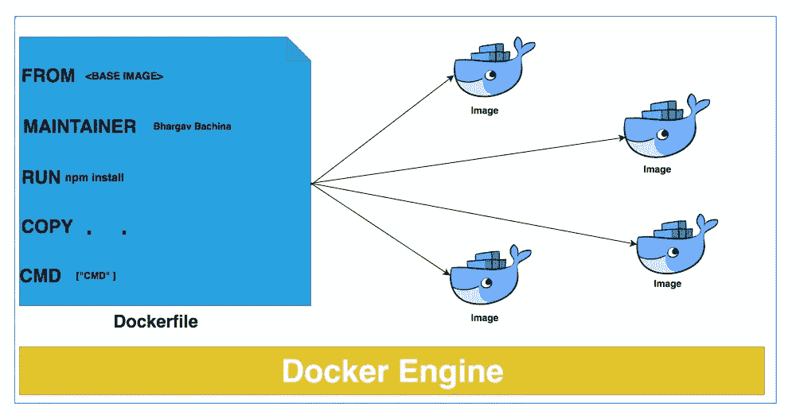

# docker——带有示例项目的 Dockerfile 初学者指南

> 原文：<https://medium.com/bb-tutorials-and-thoughts/docker-a-beginners-guide-to-dockerfile-with-a-sample-project-6c1ac1f17490?source=collection_archive---------0----------------------->

## 理解 Dockerfile 文件的逐步指南

Photo by [Roger Hoyles](https://unsplash.com/@hoylesy?utm_source=medium&utm_medium=referral) on [Unsplash](https://unsplash.com?utm_source=medium&utm_medium=referral)

**Automatic creation of Docker images through Dockerfile**

Dockerfile 用于自动创建 Docker 映像。Docker 通过阅读建立图像…