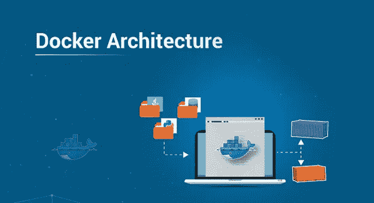
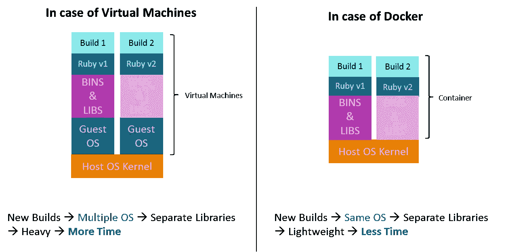
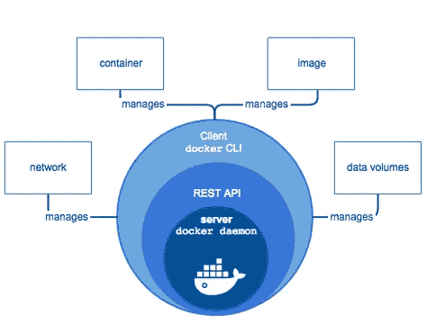

# Docker 架构:为什么重要？

> 原文：<https://medium.com/edureka/docker-architecture-be79628e076e?source=collection_archive---------0----------------------->

Docker Architecture — Edureka

我们很多人认为 Docker 是 DevOps 不可或缺的一部分。所以在这个不可思议的工具背后，必须有一个令人惊叹的架构。在这篇文章中，我将介绍你必须知道的关于 Docker 架构的一切。这些是我将在这里讨论的要点:

1.  传统虚拟化与 Docker
2.  码头工人的工作流程
3.  码头建筑

*   码头工人的客户
*   码头主持人
*   Docker 对象
*   码头工人登记处

# 传统虚拟化与 Docker

## 什么是 VM(虚拟机)？

虚拟机是模拟硬件服务器的虚拟服务器。虚拟机依赖于系统的物理硬件来模拟安装应用程序的完全相同的环境。根据您的使用情况，您可以使用系统虚拟机(将整个操作系统作为一个进程运行，允许您用真实的机器代替虚拟机)，或者处理虚拟机，让您在虚拟环境中单独执行计算机应用程序。

以前，我们创建虚拟机，每个虚拟机都有一个操作系统，占用大量空间，使其变得沉重。

## Docker 是什么？

Docker 是一个开源项目，提供了一个名为 containers 的软件开发解决方案。要理解 Docker，你需要知道什么是容器。根据 Docker 的说法，容器是一个轻量级的、独立的、可执行的软件包，它包含了运行软件所需的一切。

容器是独立于平台的，因此 Docker 可以跨基于 Windows 和 Linux 的平台运行。事实上，如果需要的话，Docker 也可以在虚拟机中运行。Docker 的主要目的是让您在分布式架构中运行微服务应用程序。

与虚拟机相比，Docker 平台将资源的抽象从硬件层提升到了操作系统层。这允许实现容器的各种好处，例如应用程序可移植性、基础设施分离和独立的微服务。

换句话说，虚拟机抽象了整个硬件服务器，而容器抽象了操作系统内核。这是一种完全不同的虚拟化方法，可以实现更快、更轻量级的实例。

# 码头工人的工作流程

首先，让我们看看 Docker 引擎及其组件，这样我们就对系统的工作原理有了一个基本的概念。Docker Engine 允许您使用以下组件开发、组装、发布和运行应用程序:

1.  **Docker 守护进程**:管理 Docker 映像、容器、网络和存储卷的持久后台进程。Docker 守护进程不断监听 Docker API 请求并处理它们。
2.  **Docker Engine REST API** :应用程序使用 API 与 Docker 守护进程进行交互。HTTP 客户端可以访问它。
3.  Docker CLI :用于与 Docker 守护进程交互的命令行界面客户端。它极大地简化了管理容器实例的方式，也是开发人员喜欢使用 Docker 的主要原因之一。

首先，Docker 客户机与 Docker 守护进程对话，后者负责构建、运行和分发 Docker 容器。从根本上说，Docker 客户机和守护进程可以在同一个系统上运行。我们还可以将 Docker 客户端连接到远程 Docker 守护进程。此外，通过使用 REST API，Docker 客户机和守护程序通过 UNIX 套接字或网络接口进行通信。

# 码头建筑

Docker 的架构采用客户端-服务器模型，由 Docker 的客户端、Docker 主机、网络和存储组件以及 Docker 注册中心/集线器组成。让我们来详细了解一下其中的每一项。

## 码头工人的客户

Docker 用户可以通过客户端与 Docker 交互。当任何 docker 命令运行时，客户端将它们发送到 dockerd 守护进程，由它执行这些命令。Docker API 由 Docker 命令使用。Docker 客户端可以与多个守护程序通信。

## 码头主持人

Docker 主机提供了执行和运行应用程序的完整环境。它由 Docker 守护进程、映像、容器、网络和存储组成。如前所述，守护进程负责所有与容器相关的操作，并通过 CLI 或 REST API 接收命令。它还可以与其他守护程序通信来管理其服务。

## Docker 对象

## 1.形象

图像不过是一个可以构建容器的只读二进制模板。它们还包含描述容器功能和需求的元数据。图像用于存储和发布应用程序。一个映像可以单独使用来构建一个容器，也可以被定制来添加额外的元素来扩展当前的配置。

在私有容器注册中心的帮助下，您可以在企业内的团队之间共享容器映像，或者使用 Docker Hub 这样的公共注册中心与全世界共享它。图像是 Docker 体验的核心元素，因为它们以一种前所未有的方式支持开发人员之间的协作

## 2.容器

容器是一种封装的环境，您可以在其中运行应用程序。容器由映像和启动容器时提供的任何附加配置选项定义，包括但不限于网络连接和存储选项。容器只能访问映像中定义的资源，除非在将映像构建到容器中时定义了额外的访问权限。

您还可以基于容器的当前状态创建新图像。因为容器比虚拟机小得多，所以它们可以在几秒钟内完成旋转，从而实现更高的服务器密度

## 3.网络

Docker 网络是一个通道，所有孤立的容器通过它进行通信。docker 中主要有五个网络驱动程序:

1.  **Bridge** :是容器的默认网络驱动。当您的应用程序运行在独立的容器上时，即多个容器与同一个 docker 主机通信时，您可以使用这个网络。
2.  **主机**:这个驱动解除了 docker 容器和 docker 主机之间的网络隔离。当主机和容器之间不需要任何网络隔离时，可以使用它。
3.  **覆盖**:这个网络可以让群体服务互相交流。当您希望容器在不同的 Docker 主机上运行，或者当您希望通过多个应用程序形成群服务时，您可以使用它。
4.  **无**:此驱动程序禁用所有网络。
5.  macvlan :这个驱动程序给容器分配 mac 地址，使它们看起来像物理设备。它通过容器的 mac 地址在容器之间路由流量。当您希望容器看起来像物理设备时，例如在迁移 VM 设置时，您可以使用此网络。

## 4.储存；储备

您可以将数据存储在容器的可写层中，但它需要存储驱动程序。由于是非持久的，每当容器不运行时，它就会消失。而且，转移这些数据并不容易。关于持久存储，Docker 提供了四个选项:

1.  **数据卷**:它们提供了创建持久存储的能力，能够重命名卷、列出卷以及列出与卷相关联的容器。数据卷放在主机文件系统上，在容器的写时拷贝机制之外，效率相当高。
2.  **卷容器**:这是一种替代方法，其中一个专用容器托管一个卷，并将该卷挂载到其他容器。在这种情况下，卷容器独立于应用程序容器，因此您可以在多个容器之间共享它。
3.  **目录挂载**:另一个选项是将主机的本地目录挂载到容器中。在前面提到的情况下，卷必须位于 Docker volumes 文件夹中，而对于目录挂载，主机上的任何目录都可以用作卷的源。
4.  **存储插件**:存储插件提供连接外部存储平台的能力。这些插件将存储从主机映射到外部源，如存储阵列或设备。你可以在 Docker 的插件页面看到存储插件列表。

## **码头工人注册处**

Docker 注册表是提供存储和下载图像位置的服务。换句话说，Docker 注册表包含托管一个或多个 Docker 映像的 Docker 储存库。公共注册中心包括两个组件，即 Docker Hub 和 Docker Cloud。您也可以使用私有注册表。使用注册表时最常见的命令包括:docker push、docker pull、docker run

如果你想查看更多关于人工智能、Python、道德黑客等市场最热门技术的文章，你可以参考 Edureka 的官方网站。

请留意本系列中的其他文章，它们将解释 DevOps 的各个方面。

> *1。* [*DevOps 教程*](/edureka/devops-tutorial-89363dac9d3f)
> 
> *2。* [*Git 教程*](/edureka/git-tutorial-da652b566ece)
> 
> *3。* [*詹金斯教程*](/edureka/jenkins-tutorial-68110a2b4bb3)
> 
> *4。* [*码头工人教程*](/edureka/docker-tutorial-9a6a6140d917)
> 
> *5。* [*Ansible 教程*](/edureka/ansible-tutorial-9a6794a49b23)
> 
> *6。* [*木偶教程*](/edureka/puppet-tutorial-848861e45cc2)
> 
> *7。* [*厨师教程*](/edureka/chef-tutorial-8205607f4564)
> 
> *8。* [*Nagios 教程*](/edureka/nagios-tutorial-e63e2a744cc8)
> 
> *9。* [*如何编排 DevOps 工具？*](/edureka/devops-tools-56e7d68994af)
> 
> *10。* [*连续交货*](/edureka/continuous-delivery-5ca2358aedd8)
> 
> *11。* [*持续集成*](/edureka/continuous-integration-615325cfeeac)
> 
> *12。* [*连续部署*](/edureka/continuous-deployment-b03df3e3c44c)
> 
> *13。* [*持续交付 vs 持续部署*](/edureka/continuous-delivery-vs-continuous-deployment-5375642865a)
> 
> *14。* [*CI CD 管道*](/edureka/ci-cd-pipeline-5508227b19ca)
> 
> 15。 [*码头工人撰写*](/edureka/docker-compose-containerizing-mean-stack-application-e4516a3c8c89)
> 
> 16。 [*码头工人群*](/edureka/docker-swarm-cluster-of-docker-engines-for-high-availability-40d9662a8df1)
> 
> *17。* [*Docker 联网*](/edureka/docker-networking-1a7d65e89013)
> 
> *18。* [*天穹*](/edureka/ansible-vault-secure-secrets-f5c322779c77)
> 
> 19。 [*可变角色*](/edureka/ansible-roles-78d48578aca1)
> 
> 20。 [*适用于 AWS*](/edureka/ansible-for-aws-provision-ec2-instance-9308b49daed9)
> 
> *21。* [*詹金斯管道*](/edureka/jenkins-pipeline-tutorial-continuous-delivery-75a86936bc92)
> 
> *22。* [*顶级 Docker 命令*](/edureka/docker-commands-29f7551498a8)
> 
> *23。*[*Git vs GitHub*](/edureka/git-vs-github-67c511d09d3e)
> 
> *24。* [*顶级 Git 命令*](/edureka/git-commands-with-example-7c5a555d14c)
> 
> *25。* [*DevOps 面试问题*](/edureka/devops-interview-questions-e91a4e6ecbf3)
> 
> *26。* [*谁是 DevOps 工程师？*](/edureka/devops-engineer-role-481567822e06)
> 
> *27。* [*DevOps 生命周期*](/edureka/devops-lifecycle-8412a213a654)
> 
> *28。*[*Git Reflog*](/edureka/git-reflog-dc05158c1217)
> 
> *29。*
> 
> **三十。* [*组织正在寻找的顶尖 DevOps 技能*](/edureka/devops-skills-f6a7614ac1c7)*
> 
> **30。* [*瀑布 vs 敏捷*](/edureka/waterfall-vs-agile-991b14509fe8)*
> 
> **31。* [*詹金斯小抄*](/edureka/jenkins-cheat-sheet-e0f7e25558a3)*
> 
> **32。**
> 
> **33。 [*Ansible 面试问答*](/edureka/ansible-interview-questions-adf8750be54)**
> 
> **34。 [*50 Docker 面试问题*](/edureka/docker-interview-questions-da0010bedb75)**
> 
> **35。 [*敏捷方法论*](/edureka/what-is-agile-methodology-fe8ad9f0da2f)**
> 
> ***36。* [*詹金斯面试问题*](/edureka/jenkins-interview-questions-7bb54bc8c679)**
> 
> **37。 [*Git 面试问题*](/edureka/git-interview-questions-32fb0f618565)**
> 
> **38。 [*Maven 用于构建 Java 应用*](/edureka/maven-tutorial-2e87a4669faf)**
> 
> **39。[*devo PS 中使用的 Linux 命令*](/edureka/linux-commands-in-devops-73b5a2bcd007)**
> 
> ***40。* [*詹金斯 vs 竹子*](/edureka/jenkins-vs-bamboo-782c6b775cd5)**
> 
> ***41。* [*Nagios 教程*](/edureka/nagios-tutorial-e63e2a744cc8)**
> 
> ***42。* [*Nagios 面试问题*](/edureka/nagios-interview-questions-f3719926cc67)**
> 
> ***43。* [*DevOps 实时场景*](/edureka/jenkins-x-d87c0271af57)**
> 
> ***44。* [*詹金斯和詹金斯 X 的区别*](/edureka/jenkins-vs-bamboo-782c6b775cd5)**
> 
> ***45。*[*Docker for Windows*](/edureka/docker-for-windows-ed971362c1ec)**
> 
> ***46。*T80*Git vs Github***

***原载于 2019 年 9 月 24 日*[*https://www.edureka.co*](https://www.edureka.co/blog/docker-architecture/)*。***