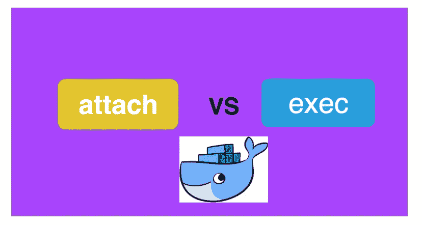

# Docker — attach 与 exec 命令

> 原文：<https://medium.com/bb-tutorials-and-thoughts/docker-attach-vs-exec-commands-473f591da3a8?source=collection_archive---------1----------------------->



**attach vs exec**

在本文中，我们将探讨 docker attach 和 docker exec 命令之间的区别。两者都用于探索运行中的容器，但这两者之间有一点点不同。

复制下面这篇文章的报告。

```
git clone [https://github.com/bbachi/prod-ready-node-rest-api.git](https://github.com/bbachi/prod-ready-node-rest-api.git)
```