# 你应该知道的 15 个 Docker 命令

> 原文：<https://medium.com/edureka/docker-commands-29f7551498a8?source=collection_archive---------0----------------------->

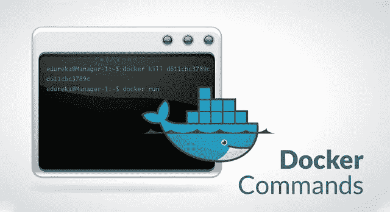

Docker Commands — Edureka

Docker 容器的趋势一直在不受控制地发展，许多组织都在积极寻找精通 Docker 命令的专业人员。因此，在本文中，我将讨论 15 个最常用的 Docker 命令。

以下是所涉及的命令:

*   docker–版本
*   码头工人拉动
*   码头运行
*   docker ps
*   docker ps -a
*   码头经理
*   码头停车
*   码头工人杀人
*   docker 提交
*   docker 登录
*   码头推送
*   docker 图像
*   码头工人室
*   码头工人 rmi
*   码头工人建造

# 1.**docker–版本**

## 用法:docker--版本

该命令用于获取当前安装的 docker 版本

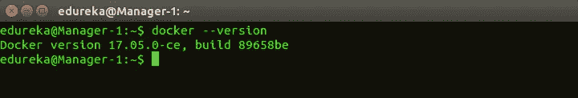

# 2.**码头工人拉**

## **用法:码头工人拉<图像名称>**

该命令用于从 **docker 库**(hub.docker.com)中提取图像

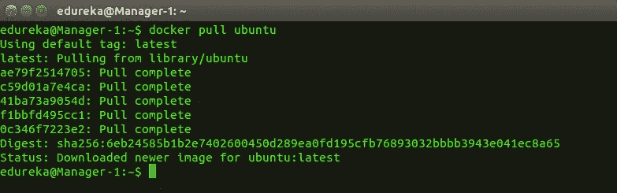

# 3.**对接运行**

## **用法:docker run -it -d <图像名称>**

该命令用于从图像创建容器

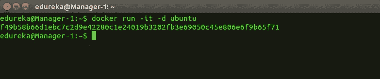

# 4. **docker ps**

## 用法:docker ps

该命令用于列出正在运行的容器

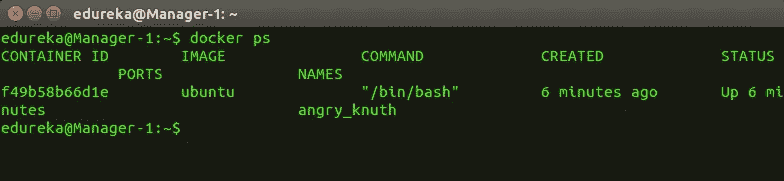

# 5. **docker ps -a**

## 用法:docker ps -a

该命令用于显示所有正在运行和已退出的容器

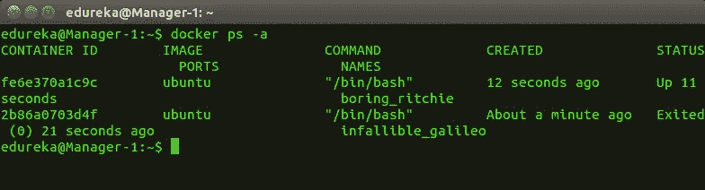

# 6.**码头工人执行**

## **用法:docker exec -it <容器 id > bash**

该命令用于访问正在运行的容器

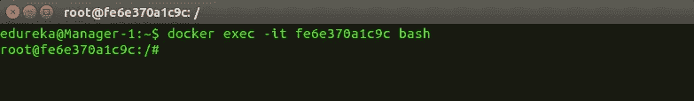

# 7.**码头工人停止**

## **用途:码头停止<集装箱 id>**

该命令停止正在运行的容器

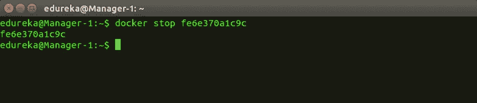

# 8.**码头工人杀人**

## **用途:码头工人杀死<集装箱 id>**

该命令通过立即停止容器的执行来终止容器。“docker kill”和“docker stop”的区别在于,“docker stop”让容器有时间正常关闭，如果让容器停止需要太多时间，可以选择杀死它。

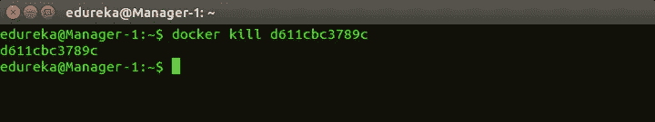

# 9. **docker 提交**

## **用法:docker commit <容器 id > <用户名/图像名>**

该命令在本地系统上创建一个已编辑容器的新映像

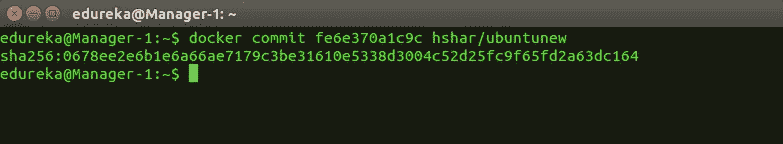

# 10. **docker 登录**

## 用法:docker 登录

该命令用于登录 docker hub 存储库

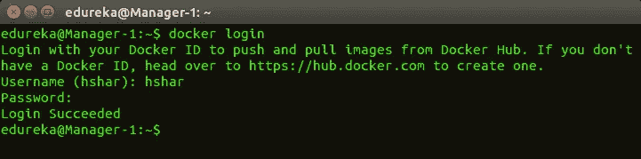

# 11.**对接器推动**

## **用法:docker 推送<用户名/图片名>**

该命令用于将映像推送到 docker hub 存储库

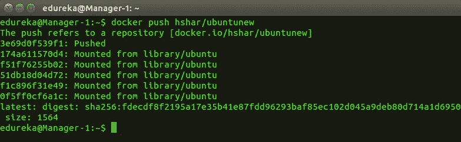

# 12. **docker 图片**

## 用途:docker 图像

该命令列出了所有本地存储的 docker 图像。

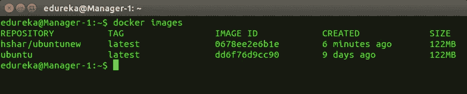

# 13.**码头工人室**

## **用途:码头工人 rm <集装箱 id>**

此命令用于删除停止的容器。

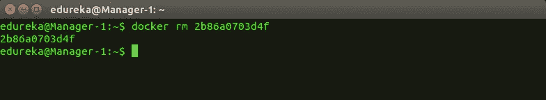

# 14.**码头工人 rmi**

## **用途:docker RMI<image-id>**

此命令用于从本地存储器中删除图像。

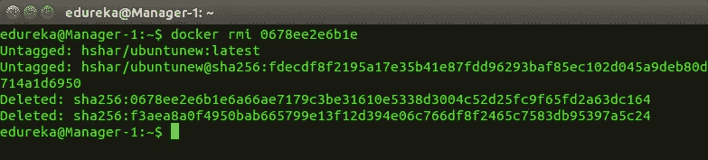

# 15.**码头工人建造**

## **用法:docker 构建<路径到 docker 文件>**

此命令用于从指定的 docker 文件构建映像。

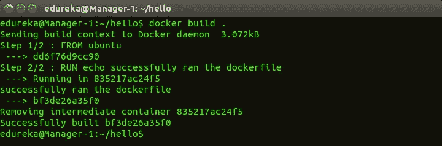

这就把我们带到了文章的结尾。如果你想查看更多关于人工智能、Python、道德黑客等市场最热门技术的文章，你可以参考 [Edureka 的官方网站。](https://www.edureka.co/blog/?utm_source=medium&utm_medium=content-link&utm_campaign=docker-commands)

请留意本系列中的其他文章，它们将解释 DevOps 的各个方面。

> *1。* [*DevOps 教程*](/edureka/devops-tutorial-89363dac9d3f)
> 
> *2。* [*Git 教程*](/edureka/git-tutorial-da652b566ece)
> 
> *3。* [*詹金斯教程*](/edureka/jenkins-tutorial-68110a2b4bb3)
> 
> *4。* [*Docker 教程*](/edureka/docker-tutorial-9a6a6140d917)
> 
> *5。* [*Ansible 教程*](/edureka/ansible-tutorial-9a6794a49b23)
> 
> *6。* [*木偶教程*](/edureka/puppet-tutorial-848861e45cc2)
> 
> *7。* [*厨师教程*](/edureka/chef-tutorial-8205607f4564)
> 
> *8。* [*Nagios 教程*](/edureka/nagios-tutorial-e63e2a744cc8)
> 
> *9。* [*如何编排 DevOps 工具？*](/edureka/devops-tools-56e7d68994af)
> 
> *10。* [*连续交货*](/edureka/continuous-delivery-5ca2358aedd8)
> 
> *11。* [*持续集成*](/edureka/continuous-integration-615325cfeeac)
> 
> *12。* [*连续部署*](/edureka/continuous-deployment-b03df3e3c44c)
> 
> *13。* [*持续交付 vs 持续部署*](/edureka/continuous-delivery-vs-continuous-deployment-5375642865a)
> 
> *14。* [*CI CD 管道*](/edureka/ci-cd-pipeline-5508227b19ca)
> 
> *15。* [*Docker 构*](/edureka/docker-compose-containerizing-mean-stack-application-e4516a3c8c89)
> 
> 16。 [*码头工人群*](/edureka/docker-swarm-cluster-of-docker-engines-for-high-availability-40d9662a8df1)
> 
> 17。 [*Docker 联网*](/edureka/docker-networking-1a7d65e89013)
> 
> 18。
> 
> **19。**
> 
> **20。[*Ansible for AWS*](/edureka/ansible-for-aws-provision-ec2-instance-9308b49daed9)**
> 
> ***21。* [*詹金斯管道*](/edureka/jenkins-pipeline-tutorial-continuous-delivery-75a86936bc92)**
> 
> ***二十二。* [*顶级 Git 命令*](/edureka/git-commands-with-example-7c5a555d14c)**
> 
> ***23。*[*Git vs GitHub*](/edureka/git-vs-github-67c511d09d3e)**
> 
> ***24。* [*DevOps 面试问题*](/edureka/devops-interview-questions-e91a4e6ecbf3)**
> 
> ***25。* [*谁是 DevOps 工程师？*](/edureka/devops-engineer-role-481567822e06)**
> 
> ***26。* [*DevOps 生命周期*](/edureka/devops-lifecycle-8412a213a654)**
> 
> ***27。*[*Git ref log*](/edureka/git-reflog-dc05158c1217)**
> 
> ***28。***
> 
> ****29。* [*组织正在寻找的顶尖 DevOps 技能*](/edureka/devops-skills-f6a7614ac1c7)***
> 
> **三十。 [*瀑布 vs 敏捷*](/edureka/waterfall-vs-agile-991b14509fe8)**
> 
> ***31。* [*Maven 用于构建 Java 应用*](/edureka/maven-tutorial-2e87a4669faf)**
> 
> ***32。* [*詹金斯小抄*](/edureka/jenkins-cheat-sheet-e0f7e25558a3)**
> 
> ***33。* [*Ansible 备忘单*](/edureka/ansible-cheat-sheet-guide-5fe615ad65c0)**
> 
> ***34。* [*Ansible 面试问答*](/edureka/ansible-interview-questions-adf8750be54)**
> 
> **35。 [*50 码头工人面试问题*](/edureka/docker-interview-questions-da0010bedb75)**
> 
> **36。 [*敏捷方法论*](/edureka/what-is-agile-methodology-fe8ad9f0da2f)**
> 
> ***37。* [*詹金斯面试问题*](/edureka/jenkins-interview-questions-7bb54bc8c679)**
> 
> ***38。* [*Git 面试问题*](/edureka/git-interview-questions-32fb0f618565)**
> 
> **39。 [*Docker 架构*](/edureka/docker-architecture-be79628e076e)**
> 
> **40。[*devo PS 中使用的 Linux 命令*](/edureka/linux-commands-in-devops-73b5a2bcd007)**
> 
> **41。 [*詹金斯 vs 竹子*](/edureka/jenkins-vs-bamboo-782c6b775cd5)**
> 
> ***42。* [*Nagios 面试问题*](/edureka/nagios-interview-questions-f3719926cc67)**
> 
> ***43。* [*DevOps 实时场景*](/edureka/jenkins-x-d87c0271af57)**
> 
> ***44。* [*詹金斯和詹金斯 X*](/edureka/jenkins-vs-bamboo-782c6b775cd5) 的区别**
> 
> ***45。*[*Windows Docker*](/edureka/docker-for-windows-ed971362c1ec)**
> 
> ***46。*[*Git vs Github*](http://git%20vs%20github/)**

***原载于 2017 年 11 月 14 日*[*https://www.edureka.co*](https://www.edureka.co/blog/docker-commands/)*。***