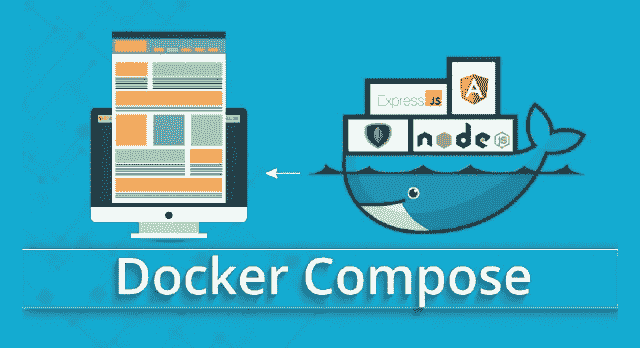
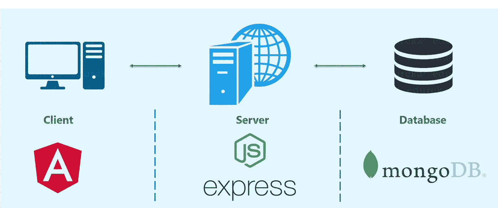
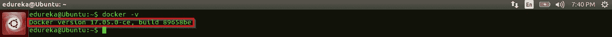
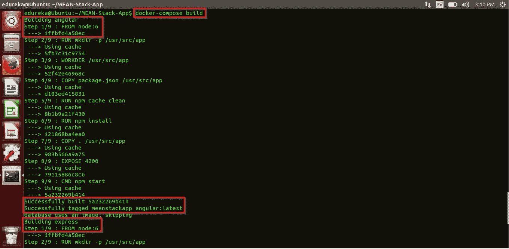
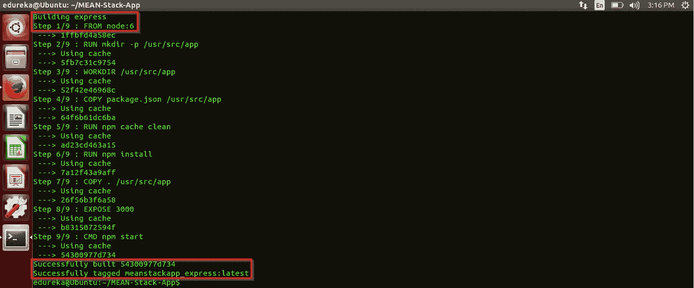
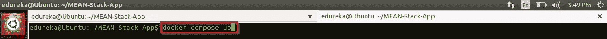
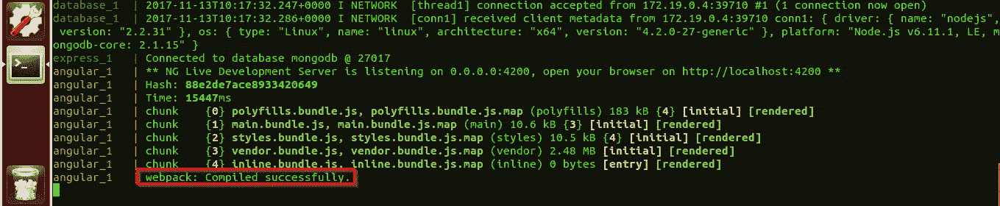

# 用于集装箱化平均堆栈应用 Docker 组合器

> 原文：<https://medium.com/edureka/docker-compose-containerizing-mean-stack-application-e4516a3c8c89?source=collection_archive---------1----------------------->



Docker Compose - Edureka

在之前关于 Docker 的博客中，你可能已经了解了什么是 Docker 图像、Docker 容器以及对它们的需求。如果你没有读过它们，那么我请求你在继续 Docker Compose 上的这篇博客之前，先读一读*什么是 Docker* 。

在探索了 Docker 带来的可能性之后，了解更多当然是非常令人兴奋的。不是吗？好吧，至少我遇到挑战的时候是这样。

# Docker 撰写简介

对我来说，将单个服务应用程序容器化很容易。但是，当我必须将多种服务封装到不同的容器中时，我遇到了障碍。我的要求是容器化和托管一个普通的堆栈应用程序。

是的，你没看错。全栈应用。最初，我认为这是不可能的。但是在我听说 Docker Compose 之后，我知道我所有的问题都会得到解决。

Docker Compose 可以用来为一个 MEAN stack 应用程序中的每个堆栈创建单独的容器(并托管它们)。MEAN 是 MongoDB Express Angular & NodeJs 的首字母缩写。我将在这个博客中展示的演示也是关于同一主题的。

通过使用 Docker Compose，我们可以在同一台主机上的不同容器中托管这些技术，并让它们相互通信。每个容器将暴露一个用于与其他容器通信的端口。

这些容器的通信和正常运行时间将由 Docker Compose 维护。

所以你可能会问，如何建立整个基础设施？那么，让我给你更详细的解释。

# Dockerfile 文件

类似于我们如何通过编写 dockerfile 来旋转任何单个应用程序容器，我们将不得不为构建每个单个容器应用程序编写单独的 dockerfile。此外，我们还必须编写一个 Docker Compose 文件来完成实际工作。Docker 合成文件将执行不同的 docker 文件来创建不同的容器，并让它们彼此交互。

在我们的例子中，我们有一个完整的堆栈应用程序，由 MongoDB、ExpressJS、Angular 和 NodeJS 组成。MongoDB 负责后端数据库，NodeJS 和 ExpressJS 负责服务器端渲染，Angular 负责前端。



由于有三个组件，我们必须为每个组件旋转容器。我们必须按照以下方式旋转容器:

1.  容器 1 —角形
2.  容器 2 — NodeJS 和 ExpressJS
3.  容器 3 — MongoDB

# 创建 Docker 容器

作为对 mean 应用程序进行 dockerize 化的第一步，让我们从 Angular 的容器开始，为构建每个组件编写 dockerfile。这个 docker 文件必须与“package.json”文件一起存在于项目目录中。“package.json”包含关于“NPM”需要使用哪个版本的依赖项来构建 angular 应用程序的详细信息。

## 1.前端的 docker 文件

```
FROM node:6
RUN mkdir -p /usr/src/app
WORKDIR /usr/src/app
COPY package.json /usr/src/app
RUN npm cache clean
RUN npm install
COPY . /usr/src/app
EXPOSE 4200
CMD ["npm","start"]
```

和往常一样， ***我们的第一个命令是拉一个基础映像*** ，我们正在拉一个基础‘节点:6’映像。

***接下来的两个命令是关于在 Docker 容器内创建一个新的目录*** '/usr/src/app '，用于存储角度代码，并使其成为容器内的工作目录。

然后我们 ***将‘package . JSON’文件*** 从我们的项目目录复制到容器内部。

然后我们 ***运行“npm 缓存清理”命令*** ，清理 npm 缓存。

之后，我们 ***运行“npm 安装”命令*** ，开始下载托管 Angular 应用程序所需的样板文件。它开始根据“package.json”中指定的依赖项版本下载样板文件。

接下来的' ***RUN*** '命令运行是将项目目录下的所有代码、文件夹复制到容器内。

上面的 ***命令要求容器暴露端口号 4200*** 用于与后端服务器通信，以发送用户通过 Web UI 访问前端客户端所发出的请求。

最后，最后一个命令是，' ***运行*** '命令启动' ***npm*** '。这将开始执行构建 Angular 应用程序的代码。

Angular 应用程序现在已经准备好了，但是由于它依赖于后端服务器和数据库，所以不能被正确托管。所以让我们更进一步，编写一个 dockerfile 来容器化后端服务器。

## 2.后端的 docker 文件

甚至这个 dockerfile 文件也会出现在项目目录中。该目录还将包含' ***package.json*** '文件，用于定义 Express server 的依赖关系和 NodeJS 的其他要求。但最重要的是，它包含了支持后端服务器的项目代码。

```
FROM node:6
RUN mkdir -p /usr/src/app
WORKDIR /usr/src/app
COPY package.json /usr/src/app
RUN npm cache clean
RUN npm install
COPY . /usr/src/app
EXPOSE 3000
CMD ["npm","start"]
```

如您所见，这两个 docker 文件有很多相似之处。我们使用相同的' ***节点:6*** '作为基础图像层，在容器内创建一个新目录，使其成为工作目录，并运行' ***npm install*** '等命令。但是唯一的区别是用于通信的端口号。在这种情况下， ***端口号 3000*** 被定义。这是服务器将被托管的地方，并且将寻找来自客户端的请求。

## 3.数据库ˌ资料库

你可能想知道为什么我没有在标题中提到' **dockerfile** For Database '。原因是，我们实际上不需要进行定制。我们可以直接提取一个“MongoDB”基础映像来存储我们的数据，只需公开可以访问它的端口号。

现在你脑海中的问题是，我在哪里做呢？好吧，我们可以在 Docker 撰写文件中这样做。

# Docker 合成文件

Docker Compose 文件是一个 YAML 文件，包含有关服务、网络和卷的详细信息，用于设置 Docker 应用程序。

运行下面的命令来查找您的 Docker 引擎的版本。

```
docker -v
```

执行该命令将返回在您的主机上运行的版本。根据您主机上的 Docker 引擎版本，下载适当版本的 Docker Compose。你可以从 *Docker 的官方文档*中寻找合适的版本下载。



由于我运行的是 Docker 引擎版本 17.05.0-ce，所以我使用了 Docker Compose 版本 3。

# 安装 Docker 撰写

要下载 Compose，请运行下面的命令集。

```
sudo curl -L https://github.com/docker/compose/releases/download/1.16.1/docker-compose-`uname -s`-`uname -m` -o /usr/local/bin/docker-compose
sudo chmod +x /usr/local/bin/docker-compose
```

请注意，命令中的版本号将根据您运行的 Docker 引擎版本而变化。

以下是我的 Docker 编写文件的一部分命令。

```
version: '3.0' # specify docker-compose version

# Define the services/ containers to be run
services:
 angular: # name of the first service
  build: angular-app # specify the directory of the Dockerfile
  ports:
  - "4200:4200" # specify port mapping

 express: # name of the second service
  build: express-server # specify the directory of the Dockerfile
  ports:
  - "3000:3000" #specify ports mapping
  links:
  - database # link this service to the database service

 database: # name of the third service
  image: mongo # specify image to build container from
  ports:
  - "27017:27017" # specify port forwarding
```

我很确定上面文件中的命令对你来说毫无意义。所以，让我们来解决这个问题。

在第一行代码中，我已经定义了我正在使用的 Docker Compose 的版本。如果希望 Compose 正常工作而不抛出任何错误，这是非常重要的一步。确保根据您的 Docker 引擎版本下载 Docker Compose 版本。

之后，我使用关键字“服务”定义了三个容器。这些服务指的是我的堆栈的三个组件，前端、后端和数据库。因此，在这种情况下，我的容器的名称将是我的服务的名称，即' angular '，' express '和' database '。

关键字“build”用于指示用于旋转该容器的 docker 文件存在于该目录中。等等，你怎么糊涂了？

很简单。需要在' ***构建:*** 之后指定路径。在我们的例子中，' ***angular-app*** 和'***express-server***'是两个目录的路径，可以从 Docker 合成文件所在的目录访问这两个目录。对于我们的数据库容器，我只是说使用一个基本的' ***image: mongo*** '而不是 dockerfile 的路径。

对于这些服务中的每一个，我还指定了端口号，这些端口号可用于接收/发送来自其他容器(服务)的请求。angular 的 4200，express 的 3000，mongo 的 27017。

此外，express 容器有一个到数据库容器的“link:”链接，表明服务器端接收到的任何数据都将被发送到数据库并存储在那里。

现在，我们终于完成了构建。要启动 Docker Compose 并使用三个服务旋转三个容器，我们只需从 Docker Compose 文件(YAML 文件)所在的目录中执行以下两个命令:

```
docker-compose build
docker-compose up
```

'***docker-compose build***'命令用于构建/重建服务，而' ***docker-compose up*** '命令用于创建/启动容器。去吧！你自己试试。

下面是 Docker 映像被构建和执行的截图。您可以注意到，角度图像正在建立，然后用名称标记为“angular:latest”。



此外，Express 的图像是用名称和标签构建的，如' ***express:latest*** '。



现在映像已经构建好了，让我们试着运行它，从而在这个过程中旋转一个容器。下面是那个截图。



下面是显示“webpack:编译成功”的截图，这意味着这三个服务被 Docker 成功地容器化了。



现在容器已经托管，您可以看到服务在它们各自的端口上是活动的。在您的网络浏览器中键入以下端口号，与 MEAN 应用程序的 GUI 进行交互。

> localhost:4200 — *Angular App(前端)* localhost:3000—*Express Server&NodeJS(后端/服务器端)* localhost:27017—MongoDB(数据库)

印象深刻吗？等等，因为 Docker 还没做好！我们可以使用“docker-compose scale='x '”命令来轻松地增加/减少部署的数量。换句话说，我们可以为一个服务创建那么多容器。以下是将特定服务扩展到“5”个容器的完整命令:

```
docker-compose scale=5
```

如此轻松地扩展服务，以如此经济高效的方式包装和打包服务，使 Docker 成为最好的部署工具之一，也是我个人的最爱。

如果你想查看更多关于人工智能、Python、道德黑客等市场最热门技术的文章，你可以参考 Edureka 的官方网站。

请留意本系列中的其他文章，它们将解释 DevOps 的各个方面。

> *1。* [*DevOps 教程*](/edureka/devops-tutorial-89363dac9d3f)
> 
> *2。* [*饭桶教程*](/edureka/git-tutorial-da652b566ece)
> 
> *3。* [*詹金斯教程*](/edureka/jenkins-tutorial-68110a2b4bb3)
> 
> *4。* [*码头工人教程*](/edureka/docker-tutorial-9a6a6140d917)
> 
> *5。* [*Ansible 教程*](/edureka/ansible-tutorial-9a6794a49b23)
> 
> *6。* [*木偶教程*](/edureka/puppet-tutorial-848861e45cc2)
> 
> *7。* [*厨师教程*](/edureka/chef-tutorial-8205607f4564)
> 
> 8。 [*Nagios 教程*](/edureka/nagios-tutorial-e63e2a744cc8)
> 
> *9。* [*如何编排 DevOps 工具？*](/edureka/devops-tools-56e7d68994af)
> 
> *10。* [*连续交货*](/edureka/continuous-delivery-5ca2358aedd8)
> 
> *11。* [*持续集成*](/edureka/continuous-integration-615325cfeeac)
> 
> *12。* [*连续部署*](/edureka/continuous-deployment-b03df3e3c44c)
> 
> *13。* [*持续交付 vs 持续部署*](/edureka/continuous-delivery-vs-continuous-deployment-5375642865a)
> 
> *14。* [*CI CD 管道*](/edureka/ci-cd-pipeline-5508227b19ca)
> 
> *15。* [*码头工人群*](/edureka/docker-swarm-cluster-of-docker-engines-for-high-availability-40d9662a8df1)
> 
> *16。* [*Docker 联网*](/edureka/docker-networking-1a7d65e89013)
> 
> *17。* [*可担任的角色*](/edureka/ansible-roles-78d48578aca1)
> 
> *18。*[](/edureka/ansible-vault-secure-secrets-f5c322779c77)
> 
> **19。* [*适用于 AWS*](/edureka/ansible-for-aws-provision-ec2-instance-9308b49daed9)*
> 
> **20。* [*詹金斯管道*](/edureka/jenkins-pipeline-tutorial-continuous-delivery-75a86936bc92)*
> 
> **21。* [*Top Git 命令*](/edureka/git-commands-with-example-7c5a555d14c)*
> 
> **22。* [*顶级 Docker 命令*](/edureka/docker-commands-29f7551498a8)*
> 
> **23。* [*Git vs GitHub*](/edureka/git-vs-github-67c511d09d3e)*
> 
> *24。 [*DevOps 面试问题*](/edureka/devops-interview-questions-e91a4e6ecbf3)*
> 
> **25。* [*谁是 DevOps 工程师？*](/edureka/devops-engineer-role-481567822e06)*
> 
> **26。* [*DevOps 生命周期*](/edureka/devops-lifecycle-8412a213a654)*
> 
> *27。[*Git Reflog*](/edureka/git-reflog-dc05158c1217)*
> 
> **二十八。* [*不可预见的准备*](/edureka/ansible-provisioning-setting-up-lamp-stack-d8549b38dc59)*
> 
> **29。* [*组织正在寻找的顶尖 DevOps 技能*](/edureka/devops-skills-f6a7614ac1c7)*
> 
> **30。* [*瀑布 vs 敏捷*](/edureka/waterfall-vs-agile-991b14509fe8)*
> 
> **31。* [*Maven 用于构建 Java 应用*](/edureka/maven-tutorial-2e87a4669faf)*
> 
> **32。* [*詹金斯小抄*](/edureka/jenkins-cheat-sheet-e0f7e25558a3)*
> 
> **33。* [*Ansible 备忘单*](/edureka/ansible-cheat-sheet-guide-5fe615ad65c0)*
> 
> **34。* [*Ansible 面试问答*](/edureka/ansible-interview-questions-adf8750be54)*
> 
> **35。* [*50 码头工人面试问题*](/edureka/docker-interview-questions-da0010bedb75)*
> 
> **36。* [*敏捷方法论*](/edureka/what-is-agile-methodology-fe8ad9f0da2f)*
> 
> **37。* [*詹金斯面试问题*](/edureka/jenkins-interview-questions-7bb54bc8c679)*
> 
> **38。* [*Git 面试问题*](/edureka/git-interview-questions-32fb0f618565)*
> 
> **39。* [*Docker 架构*](/edureka/docker-architecture-be79628e076e)*
> 
> **40。*[*devo PS 中使用的 Linux 命令*](/edureka/linux-commands-in-devops-73b5a2bcd007)*
> 
> **41。* [*詹金斯 vs 竹子*](/edureka/jenkins-vs-bamboo-782c6b775cd5)*
> 
> **42。* [*Nagios 面试题*](/edureka/nagios-interview-questions-f3719926cc67)*
> 
> *43。 [*DevOps 实时场景*](/edureka/jenkins-x-d87c0271af57)*
> 
> **44。* [*詹金斯和詹金斯 X 的区别*](/edureka/jenkins-vs-bamboo-782c6b775cd5)*
> 
> **45。*[*Windows Docker*](/edureka/docker-for-windows-ed971362c1ec)*
> 
> *46。[*Git vs Github*](http://git%20vs%20github/)*

**原载于 2017 年 11 月 18 日*[*www.edureka.co*](https://www.edureka.co/blog/docker-compose-containerizing-mean-stack-application/)*。**