# 码头集装箱化世界(基础)第 1 部分

> 原文：<https://medium.com/globant/docker-containerisation-world-basics-part-1-f5abc0b7390b?source=collection_archive---------0----------------------->

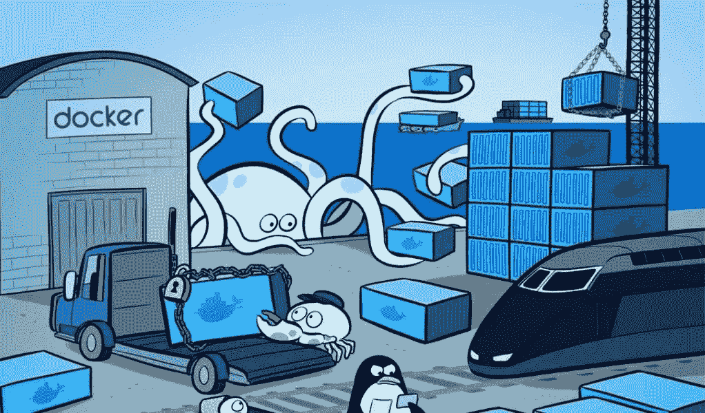

Docker Containerisation

# 什么是 Docker

Docker 是一个围绕创建和运行容器的平台或生态系统。它使安装和运行软件变得简单，而不用担心安装或依赖性。

它是一个允许用户在容器中轻松打包、分发和管理应用程序的平台。换句话说，它是一个开源项目，可以在软件容器中自动部署应用程序。

Docker 通过使用容器使创建、部署和运行应用程序变得更加容易。容器允许开发人员将应用程序与它需要的所有部分打包在一起，比如库和其他依赖项，然后作为一个包发送出去。通过这样做，开发人员可以确信应用程序可以在任何其他 Linux 机器上运行。

> **要继续使用 docker，让我们在您的系统中安装 Docker。一旦你成功安装了 docker，然后在你的终端上运行命令** `docker version` **来验证你系统中的 docker。**

# 码头内

Docker 包带有两个工具，即 Docker 客户端和 Docker 服务器。

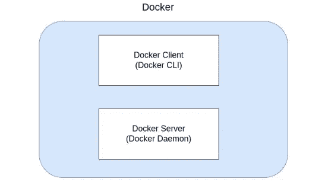

Docker Ecosystem

Docker 客户端:Docker 客户端也称为 Docker CLI，它发出命令与另一个名为 Docker 服务器工具进行交互。这发生在幕后。

**Docker Server:**Docker Server 是负责创建图片、运行容器、上传图片等的第二个工具。我们永远不会到达 Docker 服务器，因为它在后台运行。我们只处理 Docker CLI 来运行命令。

# 使用 Docker 客户端

首先，在您的终端上运行该命令。命令是`docker run hello-world`。一旦运行这个命令，您可能会注意到终端上打印的一些信息。参考下面的截图和命令。

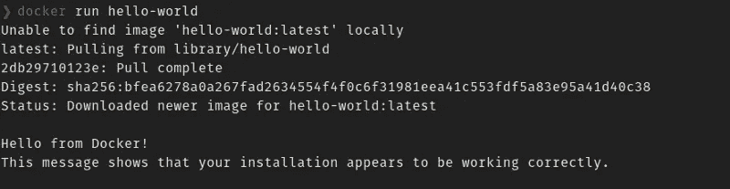

*   在上图中，您可以看到我们试图从 docker hub 安装 hello-world 映像。所以在这里你可以把图像看作软件。
*   当您运行该命令时，我们得到的第一条语句是“无法在本地找到图像 hello-world: latest”。
*   除了“码头工人你好！”。这是图像返回的默认消息，也可以说这是图像的输出。
*   现在你可能会问这里发生了什么？。让我们进入它的幕后内部工作。

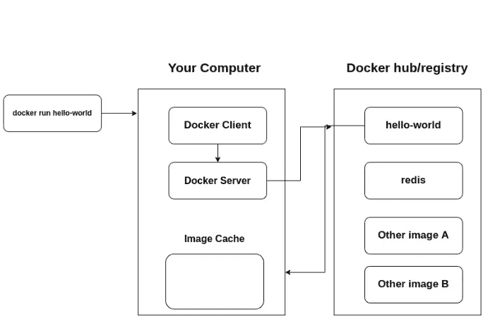

working of docker client

*   在上面的图像中，当我们对任何图像运行 docker 命令时，事情是如何在幕后运行的。
*   在这里，我们已经安装了 hello-world 映像，一旦您在终端上点击它，docker 客户端就会进入画面，它发出命令并与后台的 Docker 服务器进行交互。
*   一旦 docker 服务器从 Docker 客户端获得请求，它将检查图像缓存下的图像。如果找到，docker 服务器将从图像缓存中提取图像，否则它将在 Docker hub 或注册表中查找图像。
*   一旦图像缓存有了最初下载的图像的副本，下一次当我们对同一图像运行 docker 时，docker 服务器将从图像缓存中提取图像。
*   现在你第二次看不到“找不到图片 hello-world: latest”的消息了，因为图片已经在你机器的图片缓存下了。

# 什么是容器(深入)

容器是一个程序，它有自己独立的一组硬件和资源。所以它可以有自己的内存空间，也可以有自己的硬盘空间。映像是一个文件，包含运行程序所需的所有依赖项和配置。容器是图像的实例。意思是它运行那个程序。

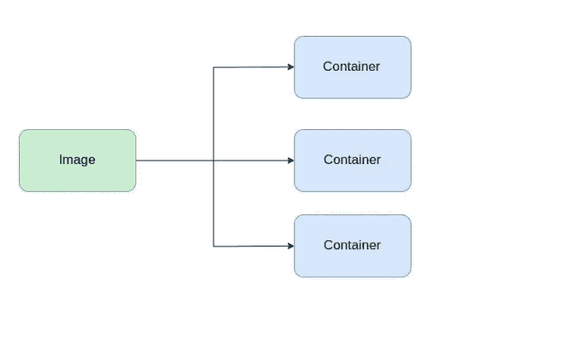

Flow of container

# 图像与容器的关系

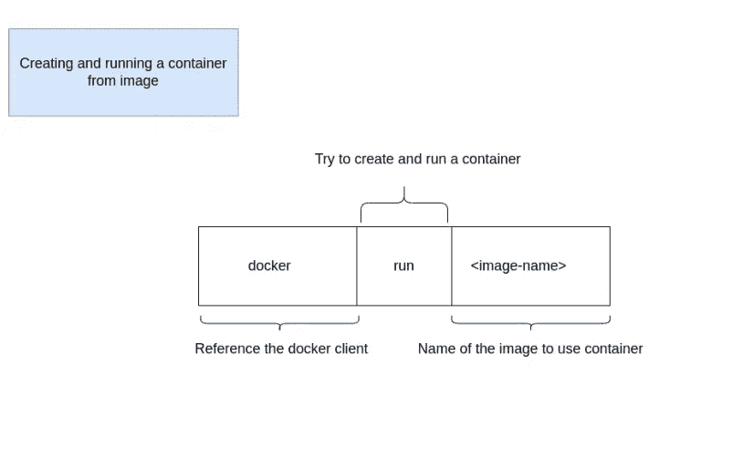

*   上图说明了我们在创建容器时使用的每个关键字的含义。让我们运行命令`docker run hello-world` **。**
*   让我们来理解当您运行上面的命令时，幕后到底发生了什么。
*   映像只不过是一个文件系统，其中包含了我们需要在系统上安装的所有程序。

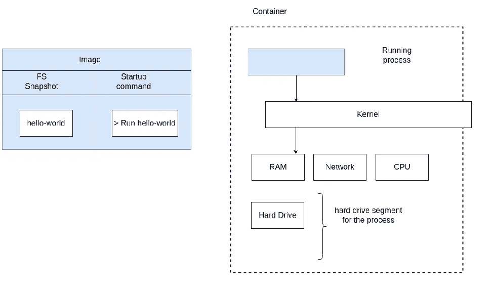

before running the command

*   在上图中，我们可以看到，在硬盘的某个地方，我们有映像，它有一个文件系统，其中有 hello-world 程序。
*   当我们运行该命令时，我们获取了该文件系统的快照，并将其粘贴到容器的硬盘驱动器中。因为每个容器都是一个独立的进程，有自己的一组资源。
*   然后我们执行了命令`run hello-world` **。**因此，运行的进程是 hello-world，它通过在终端上给出输出来立即运行和退出。

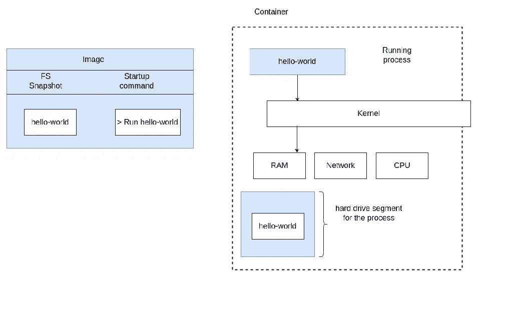

After running the command

# 容器的生命周期

*   到目前为止，我们已经看到了使用`docker run` 命令创建容器，但是我们也可以使用`docker create`命令创建容器。那么这两个主题有什么区别呢？我们来了解一下。
*   当你使用`docker create <image-name>`时，它将从提供的图片中创建一个容器，并给你一个启动它的 id。比方说，我正在使用 hello-world 映像执行 docker create 命令。

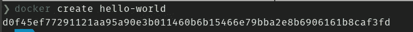

*   您可以在上面的图像中看到，我们已经创建了集装箱，它在终端上有一个打印的集装箱 id。使用这个 id，我们可以启动容器。

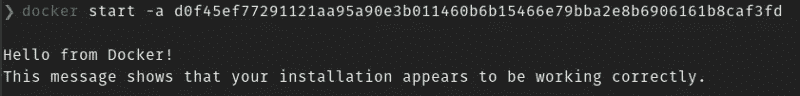

*   `-a`该命令用于显示来自容器的输出。
*   这里我们必须使用两个命令来创建和运行容器。如果有一个命令可以单独完成这两项任务呢？于是`docker run`来了**。**
*   `docker run => docker create + docker start`

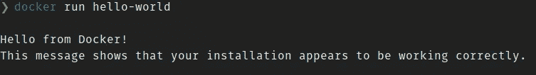

*   在上面的图像中，您可以看到 docker run 命令正在创建容器、启动容器，并且如果系统上不存在的话，从 docker 存储库中提取图像。
*   我们可以用`docker ps`命令列出正在运行的容器。还有一个命令`docker ps -a`显示了创建和退出的容器。

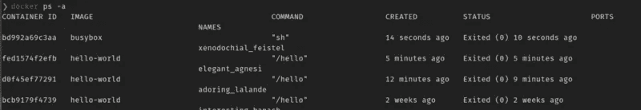

*   在上图中，您可以看到容器 id、图像、命令、名称、状态、端口等标题。
*   我们可以使用运行`docker ps -a`命令后显示的容器 id 再次启动创建的容器。
*   **命令头**就是我们在创建容器时发出的命令。现在你可能对上图中的/ `hello`命令有疑问。
*   这是 hello-world 图像的默认命令。当我们运行 docker run hello-world 时，容器和默认的启动命令`/hello` **一起被创建。**
*   这些默认命令被添加到创建的容器的启动命令中。但是我们也可以在运行过程中为容器提供其他启动命令。让我们用下面的例子来理解。
*   运行`docker run busybox echo hi there` **。**
*   这里的 busybox 是 docker hub 存储库中的官方映像。
*   上面的命令是用 echo hi 作为启动命令执行的。该命令已经为 **busybox 映像预先编程。**

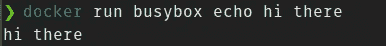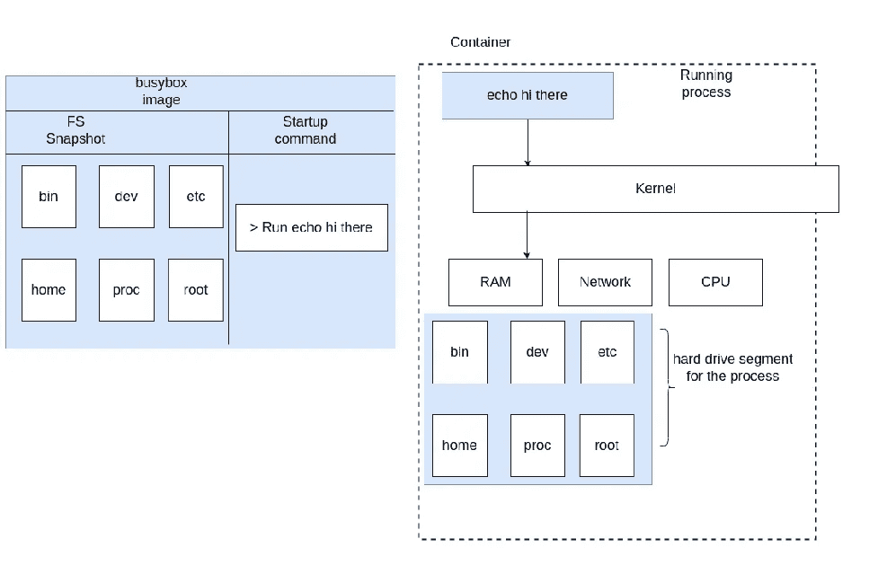

*   这是它在幕后的工作方式。它在映像 busybox 之外创建容器，并将映像的文件系统放在容器的硬盘驱动器中。并使用提供的启动命令`echo hi there` **启动容器。**
*   我们可以用`docker stop <container-id>` 命令停止容器。

# 结论

我们已经介绍了 docker 的基本概念和深入知识，以及它在我们系统中的工作方式。

在接下来的博客中，我们将学习如何在我们的项目中使用 docker 文件来实现这一点。如果你有任何疑问，请在评论区随意添加。