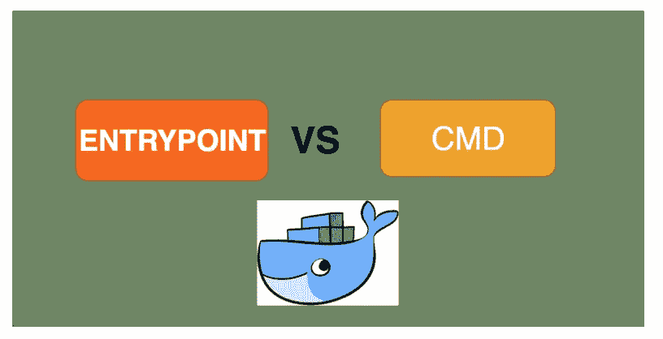

# Docker —入口点与 CMD

> 原文：<https://medium.com/bb-tutorials-and-thoughts/docker-entrypoint-vs-cmd-8934cfdf78f3?source=collection_archive---------1----------------------->



**entrypoint vs cmd**

在本文中，我们将探讨**入口点**和 **CMD** 指令之间的区别。两者都用于在实例化映像时运行可执行文件。但是，这两者之间有一点点不同。让我们来看看！

如果两者都定义了，CMD 可以将默认参数传递给 ENTRYPOINT。

复制下面这篇文章的报告。

```
git clone…
```