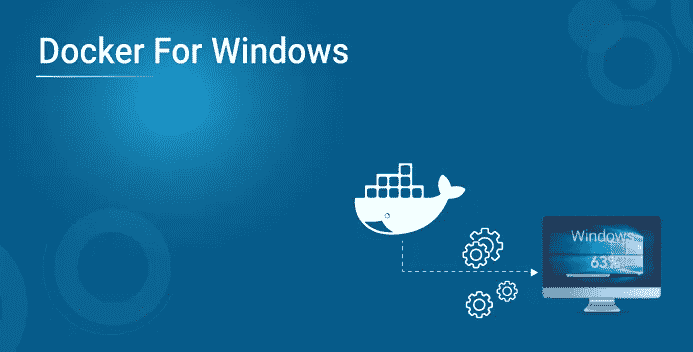
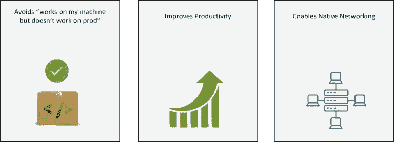
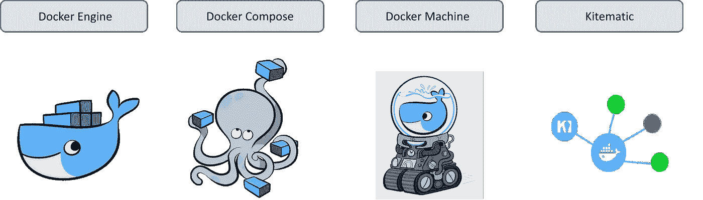
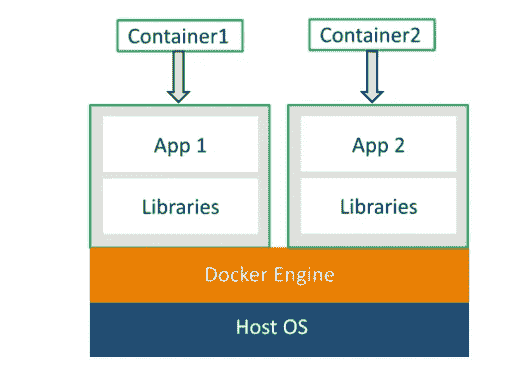
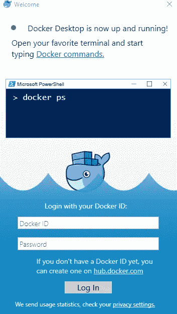
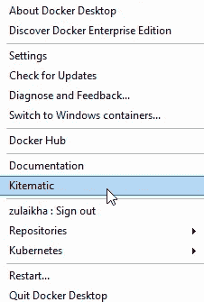
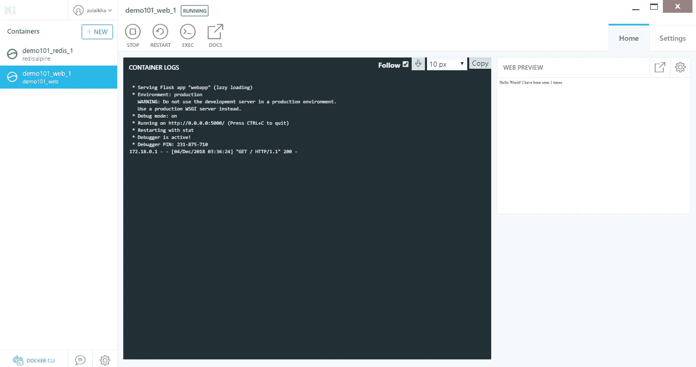
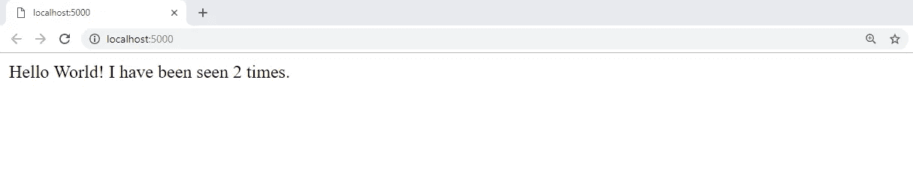

# 了解如何设置 Docker For Windows

> 原文：<https://medium.com/edureka/docker-for-windows-ed971362c1ec?source=collection_archive---------2----------------------->



如果您正在寻找简单而轻松的软件部署，Docker 是您的合适工具。它是最好的容器化平台，在这篇关于 Docker for Windows 的博客中，我们将特别关注 Docker 如何在 Windows 上工作。

我将在这个博客中讨论以下主题:

1.  为什么要用 Docker For Windows？
2.  Windows 系统必备 Docker
3.  Docker 安装的组件
4.  Docker 是什么？
5.  码头术语
6.  亲自动手

# 为什么要用 Docker for Windows？



*Why use Docker for Windows — Docker for Windows*

*   **避免在我的机器上工作，但对生产问题不起作用:**此问题是由于整个软件开发工作流程中的环境不一致而发生的。使用 Docker，您可以在包含应用程序所有依赖项的容器中运行应用程序，并且该容器可以在整个软件开发周期中运行。这种实践在整个软件开发生命周期中提供了一致的环境
*   **提高工作效率:**通过在 windows 上安装 Docker，我们可以原生运行 Docker。如果您已经关注 Docker 有一段时间了，您会知道 Docker 容器最初只支持 Linux 操作系统。但是由于最近的发布，Docker 现在可以在 windows 上本地运行，这意味着不需要 Linux 支持，相反，Docker 容器将在 Windows 内核上运行
*   **支持本地联网:**不仅 Docker 容器，而且整个 Docker 工具集现在也与 windows 兼容。这包括 Docker CLI(客户端)、Docker compose、数据卷和 Docker 化基础架构的所有其他构建模块现在都与 windows 兼容。但是这有什么好处呢？由于所有 Docker 组件都与 windows 本地兼容，它们现在可以以最小的计算开销运行。

# Windows 系统必备 Docker


*Docker for Windows — Prerequisites*

在 windows 上安装 Docker 之前，需要满足以下要求:

1.  检查您是否使用 Windows 10，无论是专业版还是企业版，64 位系统。Docker 不会在任何其他 windows 版本上运行。因此，如果你运行的是旧版本的 windows，你可以安装 Docker 工具箱。
2.  Docker for Windows 需要一个类型 1 的虚拟机管理程序，在 Windows 中，它被称为 Hyper-V。Hyper-V 基本上是一个构建在虚拟机管理程序框架之上的轻量级虚拟化解决方案。因此，您不需要虚拟设备，只需启用虚拟机管理程序。
3.  此外，您还需要在 BIOS 中启用虚拟化。现在当你安装 Docker for Windows 时，默认情况下这是启用的。但如果你在安装过程中遇到任何问题，请检查你的 Hyper-V 和虚拟化是否已启用。

# Docker 安装的组件



*Components installed with Docker — Docker for Windows*

1.  Docker 引擎:当我们说 Docker 时，我们实际上指的是 Docker 引擎。Docker 引擎包含 Docker 守护进程、用于与 Docker 守护进程交互的 REST API 以及与守护进程通信的命令行界面客户端。Docker 守护进程从 Docker 客户端接受 Docker 命令，如 Docker 运行、Docker 构建等。
2.  Docker Compose: Docker compose 用于通过使用一个命令一次运行多个 Docker 容器，这个命令就是 docker-compose up。
3.  Docker Machine: Docker machine 用于安装 Docker 引擎。它基本上就是您在本地系统上安装的内容。Docker 机器有自己的 CLI 客户机，称为 Docker 机器，还有一个 Docker 引擎客户机，称为 Docker。
4.  Kitematic: Kitematic 是一个开源项目，旨在简化 Docker 在 Windows 上的使用。它有助于自动安装 Docker，并为运行 Docker 容器提供了一个非常交互式的用户界面。

# Docker 是什么？

Docker 是一个容器化平台，它在称为 Docker 容器的容器中运行应用程序。与虚拟机相比，Docker 容器是轻量级的。当您在系统上安装虚拟机时，它会在您的主机操作系统上使用客户机操作系统。这显然会占用大量资源，如磁盘空间、RAM 等。另一方面，Docker 容器利用主机操作系统本身。



*What is Docker — Docker for Windows*

在上面的图片中，你可以看到，有一个主机操作系统，Docker 引擎安装在其上。Docker 引擎运行容器#1 和容器#2。这两种容器都有不同的应用程序，每个应用程序都有自己的库和包安装在容器中。

现在让我们来讨论一些 Docker 术语:

**Docker 图像**

Docker 映像是用于构建 Docker 映像的只读模板。Docker 图像是从名为 Dockerfile 的文件中创建的。在 docker 文件中，您定义了应用程序所需的所有依赖项和包。

**码头集装箱**

每次运行 Docker 映像时，它都作为 Docker 容器运行。因此，Docker 容器是 Docker 映像的运行时实例。

**码头工人登记处**

Docker 的注册表，称为 DockerHub，用于存储 Docker 图像。这些图像可以从远程服务器上获取，也可以在本地运行。DockerHub 允许您拥有公共/私有存储库。

**码头工人群**

Docker swarm 是一种创建和维护 Docker 引擎集群的技术。对接引擎集群包括多个相互连接的对接引擎，形成一个网络。这个 Docker 引擎网络被称为 Docker swarm。一个 Docker 管理器启动整个集群，其他 Docker 节点上运行服务。Docker 管理器的主要目标是确保应用程序或服务在这些 Docker 节点上有效运行。

**Docker 撰写**

Docker-compose 用于一次运行多个容器。假设您在 3 个不同的容器中有 3 个应用程序，并且您想一次执行它们。这就是 Docker compose 的用武之地，你可以一次在不同的容器中运行多个应用程序，只需一个命令，即 docker-compose up。

# 亲自动手

我们将从安装 Docker for windows 开始演示。但在此之前，请检查您是否满足了先决条件。

还有一点需要注意的是，由于 Docker for Windows 需要微软的 Hyper-V，一旦启用，VirtualBox 将不再能够运行虚拟机。所以你不能在同一个系统上同时运行 Docker for Windows 和 VirtualBox。

1.  从官方网站下载 Docker for Windows installer
2.  双击安装程序来运行它
3.  完成安装向导，接受许可证并继续安装
4.  安装后，打开 Docker for Windows 应用程序，等待状态栏上的鲸鱼图标变得稳定
5.  打开任何终端，如 Windows PowerShell，并开始运行 Docker



理论讲得够多了，让我们动手使用 Docker Compose 创建一个简单的 Python web 应用程序。这个应用程序使用 Flask 框架，并在 Redis 上维护一个点击计数器。

Flask 是一个 web 开发框架，用 Python 写的，Redis 是一个内存存储组件，用作数据库。您不必安装 Python 或 Redis，我们只需为 Python 和 Redis 使用 Docker 映像。

在本演示中，我们将使用 Docker compose 运行两个服务，即:

1.  网络服务
2.  Redis 服务。

应用程序是做什么的？每当你访问一个网页时，它都会维护一个点击计数器。所以每次你访问这个网站，点击数就会增加。这是一个简单的逻辑，当网页被访问时，只需增加点击计数器的值。

对于本演示，您需要创建四个文件:

1.  Python 文件
2.  Requirements.txt
3.  Dockerfile 文件
4.  Docker 合成文件

下面是使用 Flask 框架创建应用程序的 Python 文件(webapp.py ),它在 Redis 上维护一个点击计数器。

```
**import** time
**import** redis
**from** flask **import** Flask
app **=** Flask(__name__)
cache **=** redis.Redis(host**=**'redis', port**=**6379)
**def** get_hit_count():
retries **=** 5
**while** True:
**try**:
**return** cache.incr('hits')
**except** redis.exceptions.ConnectionError as exc:
**if** retries **==** 0:
**raise** exc
retries **-=** 1
time.sleep(0.5)
@app.route('/')
**def** hello():
count **=** get_hit_count()
**return** 'Hello World! I have been seen {} times.'.format(count)
**if** __name__ **==** "__main__":
app.run(host**=**"0.0.0.0", debug**=**True)
```

requirements.txt 文件具有两个依赖项的名称，即我们将在 Dockerfile 文件中安装的 Flask 和 Redis。

```
flask
redis
```

Docker 文件用于创建 Docker 图像。在这里，我正在安装 python 和 requirements.txt 文件中提到的需求。

```
FROM python:3.4-alpine ADD . /code WORKDIR /code RUN pip install -r requirements.txt CMD ["python", "webapp.py"]
```

Docker 撰写文件或 YAML 文件包含两种服务:

1.  Web 服务:在当前目录中构建 Dockerfile 文件
2.  Redis 服务:从 DockerHub 提取 Redis 图像

```
version: '3'
services:
web:
build: .
ports:
**-** "5000:5000"
redis:
image: "redis:alpine"
```

现在，您可以使用以下命令运行这两个服务或容器:

```
docker-compose up
```

要查看输出，您可以使用 Kitematic。要打开 Kitematic，右击状态栏上的鲸鱼图标。



*Kitematic — Docker for Windows*

在左上角，您可以看到两个服务正在运行。



*Kitematic — Docker for Windows*

这是输出的样子。当您刷新页面时，点击次数会增加。



说到这里，我们就到此为止了。我希望你对 Docker 在 Windows 上的工作方式有更好的了解。敬请关注更多关于最热门技术的博客。如果你想查看更多关于人工智能、Python、道德黑客等市场最热门技术的文章，你可以参考 Edureka 的官方网站。

请留意本系列中的其他文章，它们将解释 DevOps 的各个方面。

> *1。* [*DevOps 教程*](/edureka/devops-tutorial-89363dac9d3f)
> 
> *2。* [*Git 教程*](/edureka/git-tutorial-da652b566ece)
> 
> *3。* [*詹金斯教程*](/edureka/jenkins-tutorial-68110a2b4bb3)
> 
> *4。* [*码头工人教程*](/edureka/docker-tutorial-9a6a6140d917)
> 
> *5。* [*Ansible 教程*](/edureka/ansible-tutorial-9a6794a49b23)
> 
> *6。* [*木偶教程*](/edureka/puppet-tutorial-848861e45cc2)
> 
> *7。* [*厨师教程*](/edureka/chef-tutorial-8205607f4564)
> 
> *8。* [*Nagios 教程*](/edureka/nagios-tutorial-e63e2a744cc8)
> 
> *9。* [*如何编排 DevOps 工具？*](/edureka/devops-tools-56e7d68994af)
> 
> *10。* [*连续交货*](/edureka/continuous-delivery-5ca2358aedd8)
> 
> *11。* [*持续集成*](/edureka/continuous-integration-615325cfeeac)
> 
> *12。* [*连续部署*](/edureka/continuous-deployment-b03df3e3c44c)
> 
> *13。* [*持续交付 vs 持续部署*](/edureka/continuous-delivery-vs-continuous-deployment-5375642865a)
> 
> *14。* [*CI CD 管道*](/edureka/ci-cd-pipeline-5508227b19ca)
> 
> *15。* [*Docker 作曲*](/edureka/docker-compose-containerizing-mean-stack-application-e4516a3c8c89)
> 
> 16。 [*码头工人群*](/edureka/docker-swarm-cluster-of-docker-engines-for-high-availability-40d9662a8df1)
> 
> 17。 [*Docker 联网*](/edureka/docker-networking-1a7d65e89013)
> 
> 18。[](/edureka/ansible-vault-secure-secrets-f5c322779c77)
> 
> **19。*[](/edureka/ansible-roles-78d48578aca1)*
> 
> **20。[*Ansible for AWS*](/edureka/ansible-for-aws-provision-ec2-instance-9308b49daed9)**
> 
> ***21。* [*詹金斯管道*](/edureka/jenkins-pipeline-tutorial-continuous-delivery-75a86936bc92)**
> 
> ***二十二。* [*顶级 Docker 命令*](/edureka/docker-commands-29f7551498a8)**
> 
> ***23。*[*Git vs GitHub*](/edureka/git-vs-github-67c511d09d3e)**
> 
> ***24。* [*顶级 Git 命令*](/edureka/git-commands-with-example-7c5a555d14c)**
> 
> ***25。* [*DevOps 面试问题*](/edureka/devops-interview-questions-e91a4e6ecbf3)**
> 
> ***26。* [*谁是 DevOps 工程师？*](/edureka/devops-engineer-role-481567822e06)**
> 
> ***27。* [*DevOps 生命周期*](/edureka/devops-lifecycle-8412a213a654)**
> 
> ***28。*[*Git Reflog*](/edureka/git-reflog-dc05158c1217)**
> 
> ***29。* [*组织正在寻找的顶尖 DevOps 技能*](/edureka/devops-skills-f6a7614ac1c7)**
> 
> **三十。 [*瀑布 vs 敏捷*](/edureka/waterfall-vs-agile-991b14509fe8)**
> 
> ***31。* [*Maven 用于构建 Java 应用*](/edureka/maven-tutorial-2e87a4669faf)**
> 
> ***32。* [*詹金斯小抄*](/edureka/jenkins-cheat-sheet-e0f7e25558a3)**
> 
> ***33。* [*Ansible 备忘单*](/edureka/ansible-cheat-sheet-guide-5fe615ad65c0)**
> 
> ***34。* [*Ansible 面试问答*](/edureka/ansible-interview-questions-adf8750be54)**
> 
> **35。 [*50 码头工人面试问题*](/edureka/docker-interview-questions-da0010bedb75)**
> 
> **36。 [*敏捷方法论*](/edureka/what-is-agile-methodology-fe8ad9f0da2f)**
> 
> ***37。* [*詹金斯面试问题*](/edureka/jenkins-interview-questions-7bb54bc8c679)**
> 
> ***38。* [*Git 面试问题*](/edureka/git-interview-questions-32fb0f618565)**
> 
> **39。 [*Docker 架构*](/edureka/docker-architecture-be79628e076e)**
> 
> **40。[*devo PS 中使用的 Linux 命令*](/edureka/linux-commands-in-devops-73b5a2bcd007)**
> 
> **41。 [*詹金斯 vs 竹子*](/edureka/jenkins-vs-bamboo-782c6b775cd5)**
> 
> ***42。* [*Nagios 面试问题*](/edureka/nagios-interview-questions-f3719926cc67)**
> 
> ***43。* [*DevOps 实时场景*](/edureka/jenkins-x-d87c0271af57)**
> 
> ***44。* [*詹金斯和詹金斯 X*](/edureka/jenkins-vs-bamboo-782c6b775cd5) 的区别**
> 
> ***45。*[*Windows Docker*](/edureka/docker-for-windows-ed971362c1ec)**
> 
> ***46。*[*Git vs Github*](http://git%20vs%20github/)**

***原载于 2019 年 1 月 17 日*[*https://www.edureka.co*](https://www.edureka.co/blog/docker-for-windows/)*。***