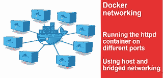

# Docker 主机和桥接网络。在不同的端口上运行库/httpd

> 原文：<https://medium.com/oracledevs/docker-host-and-bridged-networking-running-library-httpd-on-different-ports-1de81af1ae4b?source=collection_archive---------0----------------------->

Docker 提供了不同的网络选项。使用 Docker 主机网络时，您没有创建端口映射的选项。当使用像 library/httpd:2.4 这样的映像时，您没有更新它运行的端口的选项；默认情况下，它运行在端口 80 上。假设您想要使用主机联网特性，并且想要在不同的端口上运行 library/httpd:2.4，您会如何做呢？

在这篇博客中，我将解释两种机制，通过这两种机制，您可以使用主机网络在不同的端口上公开 library/httpd，以及如何使用桥接网络来做同样的事情。我将描述不同解决方案的几个特征以及连接/主机查找选项的结果。在这篇文章的最后，我会给出一些关于如何测试容器间连通性的提示。



# 使用 Docker 主机网络

## 每个端口的图像

您可以创建自己的 docker 文件并使用 ARG(参数),如下所示:

```
FROM httpd:2.4
MAINTAINER Maarten Smeets <maarten.smeets@amis.nl>LABEL nl.amis.smeetsm.httpd.name=”Apache Httpd” nl.amis.smeetsm.httpd.version=”2.4"

#COPY ./www/ /usr/local/apache2/htdocs/
ARG PORT
RUN sed -ri “s/^Listen 80/Listen $PORT/g” /usr/local/apache2/conf/httpd.conf
ENTRYPOINT [“httpd-foreground”] 
```

您可以这样构建:

```
docker build — build-arg PORT=84 -t smeetsm/httpd:2.4 .
```

像这样运行:

```
docker run -dit — network host — name my-running-app-01 smeetsm/httpd:2.4
```

这允许您构建一个在特定端口上运行的容器。这样做的缺点是，您构建的映像专门用于在单个端口上运行。如果希望容器在多个端口上运行，就需要多个映像。

```
docker build — build-arg PORT=84 -t smeetsm/httpdport84:2.4 .docker build — build-arg PORT=85 -t smeetsm/httpdport85:2.4 .docker build — build-arg PORT=86 -t smeetsm/httpdport86:2.4 .
```

像这样运行它们

```
docker run -dit — network host — name my-running-app-01 smeetsm/httpdport84:2.4docker run -dit — network host — name my-running-app-02 smeetsm/httpdport85:2.4docker run -dit — network host — name my-running-app-03 smeetsm/httpdport86:2.4 
```

您不能在多个端口上运行同一个映像。因此，您必须为每个端口创建一个映像，这可能不是您想要的。此外，用这种方式创建的容器不容易扩展。

## 在不同端口上运行的单个映像

更干净的解决方案是使用 Apache 提供的相同基础映像，并向端口提供 run 命令。您可以这样做:

```
docker run -dit — network host — name my-running-app-01 library/httpd:2.4 /bin/bash -c “sed -ri ‘s/^Listen 80/Listen 84/g’ /usr/local/apache2/conf/httpd.conf && httpd-foreground”docker run -dit — network host — name my-running-app-01 library/httpd:2.4 /bin/bash -c “sed -ri ‘s/^Listen 80/Listen 85/g’ /usr/local/apache2/conf/httpd.conf && httpd-foreground”docker run -dit — network host — name my-running-app-01 library/httpd:2.4 /bin/bash -c “sed -ri ‘s/^Listen 80/Listen 86/g’ /usr/local/apache2/conf/httpd.conf && httpd-foreground”
```

Docker run 允许您指定要运行的单个命令，并且您可以为此命令提供参数。如果希望依次运行多个命令，可以使用 bash 的-c 参数。

以上命令使用主机网络驱动程序启动指定端口(84、85、86)上的 3 个容器。这确实有局限性，如果不通过主机接口，容器就不能相互通信。它们都共享 Docker 主机主机名，因为它们直接使用 Docker 主机网络接口。有趣的是，他们可以使用自己的主机名直接访问主机上的不同端口。

例如，如果我使用主机名 ubuntu-vm 在端口 84 上运行 my-running-app-01，并且使用相同的主机名(因为使用了相同的网络接口)在端口 85 上运行 my-running-app-02，那么我可以通过访问 ubuntu-vm 或 localhost(！)端口 85。my-running-app-01 不知道 my-running-app-02 是在 Docker 容器内部运行还是直接托管在 Docker 主机上。

# Docker 桥接网络

使用桥接网络，这通常是使用 Docker 时的默认设置，您可以创建命名的桥接网络。这些命名桥接网络上的主机可以通过它们的容器名(自动 DNS)找到彼此。

桥接网络还在主机网络和容器网络之间提供了一个层。容器可以通过 NAT 接口访问其他网络资源。如果您想从主机或外部世界访问端口，您必须显式映射端口。使用桥接网络，容器内的软件可以在同一端口上运行，只有外部端口可以不同。因此，当您想要在不同的端口上运行时，不需要更新配置文件。在这种情况下，您使用相同的图像来创建不同的容器。以下示例使用默认桥接网络。容器可以通过 IP 互相访问

```
docker run -dit — name my-running-app-01 -p 84:80 library/httpd:2.4docker run -dit — name my-running-app-02 -p 85:80 library/httpd:2.4docker run -dit — name my-running-app-03 -p 86:80 library/httpd:2.4 
```

下面的例子使用了一个命名的桥接网络。容器可以通过名称相互访问。

```
docker network create — driver bridge my-netdocker run -dit — name my-running-app-01 -p 84:80 — network my-net library/httpd:2.4docker run -dit — name my-running-app-02 -p 85:80 — network my-net library/httpd:2.4docker run -dit — name my-running-app-03 -p 86:80 — network my-net library/httpd:2.4
```

# 笔记

为了测试网络连接，我使用了以下工具:

## 网络和容器

为了找出使用了哪些网络:

```
docker network lsNETWORK ID NAME DRIVER SCOPE
3457e6f0a394 bridge bridge local
43e8356475ab host host local
bffb13042787 my-net bridge local
fc4390096330 none null local
```

为了找出哪个容器连接到哪个网络以及它使用哪个 IP，我做了:

```
docker network inspect my-net"Containers": {
            "3398bb1f84504d1d5cb85a107420059dce3b617a91aef6663f526e0f7cd610b0": {
                "Name": "my-running-app-02",
                "EndpointID": "7f8191b81db6718b6f4c8091344e35a1b9641bb591025a6d5aa12699b631fbaf",
                "MacAddress": "02:42:ac:12:00:03",
                "IPv4Address": "172.18.0.3/16",
                "IPv6Address": ""
            },
            "810f87402961d79538238d07a9fb70774621b5f6363878d83884fafc89e382ed": {
                "Name": "my-running-app-01",
                "EndpointID": "5a6c99d83d4d43fec8cb7b6812f1628620f39dd13abf4caa4e5bacbf36f2707a",
                "MacAddress": "02:42:ac:12:00:02",
                "IPv4Address": "172.18.0.2/16",
                "IPv6Address": ""
            }
        }
```

以上只是输出的一部分，但确实指出了容器和 IP

## 从容器内部检查连通性

输入容器:

```
docker exec -it my-running-app-01 /bin/bash 
```

因为容器是基于 Debian 的，所以我可以使用 Apt 来安装包。

```
apt-get update && apt-get install -y telnet
```

尝试从特定容器内连接到特定容器

```
telnet my-running-app-02 80
```

如果我得到这样的回应:

```
telnet my-running-app-02 80Trying 172.18.0.3…
Connected to my-running-app-02.
Escape character is ‘^]’.
^C
```

可以建立连接。

如果我得到这样的回应

```
telnet my-running-app-02 81
Trying 172.18.0.3…
telnet: Unable to connect to remote host: Connection refused
```

我无法建立联系。上述内容表明将 my-running-app-02 解析为一个有效的 IP。

如果主机也无法解析，则异常如下:

```
telnet whatever 80
telnet: could not resolve whatever/80: Name or service not known
```

*原载于 2018 年 8 月 18 日*[*【javaoraclesoa.blogspot.com】*](https://javaoraclesoa.blogspot.com/2018/08/docker-host-and-bridged-networking.html)*。*