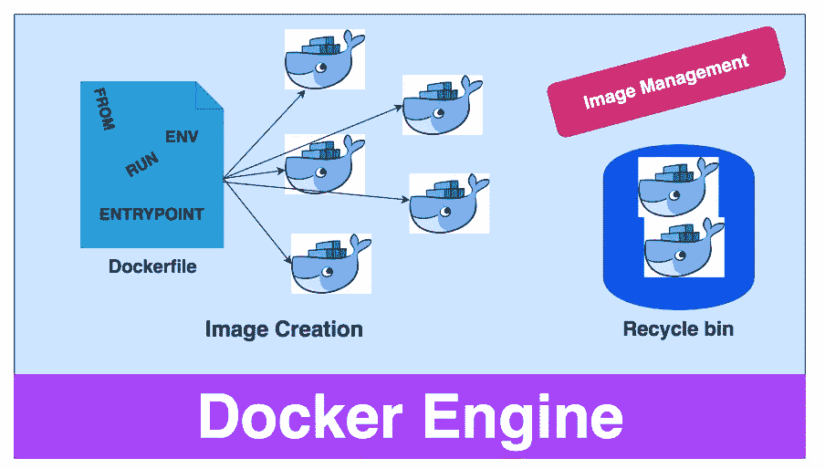

# Docker —映像创建和管理

> 原文：<https://medium.com/bb-tutorials-and-thoughts/docker-image-creation-and-management-9d91e4c277b1?source=collection_archive---------1----------------------->

**Image creation and management**

Docker 是一个开发人员可以运行、开发和部署基于容器的应用程序的平台。我们在 docker world 中有图像和容器。一个**映像**是一个可执行的包，包括运行一个应用程序所需的一切——代码、运行时、库、环境变量和配置文件。一个**容器**是映像的运行实例，这意味着你可以从一个