# 使用 Amazon ECS 在生产中运行 Docker

> 原文：<https://medium.com/edureka/docker-in-production-using-amazon-ecs-f7ec958bc196?source=collection_archive---------5----------------------->

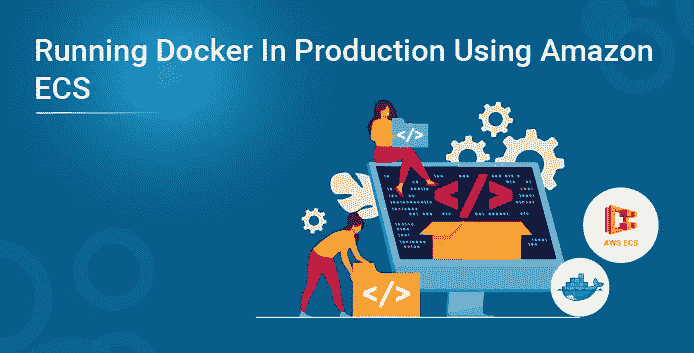

我相信你听说过最近科技行业的“Docker 炒作”。Docker 使得在任何环境下运行应用程序都变得非常容易。你知道是什么让 Docker 更加高效吗？和亚马逊的 ECS 一起使用。这篇关于 Amazon ECS 的文章详细解释了如何在使用 Amazon ECS 的生产中使用 Docker。

本文议程:

*   Docker 简介
*   亚马逊 ECS 简介
*   ECS 如何工作
*   使用 ECS 的特点和优势
*   演示:使用 Amazon ECS 在生产环境中运行 Docker 映像

# Docker 简介

Docker 是一个软件开发平台。它基于集装箱化的概念。它将应用程序及其所有依赖项包装到一个容器映像中。该容器可以部署在任何平台上运行该应用程序。因此，基本上这些应用程序运行完全相同，无论它们运行在哪里或运行在什么系统上。它使用一个名为 DockerHub 的在线云存储库来存储所有这些容器图像。

# 亚马逊 ECS 简介

既然你已经理解了 Docker，那我们就来看看 ECR 吧。作为容器服务平台的一部分，AWS 提供了亚马逊 EC2 容器注册中心(Amazon ECR)。这是一个完全托管的 docker 容器注册表。

现在您有了自己的容器，您需要的只是一个托管它们的平台。这就是 ECS 发挥作用的地方。

ECS 代表弹性集装箱服务。这是一种容器管理服务。在 ECS 集群上运行、停止或管理 Docker 容器就像在公园散步一样。您可以通过几个简单的 API 调用来启动、停止或扩展任何基于容器的应用程序。

我相信你们一定听说过微服务这个术语，它现在在技术市场上非常热门。Amazon ECS 可以让您通过在微服务模型上构建复杂的应用程序架构来创建一致的部署。

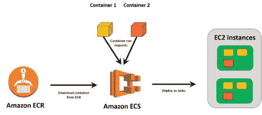

ECS 还跟踪您的实例及其资源。在上图中，有一个运行两个容器的请求。ECS 将寻找拥有运行这些容器的资源的实例，从注册中心下载容器，并相应地将它们部署到容器上。

## ECS 如何工作

现在您已经理解了理论概念，让我们更深入地了解一下 ECS 是如何工作的。让我们看一个非常常见的场景，假设您正在运行一个使用两个 docker 容器的应用程序。例如，一个容器包含实际的应用程序，另一个包含所有的依赖项。您需要这两者来成功运行应用程序。

Amazon ECS 由以下部分组成:

## 任务内容

任务定义基本上是描述用于运行应用程序的 docker 容器的蓝图。在我们的例子中，它将是两个 docker 容器、所用图像的细节、要分配的 CPU 内存、要声明和使用的环境变量、要公开的端口等。

## 工作

任务是任务定义的实例。它运行容器以及任务定义中提到的容器细节。需要时，单个类定义可以创建多个任务。

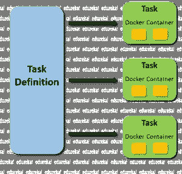

## 服务

服务定义了在任何给定点从单个任务定义运行的最小和最大任务。在我们的示例中，如果一个任务定义中有一个任务正在运行，并且 CPU 达到极限，ECS 将添加另一个任务。此时，服务将是 2，因为两个任务从一个任务定义中运行。

## ECS 容器实例和 ECS 容器代理

每个 docker 容器都将在 EC2 实例上运行。这样的 EC2 实例被称为 ECS 容器实例。

每个 ECS 容器实例都将运行一个 ECS 容器代理。该代理在实例和 ECS 之间进行通信，这有助于管理正在运行的容器，甚至添加新的容器。

## 串

我们现在有了任务定义、任务和服务。我们只需要一个平台来托管这些。这个平台就是集群。集群是一组 ECS 容器实例。一个集群可以运行许多服务。例如，您的项目中有多个应用程序，您可以在一个集群上运行其中的几个。这减少了资源的浪费，间接节省了你的钱。

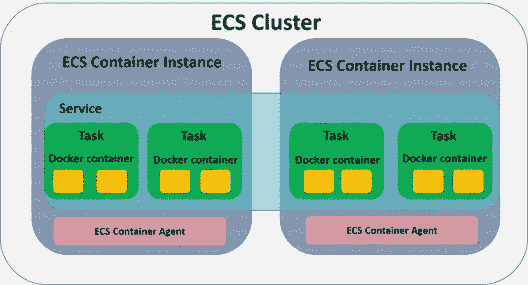

## 使用 ECS 的特点和优势

*   它允许您在一个区域内跨多个可用性区域以高可用性的方式运行应用程序容器
*   它允许您在没有基础设施管理的情况下使用容器。
*   您可以将任何东西都容器化，并让 ECS 来管理。
*   它是超级安全的，因为你可以将你的容器图像存储在 EC2 容器注册表中，这是非常安全的，因为你的图像在静止时是加密的。
*   ECS 的另一个令人惊奇的特性是，它让 IAM 角色在每个任务中保持独立，这是我非常喜欢的。对每个任务的控制访问是非常受指导的。

# 演示:使用 Amazon ECS 在生产环境中运行 Docker 映像

在这个演示中，我将向您展示如何使用 Amazon ECS 并在其上运行 docker 映像。让我们开始吧。

如果你已经有一个帐户，去亚马逊的登录页面登录。如果你没有，那就创建一个免费账户吧。这是您登录后将看到的控制台。

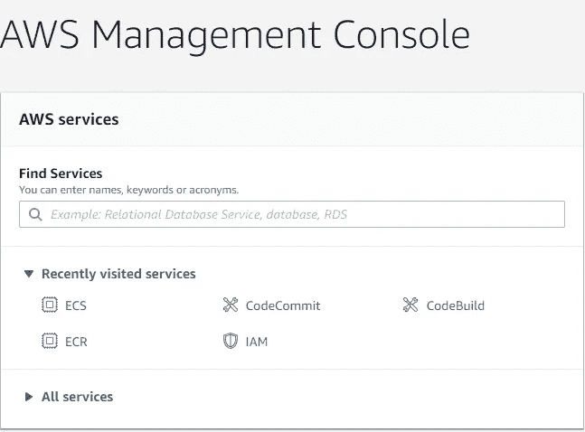

键入“ECS ”,然后单击该服务。如果您之前没有创建集群，您会看到一个**开始**按钮。继续点击**开始**。

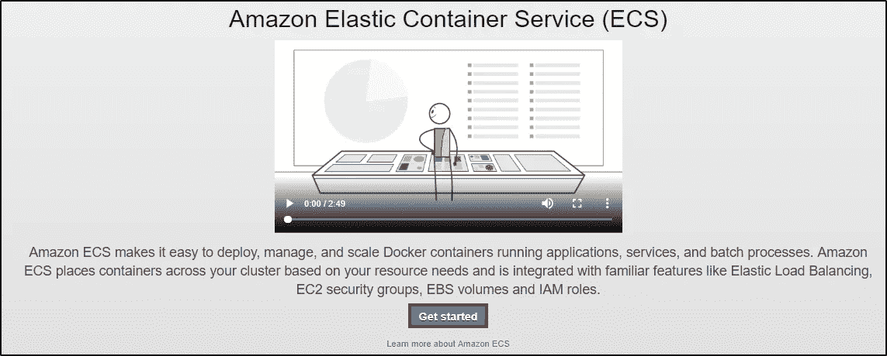

在 AWS ECS 上运行 docker 映像有 4 个主要步骤，**容器定义、任务定义、服务、集群**。

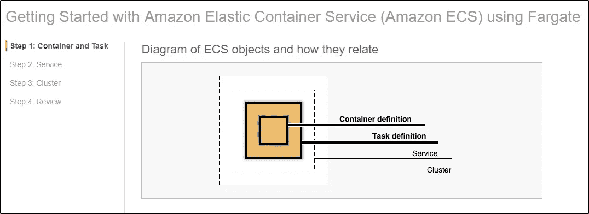

**配置容器定义:**为您的容器选择一个图像。您有 4 个选项——一个样例应用程序映像、Nginx 映像、tomcat-webserver 和一个自定义映像。

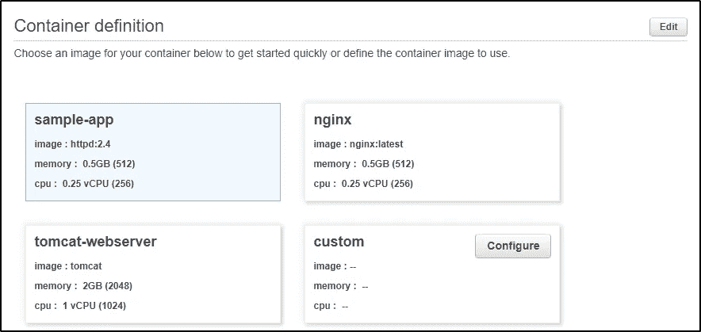

对于这个演示，我选择了 sample-app。

如果您希望更改配置，请单击右上角的编辑。

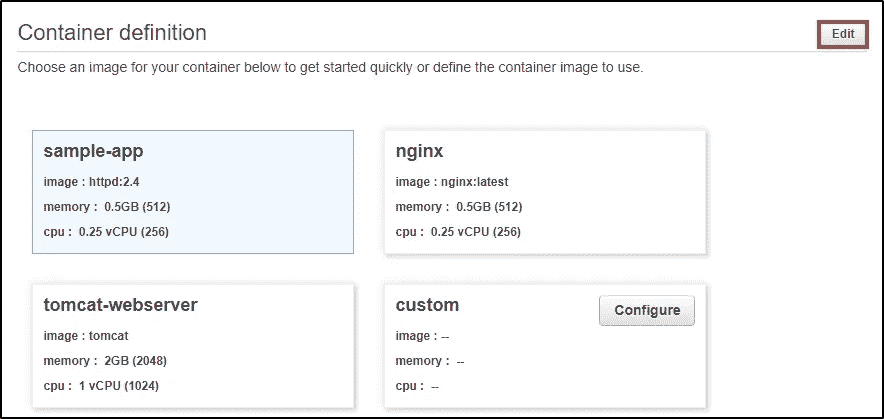

您可以编辑**容器名称、要使用的映像、内存限制、端口映射、健康检查配置、环境配置、容器超时配置、网络设置、存储和日志记录配置、资源限制、**和 **Docker 标签。**在本次演示中，我使用了所有默认配置。

**配置** **任务定义:**由**任务定义名称**、**网络模式**、**任务执行角色**、**能力**、**任务内存、**和**任务 CPU** 组成。

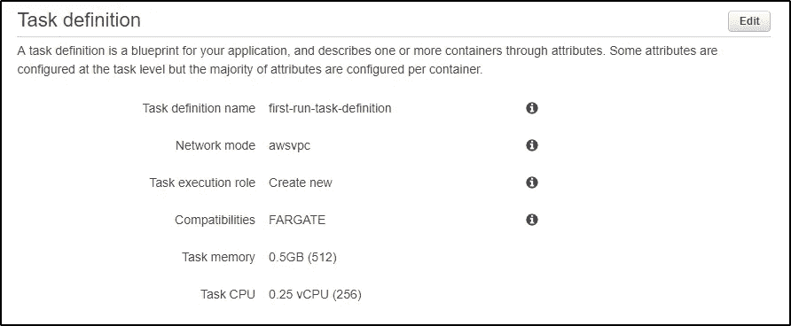

您可以点击右上角的**编辑**，根据您的需求进行配置。对于这个演示，我使用所有的默认配置。完成后，点击右下角的下一个按钮**。**

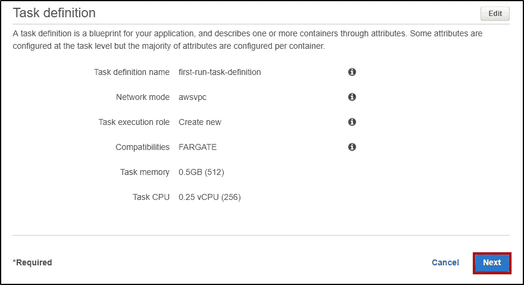

**配置服务:**您可以继续更改**服务名称、所需任务数量**、**安全组**并选择**负载均衡器类型**。对于这个演示，我没有使用负载平衡器。点击**下一步。**

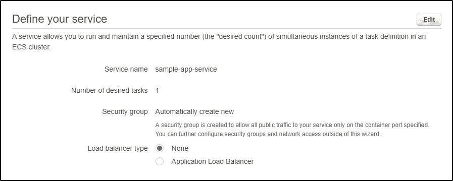

**配置集群:**通过添加一个**集群名称**来配置集群，然后单击 **Next。**

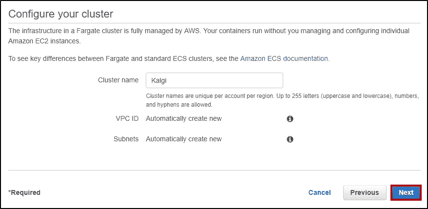

**回顾:**一旦你配置好了一切，你应该会看到类似这样的东西。

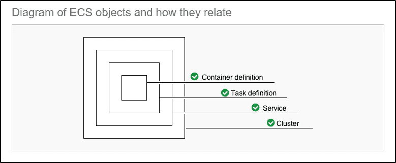

回顾一切，点击右下角的**创建**。现在将创建所有的服务。这可能需要大约 10 分钟。

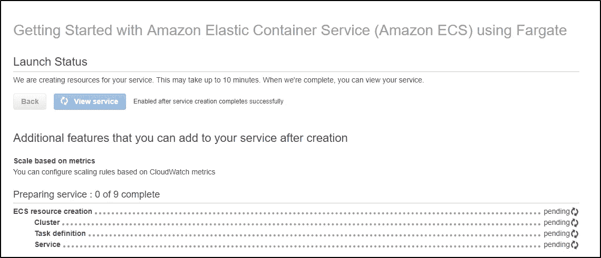

一旦一切都处于**完成**状态，点击**查看服务**

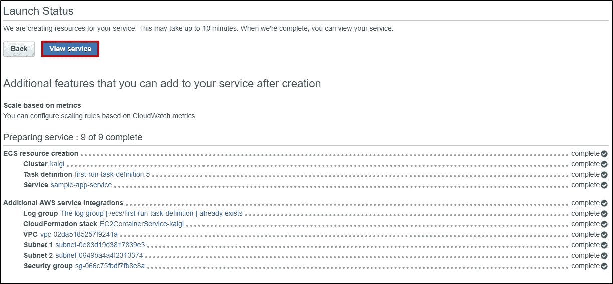

你会看到这样的东西。它将向您显示您的**集群详细信息、任务定义**和一个选项，用于**删除**和**更新**它。

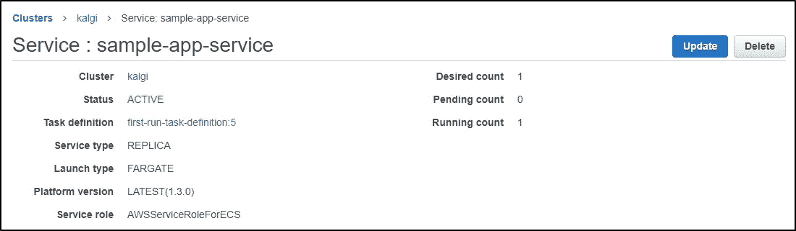

您可以查看进一步的详细信息，如 **VPC** 、**子网**、**任务**、**事件**、**自动缩放**、**部署**、**指标**、**标签**和**日志**。

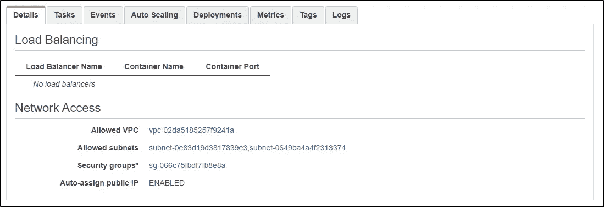

现在，点击**任务**来检查已部署的容器。

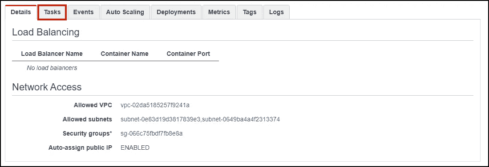

点击**任务名称**，如下图所示。

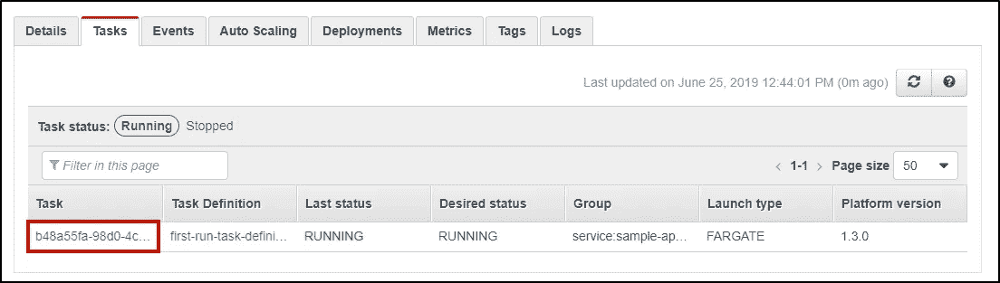

点击**网络**部分下的 **ENI Id** 。

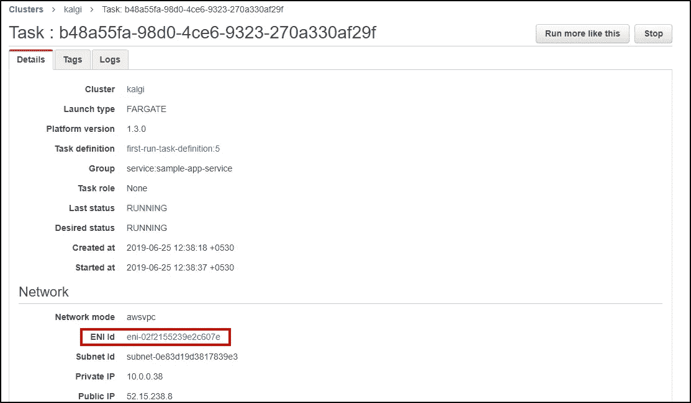

您将被带到**网络接口**页面，如下所示:

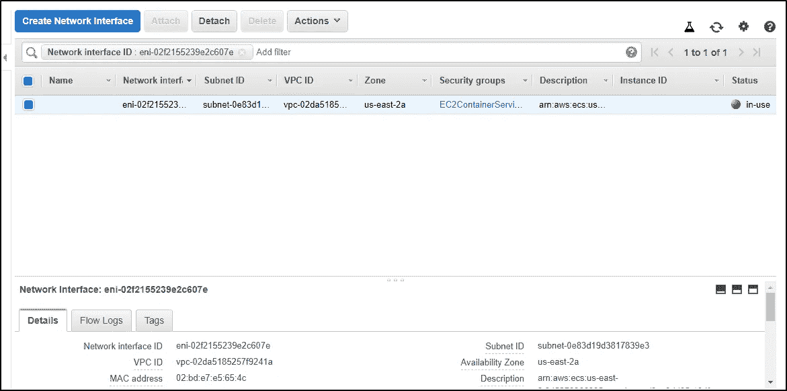

向下滚动，你会看到你的 IPV4 公共 IP。复制它。

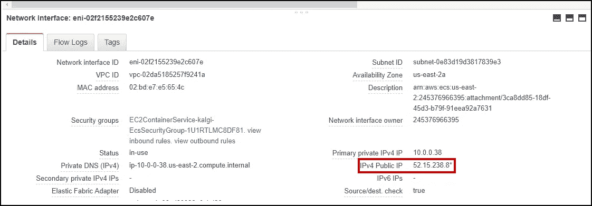

像贴网址一样贴在任何浏览器上。您将在那里看到 docker 容器输出。您将看到您的示例应用程序。

这只是一个示例应用程序。只需几个步骤，您就可以运行任何类型的应用程序或任何类型的 Docker 映像。

这就把我们带到了这篇亚马逊 ECS 文章的结尾。我希望你对 Docker 在 Windows 上的工作方式有更好的了解。敬请关注更多关于最热门技术的博客。如果你想查看更多关于人工智能、Python、道德黑客等市场最热门技术的文章，你可以参考 Edureka 的官方网站。

请留意本系列中的其他文章，它们将解释 DevOps 的各个方面。

> *1。* [*DevOps 教程*](/edureka/devops-tutorial-89363dac9d3f)
> 
> *2。* [*Git 教程*](/edureka/git-tutorial-da652b566ece)
> 
> *3。* [*詹金斯教程*](/edureka/jenkins-tutorial-68110a2b4bb3)
> 
> *4。* [*码头工人教程*](/edureka/docker-tutorial-9a6a6140d917)
> 
> *5。* [*Ansible 教程*](/edureka/ansible-tutorial-9a6794a49b23)
> 
> *6。* [*木偶教程*](/edureka/puppet-tutorial-848861e45cc2)
> 
> *7。* [*厨师教程*](/edureka/chef-tutorial-8205607f4564)
> 
> *8。* [*Nagios 教程*](/edureka/nagios-tutorial-e63e2a744cc8)
> 
> *9。* [*如何编排 DevOps 工具？*](/edureka/devops-tools-56e7d68994af)
> 
> *10。* [*连续交货*](/edureka/continuous-delivery-5ca2358aedd8)
> 
> *11。* [*持续集成*](/edureka/continuous-integration-615325cfeeac)
> 
> *12。* [*连续部署*](/edureka/continuous-deployment-b03df3e3c44c)
> 
> *13。* [*持续交付 vs 持续部署*](/edureka/continuous-delivery-vs-continuous-deployment-5375642865a)
> 
> *14。* [*CI CD 管道*](/edureka/ci-cd-pipeline-5508227b19ca)
> 
> 15。 [*Docker 撰写*](/edureka/docker-compose-containerizing-mean-stack-application-e4516a3c8c89)
> 
> *16。* [*码头工人群*](/edureka/docker-swarm-cluster-of-docker-engines-for-high-availability-40d9662a8df1)
> 
> *17。* [*码头工人联网*](/edureka/docker-networking-1a7d65e89013)
> 
> 18。 [*天穹*](/edureka/ansible-vault-secure-secrets-f5c322779c77)
> 
> 19。 [*可替代角色*](/edureka/ansible-roles-78d48578aca1)
> 
> 20。 [*适用于 AWS*](/edureka/ansible-for-aws-provision-ec2-instance-9308b49daed9)
> 
> *21。* [*詹金斯管道*](/edureka/jenkins-pipeline-tutorial-continuous-delivery-75a86936bc92)
> 
> *22。* [*顶级 Docker 命令*](/edureka/docker-commands-29f7551498a8)
> 
> *23。*[*Git vs GitHub*](/edureka/git-vs-github-67c511d09d3e)
> 
> *24。* [*顶级 Git 命令*](/edureka/git-commands-with-example-7c5a555d14c)
> 
> *25。* [*DevOps 面试问题*](/edureka/devops-interview-questions-e91a4e6ecbf3)
> 
> *26。* [*谁是 DevOps 工程师？*](/edureka/devops-engineer-role-481567822e06)
> 
> *27。* [*DevOps 生命周期*](/edureka/devops-lifecycle-8412a213a654)
> 
> *28。*[*Git Reflog*](/edureka/git-reflog-dc05158c1217)
> 
> *29。* [*组织正在寻找的顶尖 DevOps 技能*](/edureka/devops-skills-f6a7614ac1c7)
> 
> *30。* [*瀑布 vs 敏捷*](/edureka/waterfall-vs-agile-991b14509fe8)
> 
> *31。* [*Maven 用于构建 Java 应用*](/edureka/maven-tutorial-2e87a4669faf)
> 
> *32。* [*詹金斯备忘单*](/edureka/jenkins-cheat-sheet-e0f7e25558a3)
> 
> 33。
> 
> *34。 [*Ansible 面试问答*](/edureka/ansible-interview-questions-adf8750be54)*
> 
> *35。 [*50 Docker 面试问题*](/edureka/docker-interview-questions-da0010bedb75)*
> 
> **36。* [*敏捷方法论*](/edureka/what-is-agile-methodology-fe8ad9f0da2f)*
> 
> *37。 [*詹金斯面试问题*](/edureka/jenkins-interview-questions-7bb54bc8c679)*
> 
> *38。 [*Git 面试问题*](/edureka/git-interview-questions-32fb0f618565)*
> 
> *39。 [*Docker 架构*](/edureka/docker-architecture-be79628e076e)*
> 
> **40。*[*devo PS 中使用的 Linux 命令*](/edureka/linux-commands-in-devops-73b5a2bcd007)*
> 
> **41。* [*詹金斯 vs 竹子*](/edureka/jenkins-vs-bamboo-782c6b775cd5)*
> 
> **42。* [*Nagios 面试问题*](/edureka/nagios-interview-questions-f3719926cc67)*
> 
> **43。* [*DevOps 实时场景*](/edureka/jenkins-x-d87c0271af57)*
> 
> **44。* [*詹金斯和詹金斯 X 的区别*](/edureka/jenkins-vs-bamboo-782c6b775cd5)*
> 
> **45。*[*Docker for Windows*](/edureka/docker-for-windows-ed971362c1ec)*
> 
> **46。*T80*Git vs Github**

**原载于 2021 年 5 月 31 日 https://www.edureka.co***。***