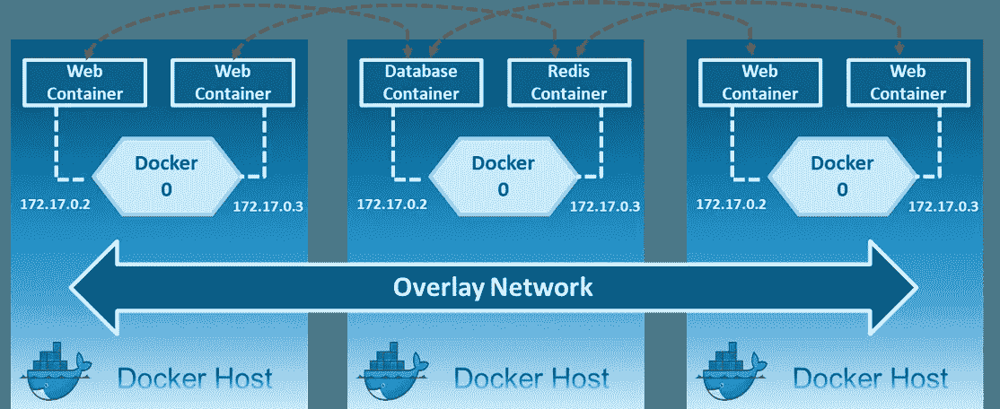
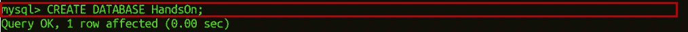

# Docker 网络——探索容器如何相互通信

> 原文：<https://medium.com/edureka/docker-networking-840c375cd93?source=collection_archive---------3----------------------->

在当今世界，企业已经变得热衷于集装箱化，这需要强大的网络技能来正确地配置集装箱架构，因此，这引入了 Docker 网络的概念。

在这篇关于 Docker Networking 的博客中，您将了解以下主题:

*   Docker 是什么？
*   Docker 中的网络
*   Docker 网络的目标
*   集装箱网络模型
*   网络驱动程序
*   亲自动手

# Docker 是什么？

要理解 Docker，您需要了解应用程序以前是如何部署的历史，以及现在如何使用容器部署应用程序。

正如您在上面的图表中看到的，旧方法在主机上有应用程序。因此，n 个应用程序共享该操作系统中的库。但是，随着容器化，操作系统将有一个内核，这是所有应用程序之间唯一通用的东西。因此，应用程序不能访问彼此的库。

因此， **Docker** 简而言之就是一个开发、运输和运行应用程序的开放平台，使用户能够借助**容器**将应用程序从基础设施中分离出来，从而快速交付软件。

那么，这些容器在各种情况下是如何相互通信的呢？

嗯，那是通过 Docker 网络。

# Docker 网络

在我深入研究 Docker 网络之前，让我向你展示一下 Docker 的工作流程。

正如你在上图中看到的。开发者在易于编写的 Docker 文件中编写规定应用需求或依赖性的代码，并且该 Docker 文件产生 Docker 图像。因此，特定应用程序所需的任何依赖关系都会出现在此映像中。

现在，Docker 容器只不过是 Docker 映像的运行时实例。这些图像被上传到 Docker Hub(Docker 图像的 Git 存储库),其中包含公共/私有存储库。

因此，从公共存储库中，你也可以提取你的图像，你可以把你自己的图像上传到 Docker Hub 上。然后，从 Docker Hub，各种团队(如质量保证或生产团队)将提取该图像并准备他们自己的容器。这些单独的容器通过网络相互通信以执行所需的操作，这就是 Docker 网络。

因此，您可以将 Docker 网络定义为一个通信通道，所有隔离的容器通过它在各种情况下相互通信，以执行所需的操作。

你认为 Docker 网络的目标是什么？

# Docker 网络的目标

**灵活性** — Docker 通过支持各种平台上任意数量的应用程序相互通信来提供灵活性。

**跨平台** —借助 Docker Swarm 集群，Docker 可以轻松地用于跨平台，跨各种服务器工作。

**可扩展性** — Docker 是一个完全分布式的网络，支持应用在确保性能的同时单独增长和扩展。

**分散式** — Docker 使用分散式网络，这使得应用程序能够分散且高度可用。如果您的资源池中突然缺少一个容器或一个主机，您可以调用额外的资源或者转移到仍然可用的服务。

**用户友好的** — Docker 使服务的自动化部署变得容易，使它们在日常生活中易于使用。

**支持** — Docker 提供开箱即用的支持。因此，使用 Docker 企业版并获得所有功能的能力非常简单明了，使得 Docker 平台非常易于使用。

为了实现上述目标，您需要一种称为容器网络模型的东西。

想探索各种 DevOps 阶段？[立即探索](https://www.edureka.co/devops)

# 集装箱网络模型(CNM)

在我告诉你到底什么是容器网络模型之前，让我简单介绍一下在你理解 CNM 之前需要用到的 Libnetwork。

Libnetwork 是一个开源的 Docker 库，它实现了构成 CNM 的所有关键概念。

因此，**容器网络模型(CNM)** 标准化了使用多个网络驱动程序为容器提供网络所需的步骤。CNM 需要像控制台这样的分布式键值存储来存储网络配置。

CNM 有 IPAM 插件和网络插件的接口。

IPAM 插件 API 用于创建/删除地址池和分配/解除分配容器 IP 地址，而网络插件 API 用于创建/删除网络和从网络添加/移除容器。

CNM 主要建立在 5 个对象上:网络控制器、驱动程序、网络、端点和沙箱。

# 集装箱网络模型对象

**网络控制器:**提供 Libnetwork 的入口点，为 Docker 引擎提供简单的 API 来分配和管理网络。由于 Libnetwork 支持多个内置和远程驱动程序，网络控制器使用户能够将特定的驱动程序连接到给定的网络。

**驱动程序:**拥有网络，并负责通过让多个驱动程序参与来管理网络，以满足各种用例及部署场景。

**网络:**提供属于同一网络并与其他网络隔离的一组端点之间的连接。因此，每当创建或更新网络时，相应的驱动程序都会收到事件通知。

**端点:**为网络中容器暴露的服务提供与网络中其他容器提供的其他服务的连接。端点代表一个服务，而不一定是一个特定的容器，端点在集群中也具有全局范围。

**沙箱:**当用户请求在网络上创建端点时创建。一个沙箱可以有多个端点连接到不同的网络，代表容器的网络配置，如 IP 地址，MAC 地址，路由，DNS。

这就是 CNM 的五个主要目标。

现在，让我告诉你 Docker 网络中涉及的各种网络驱动程序。

想让 DevOps 学习更上一层楼吗？[立即学习](https://www.edureka.co/devops)

# 网络驱动程序

主要有 5 种网络驱动程序:网桥、主机、无、覆盖、Macvlan

**网桥:**网桥网络是由主机上的 docker 创建的私有默认内部网络。因此，所有容器都有一个内部 IP 地址，并且这些容器可以使用这个内部 IP 互相访问。当您的应用程序在需要通信的独立容器中运行时，通常使用桥接网络。

**主机**:这个驱动去掉了 docker 主机和 docker 容器之间的网络隔离，直接使用主机的网络。这样，你就不能在同一个主机、同一个端口上运行多个 web 容器，因为这个端口现在是主机网络中所有容器的公共端口。

**无**:在这种网络中，容器不附属于任何网络，并且不能访问外部网络或其他容器。因此，当您想要完全禁用容器上的网络堆栈，并且仅创建环回设备时，可以使用此网络。

**覆盖**:创建一个内部私有网络，跨越所有参与群集群的节点。因此，覆盖网络促进了群服务和独立容器之间的通信，或者不同 Docker 守护进程上的两个独立容器之间的通信。

**Macvlan:** 允许您为容器分配 MAC 地址，使其在您的网络上显示为物理设备。然后，Docker 守护进程根据容器的 MAC 地址将流量路由到容器。当您希望直接连接到物理网络，而不是通过 Docker 主机的网络堆栈路由时，Macvlan 驱动程序是最佳选择。

好了，这就是理解 Docker 网络所需的全部理论。现在，让我继续向您实际展示网络是如何创建的，容器是如何相互通信的。

# 亲自动手

因此，假设你们所有人都在系统上安装了 Docker，我有一个场景要展示。

假设您想要存储课程名称和课程 ID，为此您需要一个 web 应用程序。基本上，你需要一个 web 应用程序容器，你还需要一个后端 MySQL 容器，MySQL 容器应该链接到 web 应用程序容器。

我实际执行上面的例子怎么样。

# 涉及的步骤:

*   初始化 Docker Swarm 以形成 Swarm 集群。
*   创建叠加网络
*   为 web 应用程序和 MySQL 创建服务
*   通过网络连接应用程序

我们开始吧！

**第一步:**在机器上初始化 Docker Swarm。

`docker swarm init --advertise-addr 192.168.56.101`

–advertise-addr 标志将管理中心节点配置为将其地址发布为 192.168.56.101。群中的其他节点必须能够通过 IP 地址访问管理器。

**步骤 2:** 现在，如果您想将这个管理器节点加入到工作者节点，请复制您在工作者节点上初始化 swarm 时获得的链接。

**步骤 3:** 创建叠加网络。

`docker network create -d overlay myoverlaynetwork`

其中 myoverlay 是网络名称，而-d 允许 Docker 守护进程在后台运行。

**步骤 4.1:** 创建服务 webapp1，并使用您已经创建的网络在 swarm 集群上部署该服务。

`docker service create --name webapp1 -d --network myoverlaynetwork -p 8001:80`

其中-p 表示端口转发，hshar 是 Docker Hub 上的帐户名称，webapp 是 Docker Hub 上已经存在的 web 应用程序的名称。

**步骤 4.2:** 现在，检查服务是否被创建。

`docker service ls`

**步骤 5.1:** 现在，创建一个服务 MySQL，并使用您创建的网络在 swarm 集群上部署该服务。

`docker service create --name mysql -d --network myoverlaynetwork -p 3306:3306` `hshar/mysql:5.5`

**步骤 5.2:** 现在，检查服务是否被创建。

`docker service ls`

**步骤 6.1:** 之后，检查哪个容器正在您的主节点上运行，并进入 hshar/webapp 容器。

`docker ps`

**步骤 6.2:** 所以，你可以看到 manager 节点上只有 webapp 服务。因此，进入 webapp 容器。

`docker exec -it container_id bash`

`nano var/www/html/index.php`

docker ps 命令将列出两个容器及其各自的容器 id。第二个命令将在交互模式下启用该容器。

**第 7 步:**现在，将$servername 从 localhost 更改为 mysql，将$password 从"""更改为" edureka "，同时更改所有需要填写的数据库详细信息，并使用键盘快捷键 Ctrl+x 保存您的 index.php 文件，之后使用 y 保存，并按 enter 键。

**步骤 8:** 现在，进入运行在另一个节点上的 mysql 容器。

`docker exec -it container_id bash`

**步骤 9:** 进入 mysql 容器后，输入以下命令使用 MySQL 中的数据库。

步骤 9.1: 获得使用 mysql 容器的权限。

`mysql -u root -pedureka`

其中-u 代表用户，而-p 是您的机器的密码。

**步骤 9.2:** 在 mysql 中创建一个数据库，用于从 webapp1 获取数据。

`CREATE DATABASE HandsOn;`

**步骤 9.3:** 使用创建的数据库。

`USE HandsOn;`

**步骤 9.4:** 在该数据库中创建一个表，该表将用于从 webapp1 获取数据。

`CREATE TABLE course_details (course_name VARCHAR(10), course_id VARCHAR(11));`

**步骤 9.5:** 现在，使用命令 **exit** 退出 MySQL 和 container。

**第十步:**进入你的浏览器，输入地址为**localhost:8001/index . PHP**。这将打开您的 web 应用程序。现在，输入课程的详细信息并点击**提交查询**。

**第 11 步:**单击提交查询后，转到运行 MySQL 服务的节点，然后进入容器。

`docker exec -it container_id bash`

`mysql -u root -pedureka`

`USE HandsOn;`

`SHOW tables;`

`select * from course_details;`

这将向您显示所有课程的输出，其中您已经填写了详细信息。

在这里，我结束了我的 Docker 网络博客。我希望你喜欢这篇文章。如果你想查看更多关于人工智能、DevOps、道德黑客等市场最热门技术的文章，你可以参考 Edureka 的官方网站。

请留意本系列中解释 DevOps 各个方面的其他文章。

> *1。* [*DevOps 教程*](/edureka/devops-tutorial-89363dac9d3f)
> 
> *2。* [*Git 教程*](/edureka/git-tutorial-da652b566ece)
> 
> *3。* [*詹金斯教程*](/edureka/jenkins-tutorial-68110a2b4bb3)
> 
> *4。* [*码头工人教程*](/edureka/docker-tutorial-9a6a6140d917)
> 
> *5。* [*Ansible 教程*](/edureka/ansible-tutorial-9a6794a49b23)
> 
> *6。* [*木偶教程*](/edureka/puppet-tutorial-848861e45cc2)
> 
> *7。* [*厨师教程*](/edureka/chef-tutorial-8205607f4564)
> 
> *8。* [*Nagios 教程*](/edureka/nagios-tutorial-e63e2a744cc8)
> 
> *9。* [*如何编排 DevOps 工具？*](/edureka/devops-tools-56e7d68994af)
> 
> *10。* [*连续交货*](/edureka/continuous-delivery-5ca2358aedd8)
> 
> *11。* [*持续集成*](/edureka/continuous-integration-615325cfeeac)
> 
> *12。* [*连续部署*](/edureka/continuous-deployment-b03df3e3c44c)
> 
> *13。* [*持续交付 vs 持续部署*](/edureka/continuous-delivery-vs-continuous-deployment-5375642865a)
> 
> *14。* [*CI CD 管道*](/edureka/ci-cd-pipeline-5508227b19ca)
> 
> *15。* [*Docker 作曲*](/edureka/docker-compose-containerizing-mean-stack-application-e4516a3c8c89)
> 
> *16。* [*码头工人群*](/edureka/docker-swarm-cluster-of-docker-engines-for-high-availability-40d9662a8df1)
> 
> *17。* [*码头工人联网*](/edureka/docker-networking-1a7d65e89013)
> 
> 18。
> 
> **19。* [*可能的角色*](/edureka/ansible-roles-78d48578aca1)*
> 
> *20。[*Ansible for AWS*](/edureka/ansible-for-aws-provision-ec2-instance-9308b49daed9)*
> 
> *21。 [*詹金斯管道*](/edureka/jenkins-pipeline-tutorial-continuous-delivery-75a86936bc92)*
> 
> **22。* [*顶级 Docker 命令*](/edureka/docker-commands-29f7551498a8)*
> 
> **23。*T38*Git vs GitHub**
> 
> **24。* [*顶级 Git 命令*](/edureka/git-commands-with-example-7c5a555d14c)*
> 
> **25。* [*DevOps 面试问题*](/edureka/devops-interview-questions-e91a4e6ecbf3)*
> 
> **26。* [*谁是 DevOps 工程师？*](/edureka/devops-engineer-role-481567822e06)*
> 
> **27。* [*DevOps 生命周期*](/edureka/devops-lifecycle-8412a213a654)*
> 
> **28。*[*Git Reflog*](/edureka/git-reflog-dc05158c1217)*
> 
> **29。**
> 
> ***30。* [*组织正在寻找的顶尖 DevOps 技能*](/edureka/devops-skills-f6a7614ac1c7)**
> 
> **三十。 [*瀑布 vs 敏捷*](/edureka/waterfall-vs-agile-991b14509fe8)**
> 
> ***31。* [*詹金斯小抄*](/edureka/jenkins-cheat-sheet-e0f7e25558a3)**
> 
> ***32。* [*Ansible 备忘单*](/edureka/ansible-cheat-sheet-guide-5fe615ad65c0)**
> 
> ***33。* [*Ansible 面试问答*](/edureka/ansible-interview-questions-adf8750be54)**
> 
> ***34。* [*50 码头工人面试问题*](/edureka/docker-interview-questions-da0010bedb75)**
> 
> **35。 [*敏捷方法论*](/edureka/what-is-agile-methodology-fe8ad9f0da2f)**
> 
> **36。 [*詹金斯面试问题*](/edureka/jenkins-interview-questions-7bb54bc8c679)**
> 
> ***37。* [*Git 面试问题*](/edureka/git-interview-questions-32fb0f618565)**
> 
> ***38。* [*码头工人建筑*](/edureka/docker-architecture-be79628e076e)**
> 
> **39。[*devo PS 中使用的 Linux 命令*](/edureka/linux-commands-in-devops-73b5a2bcd007)**
> 
> **40。 [*詹金斯 vs 竹子*](/edureka/jenkins-vs-bamboo-782c6b775cd5)**
> 
> **41。 [*Nagios 教程*](/edureka/nagios-tutorial-e63e2a744cc8)**
> 
> ***42。* [*Nagios 面试问题*](/edureka/nagios-interview-questions-f3719926cc67)**
> 
> ***43。* [*DevOps 实时场景*](/edureka/jenkins-x-d87c0271af57)**
> 
> ***44。* [*詹金斯和詹金斯 X*](/edureka/jenkins-vs-bamboo-782c6b775cd5) 的区别**
> 
> ***45。*[*Windows Docker*](/edureka/docker-for-windows-ed971362c1ec)**
> 
> ***46。*[*Git vs Github*](http://git%20vs%20github/)**

***原载于 2021 年 6 月 1 日 https://www.edureka.co**[*。*](https://www.edureka.co/blog/companies-using-devops/)***

*****覆盖**:创建一个内部私有网络，跨越所有参与群集群的节点。因此，覆盖网络促进了群服务和独立容器之间的通信，或者不同 Docker 守护进程上的两个独立容器之间的通信。***

*****Macvlan:** 允许您为容器分配 MAC 地址，使其在您的网络上显示为物理设备。然后，Docker 守护进程根据容器的 MAC 地址将流量路由到容器。当您希望直接连接到物理网络，而不是通过 Docker 主机的网络堆栈路由时，Macvlan 驱动程序是最佳选择。***

***好了，这就是理解 Docker 网络所需的全部理论。现在，让我继续向您实际展示网络是如何创建的，容器是如何相互通信的。***

***因此，假设你们所有人都在系统上安装了 Docker，我有一个场景要展示。***

***假设您想要存储课程名称和课程 ID，为此您需要一个 web 应用程序。基本上，你需要一个 web 应用程序容器，你还需要一个后端 MySQL 容器，MySQL 容器应该链接到 web 应用程序容器。***

***我实际执行上面的例子怎么样。***