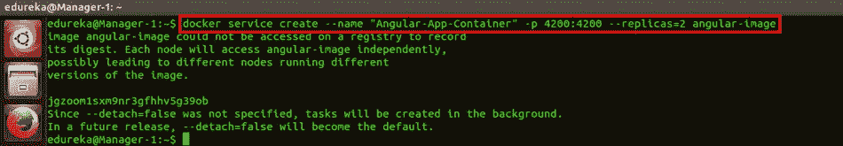

# Docker Swarm:建立一个 Docker 引擎集群以实现高可用性

> 原文：<https://medium.com/edureka/docker-swarm-cluster-of-docker-engines-for-high-availability-40d9662a8df1?source=collection_archive---------0----------------------->


Docker Swarm - Edureka

任何基于网络的应用程序最重要的特征是什么？有很多，但对我来说，**高可用性**最重要。这就是 Docker Swarm 帮助我们实现的目标！这有助于提高应用程序的可用性。

在我之前的博客中，我解释了 Docker Compose 是如何工作的。这篇关于 Docker Swarm 的博客是前者的延续，这里已经解释了使用 Docker Swarm 容器化任何多容器应用程序的好处。

在这个博客的情况下，它只是一个有角度的应用程序，将被 Docker 蜂拥而至。

> **注意**:容器化 MEAN Stack app 的方法是一样的。

# 那么，Docker Swarm 是什么？

**Docker Swarm** 是一种创建和维护集群 **Docker 引擎**的技术。**Docker 引擎可以托管在不同的节点上，当以群组模式连接时，这些位于远程位置的节点形成一个*集群*。**

# **为什么要用 Docker Swarm？**

**原因已经提到了！实现**高可用性**而不出现任何宕机是每个服务提供商的首要任务。高可用性会给客户留下深刻印象吗？如果他们面临停机，他们不会被打动。这是显而易见的。**

# **Docker Swarm 的其他优势**

**像许多其他服务一样，Docker Swarm 为我们实现了自动负载平衡。因此，当一个节点出现故障时，DevOps 工程师不需要将处理请求路由到其他节点。集群的管理器将自动为我们执行负载平衡。**

****分散访问**是另一个好处。那是什么意思？这意味着可以从管理器轻松访问所有节点。管理器还会定期提示节点，并跟踪其健康/状态，以应对停机。但是，节点不能访问或跟踪在其他节点/管理器中运行的服务。**

**您可以根据我们的要求，通过执行一个命令来检查一个节点中运行的集装箱数量，**放大**集装箱数量或**缩小**集装箱数量。**

**即使在应用程序已经部署之后，我们也可以发布**滚动更新**并确保实现 CI(持续集成)。滚动更新一个接一个地发布到一个节点，从而确保没有停机时间，并且负载在集群中的其他节点之间分布。**

**那么，接下来呢？做显而易见的事情。如果您已经使用过 Docker，或者您的组织希望将一个可靠的 web 服务容器化，那么就开始使用 Docker Swarm 吧。**

> ****注意** : Docker 引擎安装在独立的主机/服务器上，或者安装在一台主机的多个虚拟机中。**

****开始使用群体模式****

**Docker Swarm 由管理器启动，或者这么说吧，启动 Swarm 集群的实例成为管理器。启动集群的命令是:**

```
$ docker swarm init --advertise-addr ip-address
```

**这里，'**–advertise-addr**'标志用于向想要加入集群的其他节点通告自己。管理器的 IP 地址需要与标志一起指定。下面是示例截图。**

****

**当群集群被启动时，在管理者端生成一个令牌。其他节点需要使用这个令牌来加入 swarm 集群。**

**具体是怎样的？复制在管理器的 docker 引擎生成的整个令牌，将其粘贴到节点的 docker 引擎并执行它。上面截图突出显示的部分是一个令牌。当令牌在一个 worker 节点上执行时，它将看起来像下面的屏幕截图。**

****

**任何加入集群的节点都可以在以后升级为管理器。如果您希望 docker 引擎作为管理器加入，请在管理器端执行以下命令:**

```
$ docker swarm join-token manager
```

****

**稍后，如果您希望某个节点的令牌加入群集，请运行以下命令:**

```
$ docker swarm join-token node
```

**继续，在您想要加入集群的每个节点上执行令牌。当所有这些都完成后，您可以运行 docker node list 命令来检查有多少节点加入了集群以及它们的状态。命令是:**

```
$ docker node ls
```

**截图如下:**

****

# **为 Angular 应用程序创建 Docker 图像**

**如果一切顺利，那么我们可以开始我们的 Swarm 服务，前提是 Docker 映像已经构建好。Docker 映像可以从 Docker 文件中构建。用于构建应用程序的 Dockerfile 文件如下:**

```
FROM node:6
RUN mkdir -p /usr/src/app
WORKDIR /usr/src/app
COPY package.json /usr/src/app
RUN npm cache clean
RUN npm install
COPY . /usr/src/app
EXPOSE 4200
CMD ["npm","start"]
```

**Docker 文件用于一起执行一组命令，以便从基础映像构建自定义 Docker 映像。如你所见，我使用的基本图像是'**节点:6'** 。NodeJS 是来自 Docker Hub 的图像 I，标记为版本 6。**

**然后，我在容器中创建一个新的 Docker 目录，并使它成为我的容器中的工作目录。**

**我正在将本地机器上的' **package.json** '文件复制到容器的工作目录中。然后，我指定'**运行 npm 缓存清理**'和'**运行 npm 安装**'命令。 *npm install* 命令下载 package.json 文件中提到的依赖项版本。**

**然后，我将所有项目代码从本地机器复制到容器中，公开端口号 4200，以便在浏览器上访问 Angular 应用程序，最后，我指定了 npm start 命令，该命令将应用程序打包。**

**现在，要基于这个 Docker 文件创建 Docker 映像，请运行以下命令:**

```
$ docker build -t angular-image .
```

****

> ****注意:**Docker 映像需要在集群中的所有节点上构建。没有它，容器不能在其他 Docker 引擎中旋转。**

# **启动 Docker 群服务**

**假设我们的 Docker 映像已经构建好了，我们可以从这个映像中旋转出一个容器。但是，我们会做得更好:用它创建一个 Docker Swarm 服务。创建群服务的命令是:**

```
$ docker service create --name "Angular-App-Container" -p 4200:4200 angular-image
```

****

**这里，' **name** 标志用于给我的服务命名，而' **p** 标志用于将容器端口暴露给主机端口。在 package.json 文件中，我已经指定了应该托管 Angular 应用程序的容器端口。这个命令中的 4200 帮助将容器的端口 4200 映射到主机的端口 4200。“角度图像”是我之前制作的图像的名字。**

> ****记住**:当我们创建一个服务时，它可以托管在集群中的任何 docker 引擎上。蜂群的管理者将决定它将在哪里被托管。但是，无论应用程序驻留在哪个节点上，都可以从集群中连接的任何节点访问 localhost:4200 上的应用程序。**

**这怎么可能呢？因为 Swarm 在内部公开了可供集群中所有其他节点访问的端口号。这意味着，集群中任何节点/管理器上的端口号 4200 都会呈现 Angular 应用程序。**

**现在怎么办？容器是活动的吗？**

**您可以通过运行 docker service list 命令来验证服务是否被容器化。但是，部署容器可能需要一分钟的时间。下面是命令:**

```
$ docker service ls
```

**这个命令将列出所有由 Swarm 集群管理的服务。在我们的例子中，它应该显示一个活动容器。看下面截图做参考。**

****

**这里，“ **REPLICAS=1/1** ”表示集群中有一个容器的“服务”。而“ **MODE=replicated** ”表示服务在集群中的所有节点上被复制。**

**现在，为了确定应用程序托管在哪个节点/管理器上，我们可以运行 docker service ps 命令，后跟容器名称。命令是:**

```
$ docker service ps Angular-App-Container
```

**相同的截图如下。**

****

**这提到了应用程序所在节点的详细信息，以及用于启动服务的命令。**

**' **docker ps** '命令揭示了关于活动容器的细节。命令是:**

```
$ docker ps
```

**看下面截图做参考。**

****

**但是，这个命令只能在集群管理器和实际托管服务的节点上运行。**

**要检查有多少节点正在运行，请运行 node list 命令。命令是:**

```
$ docker node ls
```

**要检查特定主机中运行的容器，请运行 node ps 命令。命令是:**

```
$ docker node ps
```

****

**如果您还记得的话，我之前提到过该服务目前是以复制模式运行的。这意味着服务在集群中的所有节点上复制。你认为有其他选择吗？**

**绝对的！有一种东西叫做**全局模式**。在这种模式下，集群中的每个/ manager 上都运行着该容器的服务。记得在旋转另一组容器之前停止当前服务/容器。**

**对此的命令是:**

```
$ docker service rm Angular-App-Container
```

**在全局模式下旋转容器的命令是:**

```
$ docker service create --name "Angular-App-Container" -p 4200:4200 --mode global angular-image
```

****

**这将在集群中的 3 个节点上创建 3 个服务。您可以通过运行 docker 服务列表命令来验证它。下面是这个的截图。**

****

**当 docker service ps 命令被执行时，您将看到如下内容:**

****

**如您所见，它显示模式是复制的，该容器的副本是 3。现在是这个博客最精彩的部分。**

**要在三个容器之间运行服务的两个副本，我们可以使用 replicas 标志。查看下面的命令:**

```
$ docker service create --name "Angular-App-Container" -p 4200:4200 --replicas=2 angular-image
```

****

**您会注意到这两个服务在集群中的三个节点之间实现了负载平衡。运行 docker 服务进程命令来验证容器在哪些节点上是活动的。看下面截图做参考。容器在一个管理器节点和一个工作者节点中是活动的。**

****

**从 Worker 节点，您可以通过执行' **docker ps** 命令来验证容器是否正在运行。**

****

# **Docker Swarm 实现高可用性**

**现在，为了实际验证我们的集群中是否有高可用性，我们需要体验一个场景，其中一个节点发生故障，集群中的其他节点会弥补这个故障。我们可以通过使用以下命令从其中一个节点手动停止容器来实现这种情况:**

```
$ docker stop Angular-App-Container
```

**在运行容器的节点 Worker-1 上运行上面的命令。在管理器中，运行以下命令:**

```
$ docker service ps Angular-App-Container
```

**您现在会注意到容器现在运行在节点:Worker-2 和 Manager 中。但是，它已从节点 Worker-1 关闭。从下面的截图中可以看到同样的情况。**

****

**这就是 ***Docker 高可用性*** 是如何实现的。尽管容器在 Worker-1 中处于非活动状态，但应用程序可以在该 Worker 节点上的端口号 4200 处呈现。这是因为它在内部连接到集群中的其他节点，并且能够在浏览器中呈现应用程序。**

# **扩展服务后的高可用性**

**无论是在复制模式还是全局模式下，我们都可以增加集群中运行的服务数量。即使在扩展之后，我们也能够保持高可用性。太棒了，不是吗？**

**但是回到我们的观点，让我们看看在我们的集群中增加服务数量是多么容易。假设我们的集群中有 2 个或 3 个副本，让我们通过运行一个命令将服务扩展到 5 个。命令是:**

```
$ docker service scale Angular-App-Container=5
```

**下面是这个的截图。**

****

**通过运行 docker service list 命令，您可以注意到副本的数量现在是 5。通过运行 docker service ps 命令和服务名，您可以看到这 5 个服务是如何在 3 个节点上实现负载平衡和分布的。命令包括:**

```
$ docker service ls 
$ docker service ps Angular-App-Container
```

****

**最后，在 Docker Swarm 设置中，如果您不希望您的经理参与进程并只负责管理进程，那么我们可以让经理不再托管任何应用程序。因为这个世界就是这样运作的，不是吗？经理只是用来管理其他员工的。总之，这样做的命令是:**

```
$ docker node update --availability drain Manager-1
```

****

**您可以通过运行 docker node list 命令和 docker service ps 命令来验证 manager 现在是否加入了集群:**

```
$ docker node ls 
$ docker service ps Angular-App-Container
```

****

**您现在可以注意到，容器服务已经在 Worker 节点之间进行了划分，Manager 节点实际上已经不再对任何服务进行容器化了。截图如下。**

****

**所以，Docker Swarm 上的这篇博客到此结束。我希望这篇博客解释了实现群体模式对于实现高可用性的重要性。**

**如果你想查看更多关于人工智能、Python、道德黑客等市场最热门技术的文章，你可以参考 Edureka 的官方网站。**

**请留意本系列中的其他文章，它们将解释 DevOps 的各个方面。**

> ***1。* [*DevOps 教程*](/edureka/devops-tutorial-89363dac9d3f)**
> 
> ***2。* [*Git 教程*](/edureka/git-tutorial-da652b566ece)**
> 
> ***3。* [*詹金斯教程*](/edureka/jenkins-tutorial-68110a2b4bb3)**
> 
> ***4。* [*码头工人教程*](/edureka/docker-tutorial-9a6a6140d917)**
> 
> ***5。* [*Ansible 教程*](/edureka/ansible-tutorial-9a6794a49b23)**
> 
> ***6。* [*木偶教程*](/edureka/puppet-tutorial-848861e45cc2)**
> 
> ***7。* [*厨师教程*](/edureka/chef-tutorial-8205607f4564)**
> 
> ***8。* [*Nagios 教程*](/edureka/nagios-tutorial-e63e2a744cc8)**
> 
> ***9。* [*如何编排 DevOps 工具？*](/edureka/devops-tools-56e7d68994af)**
> 
> ***10。* [*连续交货*](/edureka/continuous-delivery-5ca2358aedd8)**
> 
> ***11。* [*持续集成*](/edureka/continuous-integration-615325cfeeac)**
> 
> ***12。* [*连续部署*](/edureka/continuous-deployment-b03df3e3c44c)**
> 
> **13。 [*持续交付 vs 持续部署*](/edureka/continuous-delivery-vs-continuous-deployment-5375642865a)**
> 
> ***14。* [*CI CD 管道*](/edureka/ci-cd-pipeline-5508227b19ca)**
> 
> ***15。* [*码头工人撰写*](/edureka/docker-compose-containerizing-mean-stack-application-e4516a3c8c89)**
> 
> **16。 [*Docker 联网*](/edureka/docker-networking-1a7d65e89013)**
> 
> **17。 [*可替代角色*](/edureka/ansible-roles-78d48578aca1)**
> 
> **18。[](/edureka/ansible-vault-secure-secrets-f5c322779c77)**
> 
> ****19。* [*适用于 AWS*](/edureka/ansible-for-aws-provision-ec2-instance-9308b49daed9)***
> 
> ****20。* [*詹金斯管道*](/edureka/jenkins-pipeline-tutorial-continuous-delivery-75a86936bc92)***
> 
> ****21。* [*顶级 Git 命令*](/edureka/git-commands-with-example-7c5a555d14c)***
> 
> ****22。* [*顶级 Docker 命令*](/edureka/docker-commands-29f7551498a8)***
> 
> ****23。*[*Git vs GitHub*](/edureka/git-vs-github-67c511d09d3e)***
> 
> ****24。* [*DevOps 面试问题*](/edureka/devops-interview-questions-e91a4e6ecbf3)***
> 
> ****25。* [*谁是 DevOps 工程师？*](/edureka/devops-engineer-role-481567822e06)***
> 
> ****26。* [*DevOps 生命周期*](/edureka/devops-lifecycle-8412a213a654)***
> 
> ****27。*[*Git ref log*](/edureka/git-reflog-dc05158c1217)***
> 
> ****28。*[](/edureka/ansible-provisioning-setting-up-lamp-stack-d8549b38dc59)***
> 
> *****29。* [*组织寻找的顶尖 DevOps 技能*](/edureka/devops-skills-f6a7614ac1c7)****
> 
> *****三十。* [*瀑布 vs 敏捷*](/edureka/waterfall-vs-agile-991b14509fe8)****
> 
> ****31。 [*Maven 用于构建 Java 应用*](/edureka/maven-tutorial-2e87a4669faf)****
> 
> ****32。 [*詹金斯小抄*](/edureka/jenkins-cheat-sheet-e0f7e25558a3)****
> 
> *****33。*[](/edureka/ansible-cheat-sheet-guide-5fe615ad65c0)****
> 
> ******34。* [*Ansible 面试问答*](/edureka/ansible-interview-questions-adf8750be54)*****
> 
> ****35。 [*50 码头工人面试问题*](/edureka/docker-interview-questions-da0010bedb75)****
> 
> *****三十六。* [*敏捷方法论*](/edureka/what-is-agile-methodology-fe8ad9f0da2f)****
> 
> ****37。 [*詹金斯面试问题*](/edureka/jenkins-interview-questions-7bb54bc8c679)****
> 
> *****38。* [*Git 面试问题*](/edureka/git-interview-questions-32fb0f618565)****
> 
> *****39。* [*Docker 架构*](/edureka/docker-architecture-be79628e076e)****
> 
> ****40。 [*Linux 中使用的命令 DevOps*](/edureka/linux-commands-in-devops-73b5a2bcd007)****
> 
> *****41。* [*詹金斯 vs 竹子*](/edureka/jenkins-vs-bamboo-782c6b775cd5)****
> 
> *****42。* [*Nagios 面试问题*](/edureka/nagios-interview-questions-f3719926cc67)****
> 
> *****43。* [*DevOps 实时场景*](/edureka/jenkins-x-d87c0271af57)****
> 
> *****44。* [*詹金斯和詹金斯 X 的区别*](/edureka/jenkins-vs-bamboo-782c6b775cd5)****
> 
> *****45。*[*Windows Docker*](/edureka/docker-for-windows-ed971362c1ec)****
> 
> *****46。*[*Git vs Github*](http://git%20vs%20github/)****

*****原载于 2017 年 12 月 1 日*[*www.edureka.co*](https://www.edureka.co/blog/docker-swarm-cluster-of-docker-engines-for-high-availability)*。*****