# 集装箱化世界-第二部分

> 原文：<https://medium.com/globant/docker-the-containerization-world-part-2-cd2bdb48bf61?source=collection_archive---------2----------------------->


Docker Containerization

在之前的博客中，我们学习了关于 docker 的基本概念。这是第一部分[的链接 https://medium . com/globant/docker-container isation-world-basics-PART-1-F5 ABC 0 b 7390 b](/globant/docker-containerisation-world-basics-part-1-f5abc0b7390b)

到目前为止，我们一直使用由第三方构建和开发的 docker 映像(busybox，hello-world)。在这个博客中，我们将学习如何自己创建自定义的 Docker 图像。为了实现这一点，我们利用 docker 文件。

我们将使用 docker 创建一个简单的 node js web 应用程序，并通过浏览器访问它。参考下图。

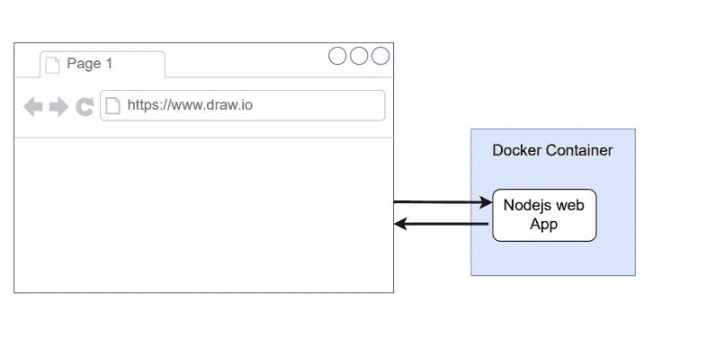

Web application

我们按照以下步骤使用 docker 创建 node js web 应用程序。

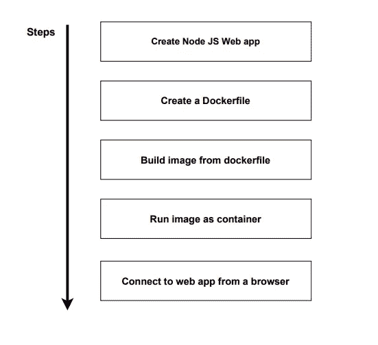

*   首先，我们创建 Node JS 服务器端应用程序。为此，我们创建目录，然后在该目录中创建 package.json 文件，并添加下面的内容。

```
{
"name": "simple-web",
"main": "index.js",
"scripts": {
"start": "node index.js"
},
"dependencies": {
"express": "^4.18.1"
}
}
```

*   然后在同一目录下创建一个 index.js 文件。这个文件是监听传入请求的入口点。添加以下内容。

```
const express = require('express');
const app = express();
app.get('/', (req, res) => {
res.send('Hello World!');
});
app.listen(5000, ()=> {
console.log("listening on port 5000");
});
```

*   在上图中，我们已经导入了 express 库，该库已经作为依赖项添加到 package.json 文件中。我们使用这个库创建服务器。将要处理 get 请求，像这样我们也可以使用其他的 HTTP 方法。`app.listen`监听端口 5000。
*   我们已经创建了节点 js 应用程序。现在是时候创建 Dockerfile 了，它负责将这个 nodejs 应用程序作为一个单独的容器来运行。因此，让我们将以下内容添加到 docker 文件中。

```
# Specify a base image
FROM node:alpine#Create a dicrectory inside the container
WORKDIR usr/app#Copy package.json file to container
COPY ./package.json ./# Install some dependencies
RUN npm install# COPY rest of the files to container
COPY ./ ./# Default command to the container startup
CMD ["npm", "start"]
```

让我们理解 Dockerfile 的每一行

**指定一个基础图像**

*   我们在 Dockerfile 的开头使用来自关键字的**来提到图像名，所以这里图像名是一个**节点。之后，我们用分号(:)来定义版本。这里我们使用一个 **alpine** 版本的 node。阿尔卑斯版本本质上是紧凑的，大小是 5MB。我们使用 alpine 版本的图像，因为我们希望我们的容器有一个更小的尺寸。您也可以在 docker hub 上使用**其他节点版本**。但是与阿尔卑斯山相比，这些版本的尺寸可能会更大。****

**在容器内创建一个目录**

*   **WORKDIR** 关键字我们用来在容器内创建工作目录。这里的 **usr** 目录是文件系统的一部分。在这个目录下，我们创建了 **app** 目录。

**将 package.json 文件复制到容器**

*   在这里，我们将 **package.json 文件**从当前工作目录复制到容器的目录，这是我们在步骤 2 中创建的一个**应用程序**。

**安装一些依赖关系**

*   这里我们使用`npm install`命令在容器下安装依赖项。以便它将在同一目录中生成 node_modules。

**将剩余的文件复制到容器**

*   现在，我们将剩余的文件复制到容器中。在我们的例子中，我们只有作为服务器的 **index.js 文件**。这里第一个**。/** 表示源目录，第二个**。/** 指目的地目录。

**容器启动的默认命令**

*   因为我们已经在前一篇博客中学习了启动命令。所以我们在这里添加了带有关键字 **CMD** 的`["npm", "start"]`命令。

# 最后，我们的项目架构应该是这样的

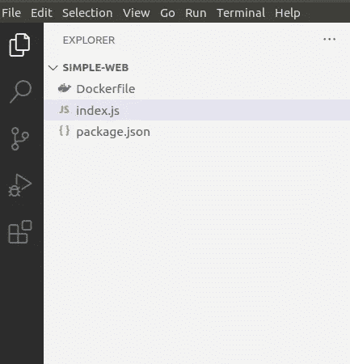

VS code editor

# 构建 docker 映像

*   为了使用 Dockerfile 构建 docker 映像，我们使用了命令`docker build .`，请注意 **build** 关键字后的**点句点**。圆点基本上告诉 docker，必须使用的 Dockerfile 在当前目录中。我们需要使用名为 **-t.** 的标志为我们的图像添加一些名称
*   在根级别运行的最后一个命令将是`docker build -t simple-web .`

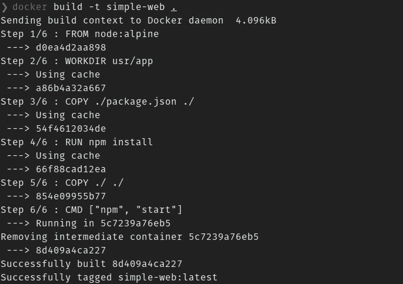

*   我们已经成功地创建了图像。现在是运行图像的时候了。使用`docker run <image-name>`。在我们的例子中，我们使用`docker run simple-web`。当我们这样做时，图像 simple-web 的文件系统将被复制到一个单独的容器中。在之前的博客中，我们已经了解了它的内部工作原理。下图显示了我们运行命令`docker run simple-web`后这个容器的样子。

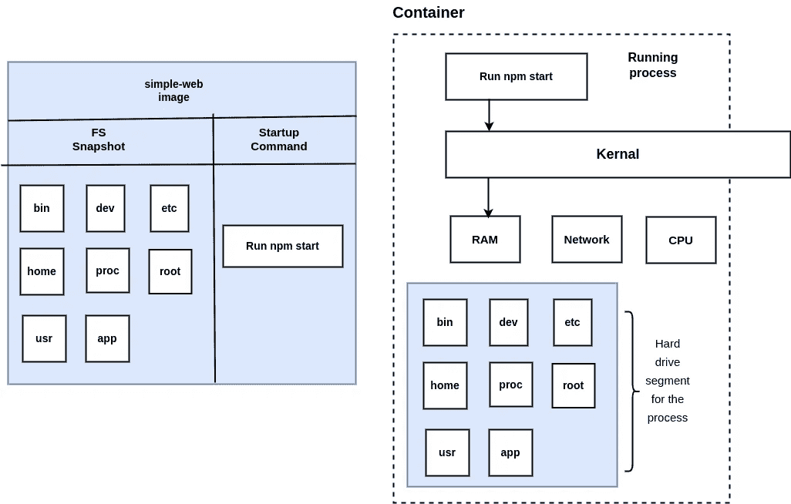

simple-web image and container

*   在上图中，我们可以看到我们定制的简单 web 图像及其文件系统。此外，我们运行图像`docker run simple-web`时创建的容器。这将在终端上显示以下输出。

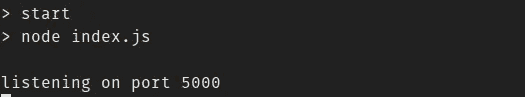

*   现在服务器运行在端口 5000 上。打开浏览器，输入网址 **localhost:5000** 。

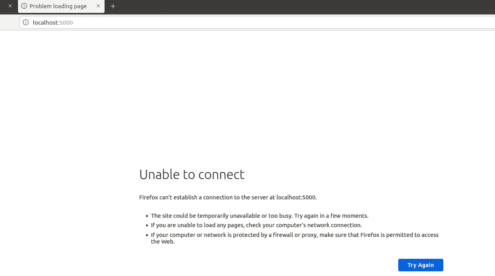

*   它无法到达端口 5000。因为我们的 node js 应用程序是在容器下运行的。因此它无法在浏览器上加载应用程序。现在，我们将通过下图了解为什么应用程序不可达。

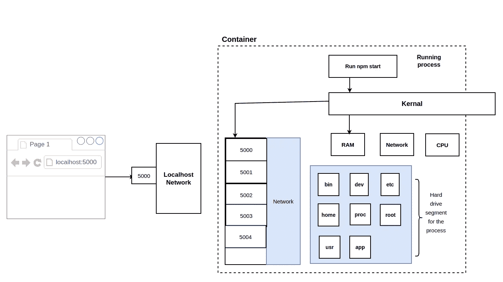

*   浏览器向端口 5000 上的本地主机发出请求。因此，无论请求到达 localhost 5000 的哪里，它都会被路由到容器。该容器有自己的一组隔离端口，可以接收来自外部世界的流量。因此，现在默认情况下，没有来自您的机器 localhost 到容器网络的请求。
*   下面是我们将应用程序从容器中暴露给外界的方式。为了实现这一点，我们必须使用-p 标志显式地进行端口映射。

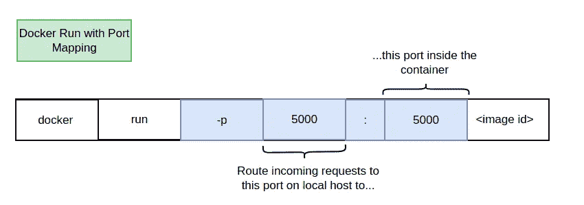

*   再次运行命令`docker run -p 5000:5000 simple-web`。一旦你在终端上点击这个命令，你可以在屏幕上再次看到同样的输出。然后转到浏览器，再次键入 localhost:5000。现在，您可以向容器发出请求了。

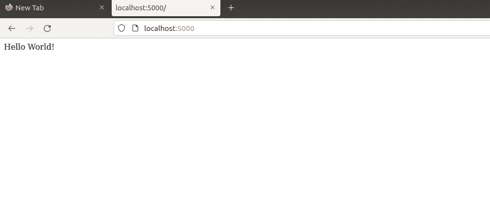

*   下图显示了映射到容器的端口。

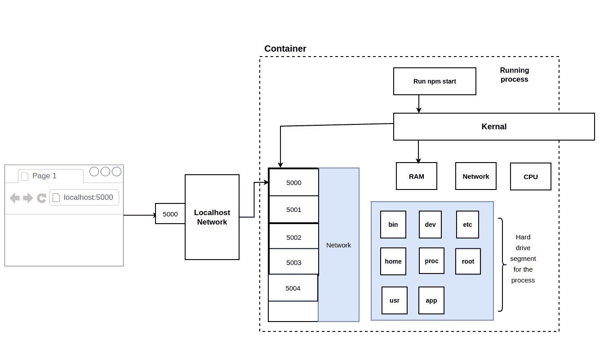

# 结论

我们已经成功地用 Dockerfile 完成了基本的 node js 应用。这被称为单容器应用程序。在接下来的博客中，我们将学习如何用 docker 实现多容器。

如果你有任何疑问，请在评论区随意添加。