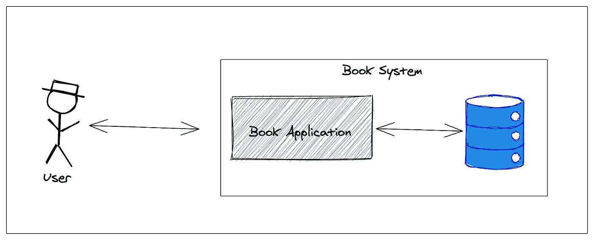

# Docker，开发者的朋友

> 原文：<https://medium.com/globant/docker-the-developers-friend-3464e5e7f43d?source=collection_archive---------0----------------------->


## **用 Docker 开发**

在本文的第一部分(你可以在这里查看，我们讲述了 Docker 的主要概念。这是我们要和 docker 玩一会儿的第二部分。

是时候看看前面的概念是如何一起构建一个小演示并更好地理解了！！

假设我们将开发一个项目(本文的简单项目),这个项目包含一个管理图书馆图书系统的 web 应用程序。应用程序使用数据库来保存数据，该应用程序的简单架构图如下:



**Book System high-level architecture diagram**

对于这个系统，使用容器的想法可能是:


我们将有两个主要容器，一个用于图书应用程序，另一个用于数据库，另外一个(可选)容器可以使用 ***pgAdmin*** 来管理数据库。所以，我们来玩 docker 吧。

**步骤 1:** 从 Docker hub 下载 **PostgreSQL** 和 **pgAdmin** 镜像:

为此，我们需要运行以下命令:

```
***docker pull postgres***
```

然后:

```
***docker pull dpage/pgadmin4***
```

在这些命令之后，我们将执行命令 ***docker images*** 来查看我们主机中的新图像:

```
docker images
```


**The result from docker images command**

因此，在前面的图像中，我们可以看到 docker 图像 PostgreSQL 和 pgadmin。

**步骤 2:** 运行 PostgreSQL 和 pgadmin 容器

为了运行 Postgres 容器，我们需要执行以下命令:

> **注意**:正如我们看到的，这个命令有一个**网络**指令，它允许我们在同一个 docker 运行时在两个容器之间进行通信，这在这里是必要的，但是稍后我们会看到其他选项。

我们可以使用命令 ***docker ps*** 来验证 Postgres 容器是否正在运行


**The result from docker ps command**

因此，让我们运行 pgadmin 容器，我们可以使用以下命令:

我们可以使用命令 ***验证 pgadmin 容器是否正在运行***


**The result from docker ps command**

另一种确认 pgadmin 容器正在运行的方法是通过 pgadmin web 访问 [http://localhost:9292](http://localhost:9292) ，让使用它来管理我们的数据库。


pgadmin login page

为了登录到 ***pgadmin*** ，记住 docker 运行命令中使用的用户名和密码(PGADMIN_DEFAULT_EMAIL 和 PGADMIN_DEFAULT_PASSWORD)。现在，我们可以创建我们的数据库模式，也可以创建我们的表来保存我们的数据，对于这个小项目，我们将拥有表 **book** ，以便通过 API 启用 CRUD 功能。

**步骤 3:** 将图书应用程序部署到一个容器中

下一步是将应用程序部署到容器中，我们可以使用下面的 docker 命令来启动容器。


Books API

> **注意**:这个演示应用程序的 Git 库是[这里是](https://github.com/jparanda/book-app)，请随意使用它。

因此，为了将应用程序作为容器运行，我们需要创建它应该运行的环境，为此，我们需要创建一个 Dockerfile(**I ' l**l**在下一节** 中解释 docker file)。因此 ***DockerFile*** 基本上是一个文件文本，它允许我们指定为 Book 应用程序创建图像的指令，Docker 将使用这些指令将图像运行到容器中。因此，让我们为我们的 ***图书应用程序*** 构建一个 Dockerfile

一旦我们有了 docker 文件，我们需要构建它，让我们使用下面的命令:

```
***docker build --no-cache -t book-app .***
```

现在，如果我们执行命令 ***docker images*** ，我们将看到两个新图像，一个是名为 ***book-app*** 的图书应用程序，另一个是基本图像 ***OpenJDK***


**The result from docker images command**

现在，我们可以运行 book-app 容器，使用其他容器 Postgres 和 pgadmin，我们的 book 系统已经准备好接收请求，因此为了做到这一点，使用以下命令:

如果我们看到上面的命令，我们正在使用同一个网络，***【pg network】，*** 以便允许与 postgres 进行网络通信。现在，我们可以执行 docker ps 命令来验证所有容器都在运行:


Result from docker ps command

在这一点上，我们已经看到了让我们的系统在其所有组件中完全停靠的方法，包括应用程序、数据库以及数据库管理应用程序。

让我们详细了解一下什么是 docker 文件。

## Docker 文件

它是一个文本文档，我们可以在其中指定用户可以在命令行上调用或使用的所有命令来组合一个图像。Dockerfile 文件有以下说明:

**从** - >定义了图像库。每个 Dockerfile 都必须以 FROM 指令开始，简单来说，就是起点。

**运行** - >允许我们在构建时将指令运行到容器中。

**ADD** 和 **COPY** - >都是用来把主机上的文件放到 Docker 镜像中的，但是 ADD 有更多的功能，比如从 web 上复制 URL 资源，还可以从源直接提取 tar 到目的地。更多详情请点击链接[添加命令](https://docs.docker.com/engine/reference/builder/#add) [复制命令](https://docs.docker.com/engine/reference/builder/#copy)。

**入口点** - >允许我们将容器运行配置为可执行文件。它是我们告诉 Docker 如何运行应用程序的地方。

让我们看一个例子:

## Docker 撰写

它是一个工具，允许我们使用 YML 文件运行多容器 docker 应用程序来配置我们的服务。使用 docker compose 的最大优点是我们可以在一个文件中定义所有的应用程序堆栈，然后用一个简单的命令运行它。

请记住，在这一点上，我们知道运行容器的唯一方法，例如，PostgreSQL 数据库使用 docker run 命令，但是，这是一个很大的命令，对吗？对于所有可能的选择，我们必须使用它。让我们看看如何定义 docker-compose 文件并配置上面的各个命令:


正如我们所见，定义一个 docker-compose 文件很容易，记住在这个文件中我们可以定义所有的应用程序堆栈，让我们开始吧！！：

厉害！！我们所有的片段都在同一个 docker-compose 文件中，我们可以在我的例子中指定一个文件名***book-app-stack . yml***或者直接将其命名为***docker-compose . yml***。因此，为了运行我们的 book 系统容器，我们需要使用以下命令:

```
***docker-compose up***
```

如果 docker compose 名称是 docker-compose.yml，请使用前面的命令，否则我们需要使用以下命令:

```
***docker-compose -f {name_compose_file} up***
```

无论是哪种情况，我们都会看到所有的容器都在我们的主机中运行:


Result docker ps command

让我们看看可以与前面的命令一起使用的命令选项:

-f，指定一个替代合成文件(默认值:docker-compose.yml)

-p，指定备用项目名(默认:目录名)

-d，以分离模式运行容器。

**结论**

作为开发人员，我们需要搜索所有能够让我们在工作中更有效率的资源，在这种情况下，Docker 是一个有用的工具，可以避免在我们的开发环境中花费时间进行不必要的配置和安装。Docker 还允许我们快速部署和共享我们的应用程序，并以更好的方式与所有团队以及所有环境(如开发、QA、试运行、生产等)共享一个公共环境。所以，让我们开始了解 Docker，并开始在我们的项目中使用它。

**参考文献**

[https://www.baeldung.com/spring-boot-postgresql-docker](https://www.baeldung.com/spring-boot-postgresql-docker)

[https://www.docker.com/why-docker](https://www.docker.com/why-docker)

[https://hub.docker.com/](https://hub.docker.com/)

[https://cloudacademy.com/blog/docker-vs-virtual-machines-differences-you-should-know/](https://cloudacademy.com/blog/docker-vs-virtual-machines-differences-you-should-know/)

[https://phoenixnap.com/kb/docker-image-vs-container](https://phoenixnap.com/kb/docker-image-vs-container)