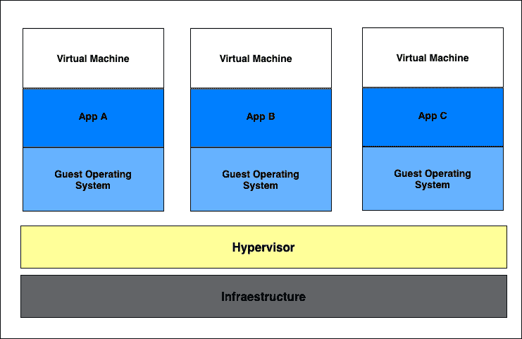
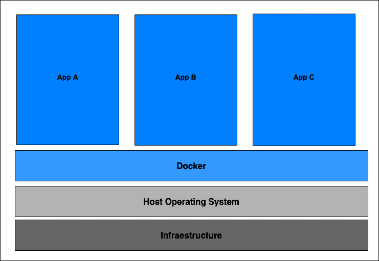
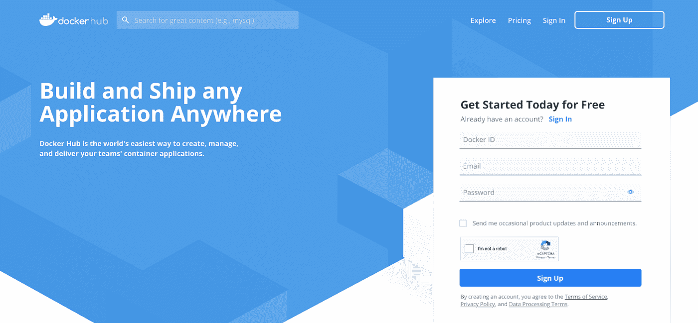
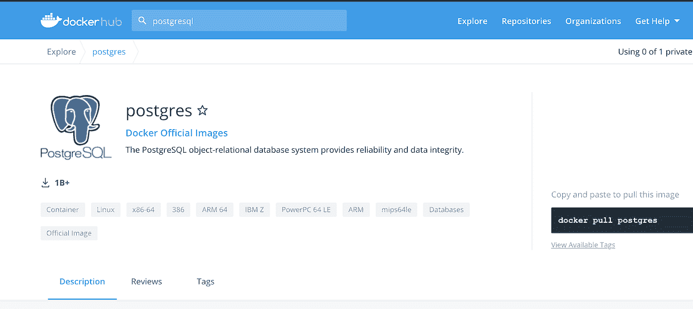
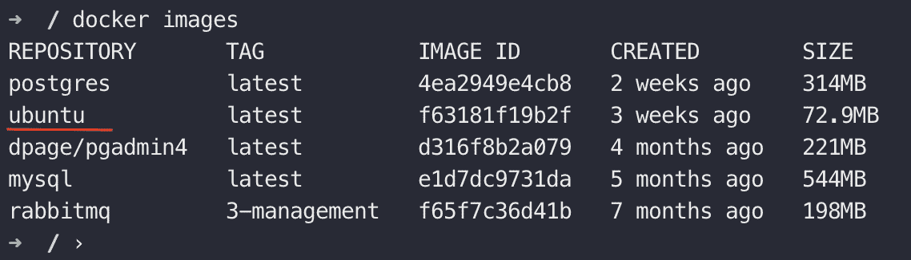
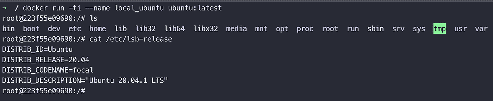
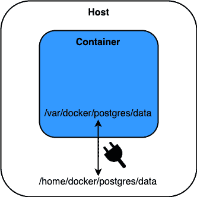

# Docker，开发者的朋友

> 原文：<https://medium.com/globant/docker-the-developers-friend-dd01399de87d?source=collection_archive---------3----------------------->


# 摘要

如今，软件开发需要的不仅仅是编写代码和测试代码。我们有多种语言、工具、框架、操作系统、架构、集成等等，造成了巨大的复杂性。Docker 简化并加速了您的工作流程，同时让开发人员可以自由地为每个项目选择工具、应用程序堆栈和部署环境。在这个 docker 概述中，您将了解 docker 的主要特性，从而获得允许您在我们的项目中开始使用该技术的知识。

这篇文章由两部分组成，第一部分(你在这里)将从一些重要的概念和定义开始，第二部分([这里](/globant/docker-the-developers-friend-3464e5e7f43d))将在一个简单的实践中把所有的理论付诸行动。

让我们看看容器之前和之后的软件开发过程。

## **应用开发**

## **集装箱前**

*   我们必须在您的本地主机或开发人员的机器上安装大部分技术，例如，PostgreSQL、Redis、Apache Tomcat、RabbitMQ 等，显然，每个开发人员的主机操作系统可能不同，安装过程也不同。
*   安装技术堆栈的步骤很多，可能会有几个步骤使其变得复杂。

## **后容器**

*   有了容器，我们不必直接在本地主机上安装任何技术堆栈，因为容器是打包您的堆栈的隔离环境，例如对于 PostgreSQL，我们将在一个单元中有一个包含所有特定版本、配置和脚本的容器。
*   开发人员只需要去容器库，下载并在他们的本地机器上运行特定的容器，而不依赖于开发人员的主机操作系统。
*   我们可以拥有不同版本的开发人员堆栈，例如，我们可以让 Redis 6.0.12 和 6.2.1 同时在您的本地主机上运行，而不会出现任何问题或冲突。

## **应用部署**

## **在容器之前**

*   第一步， ***开发团队*** 生产工件，例如 jar、ear、war 以及关于如何在服务器上配置和设置它的指令。此外，我们可以对其他工件或数据库、在服务器上运行的脚本、指令等进行同样的处理。
*   第二步，前面的指令将提供给 ***运营团队*** ，该团队将遵循这些指令并尝试配置和设置目标环境，这种方法可能会出现以下问题:
*   在目标服务器上安装和配置一切。
*   如果多台服务器在同一台主机上运行，依赖关系版本会发生冲突。
*   开发团队和运营团队之间的误解，因为说明是文本指南，导致错误的解释，或者开发团队可能忘记包括某些内容。

## **集装箱后**

*   开发团队和运营团队一起将应用程序打包到一个容器中。
*   除了 Docker 运行时，服务器上不需要任何环境配置。
*   它意味着一次性的努力。

# 什么是容器？

docker 的主要概念是 ***容器*** (打包代码及其依赖项的软件单元) ***。***Docker 容器是一个可执行的软件包，包括运行应用程序、代码、运行时、系统工具、系统库和设置所需的一切。

# docker 是什么？

Docker 是一个用于开发应用程序的开源平台，独立于基础设施，这是一个将应用程序与基础设施分离的好工具，它还意味着，例如，开发团队可以拥有一个公共的开发环境，其中包含一段代码成功工作所需的所有依赖项，从而允许非常快速的软件交付。

# 什么是图像？

Images 是一个文件(只读),它包含运行特定应用程序容器的所有指令，并且可以在 Docker 容器平台上运行。例如，假设我们想要创建一个在线购物商店，那么对于这个项目，我们需要操作系统、应用程序本身、数据库(PostgreSQL)、用于处理缓存的 Redis 等等，所以在 docker 映像文件中，我们将定义创建容器的指令，例如:

*   安装操作系统、安装数据库以及安装和运行应用程序的指令。

> ***Docker 图片也是任何第一次使用 Docker 的人的起点。***

# 虚拟机 vs Docker

清楚 docker 和 VM 之间的区别很重要，让我们来分析一下。

## 虚拟计算机



Virtual Machine architecture

我们可以说虚拟机(VM)是物理硬件的抽象，它将一台服务器变成多台服务器。**虚拟机管理程序**允许我们在一台机器上运行多个虚拟机。每个虚拟机都包括一个完整的操作系统副本( ***客户操作系统层*** )、应用程序以及必要的二进制文件和库，这可能会占用数十 GB 的空间，显然，虚拟机的启动速度也会很慢。

## 码头集装箱

容器是包括应用程序(代码)和它们打包在一起的依赖关系的抽象。许多容器可以在同一台机器上运行，并与其他容器共享操作系统内核，这里重要的是每个容器作为一个独立的进程运行。容器的大小是几十兆字节，显然，容器也可以比虚拟机更快。



Docker Architecture

让我们回顾一下上面的图像。首先，docker 拥有与虚拟机相同的 ***基础架构*** 层，在此之上我们拥有主机操作系统，它可以是能够运行 docker 的任何操作系统(Linux、Windows、Mac OS)，请查看操作系统主机要求(对于 [windows](https://docs.docker.com/docker-for-windows/install/#system-requirements) 和 [Mac OS](https://docs.docker.com/docker-for-mac/install/#system-requirements) )。记住 Docker 是在 Linux 操作系统上本地运行的。第三层是 docker 架构中最有趣的一层，即 ***docker*** 守护进程，它取代了虚拟机上的虚拟机管理程序，是一种在后台运行的服务，允许运行 docker 容器。最后一层是应用程序，其中有代码、依赖项和配置文件，因此，应用程序需要正确运行的所有必要内容。如果我们在 Docker 容器架构中看到，客户操作系统层被取消，我们节省了它所占用的资源数量。

# 码头设备

要在 Windows 操作系统、Mac 操作系统和 Linux 操作系统上安装 docker，我们可以遵循官方说明:

*   [在 Windows 操作系统上安装 docker](https://docs.docker.com/docker-for-windows/install/)
*   [在 Mac OS 上安装 docker](https://docs.docker.com/docker-for-mac/install/)
*   [在 Linux 操作系统上安装 docker](https://docs.docker.com/engine/install/ubuntu/)

# 码头枢纽

这是一个公共存储库，我们可以在其中找到关于我们项目的任何组件的一些图像，例如，MySQL、PostgreSQL、Redis、Cassandra、Ubuntu OS、Alpine、JVM、JBoss、Apache 等的图像。要使用 docker hub，请转到页面 [Docker Hub](https://hub.docker.com/) 我们将看到以下页面，这对于创建免费帐户非常有用。



Docker hub

在那里，我们可以搜索任何 docker 图像，例如，让我们搜索 PostgreSQL 图像，我们将看到以下结果。



Docker hub search result

这是 PostgreSQL 团队的官方 docker 图片，但是我们可以使用其他作者的图片。

从 docker hub 下载图像

```
***docker pull******image_name***
```

显示所有下载的图像

```
***docker images***
```

显示所有正在运行的容器

```
***docker ps***
```

显示停止和运行的容器

```
***docker ps -a***
```

使用定义的名称启动创建的容器。

```
***docker start container_name***
```

拦住集装箱

```
***docker stop container_name***
```

从映像运行容器

```
***docker run container_name******image***
```

在容器中运行 shell 命令。

```
***docker exec -ti container_name “cmd”***
```

显示/跟踪容器的日志输出。

```
***docker logs -ft container_name***
```

杀死所有运行的码头集装箱。

```
***docker kill $(docker ps -q)***
```

删除悬挂的 Docker 图像。

```
***docker rmi $(docker images -q -f dangling=true)***
```

移除所有停止的容器。

```
***docker rm $(docker ps -a -q)***
```

# 运行第一个容器

所以让我们用一个小图像例如 Ubuntu OS，让我们开始。

*   **步骤 1** :从 docker hub 下载镜像，对其执行命令:

```
***docker pull ubuntu***
```

*   **步骤 2** :一旦前面的命令完成，使用下面的命令检查图像，你应该在那里看到 ubuntu 图像:

```
***docker images***
```



*   **第三步**:有了主机中的 ubuntu 镜像，我们可以为 ubuntu 创建一个容器。让我们开始吧。

```
***docker run -ti — name local_ubuntu ubuntu:latest***
```



我们对 Ubuntu docker 容器很感兴趣，所以它已经可以用在我们的项目中了。也许我们可以安装一个 Apache Tomcat 并在那里部署应用程序，很简单，对吗？。

# 卷

基本上，卷是一种保存容器生成和使用的数据的机制。创建卷时，它存储在 Docker 主机上的一个目录中。体积有几个优点，我们来看看:

*   卷更容易备份或迁移。
*   您可以使用 Docker CLI 命令或 Docker API 来管理卷。
*   卷在 Linux 和 Windows 容器上都可以工作。
*   可以在多个容器之间更安全地共享卷。
*   新卷的内容可以由容器预先填充。
*   卷不会增加使用它的容器的大小，并且卷的内容存在于给定容器的生命周期之外。

让我们用一个形象来看这个概念，我觉得比较好理解:



docker volumes

主机上的物理文件夹被挂载到 Docker 的虚拟文件系统中。

到目前为止，我们已经回顾了关于 docker 的主要概念，如何从 docker hub 获取图像，如何开始在我们的个人计算机上安装图像，以及如何创建简单的容器。在本文的第二部分，我们将看到一个小例子来更好地理解我们所学的内容。

## 参考

【https://docs.docker.com/get-started/overview/ 