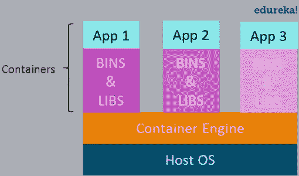

# 码头教程-码头和集装箱介绍

> 原文：<https://medium.com/edureka/docker-tutorial-9a6a6140d917?source=collection_archive---------1----------------------->

Docker Tutorial - Edureka

这篇 Docker 教程博客将让你从概念和实践上接触 Docker——一种新时代的集装箱化技术。

在这篇博客中，我们将关注以下主题:

*   什么是虚拟化？
*   什么是集装箱化
*   容器化相对于虚拟化的优势
*   Docker 简介
*   码头工人的好处
*   虚拟化与容器化

Docker 越来越受欢迎，它的使用像野火一样蔓延。Docker 越来越受欢迎的原因是它可以在 it 组织中使用的程度。很少有工具具有对开发人员和系统管理员都有用的功能。Docker 就是这样一个工具，它真正实现了自己的承诺:构建 T1、T2、运行 T3 和运行 T5。

简而言之，Docker 是一个软件容器化平台，这意味着您可以构建您的应用程序，将它们及其依赖项打包到一个容器中，然后这些容器可以很容易地被运送到其他机器上运行。

例如:让我们考虑一个用 Ruby 和 Python 编写的基于 linux 的应用程序。该应用程序需要特定版本的 linux、Ruby 和 Python。为了避免用户端的任何版本冲突，可以创建一个 linux docker 容器，并在应用程序中安装所需的 Ruby 和 Python 版本。现在，最终用户可以通过运行这个容器轻松地使用应用程序，而不用担心依赖性或任何版本冲突。

这些容器使用容器化，这可以被认为是虚拟化的进化版本。使用虚拟机也可以实现相同的任务，但是效率不是很高。

在这一点上，我通常会收到一个问题，即虚拟化和容器化之间有什么区别？这两个术语非常相似。那么，让我先告诉你什么是虚拟化？

# 什么是虚拟化？

虚拟化是在主机操作系统之上导入客户操作系统的技术。这项技术在一开始是一个启示，因为它允许开发人员在同一台主机上运行的不同虚拟机上运行多个操作系统。这消除了对额外硬件资源的需求。虚拟机或虚拟化的优势在于:

*   多种操作系统可以在同一台机器上运行
*   在出现故障的情况下，维护和恢复非常容易
*   由于对基础架构的需求减少，总拥有成本也降低了

在左侧的图表中，您可以看到有一个主机操作系统，上面运行着 3 个来宾操作系统，除了虚拟机之外，没有其他操作系统。

众所周知，没有什么是完美的，虚拟化也有一些缺点。在同一主机操作系统中运行多个虚拟机会导致性能下降。这是因为来宾操作系统运行在主机操作系统之上，主机操作系统将拥有自己的内核、一组库和依赖项。这占用了大量系统资源，即硬盘、处理器，尤其是 RAM。

使用虚拟化的虚拟机的另一个问题是启动几乎需要一分钟。这在实时应用的情况下非常关键。

***以下是虚拟化的缺点:***

*   运行多个虚拟机会导致性能不稳定
*   虚拟机管理程序不如主机操作系统高效
*   启动过程很长，需要时间

这些缺点导致了一种叫做集装箱化的新技术的出现。现在让我告诉你集装箱化。

# 什么是集装箱化？

容器化是将虚拟化带到操作系统级别的技术。虚拟化给硬件带来了抽象，而容器化给操作系统带来了抽象。请注意，容器化也是一种虚拟化。然而，容器化更有效，因为这里没有客户操作系统，而是利用主机的操作系统，在需要时共享相关的库和资源，这与虚拟机不同。特定于应用程序的二进制文件和容器库在主机内核上运行，这使得处理和执行速度非常快。甚至启动一个容器也只需要几分之一秒。因为所有的容器共享、托管操作系统，并且只保存应用程序相关的二进制文件和库。它们是轻量级的，比虚拟机更快。

**容器化相对于虚拟化的优势:**

*   同一 OS 内核上的容器更轻更小
*   与虚拟机相比，资源利用率更高
*   启动过程很短，只需几秒钟

在左边的图中，您可以看到有一个由所有容器共享的主机操作系统。容器只包含应用程序特定的库，这些库对于每个容器都是独立的，它们速度更快，并且不会浪费任何资源。

所有这些容器都由容器化层处理，容器化层不是主机操作系统固有的。因此需要一个软件，它能让你在你的主机操作系统上创建和运行容器。

现在，让我向您介绍一下 Docker。

# Docker 简介

Docker 是一个容器化平台，它以*容器*的形式将您的应用程序及其所有依赖项打包在一起，以确保您的应用程序在任何环境下都能无缝工作。

正如您在左边的图表中所看到的，每个应用程序都将在一个单独的容器上运行，并将拥有自己的一组库和依赖项。这也确保了进程级的隔离，这意味着每个应用程序都独立于其他应用程序，让开发人员确信他们可以构建不会相互干扰的应用程序。

作为一名开发人员，我可以构建一个安装了不同应用程序的容器，并将其交给我的 QA 团队，他们只需要运行该容器来复制开发人员环境。

# 码头工人的好处

现在，QA 团队不需要安装所有相关的软件和应用程序来测试代码，这有助于他们节省大量的时间和精力。这也确保了从开发到部署，工作环境在过程中涉及的所有个人之间是一致的。系统的数量可以很容易地扩大，代码可以毫不费力地部署在这些系统上。

# 虚拟化与容器化

虚拟化和容器化都允许您在一台主机上运行多个操作系统。

虚拟化处理在单个主机上创建许多操作系统。另一方面，容器化将根据需要为每种类型的应用程序创建多个容器。

Virtualization vs Containerization - Docker Tutorial

正如我们从图中看到的，主要区别在于虚拟化中有多个客户操作系统，而容器化中没有。容器化最好的部分是，与繁重的虚拟化相比，它是非常轻量级的。

到此，我们结束了 Docker 教程上的这篇博客。如果你想查看更多关于人工智能、Python、道德黑客等市场最热门技术的文章，你可以参考 Edureka 的官方网站。

请留意本系列中的其他文章，它们将解释 DevOps 的各个方面。

> *1。* [*DevOps 教程*](/edureka/devops-tutorial-89363dac9d3f)
> 
> *2。* [*Git 教程*](/edureka/git-tutorial-da652b566ece)
> 
> *3。* [*詹金斯教程*](/edureka/jenkins-tutorial-68110a2b4bb3)
> 
> *4。* [*Ansible 教程*](/edureka/ansible-tutorial-9a6794a49b23)
> 
> *5。* [*傀儡教程*](/edureka/puppet-tutorial-848861e45cc2)
> 
> *6。* [*厨师教程*](/edureka/chef-tutorial-8205607f4564)
> 
> *7。* [*Nagios 教程*](/edureka/nagios-tutorial-e63e2a744cc8)
> 
> *8。* [*如何编排 DevOps 工具？*](/edureka/devops-tools-56e7d68994af)
> 
> *9。* [*连续交货*](/edureka/continuous-delivery-5ca2358aedd8)
> 
> *10。* [*持续集成*](/edureka/continuous-integration-615325cfeeac)
> 
> 11。 [*连续部署*](/edureka/continuous-deployment-b03df3e3c44c)
> 
> *12。* [*持续交付 vs 持续部署*](/edureka/continuous-delivery-vs-continuous-deployment-5375642865a)
> 
> *13。* [*CI CD 管道*](/edureka/ci-cd-pipeline-5508227b19ca)
> 
> *14。* [*Docker 作曲*](/edureka/docker-compose-containerizing-mean-stack-application-e4516a3c8c89)
> 
> *15。* [*码头工人群*](/edureka/docker-swarm-cluster-of-docker-engines-for-high-availability-40d9662a8df1)
> 
> *16。* [*Docker 联网*](/edureka/docker-networking-1a7d65e89013)
> 
> *17。* [*岗位职责*](/edureka/ansible-roles-78d48578aca1)
> 
> *18。* [*天穹*](/edureka/ansible-vault-secure-secrets-f5c322779c77)
> 
> *19。* [*适用于 AWS*](/edureka/ansible-for-aws-provision-ec2-instance-9308b49daed9)
> 
> *20。* [*詹金斯管道*](/edureka/jenkins-pipeline-tutorial-continuous-delivery-75a86936bc92)
> 
> *21。* [*顶级 Git 命令*](/edureka/git-commands-with-example-7c5a555d14c)
> 
> *22。* [*顶级 Docker 命令*](/edureka/docker-commands-29f7551498a8)
> 
> *23。*[*Git vs GitHub*](/edureka/git-vs-github-67c511d09d3e)
> 
> *24。* [*DevOps 面试问题*](/edureka/devops-interview-questions-e91a4e6ecbf3)
> 
> *25。* [*谁是 DevOps 工程师？*](/edureka/devops-engineer-role-481567822e06)
> 
> *26。* [*DevOps 生命周期*](/edureka/devops-lifecycle-8412a213a654)
> 
> 27。 [*Git Reflog*](/edureka/git-reflog-dc05158c1217)
> 
> 28。
> 
> **29。* [*组织正在寻找的顶尖 DevOps 技能*](/edureka/devops-skills-f6a7614ac1c7)*
> 
> *三十岁。 [*瀑布 vs 敏捷*](/edureka/waterfall-vs-agile-991b14509fe8)*
> 
> **三十一。* [*Maven 用于构建 Java 应用*](/edureka/maven-tutorial-2e87a4669faf)*
> 
> *32。 [*詹金斯小抄*](/edureka/jenkins-cheat-sheet-e0f7e25558a3)*
> 
> **33。**
> 
> ***34。* [*答题面试问答*](/edureka/ansible-interview-questions-adf8750be54)**
> 
> **35。 [*50 码头工人面试问题*](/edureka/docker-interview-questions-da0010bedb75)**
> 
> ***36。* [*敏捷方法论*](/edureka/what-is-agile-methodology-fe8ad9f0da2f)**
> 
> ***37。* [*詹金斯面试问题*](/edureka/jenkins-interview-questions-7bb54bc8c679)**
> 
> ***38。* [*Git 面试问题*](/edureka/git-interview-questions-32fb0f618565)**
> 
> ***39。* [*Docker 架构*](/edureka/docker-architecture-be79628e076e)**
> 
> **40。[*devo PS 中使用的 Linux 命令*](/edureka/linux-commands-in-devops-73b5a2bcd007)**
> 
> ***41。* [*詹金斯 vs 竹子*](/edureka/jenkins-vs-bamboo-782c6b775cd5)**
> 
> ***42。* [*Nagios 面试问题*](/edureka/nagios-interview-questions-f3719926cc67)**
> 
> ***43。* [*DevOps 实时场景*](/edureka/jenkins-x-d87c0271af57)**
> 
> ***44。* [*詹金斯和詹金斯 X 的区别*](/edureka/jenkins-vs-bamboo-782c6b775cd5)**
> 
> ***45。*[*Windows Docker*](/edureka/docker-for-windows-ed971362c1ec)**
> 
> **46。[*Git vs Github*](http://git%20vs%20github/)**

***原载于 2016 年 11 月 9 日 www.edureka.co***。****