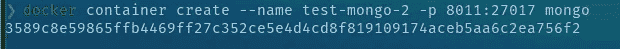

# Docker 教程—完整的初学者指南

> 原文：<https://medium.easyread.co/docker-tutorial-complete-beginners-guide-8b7dd2362c35?source=collection_archive---------0----------------------->

# 序幕

这篇文章将给出一个如何使用 Docker 的基本教程。将要解释的主题是:

*   **什么是 Docker**
*   **码头建筑**
*   **开始使用 Docker(基本命令使用指南)**
*   **使用 Dockerfile** 创建图像
*   **使用环境变量**处理图像
*   **整合集装箱网络**
*   **管理 Docker 中的数据**
*   **Docker 撰写**
*   **对接工具**
*   **Docker 备忘单**

这篇文章会很长，我希望你会喜欢，并随时给我反馈来帮助我改进这篇教程。

谢谢，好好享受吧！

# Docker 是什么？


Photo by [Ian Taylor](https://unsplash.com/@carrier_lost?utm_source=medium&utm_medium=referral) on [Unsplash](https://unsplash.com?utm_source=medium&utm_medium=referral)

[**Docker**](https://docs.docker.com/get-started/overview/) 是一个配置管理工具，用于在轻量级容器中自动部署软件。这些容器帮助应用程序在不同的环境中高效地工作。通过使用 Docker，开发人员可以快速构建、打包、运输和运行应用程序，作为轻量级、可移植、自给自足的容器，几乎可以在任何地方运行。容器允许开发人员将应用程序及其依赖项打包，并作为一个单元进行部署。通过提供预构建和自我维持的应用程序容器，开发人员可以专注于应用程序代码并使用它，而无需担心底层操作系统或部署系统。

# 码头建筑

Docker 的核心概念是图像和容器。Docker 映像包含运行软件所需的一切:代码、运行时(例如，Java 虚拟机(JVM))、驱动程序、工具、脚本、库、部署等等。
Docker 容器是 Docker 映像的运行实例。然而，与使用类型 1 或类型 2 虚拟机管理程序的传统虚拟化不同，Docker 容器运行在主机操作系统的内核上。在 Docker 映像中，没有单独的操作系统，如下图所示。


Docker Architecture

每个 Docker 容器都有自己的文件系统、网络堆栈(因此也有自己的 IP 地址)、进程空间以及为 CPU 和内存定义的资源限制。因为 Docker 容器不需要引导操作系统，所以它会立即启动。Docker 是关于隔离的，即分离主机操作系统的资源，与虚拟化相反，即在主机操作系统之上提供客户操作系统。

## 图像

Image 是一个只读文件，带有一堆指令。当执行这些指令时，它会创建一个 Docker 容器。我们可以说，图像是创建容器的模板。

## 容器

容器是一个软件包，具有运行应用程序所需的所有依赖关系。当运行容器时，它使用隔离的文件系统。

## 集装箱登记处

Docker 容器注册表是我们在将 Docker 映像部署到服务器之前远程放置它的地方。换句话说，这是存储和分发 Docker 图像的标准方式。它还有助于提高存储在其存储库中的 docker 图像的访问控制和安全性。在管理图像分发的同时，它还可以与应用程序开发工作流集成。开发人员可以建立自己的容器注册中心，因为它是在 Apache 许可下的基于开源的存储库。也可以使用托管容器服务，比如 Docker Hub 或者 Azure Container Registry 等。

# 安装码头工人

我不会介绍如何安装 Docker。有很多关于如何将 Docker 安装到你的机器上的教程。对我来说，我更喜欢使用官方文件。你可以在这里看到指令[。](https://docs.docker.com/engine/install/)

# 开始使用 Docker

安装 Docker 后，让我们开始吧！

## 从注册表中提取图像

**查看我们本地的图像**

```
**$ docker images**
```


Image list

如果你新安装了 Docker，你不会在列表中看到任何东西。您将只看到标题结果、`**REPOSITORY**`、`**TAG**`、`**IMAGE ID**`、`**CREATED**`、`**SIZE**.`

**拉图像**

要提取图像，您可以使用以下命令:

```
**$ docker pull <image-name>**
```

或者对于特定的图像版本

```
**$ docker pull <image-name>:<tag-name>**
```

对于这个例子，我们将使用 MongoDB 图像。你可以在这里 查看 [**。如果你打开链接，你可以看到在右边，有一个命令告诉你如何拉图片。**](https://hub.docker.com/_/mongo/)


Docker hub

在`**Tags**`菜单上，您可以看到图像的可用版本


Docker hub tags menu

复制 image pull 命令，并在终端上运行它。您将会看到图像正被从注册表中提取到我们的本地机器上。


Pulling image

如果我们不指定标签名称，它将自动拉最新的图像在注册表中。在图像提取完成后，我们可以重新检查图像列表，你会在列表中看到 mongo


## 创建容器

**检查运行中的容器。**

要检查正在运行的容器，您可以使用

```
**$ docker container ls**
```

它将只显示正在运行的容器，但是如果你有一些停止的容器，它不会显示在列表中。要查看我们所有的容器，我们可以使用

```
**$ docker container ls --all**
```

您可以使用`**--all**`或`**-a**.`来显示您本地机器上的所有容器。您可以在图像上看到，有些容器正在运行，有些容器停止了。


您可以在图像上看到，有些容器正在运行，有些容器停止了。

**创建容器**

创建容器有很多种方法。这些命令是:

```
**$ docker container create <image-name>**
```

创建带有特定图像标签的容器

```
**$ docker container create <image-name>:<tag>**
```

要创建一个具有预定义名称的容器，我们可以在命令中使用`**--name**`参数

```
**$ docker container create --name <some-container-name> <image-name>:<tag>**
```

例如，让我们为提取的 MongoDB 图像创建一个容器，

```
**$ docker container create --name test-mongo mongo**
```


让我们用我们的容器检查一下，


您可以看到没有 test-mongo 容器。发生这种情况是因为使用 container create 命令只是创建容器，而不是启动它。你可以尝试使用`docker contaner ls -a`命令来查看容器。

您也可以用一个条件从同一图像创建多个容器；容器名称必须不同，因为容器名称是唯一的。如果创建容器时没有指定名称，Docker 会为容器生成一个随机名称。

## 开始容器

创建容器后，我们可以使用命令运行它

```
**$ docker container start <container-name>**
```


运行命令后，让我们检查容器列表，


如你所见，我们的`**test-mongo**`已经开始运行了。在我们的例子中，你可以看到。在我们的例子中，您可以看到`**test-mongo**`容器的`**PORTS**`部分，我们可以通过使用端口`**27017**`访问该容器。

让我们尝试连接到 MongoDB。您可以使用支持 MongoDB 连接的 DB 客户端，如 [Robo3T](https://robomongo.org/) ，但我使用的是 Datagrip。


所以，我们无法连接到我们的 MongoDB。为什么会这样？嗯，这是因为`**PORTS**`我们之前看到的信息是容器上的端口。容器的行为是，它将创建一个隔离系统，这意味着我们不能在不暴露端口的情况下访问系统，因此它不能访问容器的外部。

## 港口

那么，我们如何公开容器的端口呢？为了实现这一点，我们应该考虑在创建容器时传递一个参数`**-p**`或`**--port**`，这样命令看起来就像这样

```
**$ docker container create --name <container-name> -p <external-port>:<container-port> <image-name>:<tag>**
```

让我们尝试创建一个新的容器



我会解释这个命令。

`**container-port**` i 是构建映像时已经分配的预定义端口。如果我们使用从 docker 注册中心获得的图像，我们可以看到图像的文档以获取端口信息。在本例中，MongoDB 使用端口`**27017**`。

在`**external-port**`中，我使用端口`**8011**`。这意味着，当我在容器外(或者在我的本地机器上)使用端口`8011` 时，通过端口`**8011**`传来的每个请求都将被转发到容器内的端口`**27017**`。

尝试启动新容器，有了这个，我们就可以访问 MongoDB 了。


## 移除容器

要删除容器，我们使用命令

```
**$ docker container rm <container-name>**
```

让我们试着删除`**test-mongo**`容器


将会出现错误。发生这种情况是因为 Docker 希望我们在移除容器之前停止它。有两种方法可以解决这个问题，

*   使用停止容器

```
**$ docker container stop <image-name>**
```

然后再次运行容器删除命令

*   使用参数`**--force**`强制删除容器

```
**$ docker container rm <image-name> --force**
```

使用此命令时，请确保您知道自己在做什么。

对于这个例子，我将使用选项 2，


您可以尝试重新检查容器列表，以确保该容器已经被删除。

## 移除图像

与移除容器一样，我们不能在移除所有使用图像的容器之前移除该图像。要删除图像，可以使用命令

```
**$ docker image remove <imange-name>:<tag>**
```

让我们停下来移除容器，然后移除`mongo`图像。


## 码头日志

我们可以看到 docker 日志来帮助我们调试容器内部的应用程序。为此，我们可以使用命令

```
**$ docker logs <container-name>**
```

您可以尝试创建一些容器，并检查容器的日志。这是我的 Postgres 容器的一个例子。


## 进入集装箱内部

尽管容器与容器的外部是隔离的，但是 Docker 有一些命令，我们可以使用它们在容器内部传递命令。我们可以使用命令

```
**$ docker exec <option> <container-name> <command>**
```

你可以在这里看到更多关于 docker exec [的信息](https://docs.docker.com/engine/reference/commandline/exec/)

我将演示如何使用我的名为`dev-postgres`的`postgre`进入容器内部的 Postgres 客户端。


你可以看到我正在运行一个命令来显示容器内的数据库列表`**-it**`表示`**interactive**`(保持 STDIN 打开)和 tty(分配一个伪 TTY)。

# 用 Dockerfile 创建图像

我们已经使用 Docker 处理来自容器注册中心的图像，但是如果我们想创建一个图像呢？档案来了。Dockerfile 是一个简单的文本文件，由构建 Docker 映像的指令组成。Dockerfile 由指导您如何构建特定 Docker 映像的命令组成。

例如，我们需要准备一些应用程序代码来演示如何构建应用程序映像。我们将创建两个文件，应用程序代码和 docker 文件。对于应用程序代码，我将使用 Go 制作一个简单的 HTTP app。你不需要在你的电脑上安装 Go runtime，因为我们会把我们的应用程序放在容器里，然后在里面安装 Go runtime。

## 准备应用程序

```
package mainimport (
	"fmt"
	"net/http"
)func main() {  // * Handle Route "/"
	http.HandleFunc("/", func(w http.ResponseWriter, r *http.Request) {
		fmt.Fprintf(w, "<h1>Hello Docker!</h1>")
	}) http.ListenAndServe(":8000", nil)
}
```

## 创建 Dockerfile 文件

```
# BUILD IMAGE FROM EXISTING IMAGE
# Line with '#' will not executed# 1\. Call the image
# FROM <image name>:<tag>
# for the base we will use golang image version 1.15FROM golang:1.15# 2\. Copy file that needed in this image
# COPY <source> <destination>
# we will put file main.go in /app/main.go inside the containerCOPY main.go /app/main.go# 3\. Telling the image how to run the app
# CMD [<add command using array>]CMD ["go", "run", "/app/main.go"] # same with "go run /app/main.go"
```

# 构建图像

我们可以用三种方法来建立一个图像:

*   简单方法

`**docker build <path-to-dockerfile>**`

*   在我们的图像中添加一个名称

`**docker build --tag <app name> <path-to-dockerfile>**`

*   添加名称和版本号

`**docker build --tag <app name>:<version number> <path-to-dockerfile>**`

```
**$ docker build --tag app-golang:1.0 .**
```


使用 Dockerfile 构建映像的方式多种多样，具体取决于您的需求，在创建映像时经常会用到许多 Dockerfile 语法，例如:

*   入口点
*   奔跑
*   工作方向
*   包封/包围（动词 envelop 的简写）

阅读这个 docker [**文档**](https://docs.docker.com/develop/develop-images/dockerfile_best-practices/) ，了解所有的语法，并查看使用它的最佳实践。

## 创建我们的应用容器

让我们试着为我们的应用程序创建一个容器并运行它。然后，我们可以使用浏览器查看我们的应用程序。


## 将图像上传到注册表

**准备**

*   在[https://hub.docker.com/](https://hub.docker.com/)登录您的账户


*   为图像创建新的存储库


**推送图像**

我们将使用 docker 命令来推送图像，`**docker push <repository name>:<tag>**`


如果我们尝试插入这个命令，我们会得到一个错误:`An image does not **exist locally ...**`


这是因为我们创建了一个名称不同于我们的存储库名称的映像。让我们在本地检查图像，使用:

```
**$ docker images**
```


我们的本地映像被命名为 **app-golang** ，但是 docker registry 想要 **repoerna/example-go-app** 。

为了解决这个问题，我们需要使用

```
**$ docker tag <local-image>:<tagname> <reponame>:<tagname>**
```

在我们的本地检查 docker 图像，我们将看到新的图像被创建，


之后，我们可以通过使用之前使用的相同命令来推送至存储库


哎呀！我们仍然得到一个错误，我们的推送请求被拒绝。这是因为，我们当地的码头工人不知道，在哪里推动形象。

我们需要登录，通过使用

```
**$ docker login**
```

输入您的 docker hub 帐户凭据


登录后，让我们再次尝试推送


好吧！我们成功地将本地映像推送到远程存储库，让我们在 docker hub 中进行检查


关于 docker 库的详细信息，可以阅读 [**文档**](https://docs.docker.com/docker-hub/repos/)

# 用环境变量处理图像

> *一个* ***环境变量*** *是一个动态命名的值，它可以影响正在运行的进程在计算机上的行为方式。它们是流程运行环境的一部分。* ***—维基百科***

很少直接使用环境变量。它通常被程序用来配置自己。在软件开发中，程序/应用程序的一些配置是通过使用环境变量来设置的。如果我们希望我们的程序改变一些配置，我们可以通过改变环境变量而不改变代码来实现。


在 Linux 或 macOS 中，您可以使用命令查看您的 OS 环境变量

```
$ printenv
```

如果您使用 Windows，您可以通过打开**控制面板>高级系统设置>环境变量**来访问该环境变量。您将看到环境变量窗口。


如果我们想对需要环境变量的程序进行 dockerize，我们应该在运行容器之前添加一些命令。给你一个例子，让我们更新我们的程序来处理一些环境变量。我们将添加一个新的路由来管理环境变量。

```
package main

import (
	"fmt"
	"net/http"
	"os"
)

func main() {
package main

import (
	"fmt"
	"net/http"
	"os"
)

func main() {
	// * this will set env variable MYNAME
	// os.Setenv("MYNAME", "REPOERNA")

	// * get env variable MYNAME
	appPort := os.Getenv("APP_PORT")
	port := fmt.Sprintf(":%s", appPort)

	myName := os.Getenv("MYNAME")
	txt := fmt.Sprintf("<h1>Hello, %s</h1>", myName) // <-- env var MYNAME will be used in this line

	// * Handle Route "/"
	http.HandleFunc("/", func(w http.ResponseWriter, r *http.Request) {
		fmt.Fprintf(w, "<h1>Hello Docker!</h1>")
	})

	// * Handle route "/myname"
	http.HandleFunc("/myname", func(w http.ResponseWriter, r *http.Request) {
		fmt.Fprintf(w, txt)
	})

	http.ListenAndServe(port, nil) // <-- env var APP_PORT will be used in this line
}
```

记住，在我们的程序中，我们需要两个环境变量，APP_PORT 和 MYNAME。更新我们的程序后，在不改变 docker 文件的情况下重新构建它。

```
**$ docker build --tag app-golang:1.0 .**
```

然后使用图像创建一个容器，并添加`-e`来添加一个环境变量

```
**$ docker container create --name golang-test-env -p 8080:8080 -e APP_PORT=8080 -e MYNAME=REPOERNA app-golang:1.0**
```

创建容器后，让我们使用命令检查其中的环境变量

```
**$ docker container inspect golang-test-env**
```

在列表中，你会看到在带有`APP_PORT`和`MYNAME.`的`Env`中，值与我们之前输入的命令相同。对于`PATH`，`GOLANG_VERSION`，`GOPATH`是自动添加的，因为我们在 docker 文件中使用了 golang。


因此，让我们运行容器，检查我们的程序正在工作

```
**$ docker container start golang-test-env**
```

如果没有出现错误，在浏览器*中打开 localhost:8080/myname* ，会显示`MYNAME`环境变量值。


*   注意:使用 docker 文件创建图像时，可以在 docker 文件中指定环境变量。请参阅关于如何实现的官方文档。

# 集成集装箱网络

在本节中，我们将讨论如何将容器连接到另一个容器。假设我们有一个 web 服务器，它需要与 Postgres 通信以获取数据库，与 Redis 通信以获取缓存或会话存储。


因此，我们将准备 3 个容器，一个用于 app，一个用于 Postgres，一个用于 Redis。在此之前，我们先准备好我们的 app。我们将使用我们以前的应用程序，并添加一些代码来连接 Postgres 和 Redis。

## 更新我们的应用

**main.go**

我们将添加一些数据库连接到我们的应用程序。

```
Package mainimport (
	"database/sql"
	"fmt"
	"net/http"
	"os" "github.com/go-redis/redis"
	_ "github.com/lib/pq"
)func main() { dbHost := os.Getenv("DB_HOST")
	dbPort := 5432
	dbUser := "postgres"
	dbPass := "Secure123"
	dbName := "docker-demo"
	redisHost := os.Getenv("REDIS_HOST")
	redisAddr := fmt.Sprintf("%s:6379", redisHost)
	redisPass := "" //no password set
	redisDB := 0    //default db // * setup postgre connection
	dsn := fmt.Sprintf("host=%s port=%d user=%s "+
		"password=%s dbname=%s sslmode=disable",
		dbHost, dbPort, dbUser, dbPass, dbName)
	db, err := sql.Open(
		"postgres",
		dsn,
	)
	if err != nil {
		fmt.Println(err)
	} // * Ping for test the connection
	if err = db.Ping(); err != nil {
		fmt.Println(err)
	} else {
		fmt.Println("DB Postgres Connected !")
	} // * setup redis connection
	rdb := redis.NewClient(&redis.Options{
		Addr:     redisAddr,
		Password: redisPass,
		DB:       redisDB,
	}) // * Ping for test the connection
	pong, err := rdb.Ping().Result()
	if err != nil {
		fmt.Println(err)
	} else {
		fmt.Println(pong)
		fmt.Println("Redis Connected !")
	} // * get env variable MYshNAME
	appPort := os.Getenv("APP_PORT")
	// handle for default port
	if appPort == "" {
		appPort = "8080"
	}
	port := fmt.Sprintf(":%s", appPort) // myName := os.Getenv("MYNAME")
	// txt := fmt.Sprintf("<h1>Hello, %s</h1>", myName) // * Handle Route "/"
	http.HandleFunc("/", func(w http.ResponseWriter, r *http.Request) {
		fmt.Fprintf(w, "<h1>Hello Docker!</h1>")
	}) // * Handle route "/myname"
	// http.HandleFunc("/myname", func(w http.ResponseWriter, r *http.Request) {
	// 	fmt.Fprintf(w, txt)
	// }) http.ListenAndServe(port, nil)
}
```

对于 Postgres 和 Redis hostname，我们将使用一个环境变量，因为我们正在使用 Redis，所以我们需要在我们的 go 应用程序中使用模块。因此，我们需要更新 docker 文件来处理 go 模块。

**Dockerfile**

```
FROM golang:1.15

ENV GO111MODULE=on

WORKDIR /app

RUN go mod init

COPY . .

RUN CGO_ENABLED=0 GOOS=linux GOARCH=amd64 go build

EXPOSE 8080
CMD ["go", "run", "/app/main.go"]
```

在应用程序准备好之后，我们将继续准备容器，不要忘记清理之前的容器

## 创建容器

*   重建我们的 golang 应用形象

```
**$ docker build — tag app-golang:1.0 .**
```

*   创建 golang 应用程序容器

```
**$ docker container create — name golang-docker -e REDIS_HOST=localhost -e DB_HOST=localhost -p 8080:8080 app-golang:1.0**
```

*   创建 Postgres 容器

```
**$ docker container create --name postgres-docker -p 5432:5432 -e POSTGRES_DB=docker-demo -e POSTGRES_PASSWORD=mysecretpassword postgres**
```

*   创建 Redis 容器

```
**$ docker container create --name redis-docker -p 6379:6379 redis**
```

让我们看看我们创建的容器


## 启动容器

启动所有 3 个容器

```
**$ docker container start redis-docker postgres-docker golang-docker**
```

查看我们的应用容器

```
**$ docker container logs golang-docker**
```


正如我所料，将会发生错误，因为我们试图连接到本地主机。我们无法连接到本地主机，因为 Redis 和 Postgres 在不同的容器中。我们需要使用容器名作为主机名。所以，让我们删除`golang-docker`容器并重新创建它。

```
**$ docker container create --name golang-docker -e REDIS_HOST=redis-docker -e DB_HOST=postgres-docker -p 8080:8080 app-golang:1.0**
```

启动容器，并再次检查日志。


我们仍然无法连接到 Redis 和 Postgres。这里发生了什么？如你所见，我们的应用程序出现了一个错误。这是因为我们的程序仍然找不到 Redis 和 Postgres。在使用 *localhost* 或 *127.0.0.1* 作为主机之前，localhost 指的是当前计算机或系统中的主机名。

如你所知，**当创建一个容器时，里面的系统将与另一个容器**隔离。即使我们希望容器连接到我们的笔记本电脑或计算机，我们也需要公开容器端口并将其映射到我们的计算机端口。但是，在我们将主机名更改为容器名之后，仍然会出现错误。那么**如何让容器互相沟通呢？**

## 设置容器网络

为了实现这一点，我们需要使用 **docker 网络**，它将帮助我们连接容器

```
**$ docker network --help**
```

*   创建 docker 网络

```
**$ docker network create example-network**
```

我们可以使用以下命令来检查我们创建的网络

```
**$ docker network ls**
```

*   设置容器网络

```
**$ docker network connect example-network golang-docker
$ docker network connect example-network redis-docker
$ docker network connect example-network postgres-docker**
```

在我们将容器连接到网络之后，让我们检查我们的容器

```
**$ docker container inspect golang-docker**
```

您可以在“网络”中看到我们之前创建的**示例-网络**。


让我们重新启动 golang-app 容器，并检查日志

```
**$ docker container restart golang-docker**
```


终于接通了！恭喜我们！

# 管理 Docker 中的数据

创建应用程序时，最好使其无状态。这意味着没有数据保存或数据存储在其他地方。然而，有些应用程序需要有状态，例如数据库。我们如何运行有状态的应用程序？我们如何保存数据，以便当我们删除一个容器时，数据仍然会保留？

实际上，你可以在这里阅读关于那个[的文档](https://docs.docker.com/storage/)

Docker 中管理数据的方法有很多。通常，我会使用绑定挂载，但这次我们将尝试使用卷。

在这个例子中，我们将尝试创建一个 MongoDB 容器。要管理数据，首先，我们必须知道应用程序将数据保存在哪里。如果您使用 docker hub 中的 [mongo 映像，我们可以在副标题的描述中看到存储数据的位置，从那里我们可以看到 mongo 数据驻留在哪里，它在/data/db 中。](https://hub.docker.com/_/mongo)

那么，让我们开始…

*   拉图像

```
**$ docker pull mongo**
```

*   创建新卷

```
**$ docker create volume mongo-test**
```

该卷将在我们的容器中使用。这是保存数据的地方。您可以使用以下命令检查卷在计算机中的存储位置:

```
**$ docker volume inspect <volume-name>**
```


*   创建容器

```
**$ docker container create --name mongo-docker -v mongo-test:/data/db -p 27017:27017**
```

在这个命令中，我们使用`**-v <docker_volume>:<data location in application>**`在 docker 和我们的计算机之间创建卷绑定。

*   启动容器

```
**$ docker container start mongo-docker**
```

*   使用 mongo 客户端打开 mongo DB，这里我用的是 [Studio 3T](https://studio3t.com/)


默认情况下，新创建的 MongoDB 中有 3 个类似上面的 DB。让我们创建一个新的数据库，并在其中添加新数据

*   创建一个新的数据库并插入一些数据


在这里，我已经创建了名为 test_db 新的`**DB**`，一个名为`**test_collection**`的集合，在该集合中有 1 个文档

*   停止并删除容器

```
**$ docker container stop mongo-docker**
```


```
**$ docker container rm mongo-docker**
```


*   使用步骤 3 和 4 中的相同命令再次创建并启动容器
*   使用 Mongo 客户端再次检查数据库


你会看到，你的数据还在那里。恭喜你！

这是如何在 docker 中管理数据的一种方法，在 docker 中管理数据还有很多方法。请务必阅读[文档](https://docs.docker.com/storage/)。在那里你将知道使用什么方法以及如何根据你的需要使用它。

# Docker 撰写

我们已经学会了整合我们的容器。在前面的例子中，我们使用了 3 个容器，但是如果我们的应用程序或系统需要更多呢？每一步手动做都会有问题吧？因此，Docker Compose 将帮助我们自动化这个过程。

基本上，使用 Docker Compose 有 3 个步骤，这些步骤是:

1.  用一个`**Dockerfile**`来定义你的应用环境，这样它可以在任何地方被复制。
2.  在`**docker-compose.yml**`中定义组成您的应用程序的服务，以便在一个隔离的环境中一起运行。
3.  运行`**docker-compose up**`，Compose 会启动并运行你的整个应用程序。

在步骤 1 中，我们已经学习了如何创建`**Dockerfile**`，所以我们将关注步骤 2，如何创建`**docker-compose.yml**`文件，以及步骤 3，如何运行它。

让我们创造我们的`**docker-compose.yml**`，

```
version: "3.9" # optional since v1.27.0services:
  db:
    container_name: postgres-comose
    image: postgres
    ports:
      - 5432:5432
    networks:
      - compose-network
    environment:
      - POSTGRES_DB=docker-demo
      - POSTGRES_PASSWORD=mysecretpassword
  cache:
    container_name: redis-compose
    image: redis
    ports:
      - 6379:6379
    networks:
      - compose-network
  app:
    container_name: golang-compose
    # image: app-golang:1.0
    build:
      context: .
      dockerfile: Dockerfile
    ports:
      - 8080:8080
    restart: unless-stopped
    networks:
      - compose-network
    depends_on:
      - db
      - cache
    environment:
      - REDIS_HOST=redis-compose
      - DB_HOST=postgres-compose
      - MYNAME=REPOERNAnetworks:
  compose-network:
    name: new-example-network
```

***注:在 app 服务环境中，我们使用 REDIS_HOST 和 DB_HOST 使用 REDIS 和 Postgres 容器名**

好吧，我会解释我们写的东西。在文件的根目录下，我们有:

*   `**version**`定义撰写发布。每个版本都有我们可以使用的不同特性和参数。你可以在这里 阅读各个版本 [**的兼容矩阵。如果通过**缺省省略`**version**` **，它将使用版本 1。**](https://docs.docker.com/compose/compose-file/compose-versioning/)
*   `**services**`定义了我们系统中的所有服务。在我们的例子中，在我们使用 Postgres、Redis 和 golang app 之前，这 3 个服务将在这里定义。
*   `**network**`定义网络将被使用，如果你还没有创建网络，它将被自动创建，并且你可以在这里创建多个网络。

在服务内部，有服务名；我们有数据库、缓存和应用程序。对于每个服务，我们将定义一个将在每个服务上使用的参数。这些参数是:

*   `**container_name**`定义名称服务容器。
*   `**image**`定义将用于创建容器的图像。
*   `**port**`定义端口绑定，将容器内部的端口暴露给外部环境。
*   `**networks**`定义服务将使用的网络。
*   `**depends_on**`定义 app services 需要的其他服务。
*   `**environment**`定义容器内部的环境变量。

在`**app**`服务中，我们将使用`build`来构建图像，而不是使用图像，在`**build**`下面有`**context**`来定义将用于构建图像的 Dockerfile 的位置，还有`**dockerfile**`来定义 docker file 文件名。

要运行 Docker Compose，我们需要使用一些命令，您可以使用

```
**$ docker-compose**
```

它将向您显示命令列表及其功能的简短描述。你需要知道如何正确使用它。我经常使用的命令有:

*   `**docker-compose build**`

如果您使用的是`**build**`而不是`**docker-compose.yml**`中的`**image**`，它将重建映像，如果您的服务使用现有映像，将会出现错误。

*   `**docker-compose up -d**`

它将创建并启动容器，最好使用`-d`或守护模式，在后台运行进程。

*   `**docker-compose down**`

它将停止并删除容器、网络、图像和卷。请注意，如果您在服务中使用数据库，当您使用此命令时，数据也将被删除。

那么，让我们运行 Docker Compose

*   重建形象

```
**$ docker-compose build**
```

该过程与`**docker build**`相同

*   启动服务

```
**$ docker-compose up -d**
```


*   查看我们的申请


我们的服务开始了！没有发生错误。

*   打扫

```
**$ docker-compose down**
```


# Docker 工具— Kitematic

Docker 工具是一个软件，你可以用它来帮助你使用 GUI 管理 Docker。Docker 有自己的工具，叫做 Docker Desktop，但是只针对 Windows 和 macOS。对于 Linux，我更喜欢使用 Kitematic，因为它也可以在 Windows，macOS 上运行。它也比 Docker 桌面拥有更多的功能。

其特点是:

1.  创建、删除、启动和停止容器
2.  查看容器日志
3.  管理卷
4.  添加环境变量
5.  命令行访问

您可以在上查看详细信息

你可以在 Kitematic 网站或 [docker 文档](https://docs.docker.com/kitematic/userguide/)上查看详情。

# [Docker 备忘单](https://www.docker.com/sites/default/files/d8/2019-09/docker-cheat-sheet.pdf)

# 参考文献

[1] [什么是 Dockerfile:你需要知道的一切](https://www.simplilearn.com/tutorials/docker-tutorial/what-is-dockerfile)

[2] [Docker 容器和容器云服务](https://www.oracle.com/cloud-native/container-registry/what-is-docker/)

【3】[Oracle 中关于 Docker 的基本](http://oracle-help.com/oracle-cloud/basic-docker-oracle/)