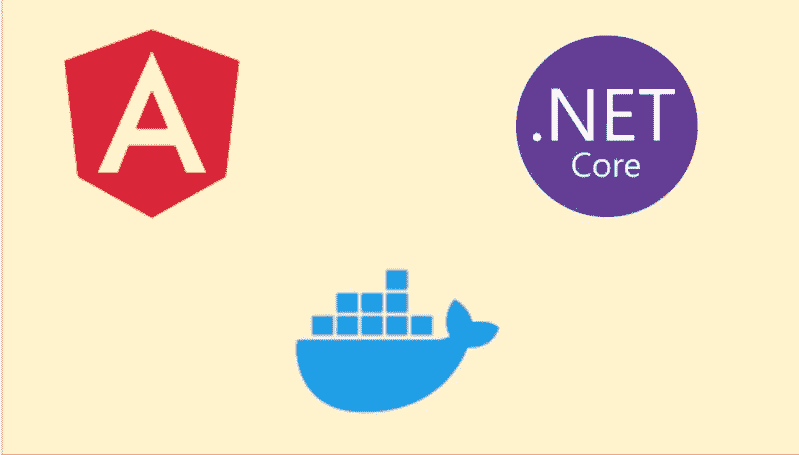

# Dockerizing Angular 应用程序。网络核心后端

> 原文：<https://medium.com/bb-tutorials-and-thoughts/dockerizing-angular-app-with-net-core-backend-734ea2df84df?source=collection_archive---------0----------------------->

## 了解如何对其进行分类并使其成为可部署的映像

Docker 是一个企业就绪的容器平台，使组织能够在任何地方无缝地构建、共享和运行任何应用程序。几乎每个公司都在将其应用程序容器化，以实现更快的生产工作负载，这样它们就可以随时部署，有时一天部署几次…