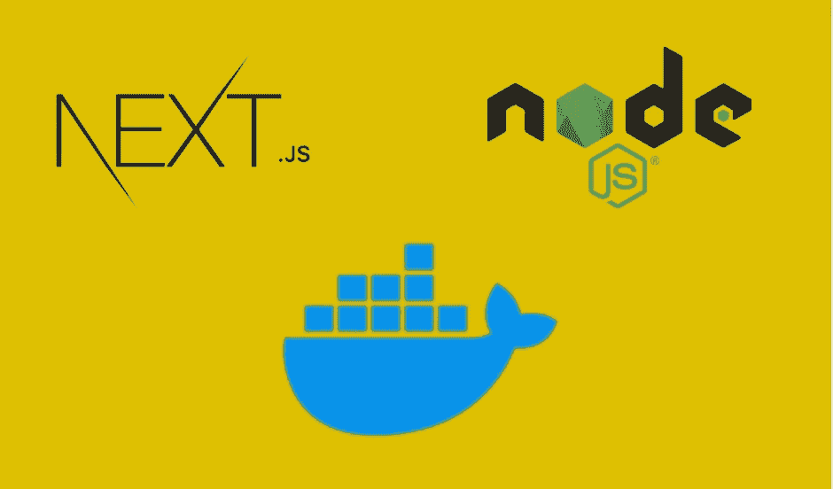

# 将 Next.js 应用程序与 NodeJS 后端对接

> 原文：<https://medium.com/bb-tutorials-and-thoughts/dockerizing-next-js-app-with-nodejs-backend-1b9a24f6e89b?source=collection_archive---------0----------------------->

## 了解如何对其进行分类并使其成为可部署的映像

Docker 是一个企业就绪的容器平台，使组织能够在任何地方无缝地构建、共享和运行任何应用程序。几乎每个公司都在将其应用程序容器化，以实现更快的生产工作负载，这样它们就可以随时部署，有时一天部署几次。那里…