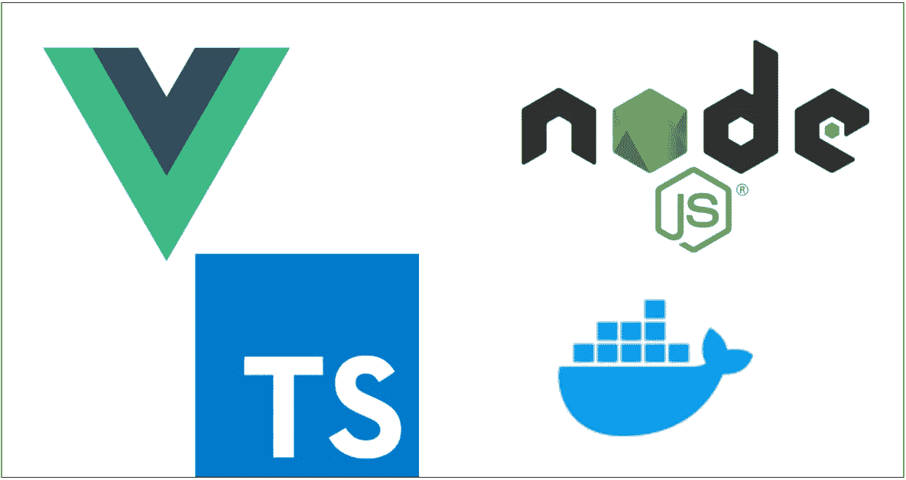

# 将 Vue 应用程序与 NodeJS 后端对接—类型脚本版本

> 原文：<https://medium.com/bb-tutorials-and-thoughts/dockerizing-vue-app-with-nodejs-backend-typescript-version-3244573b6a02?source=collection_archive---------0----------------------->

## Vue 和 NodeJS 都在 Typescript 中

Docker 是一个企业就绪的容器平台，使组织能够在任何地方无缝地构建、共享和运行任何应用程序。几乎每个公司都在将其应用程序容器化，以实现更快的生产工作负载，这样它们就可以随时部署，有时一天部署几次。那里…