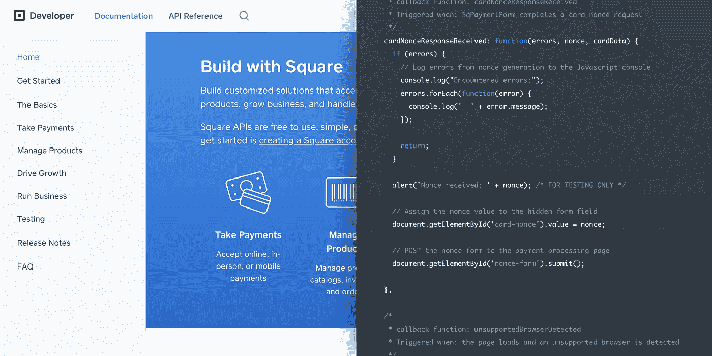
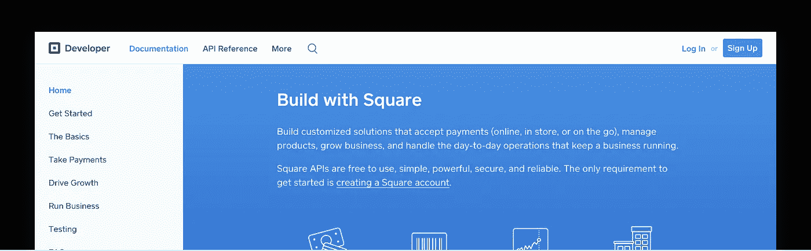
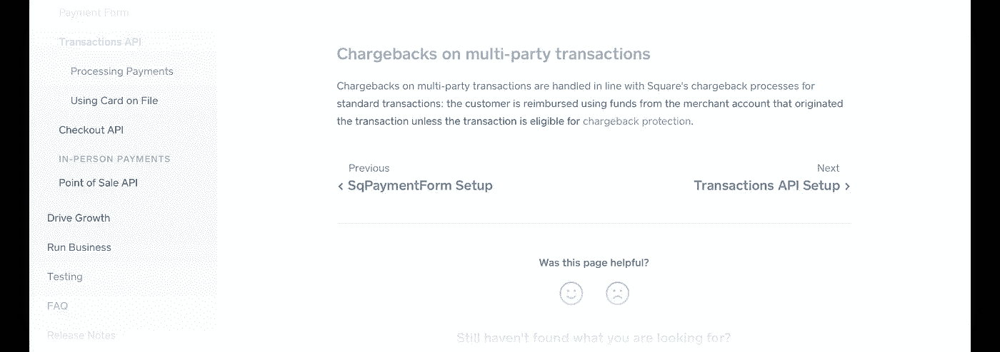
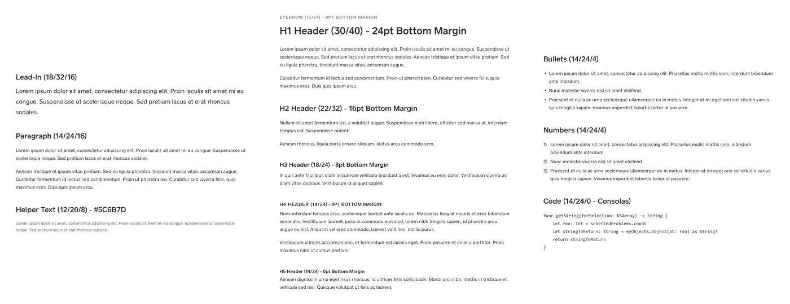
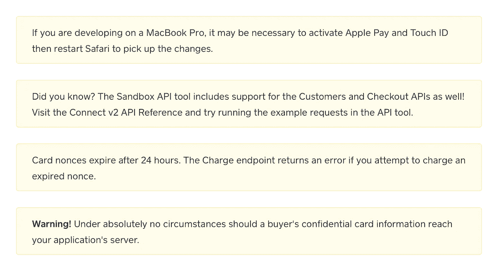
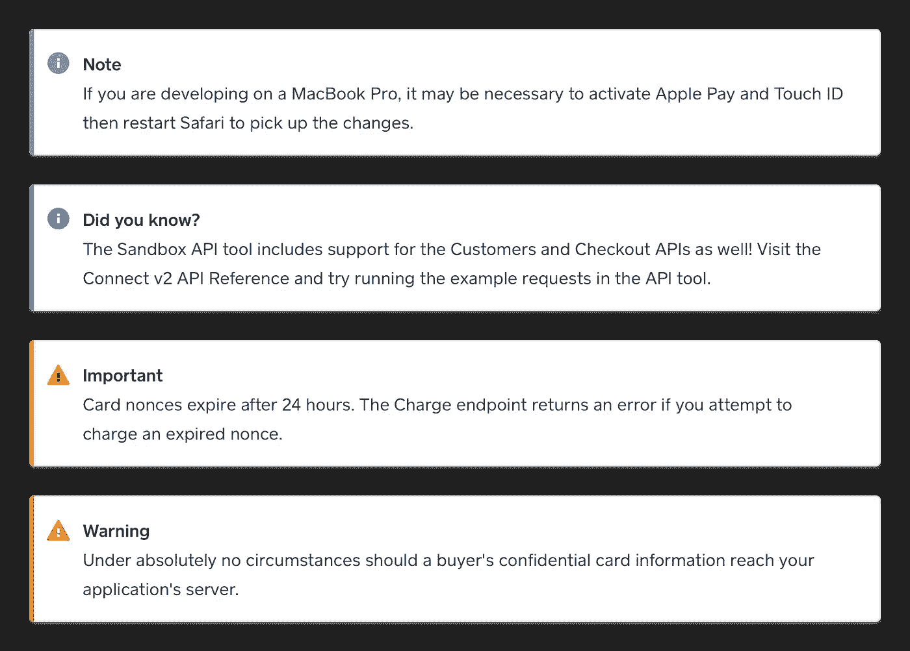
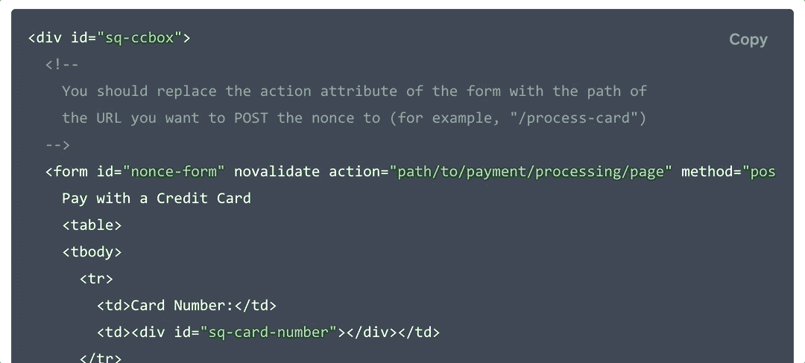

# 文档细节很重要

> 原文：<https://medium.com/square-corner-blog/documentation-details-matter-38e5e4c7b606?source=collection_archive---------4----------------------->

> 注意，我们已经行动了！如果您想继续了解 Square 的最新技术内容，请访问我们的新家[https://developer.squareup.com/blog](https://developer.squareup.com/blog)

不久前，我作为一名产品设计师加入了 Square 的[开发者平台](http://squareup.com/developers)团队。我负责的第一件事就是解决一些我们可以对现有网站进行的快速战术改进，以改善开发人员的体验。

开发团队中的设计师？在做文档？“油和水”，你可能会说，但完全相反。这些年来，我查阅了大量的文档、堆栈溢出的帖子和随机的博客，自学了各种语言。不用说，我确实同情我们的开发者。至少可以说，结构不良、找不到方向或者没有包含足够上下文的文档是令人沮丧的。

以下是我们的开发人员遇到的挫折以及我们采取的解决措施的概要。

## 全局导航栏

Square 的[开发者资源](https://docs.connect.squareup.com)已经增长了一段时间。目前，我们有我们的主要文档，一些单独的完整 API 参考，以及我们的开发人员仪表板。直到现在，还没有一致的方法在所有这些属性之间导航。

我们最近在这些独立的目的地之上增加了一个导航层，使访问者能够快速找到他们需要的信息，而不会迷路。

One navigation construct to rule them all.

## 页面内导航

我们的文档包含了很多关于如何使用我们的 API 并取得成功的信息。与您可能熟悉的其他文档类似，此信息可能由一次性页面或多页指南组成。后者尤其成问题，因为在页面底部没有明确的“下一步是什么”指导行动呼吁。此外，如果读者从第一篇文章中包含重要信息的第二篇或第三篇文章开始阅读，会怎么样呢？他们怎么知道自己错过了什么？

为了解决这一问题，我们为技术作者增加了在页面底部使用相关文章标题指定明确的“上一篇”和/或“下一篇”导航的功能，以帮助引导读者阅读序列中的后续文章。

## 排印

如果排版不符合标准，包含大量信息的文章可能很难解析。糟糕的行高和文本对比度(粗细、大小、颜色)很容易影响阅读理解，这绝对不是你想在文档中看到的。

我们对文档做的最不明显的调整之一是清理一些标题，并确保它们周围有足够的空白空间，以便在不断开相关文本的情况下清晰地划分部分。我们还将标题字体的粗细从常规调整为中等，以确保内容更容易快速浏览。

## 补充信息

在文档中有补充性的、旁注式的信息来为正在解释的概念提供更多的上下文是很常见的，无论是一般信息、提示，甚至是警告。起初，对这些旁白的处理可能看起来有点琐碎:只是把它们放在一个盒子里，也许给容器一种颜色填充，以区别于文章内容，并称之为好。实际上很容易习惯于看到并跳过它们，这对于一些一般的笔记可能是好的，但对于警告内容可能是灾难性的。不幸的是，这正是我们的困境。

**(Before)** Different types of messages that all carry the same importance.

我们通过颜色和图标在我们的旁白中添加更多的视觉指示器来解决这个问题，同时保持一致的基础结构来继续帮助它们从正常的文章内容中脱颖而出。现在，我们能够区分警告、提示和一般信息注释。

**(After)** Asides that clearly highlight the type of information they contain.

## 代码示例

在开发过程中，将在线指南中不同大小的代码块复制并粘贴到您正在处理的文件中是很常见的。选择和复制整个块可能很棘手，特别是如果它们有水平滚动*和*需要你垂直滚动才能看到全部。

我们在一些代码块中添加了复制到剪贴板的特性，这样读者只需点击一下按钮就可以轻松地复制整个示例。

# 还会有更多

这些微小但非常必要的改进只是 Square 开发者平台 web 体验更多改进的开始。敬请关注。

我们总是乐于听取我们如何改进的意见。如果您有反馈，请通过我们的[休闲频道](https://docs.google.com/forms/d/e/1FAIpQLSfAZGIEZoNs-XryKqUoW3atFQHdQw5UqXLMOVPq3V4DEq-AJw/viewform)告诉我们！

*想要更多吗？* [*注册*](https://www.workwithsquare.com/developer-newsletter.html?channel=Online%20Social&sqmethod=Blog) *获取我们每月的开发者简讯。*