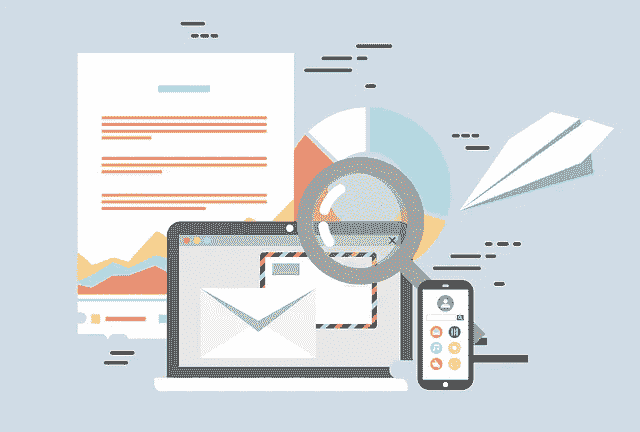
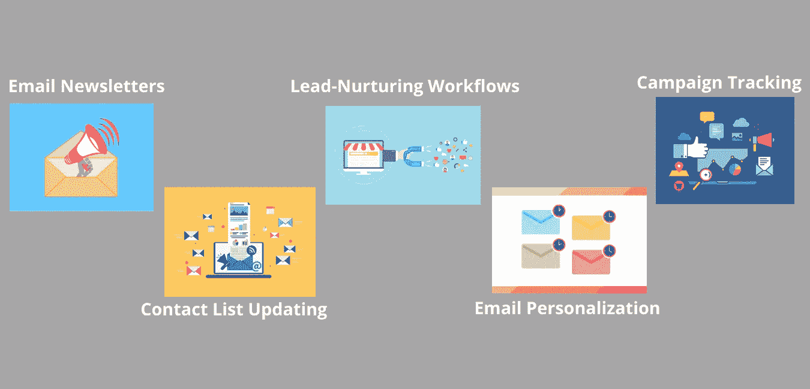

# 邮件营销真的管用吗？

> 原文：<https://medium.com/globant/does-email-marketing-really-work-9a50ae82efee?source=collection_archive---------4----------------------->

***知道如何有效营销&提振业务。***

*Image by Talha Khalil from Pixabay*

电子邮件营销不再以传统的手动方式向小型客户群发送电子邮件。电子邮件营销的范围已经扩大到很大程度，包括个性化，自动化和集成。我们都知道，质量&诱人的内容、图像、标题和 CTA 是每封电子邮件的关键。在这篇文章中，让我们深入一些其他重要的方面&电子邮件营销领域的新发展。

*围绕电子邮件营销的一些数字:*

59%的受访者表示营销邮件影响了他们的购买决定。([轮毂点](https://blog.hubspot.com/marketing/email-marketing-stats)，2020)

每天有 39 亿电子邮件用户。这个数字预计到 2023 年将攀升至 43 亿。( [Statista](https://www.statista.com/statistics/255080/number-of-e-mail-users-worldwide/) ，2020)

86%的消费者希望每月至少收到一封来自他们订阅的品牌的促销电子邮件。([轮毂点](https://blog.hubspot.com/marketing/email-marketing-guide)

以上所有的统计数据清楚地表明，如今电子邮件营销越来越多地被用于营销活动，并且表现得比以前更好。现在是利用电子邮件营销的所有潜在好处的最佳时机，通过正确的方式将其用于您的业务。

**电子邮件营销自动化策略:**

如果你正在运营一个电子商务网站或任何其他网站，通过在正确的时间提供正确的内容来培养和吸引你的联系人是非常重要的。电子邮件营销自动化使这成为可能，它通过设置自动电子邮件和点滴活动，在特定条件/行动得到满足时发出。它节省了时间和精力，有助于提高业务转换率。

以下是一些常见的电子邮件营销工作流程，可用于为您的商业电子邮件活动设计定制内容策略。

*   *欢迎邮件-*

这个工作流可以被触发来欢迎任何新的访问和注册/注册你的网站的人。这种姿态值得赞赏，因为它表明企业关心其新客户。这是一个很好的机会来引导你的客户与你同行，让他们容易获得可能感兴趣的内容，并给他们更多关于你的业务和社交渠道的信息。

*   *下载电子邮件-*

当用户填写表格以下载您网站上的任何资源时，可以使用此工作流。拥有一些优质资源/销售线索磁铁是很有用的，比如免费的电子书、视频，可以在客户生命周期中的正确时间与他们分享。一旦你知道客户在填写表格时对某个特定主题感兴趣，你可以围绕该主题和其他相关主题发送电子邮件，以培养这些线索，引导他们购买完整的产品/服务。

*   *免费试用电子邮件-*

当客户在您的网站上注册免费试用您的产品/服务时，就会触发此工作流程。我们的工作是让用户容易地使用我们的产品/服务&否则会导致不满意。这些电子邮件对入职很有用&指导新客户使用软件，从而让他们的生活更轻松。

*   *引导培育邮件-*

这些电子邮件可以根据您的业务需求和目标定制发送。例如，根据客户与网页的交互方式、阅读网站上的特定博客、向愿望清单添加产品等，向客户发送电子邮件。这些互动为你与客户就他们感兴趣的话题展开对话提供了基础&从而启动了销售漏斗。该平台可用于向您的客户展示和宣传合适的产品，并将其转化为有价值的销售线索。

*   *再次合作&跟进邮件-*

这些自动发送的电子邮件可以作为友好的提醒发送出去，以重新吸引不活跃的用户，或者在成功购买后与现有客户建立关系。培养与现有客户的关系对于建立忠诚的客户群至关重要。

*   *废弃购物车电子邮件-*

当客户访问您的网站时，这些工作流非常有用，因为他们没有完成购买就离开了，即没有购买就把一些商品放在购物车中。这些电子邮件可用于通知客户他们的购物车中添加了一些商品，营造一种紧迫感，提供报价或解决与购买相关的问题。同样，提供产品升级/补充服务的追加销售电子邮件可以发送给购买了您的一些产品/服务的客户。

*   *活动电子邮件-*

沟通是推动活动顺利进行并取得成功的必要条件，电子邮件是沟通工作流程的重要组成部分。可以触发电子邮件发送活动邀请、活动注册详情、提醒、反馈等。

然而，要使上述自动化工作，您需要根据联系人行为，用联系人信息保持您的电子邮件列表的更新和准确。这可以通过整合你的业务工具来实现，例如:整合你的电子商务平台/CRM 和你的电子邮件营销软件。

让我们看一些例子:

*   当新的联系人被添加到 CRM 系统时，将该联系人添加到电子邮件营销软件的列表中。自动化可以进一步用于向他们发送欢迎电子邮件、销售线索培育电子邮件等。
*   在电子商务平台上进行销售时，将联系人添加到电子邮件营销软件的列表中。使用自动化向他们发送反馈邮件、感谢邮件等。
*   当联系人在活动管理工具中注册活动或网上研讨会时，将其添加到电子邮件营销软件的列表中。使用自动化向他们发送邀请、提醒和跟进电子邮件。

**电子邮件个性化:**

就打开率和点击率而言，个性化的电子邮件比普通的电子邮件更有效，因为它们让你的受众感到特别。

下面列出了一些个性化你的电子邮件的方法，这些可以在许多允许个性化令牌的电子邮件营销工具的帮助下完成。

*   将收件人的“名字”添加到电子邮件主题行
*   确保在你的邮件中添加一个合适的“发件人姓名”,例如:添加客户经常联系的主管的姓名
*   动态更改您的客户将在电子邮件正文中看到的内容块。这可以基于他们的行业、生命周期阶段、性别、地点或你对他们的任何其他了解
*   在适用的地方添加“特定区域”信息，例如:为不同的位置更改图像，以使电子邮件活动根据订户的位置进行个性化
*   地区节日提及或生日问候/惊喜
*   你可以利用联系人的行业、公司、t 恤尺寸等信息。要更改正文内容
*   电子商务公司利用个性化功能，根据客户的购买行为向客户发送有针对性的个性化电子邮件，例如:追加销售、交叉销售、弃车、VIP 忠诚度等。

对你的邮件列表进行细分是很有用的&然后根据不同客户群的兴趣，向他们发送有针对性的个性化邮件内容。事实证明，一对一体验可以在很大程度上提高客户参与度和销售额。

**邮件规定:**

在发送电子邮件之前，要记住的一件重要事情是确保它们符合 CAN-SPAM 标准。确保-

*   在每封电子邮件中包含您公司的名称和地址
*   在“发件人”和“回复”中使用真实的电子邮件地址
*   包括您的位置
*   在您的电子邮件中放置清晰可见的退订链接，让您的客户能够从电子邮件列表中选择退出
*   让主题行与你的邮件正文内容相关，避免发送垃圾邮件
*   仅收集对您的业务有必要的联系信息，并安全地存储这些信息

确保您深入了解您所在地区的电子邮件规则和法规，并完全遵守它们。

**构成一封“好邮件”的要素:**

*   只向那些选择接收你的邮件的人发送邮件，以避免落入垃圾邮件文件夹
*   让订阅者很容易退订你的邮件
*   每次都写有用和高质量的内容
*   保持您的电子邮件模板整洁，并添加清晰的 CTA
*   不要使用欺骗性的主题。相反，让他们脱颖而出
*   发送您的电子邮件从一个良好的 IP 地址&通过验证域和可靠的电子邮件服务提供商
*   通过向您的订户展示如何将您添加到他们的地址簿中，将您的电子邮件列入白名单
*   不要通过使用“折扣”、“购买”等词语来使你的内容变得“廉价”。过度地
*   定期删除不活跃的订阅者，保持清理你的电子邮件列表
*   在你的订户参与最多的日子和时间发送电子邮件。这可以通过 A/B 测试你的电子邮件和通过分析获得洞察力来发现
*   就像给一个人写一封特制的邮件一样写作
*   为移动设备优化电子邮件
*   最后，经常分析、测试和改进你的电子邮件，使它们更加有效

电子邮件营销在任何组织的数字营销工作中都起着至关重要的作用&自动化会给你很多机会让你成功。你可以尝试使用一些最广泛有效的电子邮件营销工具，包括 Hubspot、Salesforce 营销云、Mailchimp、Mailjet、Marketo、Omnisend 等等。