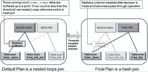

# Oracle Explain Plan 命令真的显示了将要使用的执行计划吗？

> 原文：<https://medium.com/oracledevs/does-the-oracle-explain-plan-command-really-show-the-execution-plan-that-will-be-used-eeb59dc9ed4?source=collection_archive---------0----------------------->

谈到 SQL 调优，我们经常需要查看 SQL 语句的执行计划，以确定大部分时间花在了哪里。但是我们如何生成执行计划会对我们正在查看的计划是否真的是被使用的计划有很大的影响。

为 SQL 语句生成执行计划最常用的两种方法是:

[**解释计划命令**](https://docs.oracle.com/cd/E25178_01/server.1111/e16638/ex_plan.htm) —显示 SQL 语句的执行计划，但不实际执行该语句。

[**V＄SQL _ PLAN**](https://docs.oracle.com/cd/B28359_01/server.111/b28320/dynviews_3050.htm#REFRN30250)**—Oracle 9i 中引入的动态性能视图，显示已编译到游标中并存储在游标高速缓存中的 SQL 语句的执行计划。**

**我的首选方法是始终使用 V$SQL_PLAN(即使它要求语句至少开始执行),因为在某些情况下，EXPLAIN PLAN 命令显示的计划可能与查询执行时实际使用的计划不同。**

**那么，是什么导致了计划的不同呢？**

****绑定变量****

**当 SQL 语句包含[绑定变量](https://docs.oracle.com/database/121/TGSQL/tgsql_cursor.htm#GUID-042A85BF-D96E-44AB-9312-4EB115CCE7B0)时，使用 EXPLAIN PLAN 显示的计划不知道绑定变量值，而 V$SQL_PLAN 中显示的计划在计划生成过程中将绑定变量值考虑在内。让我们看一个简单的例子，使用 customers 表，它有 1，018 行，在 C_ZIPCODE 列上有一个索引。**

```
SELECT count(*) 
FROM   customers; COUNT(*)
----------
      1018SELECT   c_zipcode, count(*) 
FROM     customers 
GROUP BY c_zipcode; C_ZIPCODE   COUNT(*)
---------- ----------
     20001	  290
      2111	   81
     10018	  180
     90034	  225
     94102	  225
     94065	   17 var n number;
exec :n :=94065;PL/SQL procedure successfully completed.SELECT count(c_email) 
FROM   customers 
WHERE  c_zipcode=:n;COUNT(C_EMAIL)
--------------
	    17SELECT * 
FROM table(dbms_xplan.display_cursor(format=>'typical +peeked_binds'));PLAN_TABLE_OUTPUT
---------------------------------------------------------------------
SQL_ID	bjj643zga3mfu, child number 0
-------------------------------------
SELECT count(c_email) FROM customers WHERE c_zipcode=:nPlan hash value: 4213764942----------------------------------------------------------------------
| Id  | Operation		      | Name	    | Rows  |  Bytes| 
----------------------------------------------------------------------
|   0 | SELECT STATEMENT	      |		    |	    |       |	  
|   1 |  SORT AGGREGATE               |		    |	  1 |   24  |	
|   2 |   TABLE ACCESS BY INDEX ROWID | CUSTOMERS   |	 17 |       | 
|*  3 |    INDEX RANGE SCAN	      | IND_CUST_ZIP|	 17 |	    |	  
----------------------------------------------------------------------Peeked Binds (identified by position):
--------------------------------------
   1 - :N (NUMBER): 94065 Predicate Information (identified by operation id):
---------------------------------------------------
   3 - access("C_ZIPCODE"=:N)20 rows selected.EXPLAIN PLAN FOR 
SELECT count(c_email) 
FROM customers 
WHERE c_zipcode=:n;Explained.SQL> 
SQL> SELECT * FROM table(dbms_xplan.display());PLAN_TABLE_OUTPUT
----------------------------------------------------------------
Plan hash value: 296924608
----------------------------------------------------------------
| Id  | Operation	   | Name      | Rows  | Bytes | Cost |
----------------------------------------------------------------
|   0 | SELECT STATEMENT   |	       |     1 |    24 |  7   | 
|   1 |  SORT AGGREGATE    |	       |     1 |    24 |      |	  
|*  2 |   TABLE ACCESS FULL| CUSTOMERS |   170 |  4080 |  7   | 
-----------------------------------------------------------------Predicate Information (identified by operation id):
---------------------------------------------------
   2 - filter("C_ZIPCODE"=TO_NUMBER(:N))
```

**当我们通过 DBMS_XPLAN 从 V$SQL_PLAN 查询执行时使用的实际计划时。DISPLAY_CURSOR 命令我们得到一个索引访问计划，基数估计值(估计返回的行数)精确到 17 行。**

**然而，当我们在语句中使用 EXPLAIN PLAN 命令时，我们得到了一个全表扫描计划和 170 行的基数估计。**

**解释计划命令不支持绑定的第一个迹象可以在计划下的谓词信息中看到。在这里，您将看到我们的绑定变量 N 增加了一个 TO_NUMBER 函数，尽管我们将变量声明为一个数字。**

**因为没有发生绑定扫视，所以优化器不能使用 c_zipcode 列上的直方图。因此，优化器必须假设 c_zipcode 列中的数据分布是均匀的，它将基数估计值计算为 NUM_ROWS / NDV 或 1018/6 = 169.66，向上舍入为 170 行。**

****Cursor_Sharing = FORCE****

**通过将初始化参数 [CURSOR_SHARING](https://docs.oracle.com/database/121/REFRN/GUID-455358F8-D657-49A2-B32B-13A1DC53E7D2.htm#REFRN10025) 设置为 FORCE，您要求 Oracle 用系统生成的绑定变量替换 SQL 语句中的文字值(通常称为文字替换)。文字替换的目的是减少共享池中生成的游标数量。在最好的情况下，只为所有语句构建一个游标，这些语句只在使用的文字值上有所不同。**

**让我们以最初的例子为例，用文字值 94065 替换我们的绑定变量:N，看看当 CURSOR_SHARING 设置为 FORCE 并使用 EXPLAIN PLAN 命令时会发生什么。**

```
ALTER SYSTEM SET cursor_sharing = force;System altered.SELECT count(c_email) 
FROM   customers 
WHERE  c_zipcode=94065;COUNT(C_EMAIL)
--------------
	    17SELECT * 
FROM table(dbms_xplan.display_cursor(format=>'typical +peeked_binds'));PLAN_TABLE_OUTPUT
-----------------------------------------------------------------
SQL_ID	djn0jckqvy2gk, child number 0
-------------------------------------
SELECT count(c_email) FROM customers WHERE c_zipcode=:"SYS_B_0"Plan hash value: 4213764942---------------------------------------------------------------------
| Id  | Operation		     | Name	     | Rows  |Bytes | 
---------------------------------------------------------------------
|   0 | SELECT STATEMENT	     |		    |	    |	    |	  
|   1 |  SORT AGGREGATE 	     |		    |	  1 |	 24 |	
|   2 |   TABLE ACCESS BY INDEX ROWID| CUSTOMERS    |	 17 |	408 |	  
|*  3 |    INDEX RANGE SCAN	     | IND_CUST_ZIP |	 17 |	    |	  
---------------------------------------------------------------------Peeked Binds (identified by position):
--------------------------------------
   1 - :SYS_B_0 (NUMBER): 94065Predicate Information (identified by operation id):
---------------------------------------------------
   3 - access("C_ZIPCODE"=:SYS_B_0)25 rows selected.EXPLAIN PLAN FOR 
SELECT count(c_email) 
FROM customers 
WHERE c_zipcode=94065;Explained.SELECT * FROM table(dbms_xplan.display());PLAN_TABLE_OUTPUT
--------------------------------------------------------------------
Plan hash value: 4213764942
--------------------------------------------------------------------
| Id  | Operation		     | Name	     | Rows  |Bytes| 
--------------------------------------------------------------------
|   0 | SELECT STATEMENT	     |		    |	    |	   |	  
|   1 |  SORT AGGREGATE              |		    |	  1 |	 24|	
|   2 |   TABLE ACCESS BY INDEX ROWID| CUSTOMERS    |	 17 |	408|	  
|*  3 |    INDEX RANGE SCAN	     | IND_CUST_ZIP |	 17 |	   |	  
--------------------------------------------------------------------
Predicate Information (identified by operation id):
---------------------------------------------------
   3 - access("C_ZIPCODE"=94065)
```

**这一次，两种情况下的计划是相同的，但是如果您查看两种计划下的谓词信息，您会注意到 explain plan 命令没有进行文字替换。它仍然将谓词显示为 C_ZIPCODE=94065，而不是 C_ZIPCODE=:SYS_B_0。**

**那么，为什么 explain plan 命令没有进行文字替换呢？**

**根据设计，由解释计划命令生成的游标是不可共享的。因为游标不是共享的，所以进行允许游标共享的文字替换是没有意义的。因此，explain plan 命令不会替换文字。**

**为了证明 EXPLAIN PLAN 命令游标不是共享的，我又运行了两次示例查询，然后查询了 V$SQL。**

```
SELECT sql_id, sql_text, executions, child_number
FROM   v$sql
WHERE  sql_text like '%SELECT count(c_email)%';SQL_ID        SQL_TEXT                               EXECUTIONS CHILD_NUMBER
------------- -------------------------------------- ---------- ------------
djn0jckqvy2gk SELECT count(c_email) FROM customers            3            0
              WHERE c_zipcode=:"SYS_B_0"78h277aadmkku EXPLAIN PLAN FOR SELECT count(c_email)          1            0
               FROM customers WHERE c_zipcode=9406578h277aadmkku EXPLAIN PLAN FOR SELECT count(c_email)          1            1
               FROM customers WHERE c_zipcode=9406578h277aadmkku EXPLAIN PLAN FOR SELECT count(c_email)          1            24 rows selected.
```

**您会注意到，实际的查询用系统生成的 bind :SYS_B_0 替换了它的文字值，并且只生成了一个游标(child_number 0 ),执行了 3 次。**

**对于该语句的解释计划版本，没有发生文字替换，每次执行都会创建一个新的子游标(0，1，2)。演示使用 explain plan 命令不会发生游标共享。**

**我有一些额外的光标。有什么大不了的？**

**重要的是，如果您想要使用任何计划稳定性特性，如 [SQL 计划基线](http://www.oracle.com/technetwork/database/bi-datawarehousing/twp-sql-plan-mgmt-12c-1963237.pdf)，那么当 CURSOR_SHARING 设置为 FORCE 时，您将看不到这些特性对解释计划的影响。假设您使用系统生成的 bind :SYS_B_0 为该语句创建了 SQL 计划基线，但是检查哪个计划将与 EXPLAIN PLAN 一起使用，而不是发生文字替换，因此将不会为该语句找到相应的基线。你可以在最近我回答的 [AskTOM 问题](https://asktom.oracle.com/pls/apex/asktom.search%3Ftag=how-spm-works-with-cursor-sharingforce)中看到这样的例子。**

****适应性计划****

**在 Oracle Database 12c 中，自适应计划使优化器能够将语句的最终计划决策推迟到执行时。**

**优化器使用统计信息收集器检测它所选择的计划(默认计划)，以便在运行时，它可以检测出它的基数估计值是否与计划中的操作所看到的实际行数有很大差异。如果有显著的差异，那么计划或计划的一部分可以自动调整，以避免 SQL 语句第一次执行时的次优性能。**

**目前只有连接方法或并行查询分布方法可以适应。**

****

**Adaptive Plans in Oracle 12c — final plan not decided until execution**

**默认情况下，explain plan 命令将只显示优化器选择的初始或默认计划。而 DBMS_XPLAN。DISPLAY_CURSOR 函数显示查询使用的最终计划或带有附加格式参数'+adaptive '的完整自适应计划。**

**让我们看一个具有自适应计划的两个表连接的简单示例，以了解您将看到的解释计划和 DBMS_XPLAN 之间的差异。显示 _ 光标函数。**

```
EXPLAIN PLAN FOR
SELECT /*+ gather_plan_statistics*/ p.product_name
FROM   order_items2 o, product_information p
WHERE  o.unit_price = 15
AND    o.quantity > 1
AND    p.product_id = o.product_id;Explained.SELECT * FROM table(dbms_xplan.display());PLAN_TABLE_OUTPUT
-----------------------------------------------------------------------
Plan hash value: 983807676
-----------------------------------------------------------------------
| Id  | Operation		     | Name		      | Rows  | 
-----------------------------------------------------------------------
|   0 | SELECT STATEMENT	     |			      |     4 |   
|   1 |  NESTED LOOPS		     |			      |     4 |   
|   2 |   NESTED LOOPS		     |			      |     4 |   
|*  3 |    TABLE ACCESS FULL	     | ORDER_ITEMS2	      |     4 |    
|*  4 |    INDEX UNIQUE SCAN	     | PRODUCT_INFORMATION_PK |     1 |       
|   5 |   TABLE ACCESS BY INDEX ROWID| PRODUCT_INFORMATION    |     1 |    
-----------------------------------------------------------------------Predicate Information (identified by operation id):
--------------------------------------------------- 3 - filter("O"."UNIT_PRICE"=15 AND "O"."QUANTITY">1)
   4 - access("P"."PRODUCT_ID"="O"."PRODUCT_ID")Note
-----
   - this is an adaptive plan22 rows selected.SELECT /*+ gather_plan_statistics*/ p.product_name
FROM   order_items2 o, product_information p
WHERE  o.unit_price = 15
AND    o.quantity > 1
AND    p.product_id = o.product_id;SELECT * FROM table(dbms_xplan.display_cursor());PLAN_TABLE_OUTPUT
-----------------------------------------------------------------------
SQL_ID	d3mzkmzxn264d, child number 0
-------------------------------------
select /*+ gather_plan_statistics */ p.product_name from order_items2
o, product_information p where o.unit_price = 15   and o.quantity > 1
and p.product_id = o.product_idPlan hash value: 2886494722------------------------------------------------------------------
| Id  | Operation	   | Name		 | Rows  | Bytes | 
------------------------------------------------------------------
|   0 | SELECT STATEMENT   |			 |	 |	 |     
|*  1 |  HASH JOIN	   |			 |     4 |   128 |     
|*  2 |   TABLE ACCESS FULL| ORDER_ITEMS2	 |     4 |    48 |
|   3 |   TABLE ACCESS FULL| PRODUCT_INFORMATION |     1 |    20 |     
------------------------------------------------------------------Predicate Information (identified by operation id):
--------------------------------------------------- 1 - access("P"."PRODUCT_ID"="O"."PRODUCT_ID")
   2 - filter(("O"."UNIT_PRICE"=15 AND "O"."QUANTITY">1))Note
-----
   - this is an adaptive plan 27 rows selected.
```

**正如您所看到的，优化器提出的初始计划是一个嵌套循环连接，而最终计划实际上是一个散列连接。如果您只使用 EXPLAIN PLAN 命令，您永远不会知道使用了完全不同的连接方法。**

**因此，我的建议是在检查 SQL 语句的执行计划时使用 use V$SQL_PLAN，因为它还会显示该语句实际使用的策略。**