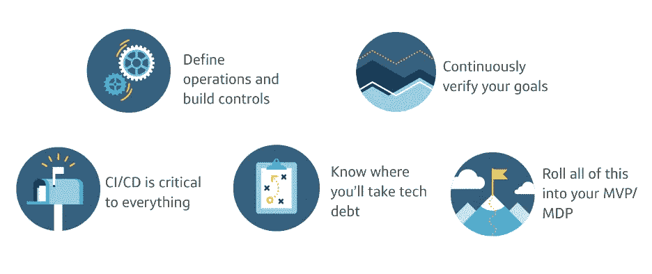

# 先做困难的事情—从我们的云计算之旅中获得的经验

> 原文：<https://medium.com/capital-one-tech/doing-the-hard-things-first-lessons-from-our-cloud-journey-6f6da77ae147?source=collection_archive---------2----------------------->

## 离开最后一个数据中心一年后，对 Capital One 云计算之旅的思考

最近，我一直在回想我在女同性恋者技术与盟友 2020 年调试峰会上的一次演讲，主题是 Capital One 的云计算之旅。自从我做了那次演讲后的六个月里，发生了很多事情。毕竟，说 2020 年是历史书上的一年是一种保守的说法。

除了世界上正在发生的一切，在 Capital One，在达到去年的关键里程碑[退出我们的数据中心并全部进入云](https://aws.amazon.com/solutions/case-studies/capital-one/)后，我们已经习惯了 100%生活在云中。因此，当我们接近 2021 年的中间点时，我目前对 Capital One 的云计算之旅有什么想法，以及对正在经历大规模技术转型的其他组织有什么影响。

对于想要一个 tl 的人；博士:*总是先做困难的事情。*

# 一家拥有科技基因的银行

让我先告诉你一些关于第一资本的事情。对于那些不知道的人，我们是一家有 25 年历史的财富 100 强公司，仍然是创始人领导的，拥有数千万客户和 5 万名员工。我们以创始人为主导的理念体现在我们所做的每一件事情中，并帮助灌输、支持和发展高度创业和创新驱动的文化。这也是我们成为第一家宣布退出数据中心的银行的部分原因，因为大型的技术驱动型思维是我们公司的基因，从我们公司成立之初就一直存在。

Capital One 建立在银行业将被技术革命的信念之上。通过将领先科技公司的技术实力与领先银行的风险管理技能相结合，我们可以通过软件、数据和人工智能/人工智能实时提供卓越的客户体验。因此，认识到[我们向云的迁移是已经持续了近十年的更广泛的数字化转型](https://www.capitalone.com/tech/software-engineering/from-the-cios-view-building-a-nimble-learning-organization/)的一部分非常重要。

基于这些基本假设，从 2012 年开始，我们试图彻底重新定义我们作为一家公司的身份——建立一家从事银行业务的科技公司，而不是一家仅仅使用科技的银行。这一技术变革有许多不同的层面:

*   我们需要变得擅长构建软件。
*   我们需要顶尖的工程人才来做这件事。
*   我们需要重塑我们的技术运营模式，以[实现必要的灵活性和创新](https://www.capitalone.com/tech/culture/digital-transformation-means-setting-audacious-goals/)来引领市场发展。
*   我们需要转向交付软件的敏捷模型，并坚持现代架构标准，如 RESTful APIs、微服务和基于开源基础的。
*   我们需要成为云优先，在云上构建一切新的东西。

作为一家公司，我们全力以赴:从首席执行官到刚毕业的同事。通过紧密合作，我们做到了任何一家正在经历转型的公司都可能做到的最困难的事情之一:我们确保每个人都有同一个北极星。

我们继续致力于解决独特的、具有挑战性的技术问题，这些问题最终将惠及数百万客户，我们正在以银行业前所未有的方式开展这项工作。

例如，我们现在可以构建由数据和人工智能/人工智能的复杂方法驱动的体验，使我们能够以更自然、无缝和可访问的方式与客户互动。因此，我们正在整个企业中嵌入机器学习，从呼叫中心运营到后台流程、欺诈、安全、数字客户个性化等等。我们也一直在开发支持企业机器学习需求的开源项目，例如最近发布的[数据分析器](https://www.capitalone.com/tech/open-source/basics-of-data-profiler/)和 [Rubicon](https://www.capitalone.com/tech/open-source/standardizing-machine-learning-model-development-with-rubicon/) 开源项目。

# 全押在云上的好处

通过退出我们的传统数据中心并迁移到云，我们为未来的银行奠定了基础。将我们的数据中心迁移到公共云的一些好处包括:

*   **以近乎无限的规模即时调配基础架构** —应用程序根据需要使用或多或少的计算和存储，并且只为其使用付费。
*   **降低成本** —第三方提供商可以实现我们自己无法实现的规模经济。
*   **扩大规模** —我们的技术专家正在使用实时、大规模流数据、机器学习和云的力量来解决独特、具有挑战性的技术问题，并提供惠及数百万客户的智能解决方案。
*   **弹性增强** —如果一个地区出现问题，[我们可以在 AWS 上的另一个地区屹立不倒](https://www.capitalone.com/tech/cloud/capital-one-mobile-auto-failover-machine-learning-model-for-resiliency/)。如果一个数据中心瘫痪，那就别无选择。
*   **融入世界创新** —新产品一直在推出，使我们能够[立即利用最新技术，并且以显著的折扣](https://www.capitalone.com/tech/cloud/capital-one-shopping-cloud-native-since-day-one/)在我们自己的数据中心做同样的事情。
*   **转向现代架构**—RESTful API、微服务、开源和 DevOps 流程的使用都在云中大大加速。[这些元素对于现代软件架构是必不可少的。](https://www.capitalone.com/tech/cloud/eno-real-time-alerts-powered-by-serverless/)
*   **敏捷性和上市速度** —我们现在可以更频繁地发布，团队从季度或月度发布到一天发布多次代码。我们还看到了系统可用性和灾难恢复方面的显著改进，包括将事务错误数量和关键事件解决时间减少了一半。此外，我们还将构建新开发环境的时间从几个月缩短到了几周。

这有助于我们在众多技术组织中实现工作方式的现代化，并使我们能够快速应对新挑战和采用新技术

# 先做难的部分应该是您云之旅的口号

显然，在这样的旅程中，你会学到很多东西——一些小的，一些大的。我们带着一个大的收获离开了我们的世界——首先做最难的部分。 不，真的。

在这个旅程中没有什么灵丹妙药。您必须定义您希望您的环境如何运行和构建控制，并建立一个[治理](https://www.capitalone.com/tech/cloud/fireside-chat-cloud-computing-trends/)功能。遵循敏捷原则，验证你的目标，首先对最重要的事情进行压力测试，以持续验证你正在实现你的目标。只要有可能，你必须知道你将在哪里承担技术债务，并建立一个可操作的计划来维持你所建立的。我在关于 [4 个可重复软件交付的最佳实践](https://www.capitalone.com/tech/software-engineering/4-best-practices-for-repeatable-software-delivery/)的博客文章中提到了这个话题。您必须认识到 CI/CD 对一切都至关重要，如果没有强大的 CI/CD 渠道，您的产品将无法扩展。我讨厌“最小可行产品”这个说法，因为 MVP 通常会忽略困难的事情。当你建立你的 MVP 时，记得也要建立基础设施。

许多公司会低估这种转变的综合性。虽然我没有全程在 Capital One，但我可以告诉你，这是一项重大的多年努力，需要业务的每个部分都参与进来。

> "在复杂性中，没有银弹，只有银弹."— [马克·切巴伊](https://www.tamarackcommunity.ca/markcabaj)

不断寻找众所周知的“银弹”或“简单按钮”会让你和你的组织在原地打转，分散你对应该做的困难事情的注意力。通过避开时尚，特别是那些以剪切粘贴式解决方案的形式呈现的、带有承诺成功捷径的规则清单的解决方案，您可以最大化您的银弹，并从您自己的云之旅中获得最大收益。

# 人是任何技术变革背后真正的超级英雄

首先做困难的部分可能是最大的收获，但我想留下深刻印象的是，如果不投资于使这项工作发生的人，最终你无法实现这一目标。时尚和快速解决方案对深度转型不起作用的一个原因是，它们关注的是过程而不是人。他们可能有一个好主意的核心，但他们没有认识到这样一个事实，即他们依赖于员工的能力、合作和热情——不方便的是，员工也是人！

只有领导者认识到并接受这种人为因素，才能在云转型过程中实现切实、持久的改善。这就是团队组成和使命等要素如此重要的原因。团队需要拥有他们的产品交付，并有被理解和授权来完成工作的角色。而且，因为这是骄傲月，作为 Capital One 的技术多样性、包容性和归属感委员会的负责人，如果我不倡导这一点，我将是失职，他们绝对必须以包容性为中心，这是高功能团队的最大指标，思想的多样性使我们更加强大。

在 Capital One，我们的云之旅和更大的数字化转型的一部分一直专注于让我们的员工感到他们的角色得到了授权，并建立一种注重持续学习的文化。我们的技术部门围绕 AWS 认证制定了雄心勃勃的目标，我们通过“[投资自我日](https://www.linkedin.com/pulse/top-companies-2021-50-best-workplaces-grow-your-career-us-/)”为员工提供了准备考试的时间。2017 年[我们在 Capital One](https://www.wsj.com/articles/capital-one-wants-to-train-all-employees-in-technology-1507038808) 内部成立了一所技术学院，以支持员工不断提高技能。我们技术学院的重点领域包括软件工程、安全、云、移动、数据、敏捷&机器学习，以及软技能，如理解偏见、创造包容文化、培养想法和信息共享社区。

此外，技术学院支持四种不同的发展计划:

*   [*技术发展计划*](https://www.capitalonecareers.com/a-day-in-the-life-of-a-technology-development-program-associate-cul-101) *:* 为期 24 个月的轮岗计划，为近期的技术毕业生提供各种学习机会。
*   [*首都一开发者学院*](https://www.capitalone.com/tech/culture/my-journey-through-capital-one-developer-academy/) :面向非计算机专业毕业生的六个月计算机编程沉浸式体验。
*   *技术领导力发展计划:*一项为期一年的计划，旨在培养未来的领导者，促进职业发展并提高技术能力。
*   *人员领导力要素*:针对有经验的人员领导者的为期 6 周的群组项目，旨在培养强大的领导技能。

这些人力投资与我们的云之旅所需的技术投资携手并进。没有一个我们就没有另一个。

# 未来的银行就是现在

当我去年第一次在女同性恋者技术大会上谈到这个问题时，我们的技术变革已经进行了八年，现在我们已经进行了九年。我们从第一天开始就不知道这些年来会如何发展，我们只知道我们的目标是达到一个目的地，在那里我们可以更快、更灵活地为客户构建新功能。因此，我们全面地重新构想了我们的人才、我们的技术基础设施和我们的工作方式，直到感觉我们已经到达那里(更不用说我们可以留在那里)。

我们尝试了许多途径，现在仍然如此，这使我们能够灵活应对 2020 年抛给我们的一切。这有点轻描淡写。我们能够快速响应新冠肺炎疫情，并确保我们的员工能够保持联系并专注于帮助我们的客户，这直接得益于我们的技术转型。

在云中帮助我们以四种主要方式快速应对 COVID19 关闭的影响:

1.  在云环境中，我们的后台办公人员能够在整个过渡过程中保持联系和高效工作，这一点至关重要。我们能够主动监控 Slack、GSuite 和 Zoom 等协作工具的性能，并根据需要进行动态扩展。这意味着我们的团队，包括我们的工程团队，可以在过渡到远程工作时保持更好的联系— [我们的人力资源技术团队最近在我们的博客](https://www.capitalone.com/tech/culture/using-tech-to-make-work-and-life-easier/)上更详细地讲述了这个故事。
2.  从 AWS 的角度来看，我们通过 API 控制和监控基础设施的能力使我们可以在任何地方进行操作，包括远程工作。我们不必担心数据中心的人员配备，也不必担心如何获得增加基础设施以应对危机所需的设备和人员。
3.  我们在云中的工作使我们能够优先考虑联系中心代理的健康和安全，并仍然为我们的客户提供关键支持-数千名联系中心代理现在通过 Amazon Connect 远程工作。甚至[有一个 AWS 案例研究](https://aws.amazon.com/solutions/case-studies/capital-one-amazon-connect/)是关于我们是如何做到这一点的。
4.  云使数字银行成为可能，数字银行在封锁期变得更加重要。通过在线访问账户或使用 Capital One 移动应用程序，我们的客户可以进行支付、查看交易、检查余额等，同时保持社交距离。

这种灵活性在我们的疫情对策之外有着深远的影响。通过在我们的技术和组织结构中构建弹性和可靠性，我们可以在 2021 年及以后更好地应对各种情况。

*披露声明:2021 资本一。观点是作者个人的观点。除非本帖中另有说明，否则 Capital One 不隶属于所提及的任何公司，也不被这些公司认可。使用或展示的所有商标和其他知识产权是其各自所有者的财产。*

*最初发表于*[T5【https://www.capitalone.com】](https://www.capitalone.com/tech/cloud/doing-the-hard-things-first/)*。*