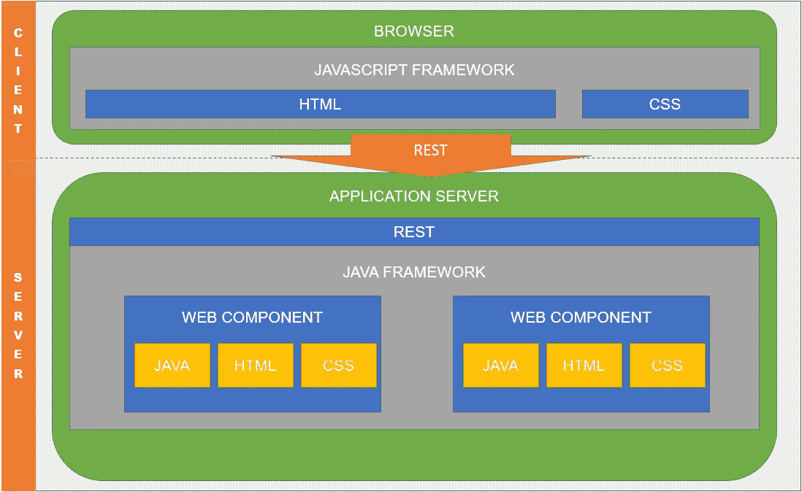

# 基于 REST 的 DOM 操作

> 原文：<https://medium.com/quick-code/dom-manipulation-over-rest-7b0a0fd6f8f1?source=collection_archive---------0----------------------->

## 有没有可能改变 web 应用的思维方式？

Photo by [Марьян Блан](https://unsplash.com/@marjan_blan?utm_source=medium&utm_medium=referral) on [Unsplash](https://unsplash.com?utm_source=medium&utm_medium=referral)

# 介绍

许多年前的趋势是实现**独立应用软件**，之后开始运行到 **MVC 服务器 web 应用**，今天我们正在进入**单页面应用**的时代。

有没有可能走别的路？或者更容易的，存在其他方式？

我们从一个假设开始:今天的网络速率和服务器基础设施的能力比 10-15 年前有了更大的提高，大约 10 年前开始有了将所有代码和运行时处理从服务器转移到客户端的想法(SPA 应用的诞生)。

但是今天这种做法还有必要吗？

我正在酝酿一个改变网络应用实现方式的想法。

***走吧！***

# SPA 和单片应用

今天，许多应用程序都像 SPA 或 monolithic 一样结构化:

*   **SPA**:SPA(*单页应用*)是用 Javascript 实现的应用，在客户端的浏览器上执行，与支持前端的 REST API 通信，并管理对数据库或外部系统的访问
*   **整体式**:整体式应用程序是在单个大型架构中实现的应用程序，包含前端、后端和对外部系统的访问。这些类型许多应用程序都是用 Java 或 C#实现的

在这些架构中，如果我们试图关注 DOM 操作在何时何地发生，我们可以描述两种场景:

*   **在浏览器上的操作**:在这些场景中，在浏览器上执行的软件具有表示页面的所有 HTML 片段，或者具有创建新的 HTML 片段的逻辑。前端和后端之间的 HTTP 通信只传输业务数据。
*   **服务器上的操作**:在这些场景中，DOM 的创建或操作的所有者是在服务器上执行的应用程序。通过前端和后端之间的 HTTP 通信，传递已经包含在业务数据中的 HTML 页面或页面片段(将由浏览器上的 Javascript 库组合)。

许多年前，网络连接速度太慢，台式机或笔记本电脑的 CPU 太小，而且只有 web 服务器才有能力:执行单一应用程序的服务器承担着费力不讨好的任务，操纵 DOM 来准备网页的 HTML 代码，并为客户机的请求提供服务。

在台式机和笔记本电脑的 CPU 迅速增加，但网络连接没有像 CPU 一样增加:趋势是减少网络上交换的数据包，并将逻辑移动到客户端。

> 但是今天…
> 
> 未来有可能遵循新的混合方式吗？又有什么好处？

我会试着向你解释我的想法。

# DOR — DOM Over REST 应用程序

**DOR 应用** (DOM Over REST application)将成为一种思考和设计 web 应用的新类型。

DOR 应用程序的想法是为了允许基于在**服务器端**实现和管理的**组件**实现 **web 应用程序**，但是使用**公共** **框架**在**客户端**组装和查看。

这些方法将基于五个主要概念:

*   **Web 应用**:Web 应用将是唯一的(JAR 或 WAR)，它将在服务器端执行。该应用程序将提供在浏览器上查看的 HTML 页面。
*   Web 组件:Web 开发的基本单元需要是组件。与许多其他现有框架一样，该组件代表了 web 应用程序的最小部分，它将由用于视图结构的 HTML、用于样式的 CSS 和用于逻辑的 Java 组成
*   通用框架:该框架将拥有在浏览器上组织组件和在后台管理相同组件的所有权。这个框架需要有一个在浏览器上执行的 Javascript 灵魂和一个在服务器上执行的 Java 灵魂。
*   **服务器端**:服务器端的所有权将是提供一组 REST 服务，每个 Web 组件一个，并服务于呈现页面部分的请求。
*   **客户端**:客户端将管理后端公开的 REST 服务的调用。

在下一张图中，我试图展示 DOR 架构需要如何实现:

DOR architecture and layers

为了实现这种架构，我创建了一个 Java Spring Boot 项目，并试图实现 Javascript 和 Java 框架

现在，我已经生成了一个简单的页面，其中包含两个嵌套的组件，试图呈现 HTML 和 CSS 样式。

# 结论

这个想法还处于萌芽状态:我在思考的同时也在努力实现这个框架。

我想深入探讨许多主题，例如:

*   性能和优势
*   管理发布请求
*   应用程序状态的管理
*   许多其他人…

在接下来的故事中，我会尝试挖掘一个或多个主题，但欢迎您的每一个建议……

***感谢您的宝贵时间！***

**GitHub**:DOR 应用([资源库](https://github.com/Mamix84/medium/tree/master/DomOverRestProject))的一个例子