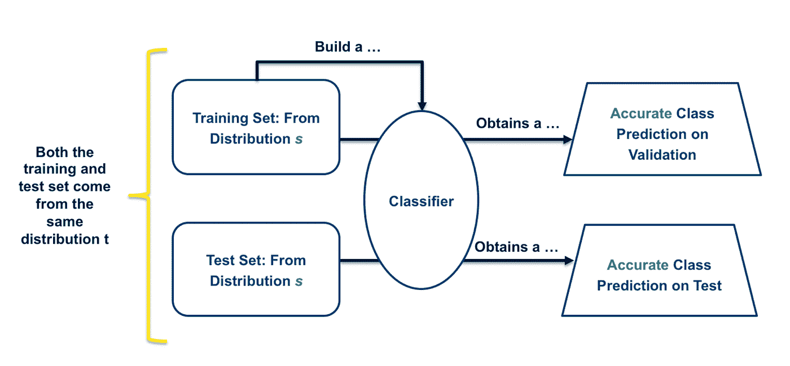
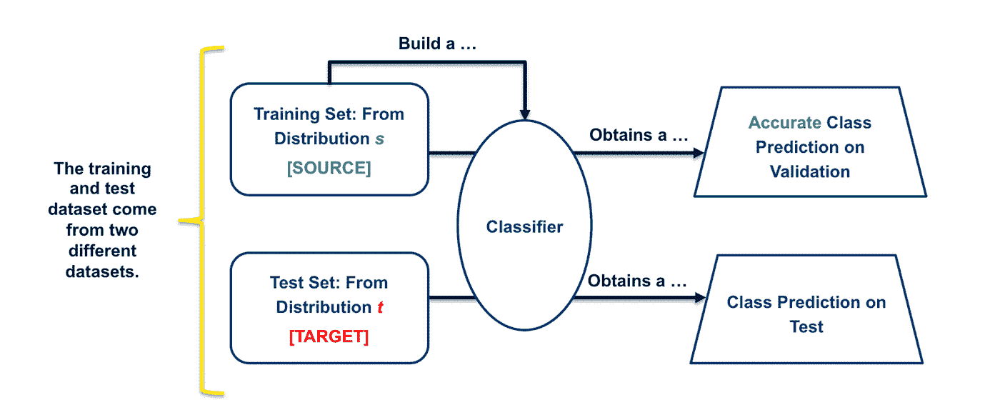
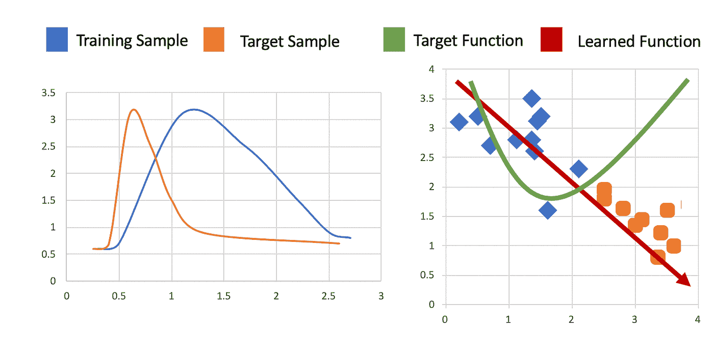
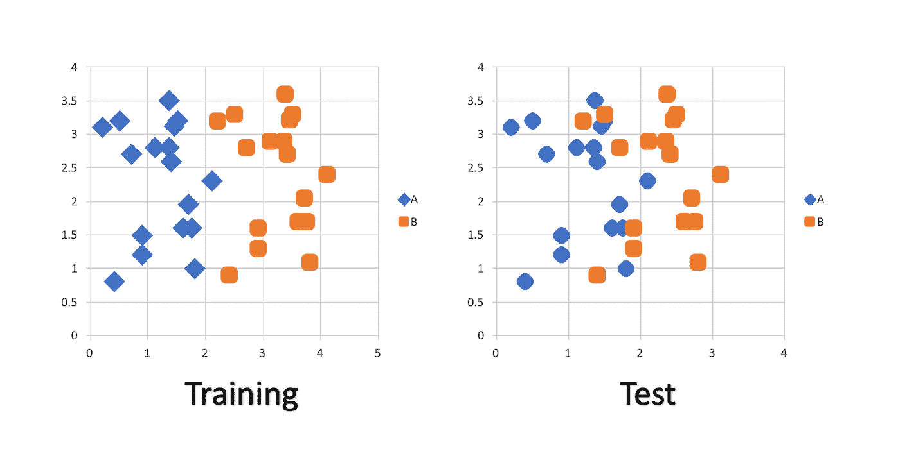
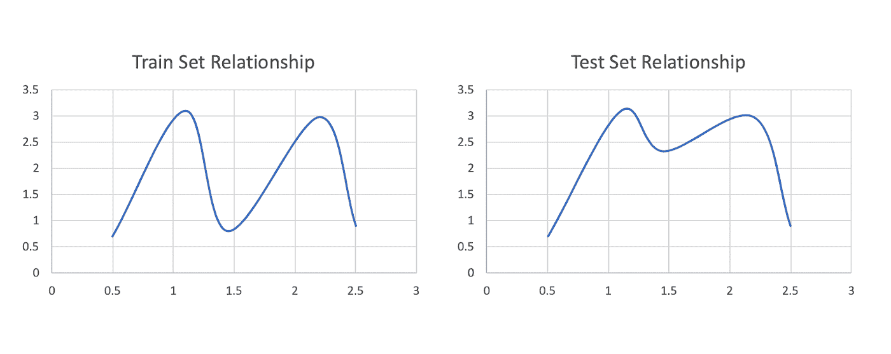

# 理解数据集转换在领域适应中的作用

> 原文：<https://medium.com/capital-one-tech/domain-adaptation-5955edf0277b?source=collection_archive---------3----------------------->

## 负责任地推进机器学习中的数据驱动决策

机器学习可能是目前科技领域的热门词汇。虽然其他一些尖端技术未能达到预期，但机器学习提供的见解和性能是值得称道的。从各种数据中得出有力结论的能力，对于 Capital One 和许多机构正在寻求做的事情来说是至关重要的；机器学习通过扩展我们在更精细的层面上做出数据驱动的决策的能力，帮助我们沿着这条道路前进。

[领域适配](https://www.wikiwand.com/en/Domain_adaptation)是这个旅程的延续。常与 [*迁移学习*](http://cs231n.github.io/transfer-learning/) 联系在一起，将*学到的*知识储存在一个问题案例中，并运用到另一个问题案例中的开放性研究领域。*在领域适应中，我们寻求构建在一个源数据集上训练的有效模型，并使用该模型在另一个目标数据集上进行准确的分类和确定。*

# 什么是领域适配？

领域适应，或多领域学习，是对单领域学习(非领域适应的 ML 用例)的改进。因此，为了更好地理解领域适应，让我们首先考虑单个领域学习的更常见的机器学习基础情况:

在单域学习中，与多域学习相反，主要区别在于训练集和测试集来自相同的分布。在训练和测试集中发现的常见分布与“单个域”的标签相关，单个分布等同于单个域。因此，在该分布中训练的分类器提供准确的分类预测的期望和可能性非常高。单域学习是大多数读者都熟悉的机器学习范式。

多领域学习涉及类似的基础设施，但我们现在有多个数据集分布，支持使用领域自适应:

在多领域学习中，训练集和测试集来自两个不同的分布。这两种分布之间的差异导致了“多域”的标签，因为每个分布被认为是一个独特的域。在这个模型中，我们试图在训练集和测试集上再次获得准确的类预测。

在理想情况下，这种多域模型和单域模型一样成功。不幸的是，这两个领域之间的差异使得默认的机器学习技术不一致，并引入了新发现的风险。尽管领域适应的潜力很大，但理解多领域学习相关风险的必要性同样重要。

# 激发领域适应

在我们深入研究领域适应所涉及的风险之前，让我们考虑一个多领域学习的潜在用例，阐述为什么为了扩展我们的机器学习能力，处理这些风险仍然是值得的。

想象一下:一家初创公司希望为用户提供一种新的移动应用认证服务，该服务涉及通过面部识别进行认证。它希望用户能够在智能手机上使用前置摄像头。此时，图像被发送到他们的模型，该模型预测当前用户是否确实是希望登录到应用程序的用户。

这种模式需要训练。选择使用其服务的公司需要其用户的图像来建立精确的图像分类器；然而，收集用户的新图像集的任务是困难的、侵入性的和不太可能的。因此，这家初创公司决定利用客户目前拥有的数据，即用户在成为客户会员时随申请一起提交的护照照片。该公司使用这些图像来训练一个模型，该模型使用经典的交叉验证指标和常见的数据集分割对用户进行准确分类。该训练集建立了最大成功模型所需的参数。

现在，他们转向现实世界。他们想让这个模型可行。信不信由你，这个模型在真实世界用例中的使用是领域适应的一个例子。当转换到通过用户摄像头提供的图像时，这家初创公司发现数据本身确实来自不同于他们训练数据的分布。由于遮挡、光线、面部定位、摄像头质量等因素，通过前置摄像头看到的客户图像与注册时提交的图像有所不同。

如果应用得当，域适应可以解决这里可能出现的许多问题。然而，当没有考虑到所涉及的风险而使用不当时，领域适应会导致不准确的预测，并且用户不能有效地使用应用程序。

领域自适应很难完美/很好地利用，但是如果做得正确，它会非常强大。因此，了解风险以及如何降低风险非常重要。

# 领域适应风险

在行业中，与领域适应相关的风险缺乏标准术语。您经常会发现诸如数据断裂、数据集转移或不断变化的环境等术语被用来描述同一组常见的风险。出于本文的目的，我们将主要使用术语*数据集移位*。

数据集偏移指的是两个分布之间的差异，**将**导致不可靠的预测。通常，这些差异或变化可以分为三类:

*   协变量移位
*   先验概率转移
*   观念转变

让我们把它们分解开来。

## **协变班次**

当数据是根据模型生成的，并且在训练和测试场景之间的变化分布为"[【Storkey，2009】](https://homepages.inf.ed.ac.uk/amos/publications/Storkey2009TrainingTestDifferent.pdf)时，会出现协变量偏移。本质上，模型处理数据并使其符合目标结果，该目标结果对于训练集和测试集来说*看起来*相似。然而，当考虑单个输入集本身时，它们的分布之间存在明显的差异(协变量移位是在上述示例中发现的域适应风险。)

**Ptraining(y|x) = Ptest(y|x)且 Ptraining(x) ≠ Ptest(x)**

## **先验概率转移**

当类别变量的分布发生变化时，会出现先验概率转移。非正式地，先验概率是指当考虑两个输出(训练和测试)的分布时，分布是不同的情况。

**Ptraining(x|y) = Ptest(x|y)和 Ptraining(y) ≠ Ptest(y)**

## **观念转变**

概念转换通常被认为是最难识别的数据集转换形式，当输入和类变量之间的关系发生变化时，就会发生概念转换。如果我们考虑输入到输出的映射的分布，并考虑这种情况下的两种分布，在这种分布不同的情况下，将会发现概念转换。

**Ptraining(x)= Ptest(x)和 Ptraining(y|x)≠ Ptest(y|x)在 X 到 Y 问题中**

**Ptraining(y)= Ptest(x)和 Ptraining(x|y)≠ Ptest(x|y)在 Y 到 X 问题中**

# 数据集偏移的原因

数据集偏移通常可归因于两个主要原因:

1.  样本选择偏差
2.  不稳定的环境

让我们把它们分解开来。

## **样本选择偏差**

当处理样本选择偏差时，分布差异可以直接联系回用于训练数据收集的有偏差方法。这种偏差可归因于优先考虑更好的交叉验证结果、不一致的总体抽样或关于数据完整性的问题。

## **非稳定环境**

非稳定环境涉及训练和测试环境之间的时间或空间变化。换句话说，环境本身已经以这样一种方式被操纵，即数据本身被发现在时间序列或稀疏性方面是不同的。这种情况通常出现在敌对的分类问题中(如垃圾邮件过滤或网络入侵检测)，并且涉及对手扭曲测试集以创建数据集转移的情况。

# 处理数据集移位

管理数据集移位的存在或可能存在是一个两步过程。首先，工程师必须首先检测数据集转移的存在(如果存在的话)，然后他们着手补救[ *注意:补救是一个广泛而复杂的讨论。为了简洁和本帖的目的，我们将只简要讨论检测部分】。*

## **数据集偏移检测**

存在许多用于数据集检测的技术，具有不同程度的成功。在工业中，有两种主要的数据集移位检测方法:

1.  函授培训
2.  概念对等

让我们快速深入地研究一下这两种方法。

## **函授培训**

在对应追踪中，构建与在数据中找到的每个单独特征或规则相关的分类器。该分类器意味着是单独的、单一特征的确定。以这种方式，为数据中考虑的每个特征训练分类器，并且对训练和测试数据都这样做。通过考虑每个分类器如何一对一地对应于每个单独的特征来识别数据集偏移。

## **概念对等**

概念等价是一种不太成熟的方法，在某些用例中被认为是有效的。当利用概念等价时，用户导出数据的较低级别表示，对于目标和源域都有唯一的表示。然后，将学习到的表示与更容易识别该级别的数据集变化的希望进行比较。通常，自动编码器用于此目的，自动编码器输出是用于比较的较低级表示。

# 结论

这篇文章无意以任何方式阻止多领域学习或领域适应的使用。相反，领域适应——或者更广泛的迁移学习领域——是机器学习中最令人兴奋的领域之一。当我们在新环境中利用现有数据时，迁移学习可能允许我们极大地扩展我们的机器学习能力。

也就是说，这篇文章的目的仅仅是扩大对领域适应相关风险的认识。如果操作得当，领域适应具有不可思议的潜力。但是理解正确利用这种方法需要什么是很重要的。数据驱动的决策是 Capital One 等公司的绝对重点，必须保持创新，同时提供具有可辩护结论的负责任的技术解决方案。

数据将为最明智的决策和深思熟虑的选择提供信息，然而，这些相同的选择必须得到人们可能选择使用的尖端技术的明显支持。通向机器学习支持的产品和能力的道路最终将涉及掌握诸如领域适应和迁移学习之类的技术。为了实现这一点，用在我们的行业中最好地应用这些技术所需的知识来武装自己是很重要的。

这些是作者的观点。除非本帖中另有说明，否则 Capital One 不隶属于所提及的任何公司，也不被其认可。使用或展示的所有商标和其他知识产权都是其各自所有者的所有权。本文为 2019 首都一。